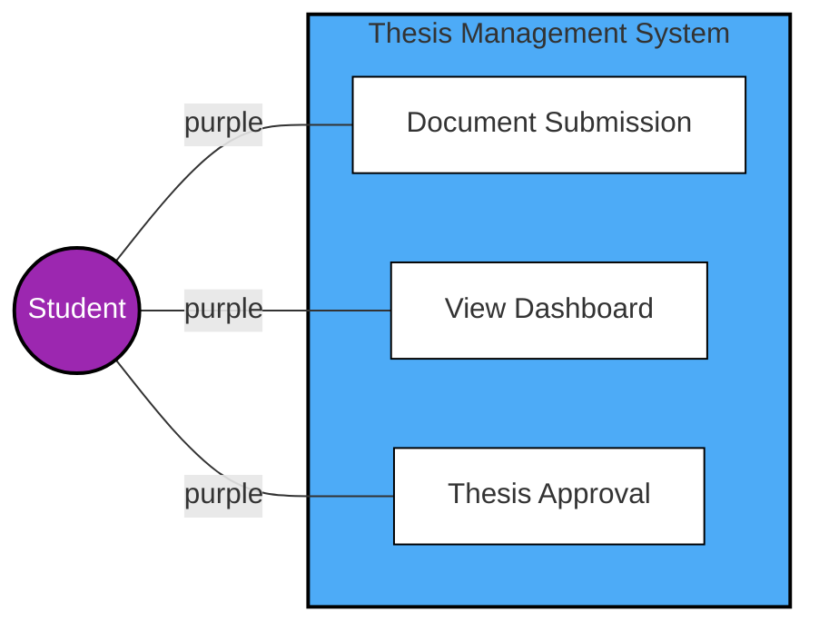
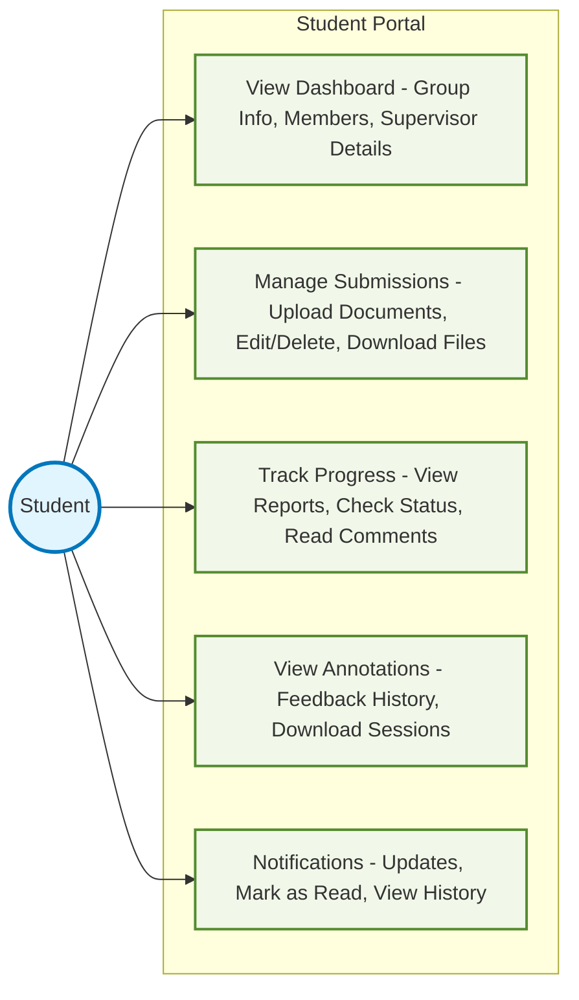
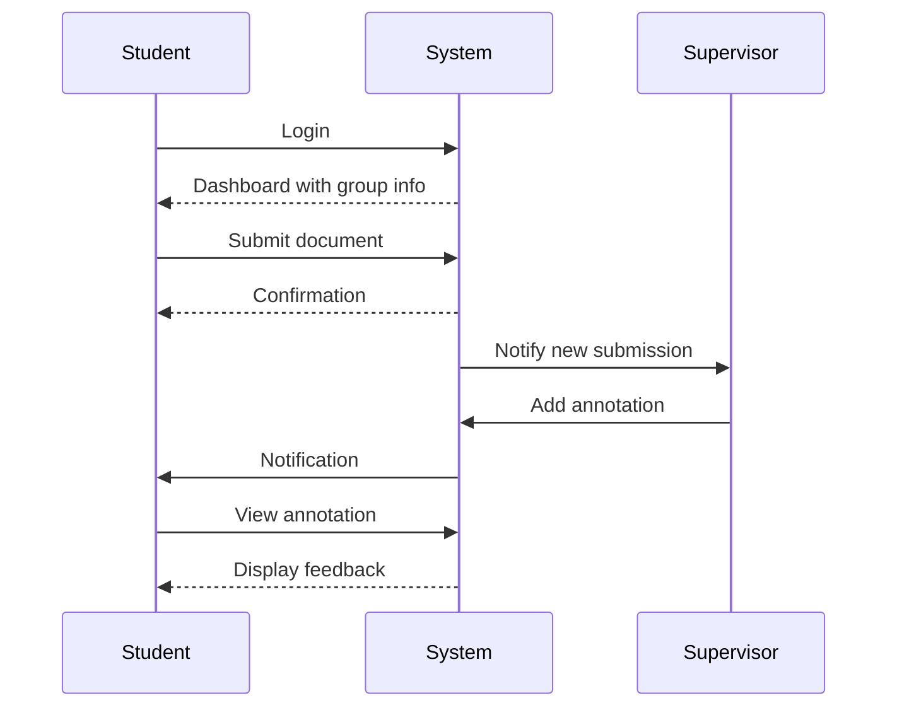

# Student Use Case Diagram

## Overview
Students are the primary end-users of the thesis management system, focusing on document submission, progress tracking, and communication with supervisors.

## Use Case Diagram (Reference Design Style)

## Detailed Use Case Diagram

```mermaid
graph TB
    %% Actor
    Student[("👤 Student")]
    
    %% System Boundary
    subgraph System["Thesis Management System - Student Module"]
        %% Dashboard & Group Information
        subgraph Dashboard["Dashboard & Group Info"]
            UC1["View Group Name"]
            UC2["View Group Members"]
            UC3["View Assigned AOIs"]
            UC4["View Supervisor Info"]
            UC5["View Meeting History"]
        end
        
        %% Reports Management
        subgraph Reports["Reports Management"]
            UC6["View Report List"]
            UC7["View Report Details"]
            UC8["View Comments"]
            UC9["Check Approval Status"]
            UC10["View Status Badges"]
        end
        
        %% Document Submission
        subgraph Submissions["Document Submissions"]
            UC11["Create Submission"]
            UC12["Edit Own Submission"]
            UC13["Delete Own Submission"]
            UC14["Download Own File"]
            UC15["Upload PDF/PPT/PPTX"]
        end
        
        %% Annotations
        subgraph Annotations["Annotations (Read-only)"]
            UC16["View Annotation History"]
            UC17["Download Annotated Sessions"]
            UC18["View Feedback"]
        end
        
        %% Notifications
        subgraph Notifications["Notifications"]
            UC19["View Bell Dropdown"]
            UC20["View Full History"]
            UC21["Mark as Read"]
            UC22["Mark All as Read"]
            UC23["Receive Report Updates"]
        end
    end
    
    %% Connections
    Student --> UC1
    Student --> UC2
    Student --> UC3
    Student --> UC4
    Student --> UC5
    Student --> UC6
    Student --> UC7
    Student --> UC8
    Student --> UC9
    Student --> UC10
    Student --> UC11
    Student --> UC12
    Student --> UC13
    Student --> UC14
    Student --> UC15
    Student --> UC16
    Student --> UC17
    Student --> UC18
    Student --> UC19
    Student --> UC20
    Student --> UC21
    Student --> UC22
    Student --> UC23
    
    %% Include relationships
    UC11 -.includes.-> UC15
    UC16 -.includes.-> UC17
    
    %% Styling
    classDef actor fill:#e3f2fd,stroke:#1565c0,stroke-width:3px
    classDef usecase fill:#f3e5f5,stroke:#6a1b9a,stroke-width:1px
    classDef subsystem fill:#fafafa,stroke:#757575,stroke-width:2px
    
    class Student actor
    class UC1,UC2,UC3,UC4,UC5,UC6,UC7,UC8,UC9,UC10,UC11,UC12,UC13,UC14,UC15,UC16,UC17,UC18,UC19,UC20,UC21,UC22,UC23 usecase
```

## Simplified Version for Better Readability

## Detailed Use Case Breakdown

```mermaid
graph TD
    %% Actor
    Student((Student))
    
    %% Primary Use Cases with Extensions
    subgraph Primary["Primary Activities"]
        Submit[Submit Documents]
        View[View Information]
        Track[Track Progress]
        Communicate[Receive Communications]
    end
    
    %% Extended Use Cases
    Submit --> PDF[Upload PDF]
    Submit --> PPT[Upload PPT/PPTX]
    Submit --> Edit[Edit Submission]
    Submit --> Delete[Delete Submission]
    
    View --> Dashboard[View Dashboard]
    View --> Reports[View Reports]
    View --> Meetings[View Meetings]
    
    Track --> Status[Check Approval Status]
    Track --> Comments[Read Comments]
    Track --> Annotations[View Annotations]
    
    Communicate --> Notifications[Receive Notifications]
    Communicate --> Feedback[View Feedback]
    
    Student --> Primary
    
    %% Styling
    classDef actor fill:#bbdefb,stroke:#1976d2,stroke-width:3px
    classDef primary fill:#fff9c4,stroke:#f57f17,stroke-width:2px
    classDef extended fill:#f5f5f5,stroke:#9e9e9e,stroke-width:1px
    
    class Student actor
    class Submit,View,Track,Communicate primary
    class PDF,PPT,Edit,Delete,Dashboard,Reports,Meetings,Status,Comments,Annotations,Notifications,Feedback extended
```

## Key Use Cases

### Dashboard & Group Information
- **Group Details**: View group name, members, and assigned areas of interest
- **Supervisor Information**: Access supervisor and co-supervisor contact details
- **Meeting History**: Track all past and upcoming meetings

### Document Submission
- **File Upload**: Submit PDF, PPT, or PPTX files (max 20MB)
- **One Submission per Report**: System enforces single submission constraint
- **Edit/Delete**: Modify or remove own submissions before final approval
- **Download**: Access previously uploaded documents

### Progress Tracking
- **Report Status**: Monitor approval status with visual badges
- **Comments**: Read feedback from supervisors and panel members
- **Annotations**: View detailed annotations on submitted documents

### Notifications
- **Real-time Updates**: Receive instant notifications for report updates
- **Bell Dropdown**: Quick access to latest 10 notifications
- **History**: Full notification history with read/unread status

## Constraints
- **File Types**: Only PDF, PPT, and PPTX files allowed
- **File Size**: Maximum 20MB per submission
- **Submission Limit**: One submission per report
- **Annotation Access**: Read-only access to annotations

## Access Paths
- `/student/dashboard` - Main student dashboard
- `/student/meetings` - Meeting schedule and history
- `/student/reports` - Report list and details
- `/student/notifications` - Notification center

## System Interactions

## Notes
- Students have read-only access to most system features
- All submissions are tracked with timestamps
- Notifications are automatically generated for important events
- Students can only modify their own submissions