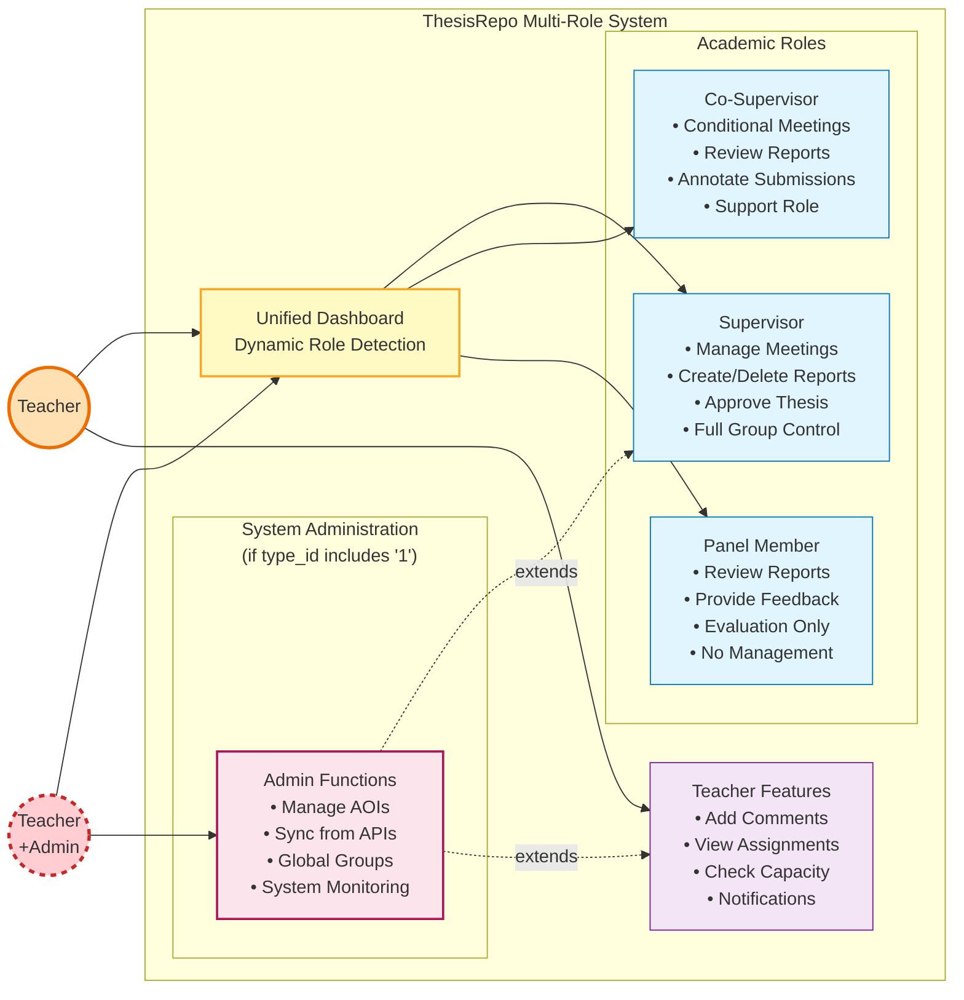
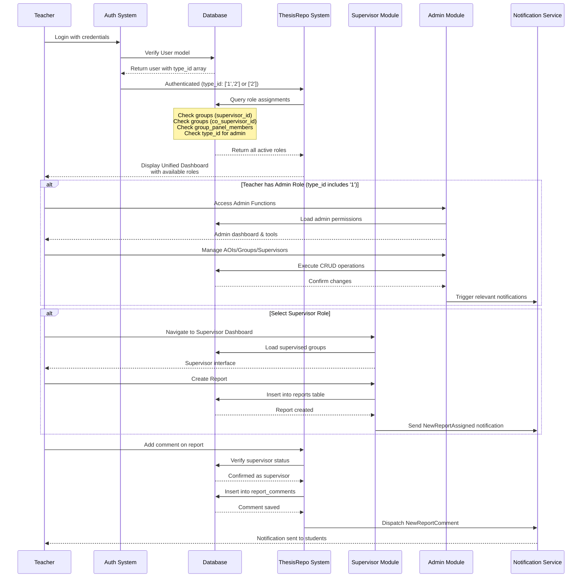

# Teacher Use Case Diagram

## Overview
Teacher is a multi-faceted role in the ThesisRepo system. Teachers can serve as supervisors, co-supervisors, panel members, and potentially system administrators. The system dynamically detects and enables appropriate functionalities based on role assignments and permissions.

## Use Case Diagram

```mermaid
graph TB
    %% Actors
    Teacher[("👤 Teacher<br/>(Faculty Member)")]
    TeacherAdmin[("👤 Teacher-Admin<br/>(Dual Role)")]
    
    %% System Boundary
    subgraph System["ThesisRepo - Teacher Module"]
        %% Faculty Dashboard
        subgraph FacultyDashboard["Faculty Dashboard"]
            UC1["View Unified Teacher Dashboard"]
            UC2["Switch Between Academic Roles"]
            UC3["View All Assigned Groups<br/>(across all roles)"]
            UC4["Check Notification Center"]
        end
        
        %% Role-Based Academic Access
        subgraph RoleAccess["Academic Role Access"]
            UC5["Access Supervisor Dashboard<br/>(for groups where assigned as supervisor)"]
            UC6["Access Co-Supervisor Dashboard<br/>(for groups where assigned as co-supervisor)"]
            UC7["Access Panel Member Dashboard<br/>(for groups where assigned to panel)"]
        end
        
        %% Supervisor Functions (When Assigned)
        subgraph SupervisorFunctions["Supervisor Capabilities"]
            UC8["Schedule/Manage Meetings<br/>(via MeetingAttendance model)"]
            UC9["Create/Edit/Delete Reports<br/>(Report model)"]
            UC10["Approve Final Thesis"]
            UC11["Annotate Student Submissions<br/>(ReportAnnotationSession)"]
            UC12["Set Co-Supervisor Meeting Rights"]
        end
        
        %% Co-Supervisor Functions (When Assigned)
        subgraph CoSupervisorFunctions["Co-Supervisor Capabilities"]
            UC13["View Assigned Groups<br/>(GroupStudent relations)"]
            UC14["Manage Meetings<br/>(if permission granted)"]
            UC15["Review & Annotate Reports"]
            UC16["Track Student Progress"]
        end
        
        %% Panel Member Functions (When Assigned)
        subgraph PanelFunctions["Panel Member Capabilities"]
            UC17["Review Assigned Reports<br/>(GroupPanelMember relations)"]
            UC18["Create Annotation Sessions"]
            UC19["Mark Reports as Reviewed"]
            UC20["Provide Evaluation Feedback"]
        end
        
        %% Teacher-Specific Features
        subgraph TeacherSpecific["Teacher Core Features"]
            UC21["Add Comments on Reports<br/>(ReportComment model)"]
            UC22["View Supervisor Assignments<br/>(Supervisor model)"]
            UC23["Check Thesis Capacity Limits"]
            UC24["View Area of Interest Assignments"]
        end
        
        %% Admin Functions (If Teacher has Admin Role)
        subgraph AdminFunctions["Administrative Functions<br/>(When type_id includes '1')"]
            UC25["Manage Areas of Interest<br/>(AreaOfInterest CRUD)"]
            UC26["Sync Supervisors from API<br/>(SupervisorApiService)"]
            UC27["Manage Batches<br/>(BatchApiService)"]
            UC28["Create/Delete Groups<br/>(AdminCreatedGroup)"]
            UC29["Assign Students to Groups<br/>(GroupStudent)"]
            UC30["Monitor System Performance<br/>(PerformanceMonitoringService)"]
            UC31["Manage Global Supervisor Assignments<br/>(SupervisorAssignmentService)"]
        end
    end
    
    %% Connections for Regular Teacher
    Teacher --> UC1
    Teacher --> UC2
    Teacher --> UC3
    Teacher --> UC4
    Teacher --> UC5
    Teacher --> UC6
    Teacher --> UC7
    
    UC5 --> UC8
    UC5 --> UC9
    UC5 --> UC10
    UC5 --> UC11
    UC5 --> UC12
    
    UC6 --> UC13
    UC6 --> UC14
    UC6 --> UC15
    UC6 --> UC16
    
    UC7 --> UC17
    UC7 --> UC18
    UC7 --> UC19
    UC7 --> UC20
    
    Teacher --> UC21
    Teacher --> UC22
    Teacher --> UC23
    Teacher --> UC24
    
    UC21 -.triggers.-> UC4
    
    %% Connections for Teacher-Admin
    TeacherAdmin --> UC1
    TeacherAdmin --> UC25
    TeacherAdmin --> UC26
    TeacherAdmin --> UC27
    TeacherAdmin --> UC28
    TeacherAdmin --> UC29
    TeacherAdmin --> UC30
    TeacherAdmin --> UC31
    
    %% Styling
    classDef actor fill:#ffecb3,stroke:#ff6f00,stroke-width:3px
    classDef adminActor fill:#ffcdd2,stroke:#d32f2f,stroke-width:3px
    classDef usecase fill:#e8f5e9,stroke:#388e3c,stroke-width:1px
    classDef roleSpecific fill:#e3f2fd,stroke:#1976d2,stroke-width:1px,stroke-dasharray: 5 5
    classDef adminFunc fill:#fce4ec,stroke:#c2185b,stroke-width:2px,stroke-dasharray: 3 3
    classDef subsystem fill:#f5f5f5,stroke:#616161,stroke-width:2px
    
    class Teacher actor
    class TeacherAdmin adminActor
    class UC1,UC2,UC3,UC4,UC21,UC22,UC23,UC24 usecase
    class UC5,UC6,UC7,UC8,UC9,UC10,UC11,UC12,UC13,UC14,UC15,UC16,UC17,UC18,UC19,UC20 roleSpecific
    class UC25,UC26,UC27,UC28,UC29,UC30,UC31 adminFunc
```



## Simplified Multi-Role View with Admin Integration



## Dynamic Role Assignment Flow with Admin Detection

```mermaid
graph TD
    %% Actor
    Teacher((Teacher))
    
    %% Role Detection
    subgraph RoleDetection["ThesisRepo Role Detection System"]
        Login[Teacher Login<br/>via External API]
        DetectType{Detect Login Type<br/>from Input Pattern}
        CallAPI[Call Teacher API<br/>with Credentials]
        ParseTypeId[Parse TypeId Field<br/>'1''2' format → ['1','2']]
        CheckUser{Check User Model<br/>type_id array}
        
        %% Admin Check
        IsAdmin{type_id<br/>includes '1'?}
        EnableAdmin[Enable Admin<br/>Dashboard & Functions<br/>via 'admin' middleware]
        
        %% Academic Role Checks
        CheckAcademic[Check Academic Assignments]
        HasSuper{Supervisor<br/>in groups.supervisor_id?}
        HasCoSuper{Co-Supervisor<br/>in groups.co_supervisor_id?}
        HasPanel{Panel Member<br/>in group_panel_members?}
        
        %% Enable Dashboards
        EnableSuper[Enable Supervisor<br/>Dashboard & Reports]
        EnableCoSuper[Enable Co-Supervisor<br/>Dashboard]
        EnablePanel[Enable Panel<br/>Review Interface]
        
        %% Combined Access
        SetSession[Set Session Data<br/>user_type: 'teacher']
        CombinedDash[Teacher Dashboard<br/>with All Active Roles]
    end
    
    Teacher --> Login
    Login --> DetectType
    DetectType --> CallAPI
    CallAPI --> ParseTypeId
    ParseTypeId --> CheckUser
    CheckUser --> IsAdmin
    CheckUser --> CheckAcademic
    
    IsAdmin -->|Yes| EnableAdmin
    IsAdmin -->|No| CheckAcademic
    
    CheckAcademic --> HasSuper
    CheckAcademic --> HasCoSuper
    CheckAcademic --> HasPanel
    
    HasSuper -->|Yes| EnableSuper
    HasCoSuper -->|Yes| EnableCoSuper
    HasPanel -->|Yes| EnablePanel
    
    EnableAdmin --> SetSession
    EnableSuper --> SetSession
    EnableCoSuper --> SetSession
    EnablePanel --> SetSession
    SetSession --> CombinedDash
    
    %% Styling
    classDef actor fill:#ffccbc,stroke:#d84315,stroke-width:3px
    classDef process fill:#ffffff,stroke:#424242,stroke-width:1px
    classDef decision fill:#fff3e0,stroke:#e65100,stroke-width:2px
    classDef adminCheck fill:#ffebee,stroke:#c62828,stroke-width:2px
    classDef enabled fill:#c8e6c9,stroke:#2e7d32,stroke-width:1px
    classDef api fill:#e8f5e9,stroke:#388e3c,stroke-width:2px
    
    class Teacher actor
    class Login,CheckUser,CheckAcademic,SetSession,CombinedDash process
    class DetectType,HasSuper,HasCoSuper,HasPanel decision
    class IsAdmin adminCheck
    class EnableAdmin,EnableSuper,EnableCoSuper,EnablePanel enabled
    class CallAPI,ParseTypeId api
```

## Role-Based Capabilities Matrix (ThesisRepo Implementation)

| Capability | As Supervisor | As Co-Supervisor | As Panel Member | As Teacher-Admin | Teacher Core |
|------------|--------------|------------------|-----------------|------------------|--------------|
| **Group Management** |
| View Groups (groups table) | ✓ | ✓ | ✓ | ✓ (all) | ✓ |
| Create Groups | ✗ | ✗ | ✗ | ✓ | ✗ |
| Delete Groups | ✗ | ✗ | ✗ | ✓ (empty only) | ✗ |
| Assign Students (group_students) | ✗ | ✗ | ✗ | ✓ | ✗ |
| **Meeting Management** |
| Create Meetings (meetings table) | ✓ | Conditional* | ✗ | ✓ | ✗ |
| Track Attendance (meeting_attendances) | ✓ | Conditional* | ✗ | ✓ | ✗ |
| **Report Management** |
| Create Reports (reports table) | ✓ | ✗ | ✗ | ✓ | ✗ |
| Delete Reports | ✓ | ✗ | ✗ | ✓ | ✗ |
| Approve Thesis | ✓ | ✗ | ✗ | ✓ | ✗ |
| **Annotation & Review** |
| Create Annotation Sessions | ✓ | ✓ | ✓ | ✓ | ✗ |
| Add Comments (report_comments) | ✓ | ✗ | ✗ | ✓ | ✓** |
| Review Submissions | ✓ | ✓ | ✓ | ✓ | ✗ |
| **System Administration** |
| Manage AOIs (area_of_interests) | ✗ | ✗ | ✗ | ✓ | ✗ |
| Sync from APIs | ✗ | ✗ | ✗ | ✓ | ✗ |
| Manage Batches | ✗ | ✗ | ✗ | ✓ | ✗ |
| Supervisor Assignment Service | ✗ | ✗ | ✗ | ✓ | ✗ |
| Performance Monitoring | ✗ | ✗ | ✗ | ✓ | ✗ |
| **Navigation** |
| Switch Between Roles | - | - | - | ✓ | ✓ |
| Access Unified Dashboard | ✓ | ✓ | ✓ | ✓ | ✓ |

*Conditional: Based on `co_supervisor_can_manage_meetings` flag in groups table
**Teacher can add comments only on groups they supervise

## Real-World Use Case Scenarios in ThesisRepo

```mermaid
graph LR
    subgraph Scenario1["Scenario 1: Multi-Role Faculty"]
        T1((Dr. Smith<br/>type_id: ['2']))
        T1 --> S1[Supervisor<br/>CSE401 Group]
        T1 --> C1[Co-Supervisor<br/>CSE402 Group]
        T1 --> P1[Panel Member<br/>CSE403 Group]
        T1 --> Cap1[Capacity: 3/5<br/>Thesis Slots]
    end
    
    subgraph Scenario2["Scenario 2: Teacher-Admin"]
        T2((Prof. Johnson<br/>type_id: ['1','2']))
        T2 --> S2[Supervisor<br/>3 Groups]
        T2 --> A2[Admin Access<br/>System Management]
        T2 --> API2[API Sync<br/>Supervisor/Batch Data]
        T2 --> Perf2[Performance<br/>Monitoring]
    end
    
    subgraph Scenario3["Scenario 3: Panel Specialist"]
        T3((Dr. Lee<br/>type_id: ['2']))
        T3 --> P3[Panel Member<br/>5 Groups]
        T3 --> Ann3[Annotation<br/>Sessions Active]
        T3 --> Rev3[Review Queue<br/>12 Reports]
    end
    
    subgraph Scenario4["Scenario 4: New Faculty"]
        T4((Mr. Chen<br/>type_id: ['2']))
        T4 --> NoRole[No Assignments Yet]
        T4 --> AOI4[AOI: Machine Learning<br/>Awaiting Groups]
    end
    
    %% Styling
    classDef teacher fill:#fff8e1,stroke:#ff8f00,stroke-width:2px
    classDef admin fill:#ffebee,stroke:#c62828,stroke-width:2px
    classDef role fill:#e8eaf6,stroke:#5e35b1,stroke-width:1px
    classDef info fill:#e3f2fd,stroke:#1565c0,stroke-width:1px
    
    class T1,T3,T4 teacher
    class T2 admin
    class S1,C1,P1,S2,P3 role
    class Cap1,A2,API2,Perf2,Ann3,Rev3,NoRole,AOI4 info
```

## Comment System Implementation (ReportComment Model)

```mermaid
graph TD
    subgraph CommentSystem["ThesisRepo Comment System"]
        Teacher((Teacher))
        
        CheckRole{Check User Role<br/>& Permissions}
        
        IsSuper{Is Supervisor<br/>of Group?}
        IsAdmin{Has Admin<br/>Role (type_id='1')?}
        
        AllowComment[Create ReportComment<br/>Entry]
        SetTeacherId[Set teacher_id<br/>in report_comments]
        TriggerNotification[Dispatch<br/>NewReportComment<br/>Notification]
        SaveToDatabase[Save to<br/>report_comments table]
        UpdateReport[Update Report<br/>last_activity]
        
        DenyComment[Access Denied<br/>No Permission]
        
        Teacher --> CheckRole
        CheckRole --> IsSuper
        CheckRole --> IsAdmin
        
        IsSuper -->|Yes| AllowComment
        IsAdmin -->|Yes| AllowComment
        IsSuper -->|No| DenyComment
        IsAdmin -->|No| DenyComment
        
        AllowComment --> SetTeacherId
        SetTeacherId --> SaveToDatabase
        SaveToDatabase --> TriggerNotification
        SaveToDatabase --> UpdateReport
    end
    
    %% Styling
    classDef actor fill:#ffe0b2,stroke:#ef6c00,stroke-width:2px
    classDef allowed fill:#c8e6c9,stroke:#2e7d32,stroke-width:1px
    classDef denied fill:#ffcdd2,stroke:#c62828,stroke-width:1px
    classDef process fill:#e1f5fe,stroke:#0277bd,stroke-width:1px
    
    class Teacher actor
    class AllowComment,SetTeacherId,SaveToDatabase,TriggerNotification,UpdateReport allowed
    class DenyComment denied
    class CheckRole,IsSuper,IsAdmin process
```

## ThesisRepo Access Paths & Routes

### Teacher Core Routes
- `/teacher/dashboard` - Unified teacher dashboard with role detection
- `/teacher/reports/{report}/comments` - Add comments on supervised groups' reports

### Academic Role Routes (Protected by 'teacher' middleware)
- `/supervisor/dashboard` - Supervisor-specific interface
- `/supervisor/groups` - View and manage supervised groups
- `/supervisor/groups/toggle-co-supervisor-meetings` - Set co-supervisor meeting permissions
- `/supervisor/reports` - Full report CRUD operations
- `/supervisor/reports/{report}/finalize` - Approve final thesis
- `/supervisor/meetings` - Schedule and manage meetings
- `/supervisor/meetings/{group}/pdf` - Download meeting reports

- `/co-supervisor/dashboard` - Co-supervisor interface
- `/co-supervisor/groups` - View co-supervised groups
- `/co-supervisor/meetings` - Conditional meeting management
- `/co-supervisor/reports` - Review reports
- `/co-supervisor/reports/{report}/under-review` - Mark reports for review

- `/panel-member/dashboard` - Panel member interface
- `/panel-member/groups` - View assigned groups
- `/panel-member/reports` - Review assigned reports
- `/panel-member/reports/{report}/submissions/{submission}/annotate` - Create annotations

### Admin Routes (Protected by 'admin' middleware - requires type_id includes '1')
- `/admin/dashboard` - System administration dashboard
- `/admin/areas-of-interest` - AOI CRUD operations with bulk creation
- `/admin/supervisors` - Supervisor management with thesis limits
- `/admin/supervisors/sync` - Sync from external API (throttled)
- `/admin/supervisors/{supervisor}/refresh` - Refresh individual supervisor
- `/admin/batches` - Batch management with activation controls
- `/admin/batches/sync` - Sync from external API (throttled)
- `/admin/batches/compare` - Compare local vs API data
- `/admin/groups` - Global group management
- `/admin/groups/create` - Create new groups
- `/admin/groups/bulk-delete` - Bulk delete empty groups
- `/admin/performance` - System performance monitoring
- `/admin/performance/metrics` - Real-time metrics
- `/admin/performance/health` - System health checks
- `/admin/performance/test` - Run component tests

### API Integration Routes
- `/api/supervisors/sync` - Sync supervisors from external API
- `/api/batches/sync` - Sync batches from external API
- `/api/students/sync` - Sync students from external API

## ThesisRepo Navigation Flow



## Key Features in ThesisRepo

### Faculty Dashboard
- **Unified Access Point**: Single entry for all faculty roles via User model
- **Dynamic Role Detection**: Automatic detection based on database relationships
- **Multi-Role Support**: Simultaneous supervisor, co-supervisor, panel, and admin roles
- **Real-time Notifications**: Integration with notification system for all activities

### Academic Role Management
- **Supervisor Features**: Full control over groups, reports, meetings via dedicated models
- **Co-Supervisor Support**: Conditional permissions based on `co_supervisor_can_manage_meetings` flag
- **Panel Member Interface**: Streamlined review and annotation workflow
- **Capacity Management**: Thesis limit tracking through Supervisor model

### Administrative Capabilities (Teacher-Admin)
- **API Integration**: Sync with external systems via SupervisorApiService, BatchApiService
- **Group Management**: Create/delete groups with AdminCreatedGroup tracking
- **AOI Management**: Full CRUD on AreaOfInterest with many-to-many relationships
- **Performance Monitoring**: System health via PerformanceMonitoringService
- **Assignment Algorithm**: Automated supervisor assignment via SupervisorAssignmentService

### Comment & Annotation System
- **ReportComment Model**: Structured comment storage with teacher_id tracking
- **Annotation Sessions**: ReportAnnotationSession with created_by_type field
- **Notification Integration**: Automatic dispatch of NewReportComment notifications
- **Permission-Based**: Comments restricted to supervisors and admins

### Database Integration
- **User Model**: Central authentication with type_id array for role detection
- **Group Relations**: Complex relationships via groups, group_students, group_panel_members
- **Report Management**: Comprehensive reports table with status tracking
- **Meeting System**: meetings and meeting_attendances for scheduling
- **History Tracking**: AssignmentHistory for audit trails

## Technical Implementation Notes

### Role Detection Logic (from AuthenticatedSessionController.php)
```php
// Login type detection based on input pattern:
- Numeric (10+ digits): Student login
- Alphanumeric with letters: Teacher login
- Short numeric (1-6 digits): Teacher login

// TypeId parsing from API response:
private function determineTypeId($typeId): array {
    $allowedTypes = ['1', '2']; // Only Admin and Teacher
    
    // Handles formats like "'1''2''3'" → ['1','2']
    if (preg_match_all("/'(\d+)'/", $typeId, $matches)) {
        return array_filter($matches[1], fn($t) => in_array($t, $allowedTypes));
    }
    
    // Default to Teacher role if not specified
    return ['2'];
}

// Middleware-based access control:
- 'teacher' middleware: Checks auth()->user()->isTeacher()
- 'admin' middleware: Checks auth()->user()->isAdmin()
- Teacher with type_id ['1','2'] passes both middlewares
```

### Key Models & Services
- **User**: Central authentication and role management
- **Supervisor**: Teacher-specific capacity and AOI assignments
- **Group**: Core entity linking students, supervisors, and panel
- **Report/ReportComment**: Document and feedback management
- **Services**: API integration, performance monitoring, assignment algorithms

### Security & Permissions
- **Middleware-based Access Control**: Separate middleware for each role (EnsureUserIsAdmin, EnsureUserIsTeacher, etc.)
- **Route Protection**: All routes protected by appropriate middleware groups
- **API Throttling**: External API calls throttled via named rate limiters:
  - `external_api_admin_supervisors_sync`
  - `external_api_admin_batches_sync`
  - `external_api_advisor_dashboard`
  - And more for different API endpoints
- **Session Management**: User type stored in session for quick role detection
- **Audit Logging**: AssignmentHistory model tracks all supervisor assignments
- **Permission Checks**: Co-supervisor meeting permissions via `co_supervisor_can_manage_meetings` flag

## System Integration Points
- External API sync for supervisors, batches, and students
- Notification system for all major events
- Performance monitoring dashboard for system health
- Automated assignment algorithms for supervisor allocation
- Excel import/export for bulk operations