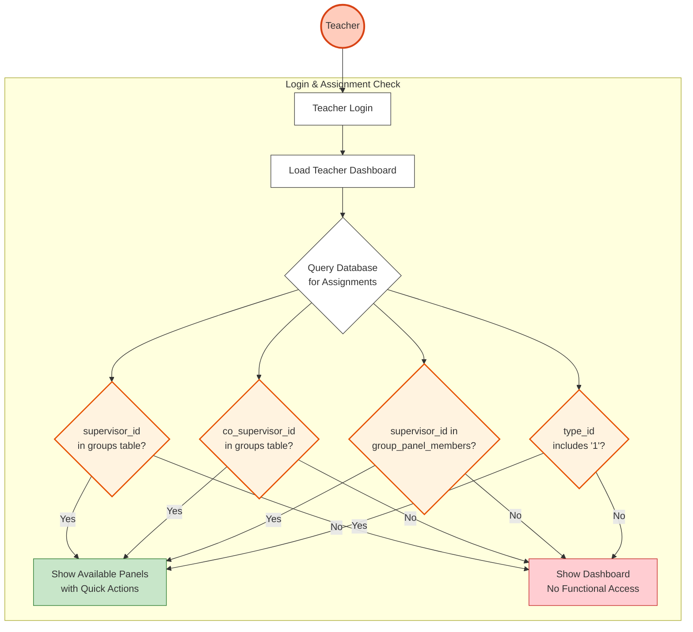

# Teacher Use Case Diagram

## Overview
Teacher is NOT a role with inherent features in the ThesisRepo system. It's merely a login type that provides access to various panels based on actual assignments. A teacher without any assignments cannot perform any actions in the system.

## Important Note
**Teachers have NO specific features by default.** They can only:
1. Login to the system
2. View their dashboard showing available panels
3. Access panels ONLY if they have actual assignments:
   - Supervisor panel → Requires being assigned as supervisor to at least one group
   - Co-Supervisor panel → Requires being assigned as co-supervisor to at least one group
   - Panel Member panel → Requires being assigned as panel member to at least one group
   - Advisor panel → Accessible but requires actual student assignments to be functional
   - Admin panel → Only if type_id includes '1'

## Use Case Diagram

```mermaid
graph TB
    %% Actors
    Teacher[("👤 Teacher<br/>(Login Type)")]
    
    %% System Boundary
    subgraph System["ThesisRepo - Teacher Access System"]
        %% Basic Teacher Access (Always Available)
        subgraph BasicAccess["Basic Teacher Access"]
            UC1["Login to System"]
            UC2["View Teacher Dashboard"]
            UC3["See Available Panels<br/>(Based on Assignments)"]
            UC4["View Profile Information"]
        end
        
        %% Conditional Access Based on Assignments
        subgraph ConditionalAccess["Conditional Access (Requires Actual Assignment)"]
            %% Supervisor Access
            subgraph SupervisorAccess["IF Assigned as Supervisor"]
                UC5["Access Supervisor Panel"]
                UC6["View Supervised Groups"]
                UC7["Manage Meetings"]
                UC8["Create/Edit/Delete Reports"]
                UC9["Approve Thesis"]
                UC10["Add Comments on Reports<br/>(ONLY for supervised groups)"]
            end
            
            %% Co-Supervisor Access
            subgraph CoSupervisorAccess["IF Assigned as Co-Supervisor"]
                UC11["Access Co-Supervisor Panel"]
                UC12["View Co-Supervised Groups"]
                UC13["Conditional Meeting Management<br/>(if permission granted)"]
                UC14["Review Reports"]
                UC15["Annotate Submissions"]
            end
            
            %% Panel Member Access
            subgraph PanelAccess["IF Assigned as Panel Member"]
                UC16["Access Panel Member Panel"]
                UC17["View Panel Groups"]
                UC18["Review Reports"]
                UC19["Create Annotations"]
            end
            
            %% Advisor Access
            subgraph AdvisorAccess["IF Has Teacher Role"]
                UC20["Access Advisor Panel<br/>(But needs student assignments)"]
            end
            
            %% Admin Access
            subgraph AdminAccess["IF type_id includes '1'"]
                UC21["Access Admin Panel"]
                UC22["Manage System Settings"]
                UC23["Sync from APIs"]
                UC24["Global Management"]
            end
        end
        
        %% No Assignment State
        subgraph NoAssignment["If No Assignments"]
            UC25["View Dashboard Only<br/>(No functional access)"]
            UC26["See 'No groups assigned' messages"]
        end
    end
    
    %% Basic connections (always available)
    Teacher --> UC1
    UC1 --> UC2
    UC2 --> UC3
    UC2 --> UC4
    
    %% Conditional connections
    UC3 -.->|If supervisor_id matches| UC5
    UC5 --> UC6
    UC5 --> UC7
    UC5 --> UC8
    UC5 --> UC9
    UC5 --> UC10
    
    UC3 -.->|If co_supervisor_id matches| UC11
    UC11 --> UC12
    UC11 --> UC13
    UC11 --> UC14
    UC11 --> UC15
    
    UC3 -.->|If in group_panel_members| UC16
    UC16 --> UC17
    UC16 --> UC18
    UC16 --> UC19
    
    UC3 -.->|If has teacher role| UC20
    
    UC3 -.->|If type_id has '1'| UC21
    UC21 --> UC22
    UC21 --> UC23
    UC21 --> UC24
    
    UC3 -.->|If no assignments| UC25
    UC25 --> UC26
    
    %% Styling
    classDef actor fill:#ffecb3,stroke:#ff6f00,stroke-width:3px
    classDef basic fill:#e8f5e9,stroke:#388e3c,stroke-width:1px
    classDef conditional fill:#e3f2fd,stroke:#1976d2,stroke-width:1px,stroke-dasharray: 5 5
    classDef noAccess fill:#ffebee,stroke:#c62828,stroke-width:1px
    classDef subsystem fill:#f5f5f5,stroke:#616161,stroke-width:2px
    
    class Teacher actor
    class UC1,UC2,UC3,UC4 basic
    class UC5,UC6,UC7,UC8,UC9,UC10,UC11,UC12,UC13,UC14,UC15,UC16,UC17,UC18,UC19,UC20,UC21,UC22,UC23,UC24 conditional
    class UC25,UC26 noAccess
```



## Simplified Reality View

```mermaid
graph LR
    %% Actor
    Teacher((Teacher))
    
    %% System
    subgraph System["ThesisRepo System"]
        Dashboard[Teacher Dashboard<br/>Shows Available Panels]
        
        %% Assignment Check
        Check{Check Assignments<br/>in Database}
        
        %% Possible Outcomes
        NoAccess[❌ No Access<br/>"No groups assigned"]
        SupervisorPanel[✓ Supervisor Panel<br/>Full Features]
        CoSupervisorPanel[✓ Co-Supervisor Panel<br/>Limited Features]
        PanelMemberPanel[✓ Panel Member Panel<br/>Review Only]
        AdminPanel[✓ Admin Panel<br/>System Management]
        
        %% Empty Panels
        EmptyAdvisor[Advisor Panel<br/>(Empty - No Students)]
    end
    
    Teacher --> Dashboard
    Dashboard --> Check
    
    Check -->|No Assignments| NoAccess
    Check -->|supervisor_id matches| SupervisorPanel
    Check -->|co_supervisor_id matches| CoSupervisorPanel
    Check -->|in group_panel_members| PanelMemberPanel
    Check -->|type_id has '1'| AdminPanel
    Check -->|Has teacher role| EmptyAdvisor
    
    %% Styling
    classDef actor fill:#ffe0b2,stroke:#ef6c00,stroke-width:3px
    classDef dashboard fill:#fff9c4,stroke:#f9a825,stroke-width:2px
    classDef check fill:#e3f2fd,stroke:#1976d2,stroke-width:2px
    classDef access fill:#c8e6c9,stroke:#2e7d32,stroke-width:1px
    classDef noAccess fill:#ffcdd2,stroke:#c62828,stroke-width:1px
    classDef empty fill:#fff3e0,stroke:#ff9800,stroke-width:1px
    
    class Teacher actor
    class Dashboard dashboard
    class Check check
    class SupervisorPanel,CoSupervisorPanel,PanelMemberPanel,AdminPanel access
    class NoAccess noAccess
    class EmptyAdvisor empty
```

## Assignment-Based Access Flow



## Real Implementation from Code

### Teacher Dashboard (dashboard.blade.php)
```php
// Quick Actions section shows panels based on type_id
@if($hasAdminRole)
    <a href="{{ route('admin.dashboard') }}">Admin Panel</a>
@endif

@if($hasTeacherRole)
    <a href="{{ route('supervisor.dashboard') }}">Supervisor Panel</a>
    <a href="{{ route('co-supervisor.dashboard') }}">Co-Supervisor Panel</a>
    <a href="{{ route('panel-member.dashboard') }}">Panel Member Panel</a>
    <a href="{{ route('advisor.dashboard') }}">Advisor Panel</a>
@endif

// If only basic teacher with no admin role
@if(count($typeIds) === 1 && $typeIds[0] === '2')
    <button disabled>Basic Teacher Access Only</button>
@endif
```

### Supervisor Dashboard Controller
```php
// Checks if teacher has actual supervisor assignments
$supervisor = SupervisorModel::where('email', $user->email)->first();

if ($supervisor) {
    $groups = Group::where('supervisor_id', $supervisor->id)->get();
} else {
    $groups = collect(); // Empty collection
}

// If no groups: "No groups have been assigned to you yet."
```

### Co-Supervisor Dashboard Controller
```php
// Must have actual co-supervisor assignments
$supervisor = Supervisor::where('email', $user->email)->first();

if (!$supervisor) {
    return redirect()->route('dashboard')
        ->with('error', 'You are not registered as a co-supervisor');
}

$groups = Group::where('co_supervisor_id', $supervisor->id)->get();
```

### Panel Member Dashboard Controller
```php
// Must be assigned as panel member
$supervisor = Supervisor::where('email', $user->email)->first();

if (!$supervisor) {
    return redirect()->route('dashboard')
        ->with('error', 'You are not registered as a panel member');
}

$panelMemberRecords = GroupPanelMember::where('supervisor_id', $supervisor->id)->get();
```

### Report Comment Controller (ONLY Teacher-Specific Feature)
```php
// Can ONLY comment on reports for groups they supervise
$supervisor = Supervisor::where('email', auth()->user()->email)->first();

if (!$supervisor || $report->group->supervisor_id !== $supervisor->id) {
    return back()->with('error', 'You are not authorized to comment');
}
```

## Key Reality Points

1. **Teacher is NOT a role** - it's a login type (type_id: '2')
2. **No inherent features** - Teachers can't do anything without assignments
3. **Panel access requires assignments**:
   - Supervisor panel → Must be assigned as supervisor to groups
   - Co-Supervisor panel → Must be assigned as co-supervisor to groups
   - Panel Member panel → Must be assigned as panel member to groups
   - Admin panel → Must have type_id including '1'
4. **Empty panels show "No groups assigned"** messages
5. **Only teacher-specific feature**: Comment on reports (but ONLY for groups they supervise)

## Access Matrix

| Feature | Requirement | Without Assignment |
|---------|------------|-------------------|
| Login | Teacher credentials | ✓ Can login |
| View Dashboard | Authenticated as teacher | ✓ Can view |
| Supervisor Panel | supervisor_id in groups table | ❌ No access/Empty |
| Co-Supervisor Panel | co_supervisor_id in groups table | ❌ No access/Empty |
| Panel Member Panel | supervisor_id in group_panel_members | ❌ No access/Empty |
| Advisor Panel | Has teacher role | ✓ Can access but empty |
| Admin Panel | type_id includes '1' | ❌ No access |
| Comment on Reports | Must be supervisor of that group | ❌ Cannot comment |

## Conclusion

The Teacher "role" in ThesisRepo is essentially just a gateway that:
1. Allows login to the system
2. Shows a dashboard with potential panels
3. Grants access to panels ONLY based on actual database assignments
4. Without assignments, a teacher can only view their profile and see empty panels

This is fundamentally different from roles like Student (who can always view their own data) or Admin (who has system-wide permissions). Teachers are completely dependent on being assigned to groups in specific capacities to have any functional access to the system.