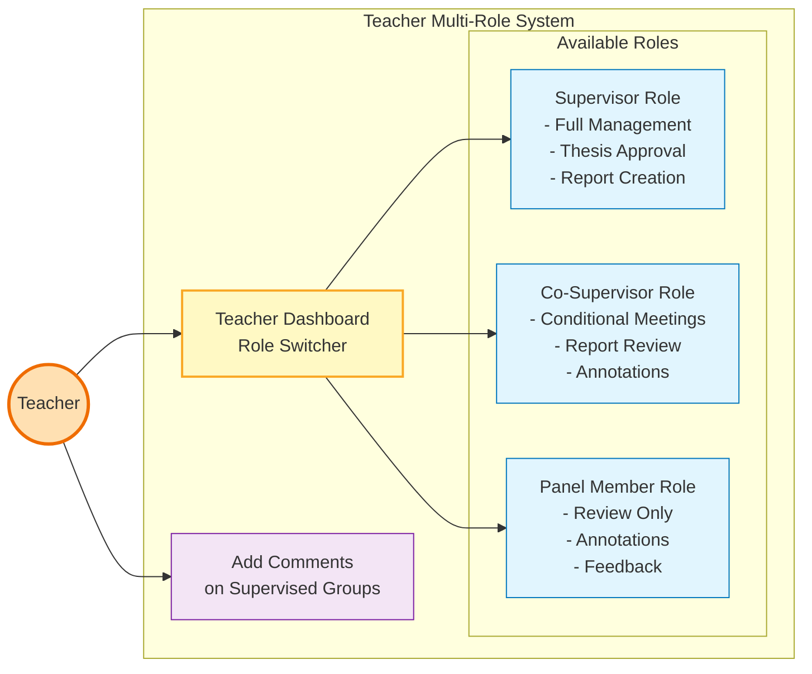
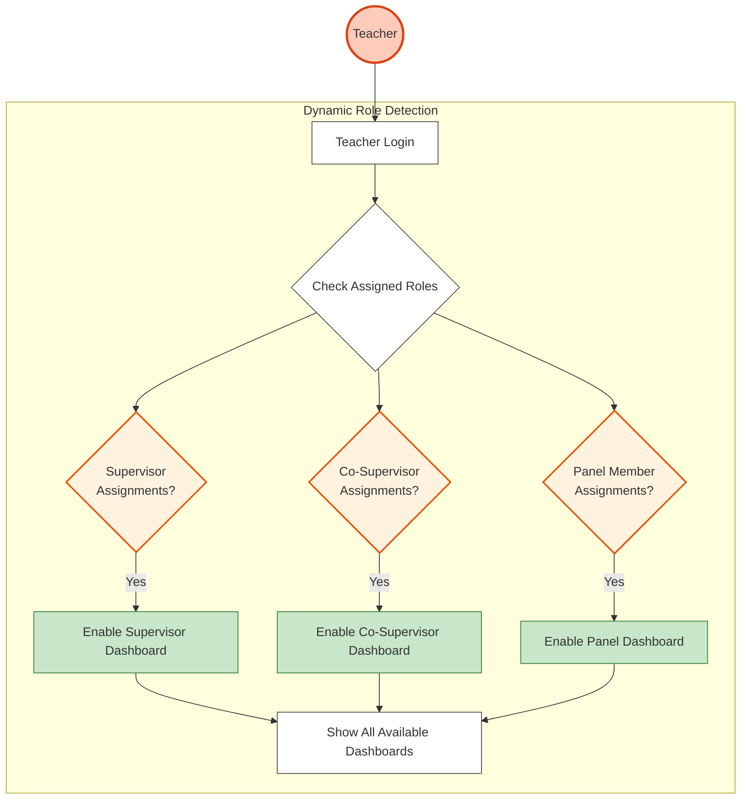
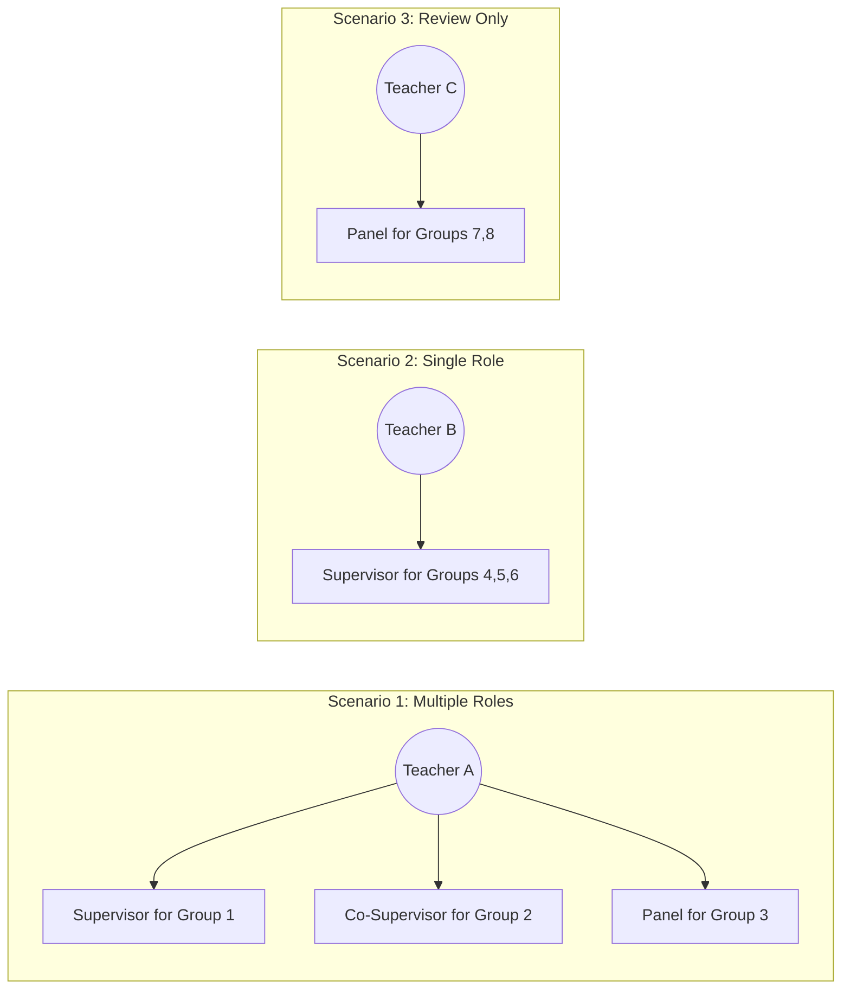
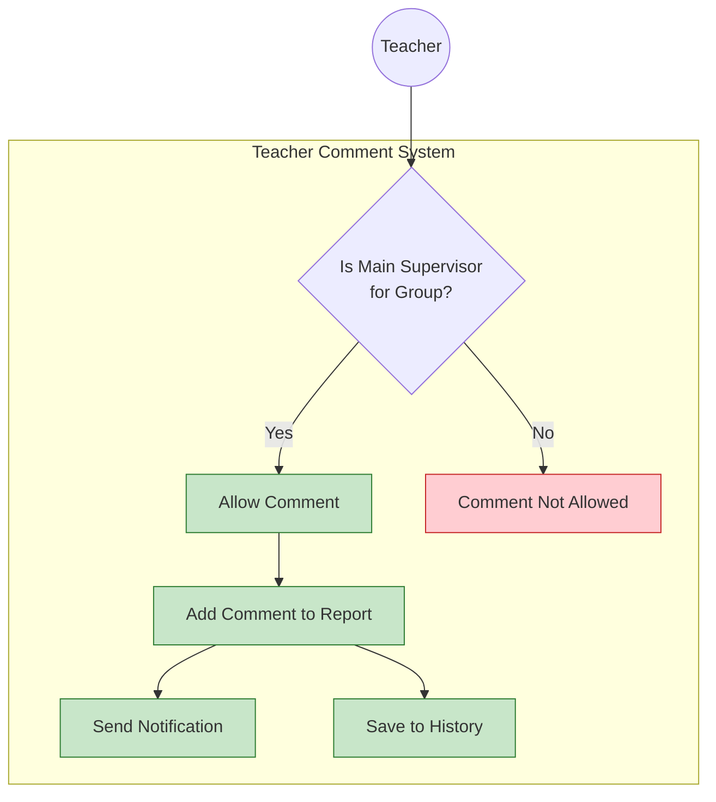
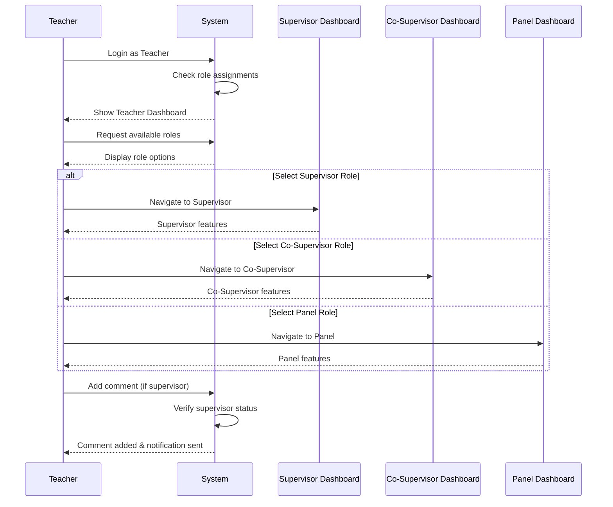

# Teacher Use Case Diagram

## Overview
Teacher is an umbrella role for faculty members who can access supervisor, co-supervisor, and panel member functionalities based on their assignments.

## Use Case Diagram

```mermaid
graph TB
    %% Actor
    Teacher[("👤 Teacher")]
    
    %% System Boundary
    subgraph System["Thesis Management System - Teacher Module"]
        %% Faculty Dashboard
        subgraph FacultyDashboard["Faculty Dashboard"]
            UC1["View Teacher Dashboard"]
            UC2["Navigate to Role Dashboards"]
            UC3["Switch Between Roles"]
        end
        
        %% Role-Based Access
        subgraph RoleAccess["Role-Based Access"]
            UC4["Access Supervisor Dashboard<br/>(if assigned as supervisor)"]
            UC5["Access Co-Supervisor Dashboard<br/>(if assigned as co-supervisor)"]
            UC6["Access Panel Member Dashboard<br/>(if assigned as panel member)"]
        end
        
        %% Supervisor Functions (When Applicable)
        subgraph SupervisorFunctions["As Supervisor"]
            UC7["Manage Meetings"]
            UC8["Create/Edit Reports"]
            UC9["Approve Thesis"]
            UC10["Annotate Submissions"]
        end
        
        %% Co-Supervisor Functions (When Applicable)
        subgraph CoSupervisorFunctions["As Co-Supervisor"]
            UC11["View Groups"]
            UC12["Conditional Meeting Management"]
            UC13["Review Reports"]
            UC14["Annotate Submissions"]
        end
        
        %% Panel Member Functions (When Applicable)
        subgraph PanelFunctions["As Panel Member"]
            UC15["Review Reports"]
            UC16["Annotate Submissions"]
            UC17["Mark Under Review"]
        end
        
        %% Teacher-Specific
        subgraph TeacherSpecific["Teacher-Specific Features"]
            UC18["Add Comments on Reports<br/>(for supervised groups)"]
            UC19["Trigger Student Notifications"]
        end
    end
    
    %% Connections
    Teacher --> UC1
    Teacher --> UC2
    Teacher --> UC3
    Teacher --> UC4
    Teacher --> UC5
    Teacher --> UC6
    
    UC4 --> UC7
    UC4 --> UC8
    UC4 --> UC9
    UC4 --> UC10
    
    UC5 --> UC11
    UC5 --> UC12
    UC5 --> UC13
    UC5 --> UC14
    
    UC6 --> UC15
    UC6 --> UC16
    UC6 --> UC17
    
    Teacher --> UC18
    UC18 -.includes.-> UC19
    
    %% Styling
    classDef actor fill:#ffecb3,stroke:#ff6f00,stroke-width:3px
    classDef usecase fill:#e8f5e9,stroke:#388e3c,stroke-width:1px
    classDef roleSpecific fill:#e3f2fd,stroke:#1976d2,stroke-width:1px,stroke-dasharray: 5 5
    classDef subsystem fill:#f5f5f5,stroke:#616161,stroke-width:2px
    
    class Teacher actor
    class UC1,UC2,UC3,UC18,UC19 usecase
    class UC4,UC5,UC6,UC7,UC8,UC9,UC10,UC11,UC12,UC13,UC14,UC15,UC16,UC17 roleSpecific
```

## Simplified Multi-Role View

## Dynamic Role Assignment Flow

## Role-Based Capabilities Matrix

| Capability | As Supervisor | As Co-Supervisor | As Panel Member | Teacher-Specific |
|------------|--------------|------------------|-----------------|------------------|
| View Groups | ✓ | ✓ | ✓ | ✓ |
| Create Meetings | ✓ | Conditional | ✗ | - |
| Create Reports | ✓ | ✗ | ✗ | - |
| Delete Reports | ✓ | ✗ | ✗ | - |
| Approve Thesis | ✓ | ✗ | ✗ | - |
| Annotate | ✓ | ✓ | ✓ | - |
| Add Comments | ✓ | ✗ | ✗ | ✓ (on supervised) |
| Switch Roles | - | - | - | ✓ |

## Use Case Scenarios

## Comment System (Teacher-Specific)

## Access Paths
- `/teacher/dashboard` - Main teacher dashboard with role switcher
- `/supervisor/dashboard` - When assigned as supervisor
- `/co-supervisor/dashboard` - When assigned as co-supervisor
- `/panel-member/dashboard` - When assigned as panel member

## Navigation Flow

## Key Features

### Faculty Dashboard
- **Unified Access Point**: Single entry for all faculty roles
- **Role Switcher**: Easy navigation between assigned roles
- **Overview**: See all assignments across different roles

### Dynamic Role Access
- **Automatic Detection**: System identifies all assigned roles
- **Conditional Display**: Only show relevant dashboards
- **Seamless Switching**: Move between roles without re-login

### Comment System
- **Supervisor-Only**: Comments restricted to main supervisors
- **Student Notifications**: Automatic notification on new comments
- **Audit Trail**: Complete history of all comments

## Notes
- Teacher role serves as an umbrella for all faculty positions
- Access to specific features depends on actual role assignments
- Comment feature is unique to teacher role when acting as supervisor
- Role switching provides flexibility for multi-role faculty
- All role-specific permissions are enforced at the system level