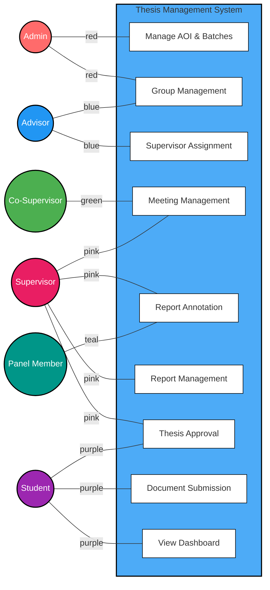
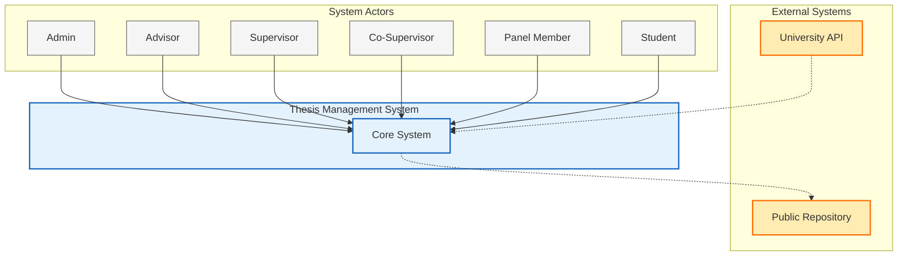

# Comprehensive Use Case Diagram

## Overview
This diagram shows all system actors and their interactions with the Thesis Management System, following the reference design style.

## Complete System Use Case Diagram

## Detailed Actor-Use Case Relationships

### Admin Use Cases
- **Manage AOI & Batches**: Create, edit, delete areas of interest and manage batch synchronization
- **Group Management**: Global group creation and management across all batches

### Advisor Use Cases
- **Group Management**: Create student groups with capacity of 3 students
- **Supervisor Assignment**: Assign supervisors using manual or lottery methods

### Supervisor Use Cases
- **Meeting Management**: Schedule and manage thesis meetings
- **Report Annotation**: Provide feedback on student submissions
- **Report Management**: Create and manage thesis reports
- **Thesis Approval**: Final approval and repository publication

### Co-Supervisor Use Cases
- **Meeting Management**: Conditional meeting management based on permissions

### Panel Member Use Cases
- **Report Annotation**: Review and annotate student submissions

### Student Use Cases
- **Document Submission**: Upload thesis documents (PDF, PPT, PPTX)
- **View Dashboard**: Access group information and progress
- **Thesis Approval**: View approval status

## Permission Matrix

| Use Case | Admin | Advisor | Supervisor | Co-Supervisor | Panel Member | Student |
|----------|-------|---------|------------|---------------|--------------|---------|
| Manage AOI & Batches | ✓ | - | - | - | - | - |
| Group Management | ✓ | ✓ | - | - | - | - |
| Supervisor Assignment | - | ✓ | - | - | - | - |
| Meeting Management | - | - | ✓ | Conditional | - | - |
| Report Annotation | - | - | ✓ | ✓ | ✓ | - |
| Report Management | - | - | ✓ | - | - | - |
| Thesis Approval | - | - | ✓ | - | - | View Only |
| Document Submission | - | - | - | - | - | ✓ |
| View Dashboard | ✓ | ✓ | ✓ | ✓ | ✓ | ✓ |

## System Architecture Context

## Key System Features by Role

### Administrative Features
- **Admin**: System configuration, monitoring, global management
- **Advisor**: Group formation, supervisor assignment algorithms

### Supervisory Features
- **Supervisor**: Full thesis guidance and approval authority
- **Co-Supervisor**: Assisted guidance with conditional permissions
- **Panel Member**: Review and feedback only

### End-User Features
- **Student**: Document submission, progress tracking, notifications

## Access Control Levels

1. **Level 1 - Admin**: Full system access
2. **Level 2 - Advisor**: Group and assignment management
3. **Level 3 - Supervisor**: Thesis management and approval
4. **Level 4 - Co-Supervisor**: Conditional management access
5. **Level 5 - Panel Member**: Review access only
6. **Level 6 - Student**: Submission and view access

## Notes
- The system follows a hierarchical permission structure
- Each role has specific use cases aligned with their responsibilities
- Color coding helps identify actor-use case relationships
- The reference design style emphasizes clarity and simplicity