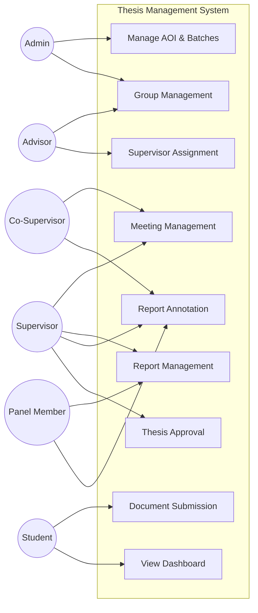
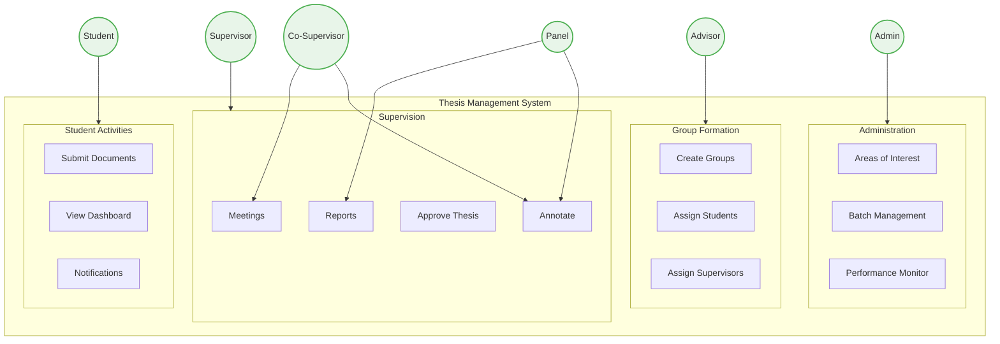

# Use Case Diagram - Thesis Management System

## Simplified Core Features by Role

This diagram shows the essential use cases for each actor in the system, optimized for A4 thesis report inclusion.

```mermaid
graph TB
    %% Define Actors
    Admin[("👤 Admin")]
    Advisor[("👤 Advisor")]
    Supervisor[("👤 Supervisor")]
    CoSupervisor[("👤 Co-Supervisor")]
    PanelMember[("👤 Panel Member")]
    Student[("👤 Student")]
    
    %% Admin Use Cases
    Admin --> UC1["Manage Areas of Interest"]
    Admin --> UC2["Sync Supervisors"]
    Admin --> UC3["Manage Batches"]
    Admin --> UC4["Create Groups"]
    Admin --> UC5["Monitor Performance"]
    
    %% Advisor Use Cases
    Advisor --> UC6["View Students"]
    Advisor --> UC7["Create Groups"]
    Advisor --> UC8["Assign Students"]
    Advisor --> UC9["Assign Supervisors"]
    Advisor --> UC10["Upload Excel"]
    
    %% Supervisor Use Cases
    Supervisor --> UC11["Manage Meetings"]
    Supervisor --> UC12["Create Reports"]
    Supervisor --> UC13["Approve Thesis"]
    Supervisor --> UC14["Annotate Submissions"]
    Supervisor --> UC15["Export Meeting PDF"]
    
    %% Co-Supervisor Use Cases
    CoSupervisor --> UC16["View Groups"]
    CoSupervisor --> UC17["Manage Meetings*"]
    CoSupervisor --> UC18["Review Reports"]
    CoSupervisor --> UC19["Annotate Submissions"]
    
    %% Panel Member Use Cases
    PanelMember --> UC20["Review Reports"]
    PanelMember --> UC21["Annotate Submissions"]
    PanelMember --> UC22["Mark Under Review"]
    
    %% Student Use Cases
    Student --> UC23["View Dashboard"]
    Student --> UC24["Submit Documents"]
    Student --> UC25["View Meetings"]
    Student --> UC26["View Notifications"]
    Student --> UC27["Download Reports"]
    
    %% Styling
    classDef actor fill:#e1f5fe,stroke:#01579b,stroke-width:2px
    classDef usecase fill:#fff3e0,stroke:#e65100,stroke-width:1px
    
    class Admin,Advisor,Supervisor,CoSupervisor,PanelMember,Student actor
    class UC1,UC2,UC3,UC4,UC5,UC6,UC7,UC8,UC9,UC10,UC11,UC12,UC13,UC14,UC15,UC16,UC17,UC18,UC19,UC20,UC21,UC22,UC23,UC24,UC25,UC26,UC27 usecase
```

## Alternative Compact Version for A4

## Most Simplified Version (Best for A4 Thesis)

## Notes for Thesis Report

**Legend:**
- *Manage Meetings* for Co-Supervisor requires permission from main Supervisor
- Panel Members have review-only access
- Students can only submit one document per report

**Key Features by Role:**

| Actor | Primary Responsibilities |
|-------|-------------------------|
| Admin | System configuration, user management, monitoring |
| Advisor | Group formation, student-supervisor matching |
| Supervisor | Thesis supervision, meetings, final approval |
| Co-Supervisor | Assist supervision (with permissions) |
| Panel Member | Review and provide feedback |
| Student | Submit work, view progress, receive notifications |

---

*Choose the version that best fits your thesis report layout. The third version (Most Simplified) is recommended for A4 format as it groups related features and maintains readability.*