# System Sequence Diagrams (Simplified)

This document contains simplified sequence diagrams for all major functionalities of the Thesis Management System.

## Table of Contents
1. [Authentication Flow](#1-authentication-flow)
2. [Admin - Supervisor Management](#2-admin---supervisor-management)
3. [Admin - Batch Management](#3-admin---batch-management)
4. [Admin - Area of Interest Management](#4-admin---area-of-interest-management)
5. [Admin - Group Management](#5-admin---group-management)
6. [Advisor - Group Creation](#6-advisor---group-creation)
7. [Advisor - Supervisor Assignment (Lottery)](#7-advisor---supervisor-assignment-lottery)
8. [Student - Report Submission](#8-student---report-submission)
9. [Supervisor - Report Management](#9-supervisor---report-management)
10. [Supervisor - Report Annotation](#10-supervisor---report-annotation)
11. [Supervisor - Meeting Management](#11-supervisor---meeting-management)
12. [Co-Supervisor & Panel Member - Report Review](#12-co-supervisor--panel-member---report-review)
13. [Notification System](#13-notification-system)
14. [Performance Monitoring](#14-performance-monitoring)
15. [External API Integration](#15-external-api-integration)

---

## 1. Authentication Flow

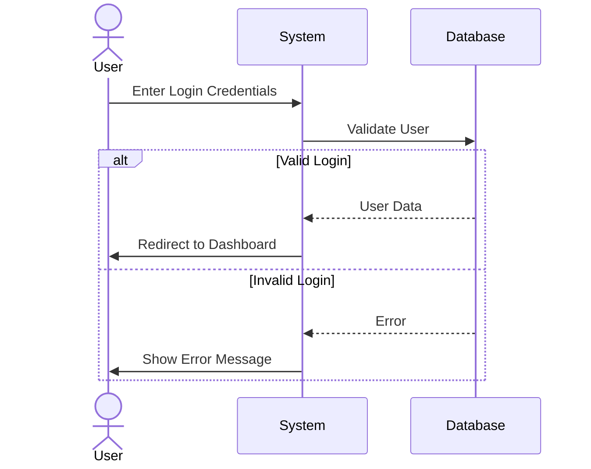
```mermaid
sequenceDiagram
    actor User
    participant System
    participant Database

    User->>System: Enter Login Credentials
    System->>Database: Validate User
    
    alt Valid Login
        Database-->>System: User Data
        System->>User: Redirect to Dashboard
    else Invalid Login
        Database-->>System: Error
        System->>User: Show Error Message
    end
```

---

## 2. Admin - Supervisor Management

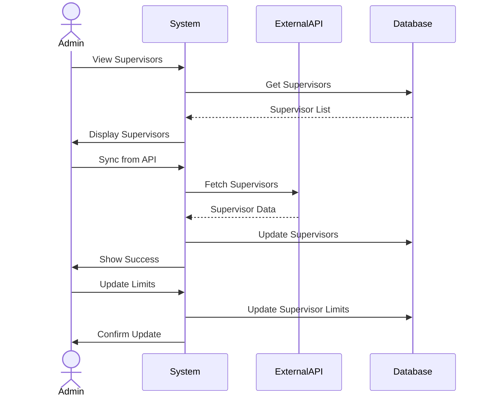
```mermaid
sequenceDiagram
    actor Admin
    participant System
    participant ExternalAPI
    participant Database

    Admin->>System: View Supervisors
    System->>Database: Get Supervisors
    Database-->>System: Supervisor List
    System->>Admin: Display Supervisors
    
    Admin->>System: Sync from API
    System->>ExternalAPI: Fetch Supervisors
    ExternalAPI-->>System: Supervisor Data
    System->>Database: Update Supervisors
    System->>Admin: Show Success
    
    Admin->>System: Update Limits
    System->>Database: Update Supervisor Limits
    System->>Admin: Confirm Update
```

---

## 3. Admin - Batch Management

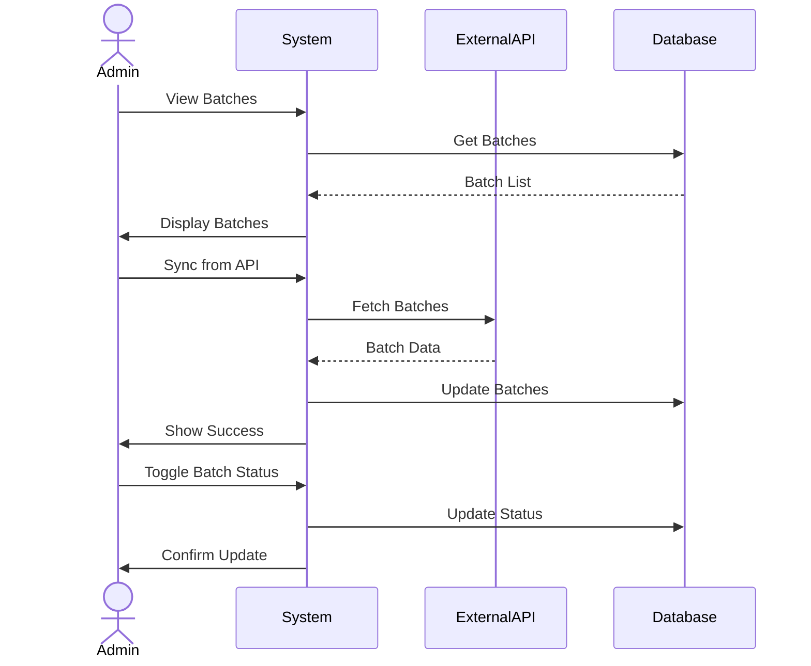
```mermaid
sequenceDiagram
    actor Admin
    participant System
    participant ExternalAPI
    participant Database

    Admin->>System: View Batches
    System->>Database: Get Batches
    Database-->>System: Batch List
    System->>Admin: Display Batches
    
    Admin->>System: Sync from API
    System->>ExternalAPI: Fetch Batches
    ExternalAPI-->>System: Batch Data
    System->>Database: Update Batches
    System->>Admin: Show Success
    
    Admin->>System: Toggle Batch Status
    System->>Database: Update Status
    System->>Admin: Confirm Update
```

---

## 4. Admin - Area of Interest Management

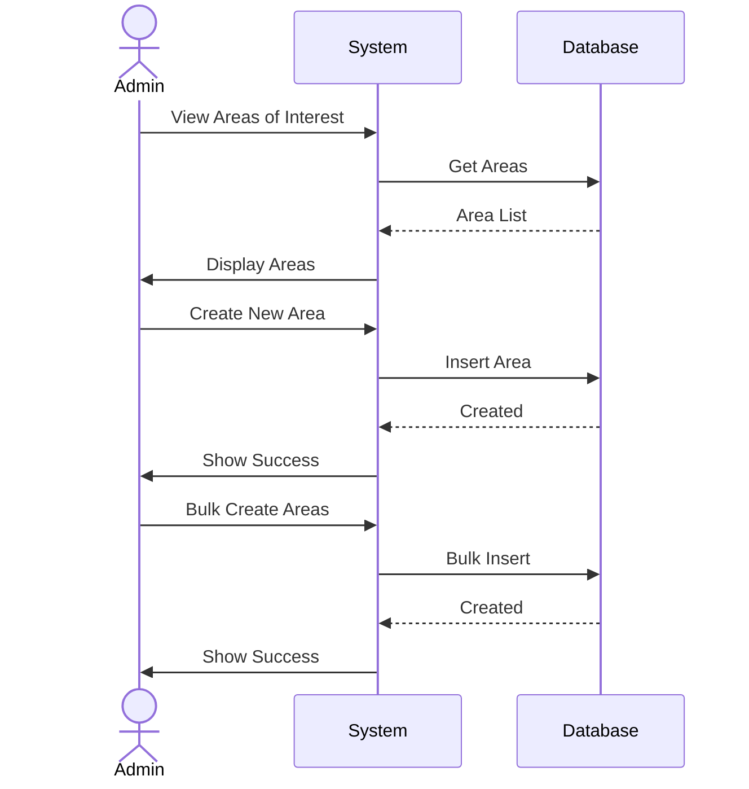
```mermaid
sequenceDiagram
    actor Admin
    participant System
    participant Database

    Admin->>System: View Areas of Interest
    System->>Database: Get Areas
    Database-->>System: Area List
    System->>Admin: Display Areas
    
    Admin->>System: Create New Area
    System->>Database: Insert Area
    Database-->>System: Created
    System->>Admin: Show Success
    
    Admin->>System: Bulk Create Areas
    System->>Database: Bulk Insert
    Database-->>System: Created
    System->>Admin: Show Success
```

---

## 5. Admin - Group Management

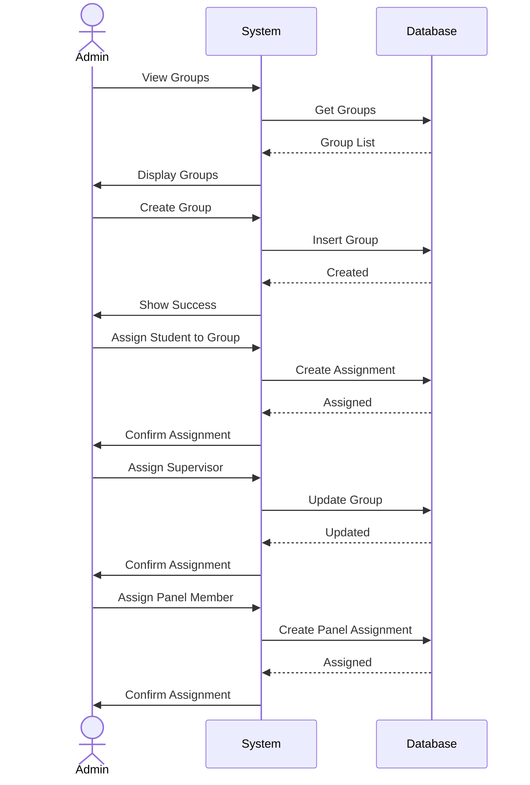
```mermaid
sequenceDiagram
    actor Admin
    participant System
    participant Database

    Admin->>System: View Groups
    System->>Database: Get Groups
    Database-->>System: Group List
    System->>Admin: Display Groups
    
    Admin->>System: Create Group
    System->>Database: Insert Group
    Database-->>System: Created
    System->>Admin: Show Success
    
    Admin->>System: Assign Student to Group
    System->>Database: Create Assignment
    Database-->>System: Assigned
    System->>Admin: Confirm Assignment
    
    Admin->>System: Assign Supervisor
    System->>Database: Update Group
    Database-->>System: Updated
    System->>Admin: Confirm Assignment
    
    Admin->>System: Assign Panel Member
    System->>Database: Create Panel Assignment
    Database-->>System: Assigned
    System->>Admin: Confirm Assignment
```

---

## 6. Advisor - Group Creation

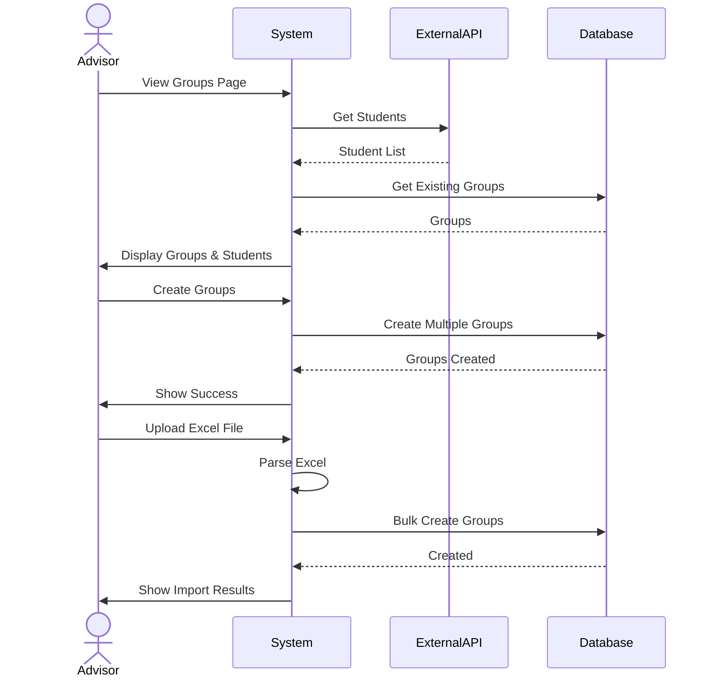
```mermaid
sequenceDiagram
    actor Advisor
    participant System
    participant ExternalAPI
    participant Database

    Advisor->>System: View Groups Page
    System->>ExternalAPI: Get Students
    ExternalAPI-->>System: Student List
    System->>Database: Get Existing Groups
    Database-->>System: Groups
    System->>Advisor: Display Groups & Students
    
    Advisor->>System: Create Groups
    System->>Database: Create Multiple Groups
    Database-->>System: Groups Created
    System->>Advisor: Show Success
    
    Advisor->>System: Upload Excel File
    System->>System: Parse Excel
    System->>Database: Bulk Create Groups
    Database-->>System: Created
    System->>Advisor: Show Import Results
```

---

## 7. Advisor - Supervisor Assignment (Lottery)

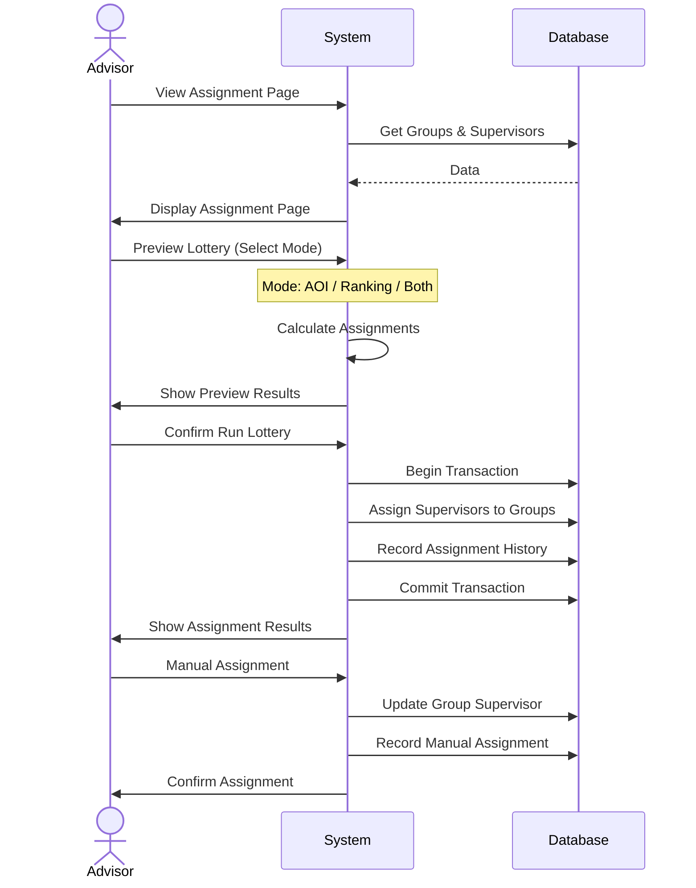
```mermaid
sequenceDiagram
    actor Advisor
    participant System
    participant Database

    Advisor->>System: View Assignment Page
    System->>Database: Get Groups & Supervisors
    Database-->>System: Data
    System->>Advisor: Display Assignment Page
    
    Advisor->>System: Preview Lottery (Select Mode)
    Note over System: Mode: AOI / Ranking / Both
    System->>System: Calculate Assignments
    System->>Advisor: Show Preview Results
    
    Advisor->>System: Confirm Run Lottery
    System->>Database: Begin Transaction
    System->>Database: Assign Supervisors to Groups
    System->>Database: Record Assignment History
    System->>Database: Commit Transaction
    System->>Advisor: Show Assignment Results
    
    Advisor->>System: Manual Assignment
    System->>Database: Update Group Supervisor
    System->>Database: Record Manual Assignment
    System->>Advisor: Confirm Assignment
```

---

## 8. Student - Report Submission

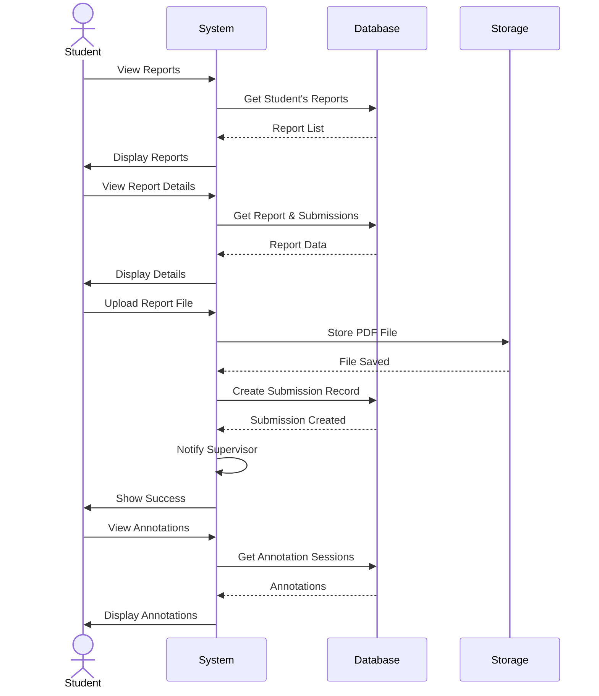
```mermaid
sequenceDiagram
    actor Student
    participant System
    participant Database
    participant Storage

    Student->>System: View Reports
    System->>Database: Get Student's Reports
    Database-->>System: Report List
    System->>Student: Display Reports
    
    Student->>System: View Report Details
    System->>Database: Get Report & Submissions
    Database-->>System: Report Data
    System->>Student: Display Details
    
    Student->>System: Upload Report File
    System->>Storage: Store PDF File
    Storage-->>System: File Saved
    System->>Database: Create Submission Record
    Database-->>System: Submission Created
    System->>System: Notify Supervisor
    System->>Student: Show Success
    
    Student->>System: View Annotations
    System->>Database: Get Annotation Sessions
    Database-->>System: Annotations
    System->>Student: Display Annotations
```

---

## 9. Supervisor - Report Management

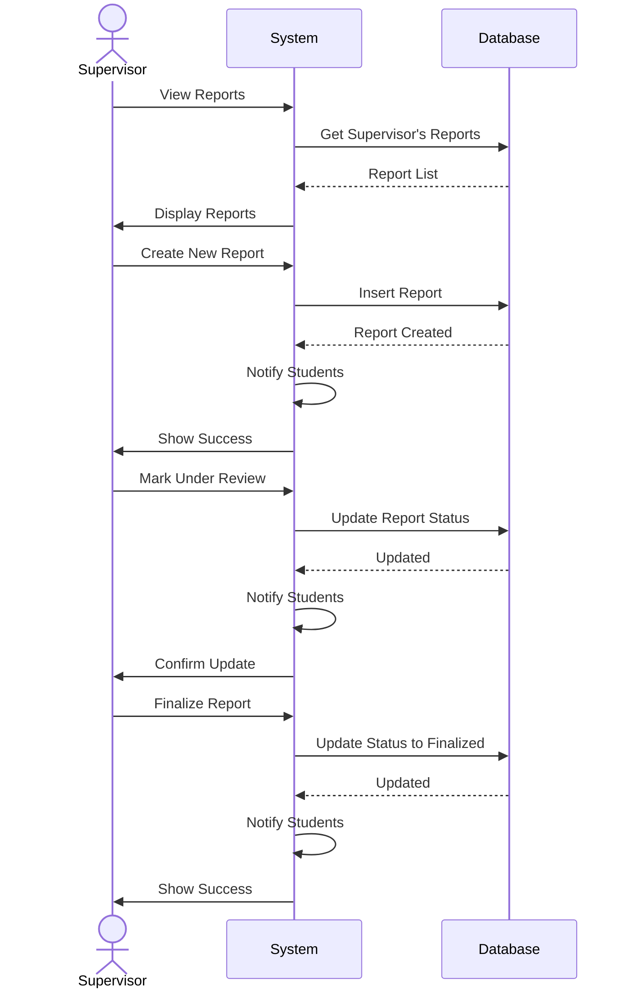
```mermaid
sequenceDiagram
    actor Supervisor
    participant System
    participant Database

    Supervisor->>System: View Reports
    System->>Database: Get Supervisor's Reports
    Database-->>System: Report List
    System->>Supervisor: Display Reports
    
    Supervisor->>System: Create New Report
    System->>Database: Insert Report
    Database-->>System: Report Created
    System->>System: Notify Students
    System->>Supervisor: Show Success
    
    Supervisor->>System: Mark Under Review
    System->>Database: Update Report Status
    Database-->>System: Updated
    System->>System: Notify Students
    System->>Supervisor: Confirm Update
    
    Supervisor->>System: Finalize Report
    System->>Database: Update Status to Finalized
    Database-->>System: Updated
    System->>System: Notify Students
    System->>Supervisor: Show Success
```

---

## 10. Supervisor - Report Annotation

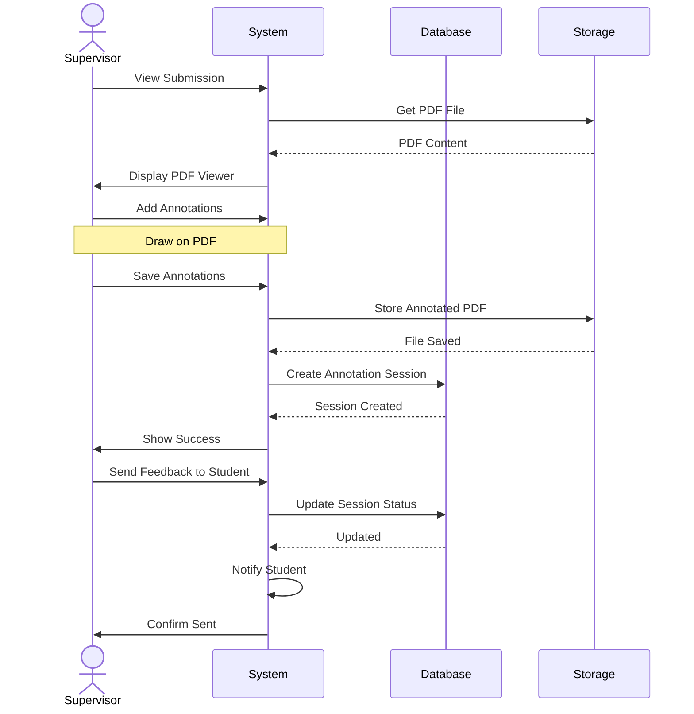
```mermaid
sequenceDiagram
    actor Supervisor
    participant System
    participant Database
    participant Storage

    Supervisor->>System: View Submission
    System->>Storage: Get PDF File
    Storage-->>System: PDF Content
    System->>Supervisor: Display PDF Viewer
    
    Supervisor->>System: Add Annotations
    Note over Supervisor,System: Draw on PDF
    
    Supervisor->>System: Save Annotations
    System->>Storage: Store Annotated PDF
    Storage-->>System: File Saved
    System->>Database: Create Annotation Session
    Database-->>System: Session Created
    System->>Supervisor: Show Success
    
    Supervisor->>System: Send Feedback to Student
    System->>Database: Update Session Status
    Database-->>System: Updated
    System->>System: Notify Student
    System->>Supervisor: Confirm Sent
```

---

## 11. Supervisor - Meeting Management

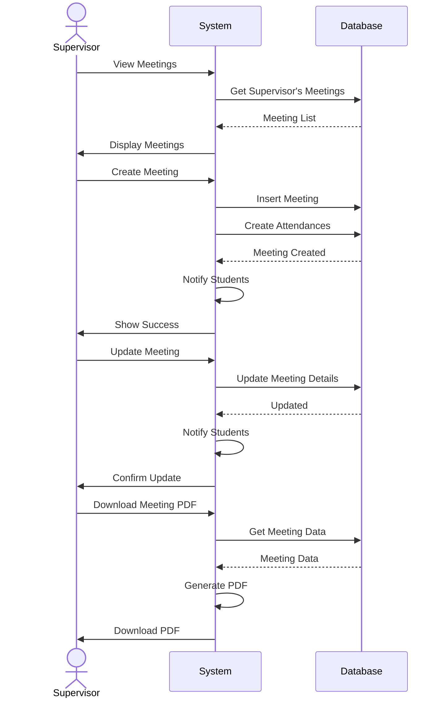
```mermaid
sequenceDiagram
    actor Supervisor
    participant System
    participant Database

    Supervisor->>System: View Meetings
    System->>Database: Get Supervisor's Meetings
    Database-->>System: Meeting List
    System->>Supervisor: Display Meetings
    
    Supervisor->>System: Create Meeting
    System->>Database: Insert Meeting
    System->>Database: Create Attendances
    Database-->>System: Meeting Created
    System->>System: Notify Students
    System->>Supervisor: Show Success
    
    Supervisor->>System: Update Meeting
    System->>Database: Update Meeting Details
    Database-->>System: Updated
    System->>System: Notify Students
    System->>Supervisor: Confirm Update
    
    Supervisor->>System: Download Meeting PDF
    System->>Database: Get Meeting Data
    Database-->>System: Meeting Data
    System->>System: Generate PDF
    System->>Supervisor: Download PDF
```

---

## 12. Co-Supervisor & Panel Member - Report Review

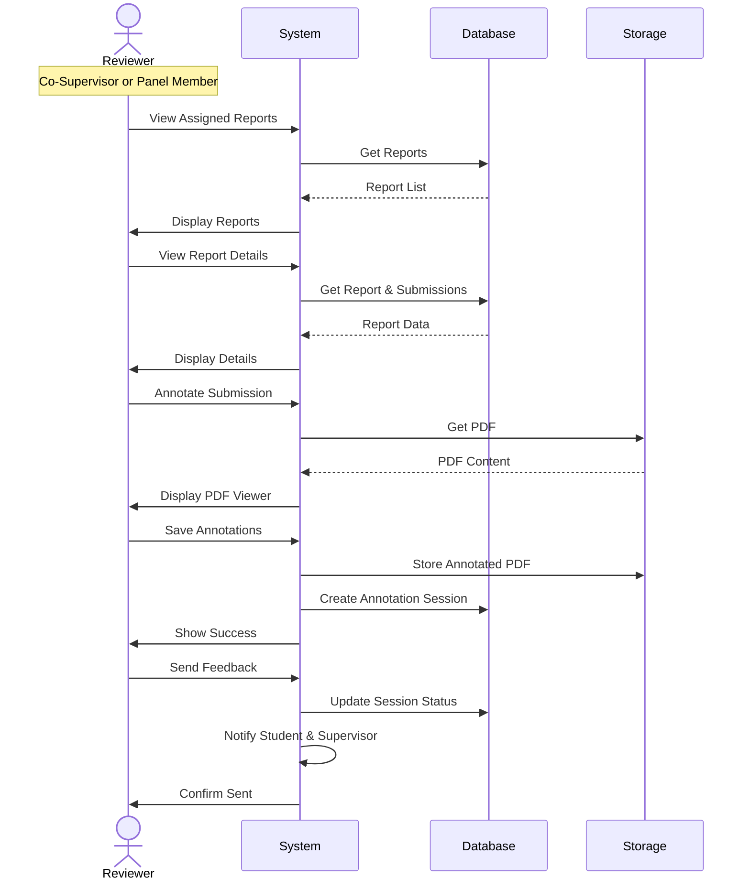
```mermaid
sequenceDiagram
    actor Reviewer
    Note over Reviewer: Co-Supervisor or Panel Member
    participant System
    participant Database
    participant Storage

    Reviewer->>System: View Assigned Reports
    System->>Database: Get Reports
    Database-->>System: Report List
    System->>Reviewer: Display Reports
    
    Reviewer->>System: View Report Details
    System->>Database: Get Report & Submissions
    Database-->>System: Report Data
    System->>Reviewer: Display Details
    
    Reviewer->>System: Annotate Submission
    System->>Storage: Get PDF
    Storage-->>System: PDF Content
    System->>Reviewer: Display PDF Viewer
    
    Reviewer->>System: Save Annotations
    System->>Storage: Store Annotated PDF
    System->>Database: Create Annotation Session
    System->>Reviewer: Show Success
    
    Reviewer->>System: Send Feedback
    System->>Database: Update Session Status
    System->>System: Notify Student & Supervisor
    System->>Reviewer: Confirm Sent
```

---

## 13. Notification System

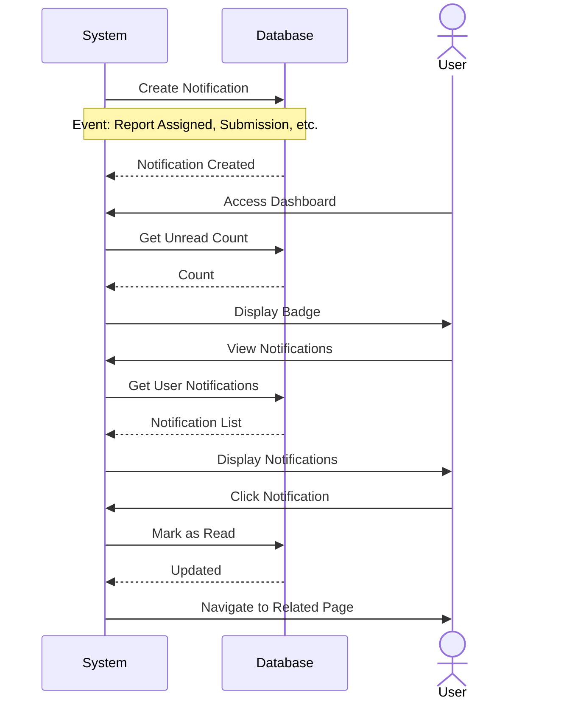
```mermaid
sequenceDiagram
    participant System
    participant Database
    actor User

    System->>Database: Create Notification
    Note over System,Database: Event: Report Assigned, Submission, etc.
    Database-->>System: Notification Created
    
    User->>System: Access Dashboard
    System->>Database: Get Unread Count
    Database-->>System: Count
    System->>User: Display Badge
    
    User->>System: View Notifications
    System->>Database: Get User Notifications
    Database-->>System: Notification List
    System->>User: Display Notifications
    
    User->>System: Click Notification
    System->>Database: Mark as Read
    Database-->>System: Updated
    System->>User: Navigate to Related Page
```

---

## 14. Performance Monitoring

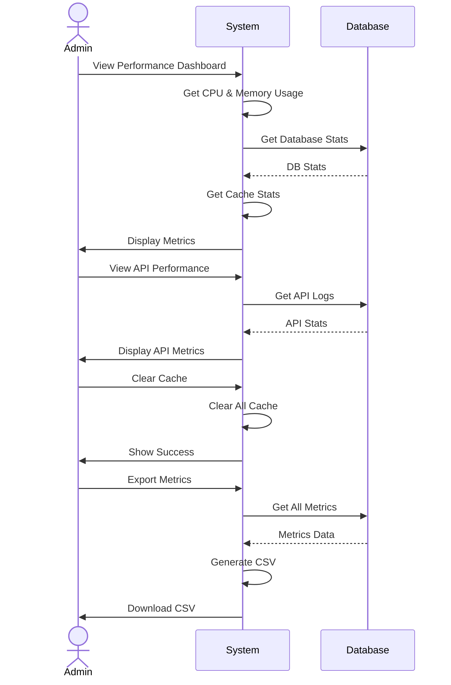
```mermaid
sequenceDiagram
    actor Admin
    participant System
    participant Database

    Admin->>System: View Performance Dashboard
    System->>System: Get CPU & Memory Usage
    System->>Database: Get Database Stats
    Database-->>System: DB Stats
    System->>System: Get Cache Stats
    System->>Admin: Display Metrics
    
    Admin->>System: View API Performance
    System->>Database: Get API Logs
    Database-->>System: API Stats
    System->>Admin: Display API Metrics
    
    Admin->>System: Clear Cache
    System->>System: Clear All Cache
    System->>Admin: Show Success
    
    Admin->>System: Export Metrics
    System->>Database: Get All Metrics
    Database-->>System: Metrics Data
    System->>System: Generate CSV
    System->>Admin: Download CSV
```

---

## 15. External API Integration

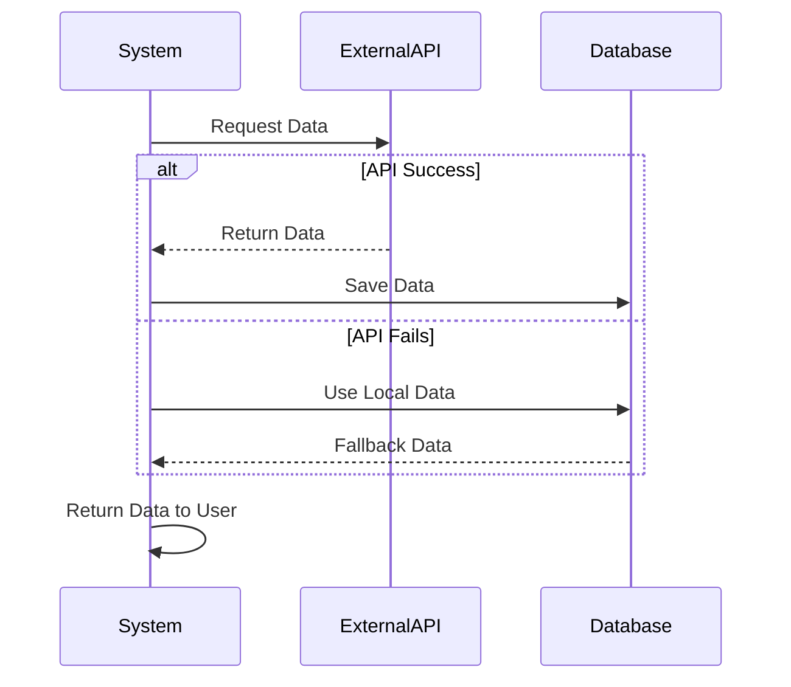
```mermaid
sequenceDiagram
    participant System
    participant ExternalAPI
    participant Database

    System->>ExternalAPI: Request Data
    
    alt API Success
        ExternalAPI-->>System: Return Data
        System->>Database: Save Data
    else API Fails
        System->>Database: Use Local Data
        Database-->>System: Fallback Data
    end
    
    System->>System: Return Data to User
```

---

## Additional Diagrams

### 16. Report Lifecycle State Machine

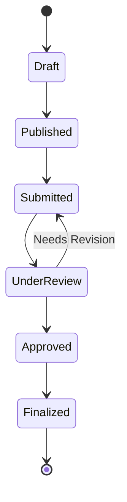
```mermaid
stateDiagram-v2
    [*] --> Draft
    Draft --> Published
    Published --> Submitted
    Submitted --> UnderReview
    UnderReview --> Submitted: Needs Revision
    UnderReview --> Approved
    Approved --> Finalized
    Finalized --> [*]
```

---

### 17. Lottery Assignment Transaction Flow

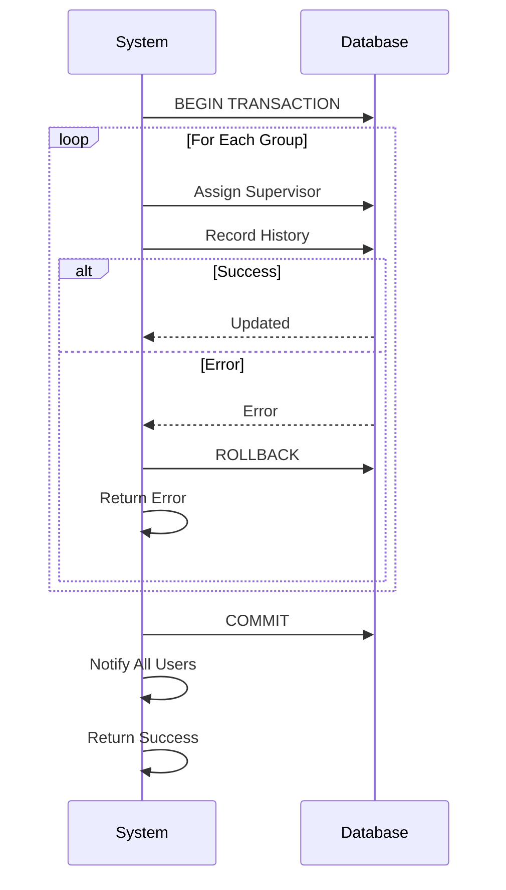
```mermaid
sequenceDiagram
    participant System
    participant Database

    System->>Database: BEGIN TRANSACTION
    
    loop For Each Group
        System->>Database: Assign Supervisor
        System->>Database: Record History
        
        alt Success
            Database-->>System: Updated
        else Error
            Database-->>System: Error
            System->>Database: ROLLBACK
            System->>System: Return Error
        end
    end
    
    System->>Database: COMMIT
    System->>System: Notify All Users
    System->>System: Return Success
```

---

### 18. Excel Import Flow

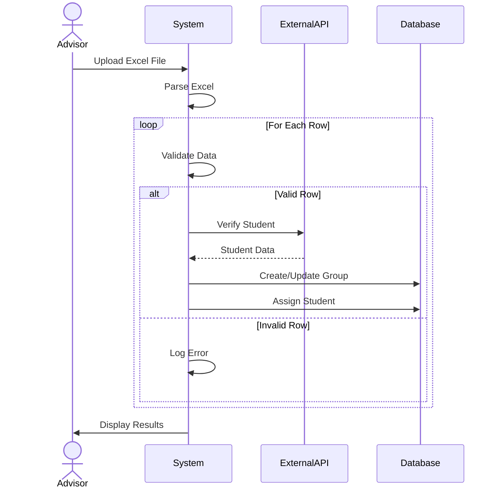
```mermaid
sequenceDiagram
    actor Advisor
    participant System
    participant ExternalAPI
    participant Database

    Advisor->>System: Upload Excel File
    System->>System: Parse Excel
    
    loop For Each Row
        System->>System: Validate Data
        
        alt Valid Row
            System->>ExternalAPI: Verify Student
            ExternalAPI-->>System: Student Data
            System->>Database: Create/Update Group
            System->>Database: Assign Student
        else Invalid Row
            System->>System: Log Error
        end
    end
    
    System->>Advisor: Display Results
```

---

### 19. System Architecture Overview

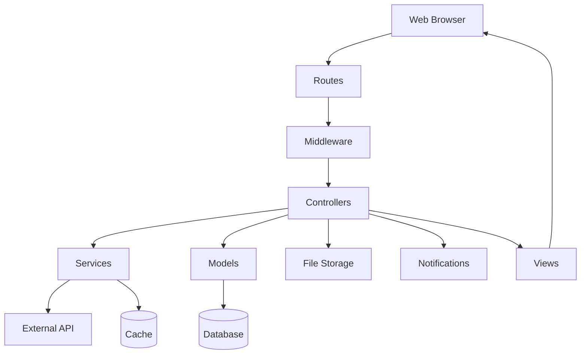
```mermaid
flowchart TB
    Browser[Web Browser] --> Routes[Routes]
    Routes --> Middleware[Middleware]
    Middleware --> Controllers[Controllers]
    Controllers --> Services[Services]
    Controllers --> Models[Models]
    Services --> ExternalAPI[External API]
    Services --> Cache[(Cache)]
    Models --> Database[(Database)]
    Controllers --> Storage[File Storage]
    Controllers --> Notifications[Notifications]
    Controllers --> Views[Views]
    Views --> Browser
```

---

## Key Features Summary

### User Roles
- **Admin**: Manages supervisors, batches, areas of interest, and groups
- **Advisor**: Creates groups, assigns supervisors using lottery system
- **Supervisor**: Manages reports, annotations, and meetings
- **Co-Supervisor**: Reviews and annotates reports
- **Panel Member**: Evaluates and provides feedback on reports
- **Student**: Submits reports and views feedback

### Core Functionalities
1. **Authentication**: Role-based access control
2. **Group Management**: Create and manage student groups
3. **Supervisor Assignment**: Automated lottery system with 3 modes (AOI, Ranking, Combined)
4. **Report Management**: Create, submit, review, and finalize reports
5. **Annotation System**: PDF annotation with feedback
6. **Meeting Management**: Schedule and track meetings
7. **Notification System**: Real-time notifications for all events
8. **Performance Monitoring**: System health and metrics tracking
9. **External API Integration**: Sync data with caching and rate limiting

### Technical Features
- **Caching**: Reduces API calls and improves performance
- **Rate Limiting**: Prevents API abuse
- **Transaction Management**: Ensures data consistency
- **File Storage**: Secure PDF storage and retrieval
- **Notification System**: Event-driven notifications
- **Excel Import/Export**: Bulk operations support

---

## Notes

- All diagrams are simplified for easy understanding
- Focus on core flows and main components
- Error handling and validation are implicit in all flows
- Database transactions ensure data consistency
- Notifications are sent for all major events
- Caching improves performance for external API calls
- All user roles have appropriate access controls

