# System Sequence Diagrams

This document contains comprehensive sequence diagrams for all major functionalities of the Thesis Management System.

## Table of Contents
1. [Authentication Flow](#1-authentication-flow)
2. [Admin - Supervisor Management](#2-admin---supervisor-management)
3. [Admin - Batch Management](#3-admin---batch-management)
4. [Admin - Area of Interest Management](#4-admin---area-of-interest-management)
5. [Admin - Group Management](#5-admin---group-management)
6. [Advisor - Group Creation](#6-advisor---group-creation)
7. [Advisor - Supervisor Assignment (Lottery)](#7-advisor---supervisor-assignment-lottery)
8. [Student - Report Submission](#8-student---report-submission)
9. [Supervisor - Report Management](#9-supervisor---report-management)
10. [Supervisor - Report Annotation](#10-supervisor---report-annotation)
11. [Supervisor - Meeting Management](#11-supervisor---meeting-management)
12. [Co-Supervisor - Report Review](#12-co-supervisor---report-review)
13. [Panel Member - Report Evaluation](#13-panel-member---report-evaluation)
14. [Notification System](#14-notification-system)
15. [Performance Monitoring](#15-performance-monitoring)

---

## 1. Authentication Flow

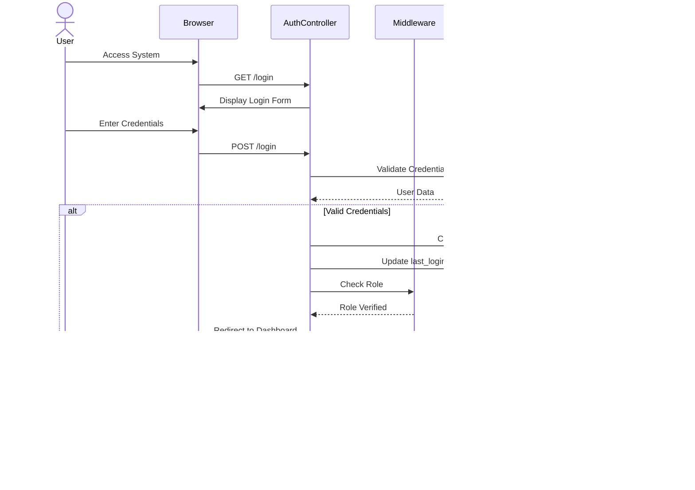
```mermaid
sequenceDiagram
    actor User
    participant Browser
    participant AuthController
    participant Middleware
    participant Database
    participant Session

    User->>Browser: Access System
    Browser->>AuthController: GET /login
    AuthController->>Browser: Display Login Form
    
    User->>Browser: Enter Credentials
    Browser->>AuthController: POST /login
    AuthController->>Database: Validate Credentials
    Database-->>AuthController: User Data
    
    alt Valid Credentials
        AuthController->>Session: Create Session
        AuthController->>Database: Update last_login
        AuthController->>Middleware: Check Role
        Middleware-->>AuthController: Role Verified
        AuthController->>Browser: Redirect to Dashboard
        Browser->>User: Show Role-based Dashboard
    else Invalid Credentials
        AuthController->>Browser: Show Error
        Browser->>User: Display Error Message
    end
```

---

## 2. Admin - Supervisor Management

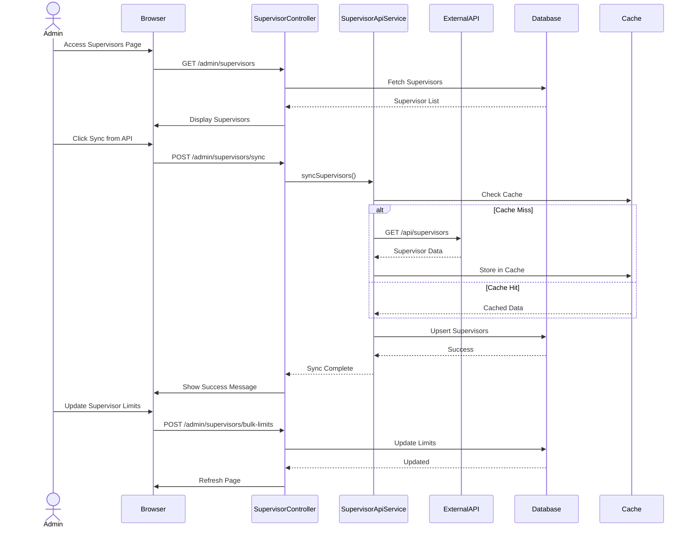
```mermaid
sequenceDiagram
    actor Admin
    participant Browser
    participant SupervisorController
    participant SupervisorApiService
    participant ExternalAPI
    participant Database
    participant Cache

    Admin->>Browser: Access Supervisors Page
    Browser->>SupervisorController: GET /admin/supervisors
    SupervisorController->>Database: Fetch Supervisors
    Database-->>SupervisorController: Supervisor List
    SupervisorController->>Browser: Display Supervisors
    
    Admin->>Browser: Click Sync from API
    Browser->>SupervisorController: POST /admin/supervisors/sync
    SupervisorController->>SupervisorApiService: syncSupervisors()
    SupervisorApiService->>Cache: Check Cache
    
    alt Cache Miss
        SupervisorApiService->>ExternalAPI: GET /api/supervisors
        ExternalAPI-->>SupervisorApiService: Supervisor Data
        SupervisorApiService->>Cache: Store in Cache
    else Cache Hit
        Cache-->>SupervisorApiService: Cached Data
    end
    
    SupervisorApiService->>Database: Upsert Supervisors
    Database-->>SupervisorApiService: Success
    SupervisorApiService-->>SupervisorController: Sync Complete
    SupervisorController->>Browser: Show Success Message
    
    Admin->>Browser: Update Supervisor Limits
    Browser->>SupervisorController: POST /admin/supervisors/bulk-limits
    SupervisorController->>Database: Update Limits
    Database-->>SupervisorController: Updated
    SupervisorController->>Browser: Refresh Page
```

---

## 3. Admin - Batch Management

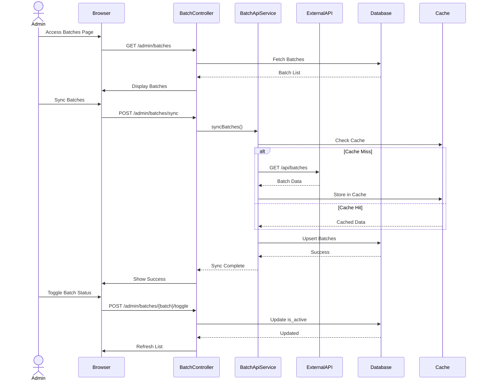
```mermaid
sequenceDiagram
    actor Admin
    participant Browser
    participant BatchController
    participant BatchApiService
    participant ExternalAPI
    participant Database
    participant Cache

    Admin->>Browser: Access Batches Page
    Browser->>BatchController: GET /admin/batches
    BatchController->>Database: Fetch Batches
    Database-->>BatchController: Batch List
    BatchController->>Browser: Display Batches
    
    Admin->>Browser: Sync Batches
    Browser->>BatchController: POST /admin/batches/sync
    BatchController->>BatchApiService: syncBatches()
    BatchApiService->>Cache: Check Cache
    
    alt Cache Miss
        BatchApiService->>ExternalAPI: GET /api/batches
        ExternalAPI-->>BatchApiService: Batch Data
        BatchApiService->>Cache: Store in Cache
    else Cache Hit
        Cache-->>BatchApiService: Cached Data
    end
    
    BatchApiService->>Database: Upsert Batches
    Database-->>BatchApiService: Success
    BatchApiService-->>BatchController: Sync Complete
    BatchController->>Browser: Show Success
    
    Admin->>Browser: Toggle Batch Status
    Browser->>BatchController: POST /admin/batches/{batch}/toggle
    BatchController->>Database: Update is_active
    Database-->>BatchController: Updated
    BatchController->>Browser: Refresh List
```

---

## 4. Admin - Area of Interest Management

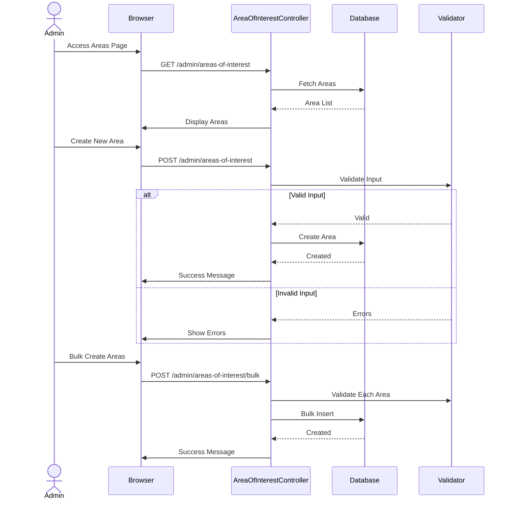
```mermaid
sequenceDiagram
    actor Admin
    participant Browser
    participant AreaOfInterestController
    participant Database
    participant Validator

    Admin->>Browser: Access Areas Page
    Browser->>AreaOfInterestController: GET /admin/areas-of-interest
    AreaOfInterestController->>Database: Fetch Areas
    Database-->>AreaOfInterestController: Area List
    AreaOfInterestController->>Browser: Display Areas
    
    Admin->>Browser: Create New Area
    Browser->>AreaOfInterestController: POST /admin/areas-of-interest
    AreaOfInterestController->>Validator: Validate Input
    
    alt Valid Input
        Validator-->>AreaOfInterestController: Valid
        AreaOfInterestController->>Database: Create Area
        Database-->>AreaOfInterestController: Created
        AreaOfInterestController->>Browser: Success Message
    else Invalid Input
        Validator-->>AreaOfInterestController: Errors
        AreaOfInterestController->>Browser: Show Errors
    end
    
    Admin->>Browser: Bulk Create Areas
    Browser->>AreaOfInterestController: POST /admin/areas-of-interest/bulk
    AreaOfInterestController->>Validator: Validate Each Area
    AreaOfInterestController->>Database: Bulk Insert
    Database-->>AreaOfInterestController: Created
    AreaOfInterestController->>Browser: Success Message
```

---

## 5. Admin - Group Management

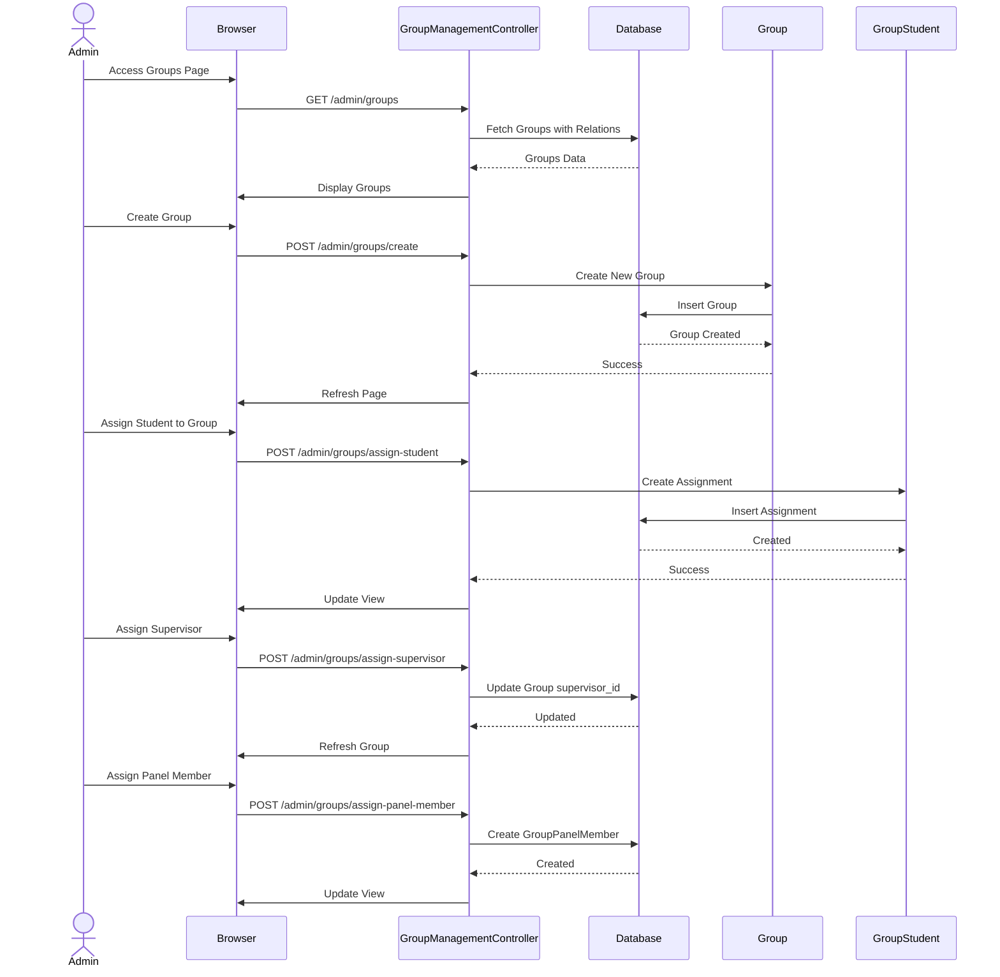
```mermaid
sequenceDiagram
    actor Admin
    participant Browser
    participant GroupManagementController
    participant Database
    participant Group
    participant GroupStudent

    Admin->>Browser: Access Groups Page
    Browser->>GroupManagementController: GET /admin/groups
    GroupManagementController->>Database: Fetch Groups with Relations
    Database-->>GroupManagementController: Groups Data
    GroupManagementController->>Browser: Display Groups
    
    Admin->>Browser: Create Group
    Browser->>GroupManagementController: POST /admin/groups/create
    GroupManagementController->>Group: Create New Group
    Group->>Database: Insert Group
    Database-->>Group: Group Created
    Group-->>GroupManagementController: Success
    GroupManagementController->>Browser: Refresh Page
    
    Admin->>Browser: Assign Student to Group
    Browser->>GroupManagementController: POST /admin/groups/assign-student
    GroupManagementController->>GroupStudent: Create Assignment
    GroupStudent->>Database: Insert Assignment
    Database-->>GroupStudent: Created
    GroupStudent-->>GroupManagementController: Success
    GroupManagementController->>Browser: Update View
    
    Admin->>Browser: Assign Supervisor
    Browser->>GroupManagementController: POST /admin/groups/assign-supervisor
    GroupManagementController->>Database: Update Group supervisor_id
    Database-->>GroupManagementController: Updated
    GroupManagementController->>Browser: Refresh Group
    
    Admin->>Browser: Assign Panel Member
    Browser->>GroupManagementController: POST /admin/groups/assign-panel-member
    GroupManagementController->>Database: Create GroupPanelMember
    Database-->>GroupManagementController: Created
    GroupManagementController->>Browser: Update View
```

---

## 6. Advisor - Group Creation

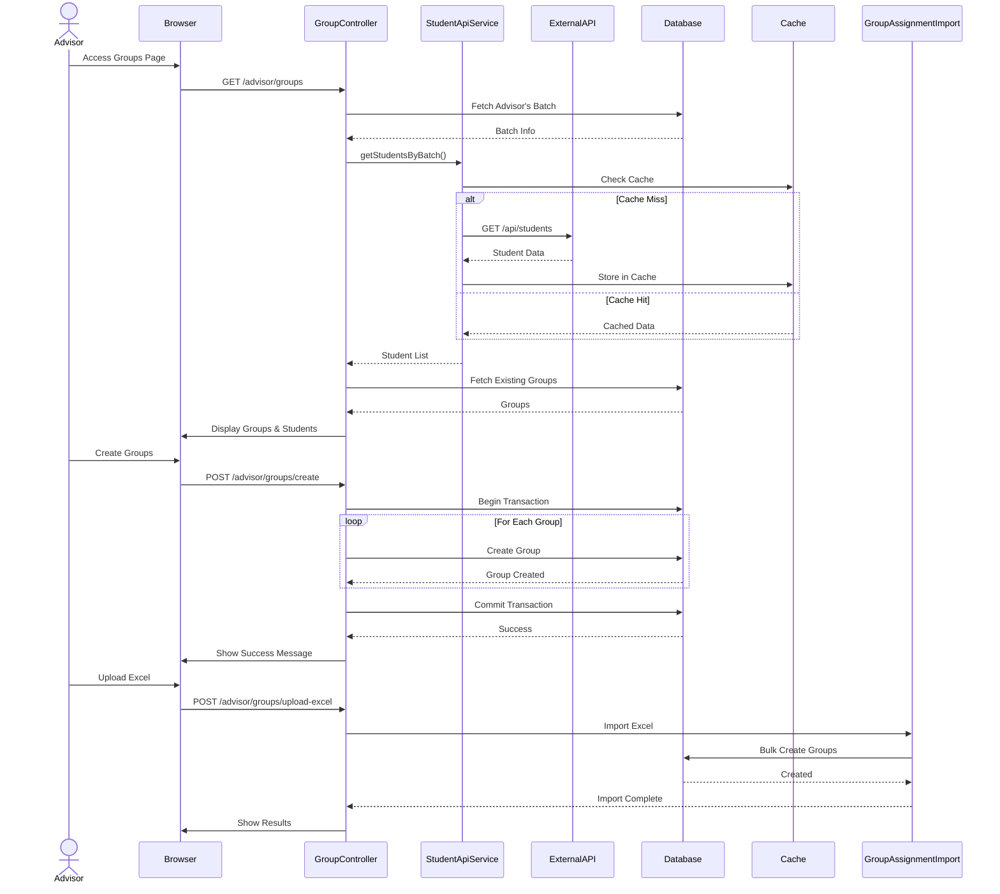
```mermaid
sequenceDiagram
    actor Advisor
    participant Browser
    participant GroupController
    participant StudentApiService
    participant ExternalAPI
    participant Database
    participant Cache

    Advisor->>Browser: Access Groups Page
    Browser->>GroupController: GET /advisor/groups
    GroupController->>Database: Fetch Advisor's Batch
    Database-->>GroupController: Batch Info
    GroupController->>StudentApiService: getStudentsByBatch()
    
    StudentApiService->>Cache: Check Cache
    alt Cache Miss
        StudentApiService->>ExternalAPI: GET /api/students
        ExternalAPI-->>StudentApiService: Student Data
        StudentApiService->>Cache: Store in Cache
    else Cache Hit
        Cache-->>StudentApiService: Cached Data
    end
    
    StudentApiService-->>GroupController: Student List
    GroupController->>Database: Fetch Existing Groups
    Database-->>GroupController: Groups
    GroupController->>Browser: Display Groups & Students
    
    Advisor->>Browser: Create Groups
    Browser->>GroupController: POST /advisor/groups/create
    GroupController->>Database: Begin Transaction
    
    loop For Each Group
        GroupController->>Database: Create Group
        Database-->>GroupController: Group Created
    end
    
    GroupController->>Database: Commit Transaction
    Database-->>GroupController: Success
    GroupController->>Browser: Show Success Message
    
    Advisor->>Browser: Upload Excel
    Browser->>GroupController: POST /advisor/groups/upload-excel
    GroupController->>GroupAssignmentImport: Import Excel
    GroupAssignmentImport->>Database: Bulk Create Groups
    Database-->>GroupAssignmentImport: Created
    GroupAssignmentImport-->>GroupController: Import Complete
    GroupController->>Browser: Show Results
```

---

## 7. Advisor - Supervisor Assignment (Lottery)

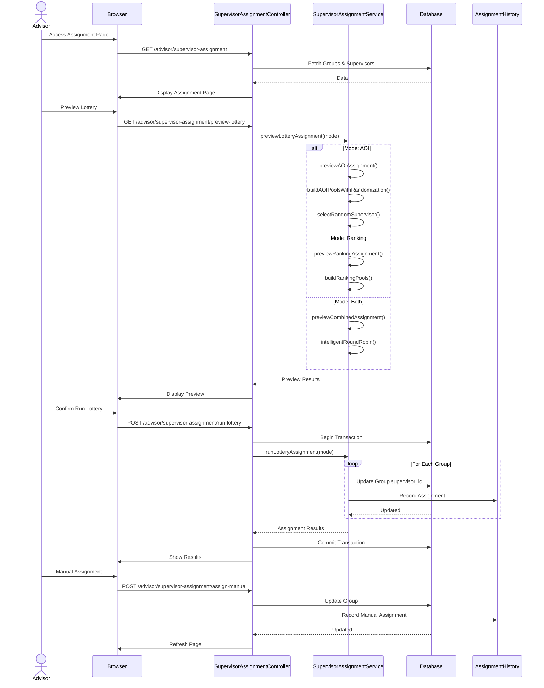
```mermaid
sequenceDiagram
    actor Advisor
    participant Browser
    participant SupervisorAssignmentController
    participant SupervisorAssignmentService
    participant Database
    participant AssignmentHistory

    Advisor->>Browser: Access Assignment Page
    Browser->>SupervisorAssignmentController: GET /advisor/supervisor-assignment
    SupervisorAssignmentController->>Database: Fetch Groups & Supervisors
    Database-->>SupervisorAssignmentController: Data
    SupervisorAssignmentController->>Browser: Display Assignment Page
    
    Advisor->>Browser: Preview Lottery
    Browser->>SupervisorAssignmentController: GET /advisor/supervisor-assignment/preview-lottery
    SupervisorAssignmentController->>SupervisorAssignmentService: previewLotteryAssignment(mode)
    
    alt Mode: AOI
        SupervisorAssignmentService->>SupervisorAssignmentService: previewAOIAssignment()
        SupervisorAssignmentService->>SupervisorAssignmentService: buildAOIPoolsWithRandomization()
        SupervisorAssignmentService->>SupervisorAssignmentService: selectRandomSupervisor()
    else Mode: Ranking
        SupervisorAssignmentService->>SupervisorAssignmentService: previewRankingAssignment()
        SupervisorAssignmentService->>SupervisorAssignmentService: buildRankingPools()
    else Mode: Both
        SupervisorAssignmentService->>SupervisorAssignmentService: previewCombinedAssignment()
        SupervisorAssignmentService->>SupervisorAssignmentService: intelligentRoundRobin()
    end
    
    SupervisorAssignmentService-->>SupervisorAssignmentController: Preview Results
    SupervisorAssignmentController->>Browser: Display Preview
    
    Advisor->>Browser: Confirm Run Lottery
    Browser->>SupervisorAssignmentController: POST /advisor/supervisor-assignment/run-lottery
    SupervisorAssignmentController->>Database: Begin Transaction
    SupervisorAssignmentController->>SupervisorAssignmentService: runLotteryAssignment(mode)
    
    loop For Each Group
        SupervisorAssignmentService->>Database: Update Group supervisor_id
        SupervisorAssignmentService->>AssignmentHistory: Record Assignment
        Database-->>SupervisorAssignmentService: Updated
    end
    
    SupervisorAssignmentService-->>SupervisorAssignmentController: Assignment Results
    SupervisorAssignmentController->>Database: Commit Transaction
    SupervisorAssignmentController->>Browser: Show Results
    
    Advisor->>Browser: Manual Assignment
    Browser->>SupervisorAssignmentController: POST /advisor/supervisor-assignment/assign-manual
    SupervisorAssignmentController->>Database: Update Group
    SupervisorAssignmentController->>AssignmentHistory: Record Manual Assignment
    Database-->>SupervisorAssignmentController: Updated
    SupervisorAssignmentController->>Browser: Refresh Page
```

---

## 8. Student - Report Submission

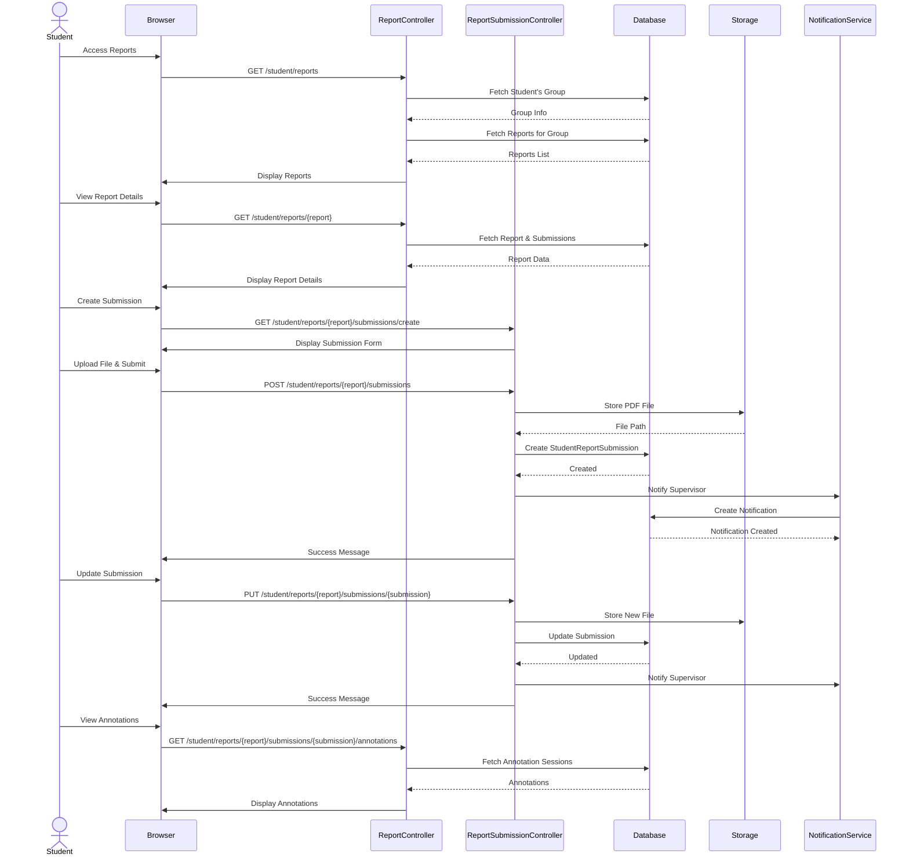
```mermaid
sequenceDiagram
    actor Student
    participant Browser
    participant ReportController
    participant ReportSubmissionController
    participant Database
    participant Storage
    participant NotificationService

    Student->>Browser: Access Reports
    Browser->>ReportController: GET /student/reports
    ReportController->>Database: Fetch Student's Group
    Database-->>ReportController: Group Info
    ReportController->>Database: Fetch Reports for Group
    Database-->>ReportController: Reports List
    ReportController->>Browser: Display Reports
    
    Student->>Browser: View Report Details
    Browser->>ReportController: GET /student/reports/{report}
    ReportController->>Database: Fetch Report & Submissions
    Database-->>ReportController: Report Data
    ReportController->>Browser: Display Report Details
    
    Student->>Browser: Create Submission
    Browser->>ReportSubmissionController: GET /student/reports/{report}/submissions/create
    ReportSubmissionController->>Browser: Display Submission Form
    
    Student->>Browser: Upload File & Submit
    Browser->>ReportSubmissionController: POST /student/reports/{report}/submissions
    ReportSubmissionController->>Storage: Store PDF File
    Storage-->>ReportSubmissionController: File Path
    ReportSubmissionController->>Database: Create StudentReportSubmission
    Database-->>ReportSubmissionController: Created
    
    ReportSubmissionController->>NotificationService: Notify Supervisor
    NotificationService->>Database: Create Notification
    Database-->>NotificationService: Notification Created
    
    ReportSubmissionController->>Browser: Success Message
    
    Student->>Browser: Update Submission
    Browser->>ReportSubmissionController: PUT /student/reports/{report}/submissions/{submission}
    ReportSubmissionController->>Storage: Store New File
    ReportSubmissionController->>Database: Update Submission
    Database-->>ReportSubmissionController: Updated
    ReportSubmissionController->>NotificationService: Notify Supervisor
    ReportSubmissionController->>Browser: Success Message
    
    Student->>Browser: View Annotations
    Browser->>ReportController: GET /student/reports/{report}/submissions/{submission}/annotations
    ReportController->>Database: Fetch Annotation Sessions
    Database-->>ReportController: Annotations
    ReportController->>Browser: Display Annotations
```

---

## 9. Supervisor - Report Management

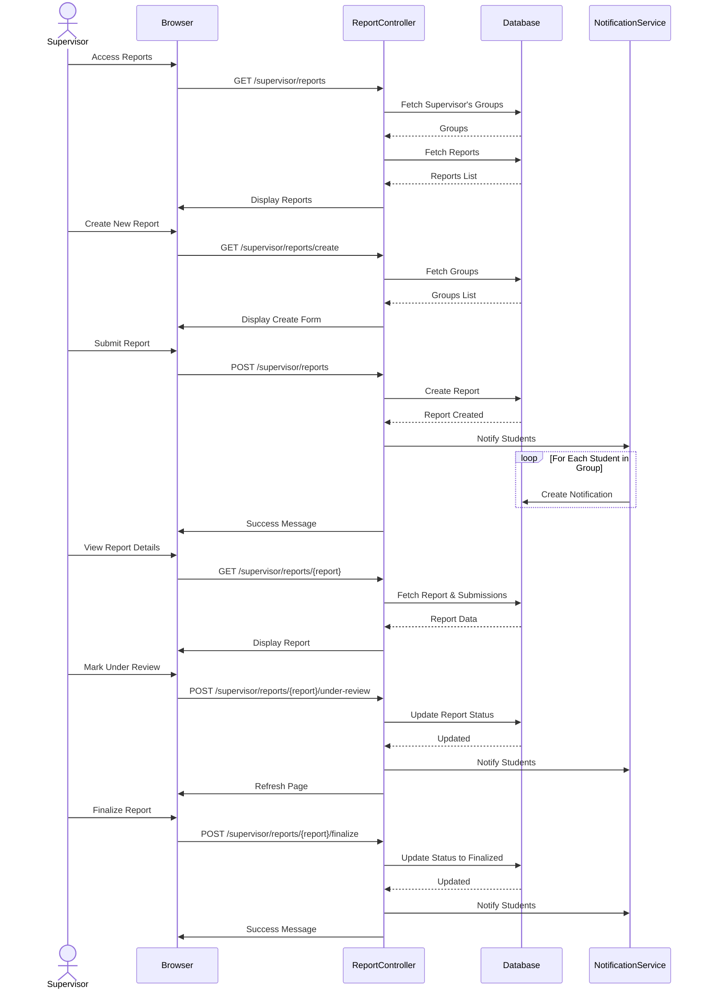
```mermaid
sequenceDiagram
    actor Supervisor
    participant Browser
    participant ReportController
    participant Database
    participant NotificationService

    Supervisor->>Browser: Access Reports
    Browser->>ReportController: GET /supervisor/reports
    ReportController->>Database: Fetch Supervisor's Groups
    Database-->>ReportController: Groups
    ReportController->>Database: Fetch Reports
    Database-->>ReportController: Reports List
    ReportController->>Browser: Display Reports
    
    Supervisor->>Browser: Create New Report
    Browser->>ReportController: GET /supervisor/reports/create
    ReportController->>Database: Fetch Groups
    Database-->>ReportController: Groups List
    ReportController->>Browser: Display Create Form
    
    Supervisor->>Browser: Submit Report
    Browser->>ReportController: POST /supervisor/reports
    ReportController->>Database: Create Report
    Database-->>ReportController: Report Created
    
    ReportController->>NotificationService: Notify Students
    loop For Each Student in Group
        NotificationService->>Database: Create Notification
    end
    
    ReportController->>Browser: Success Message
    
    Supervisor->>Browser: View Report Details
    Browser->>ReportController: GET /supervisor/reports/{report}
    ReportController->>Database: Fetch Report & Submissions
    Database-->>ReportController: Report Data
    ReportController->>Browser: Display Report
    
    Supervisor->>Browser: Mark Under Review
    Browser->>ReportController: POST /supervisor/reports/{report}/under-review
    ReportController->>Database: Update Report Status
    Database-->>ReportController: Updated
    ReportController->>NotificationService: Notify Students
    ReportController->>Browser: Refresh Page
    
    Supervisor->>Browser: Finalize Report
    Browser->>ReportController: POST /supervisor/reports/{report}/finalize
    ReportController->>Database: Update Status to Finalized
    Database-->>ReportController: Updated
    ReportController->>NotificationService: Notify Students
    ReportController->>Browser: Success Message
```

---

## 10. Supervisor - Report Annotation

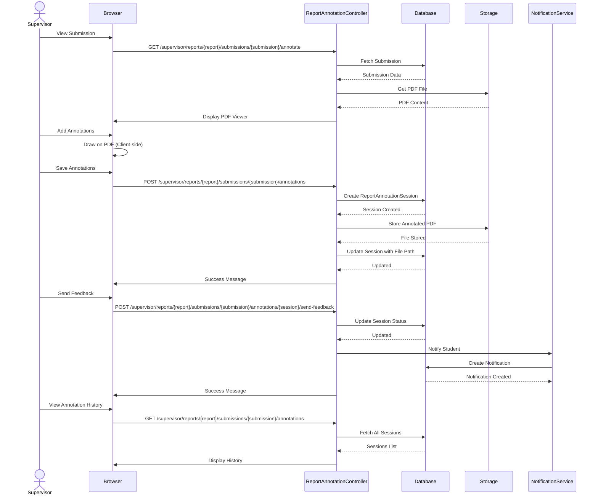
```mermaid
sequenceDiagram
    actor Supervisor
    participant Browser
    participant ReportAnnotationController
    participant Database
    participant Storage
    participant NotificationService

    Supervisor->>Browser: View Submission
    Browser->>ReportAnnotationController: GET /supervisor/reports/{report}/submissions/{submission}/annotate
    ReportAnnotationController->>Database: Fetch Submission
    Database-->>ReportAnnotationController: Submission Data
    ReportAnnotationController->>Storage: Get PDF File
    Storage-->>ReportAnnotationController: PDF Content
    ReportAnnotationController->>Browser: Display PDF Viewer
    
    Supervisor->>Browser: Add Annotations
    Browser->>Browser: Draw on PDF (Client-side)
    
    Supervisor->>Browser: Save Annotations
    Browser->>ReportAnnotationController: POST /supervisor/reports/{report}/submissions/{submission}/annotations
    ReportAnnotationController->>Database: Create ReportAnnotationSession
    Database-->>ReportAnnotationController: Session Created
    ReportAnnotationController->>Storage: Store Annotated PDF
    Storage-->>ReportAnnotationController: File Stored
    ReportAnnotationController->>Database: Update Session with File Path
    Database-->>ReportAnnotationController: Updated
    ReportAnnotationController->>Browser: Success Message
    
    Supervisor->>Browser: Send Feedback
    Browser->>ReportAnnotationController: POST /supervisor/reports/{report}/submissions/{submission}/annotations/{session}/send-feedback
    ReportAnnotationController->>Database: Update Session Status
    Database-->>ReportAnnotationController: Updated
    
    ReportAnnotationController->>NotificationService: Notify Student
    NotificationService->>Database: Create Notification
    Database-->>NotificationService: Notification Created
    
    ReportAnnotationController->>Browser: Success Message
    
    Supervisor->>Browser: View Annotation History
    Browser->>ReportAnnotationController: GET /supervisor/reports/{report}/submissions/{submission}/annotations
    ReportAnnotationController->>Database: Fetch All Sessions
    Database-->>ReportAnnotationController: Sessions List
    ReportAnnotationController->>Browser: Display History
```

---

## 11. Supervisor - Meeting Management

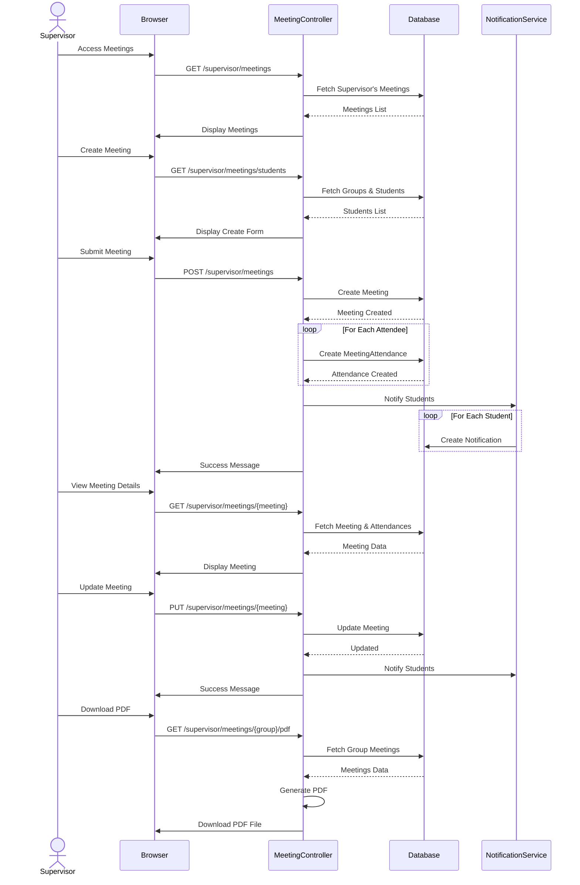
```mermaid
sequenceDiagram
    actor Supervisor
    participant Browser
    participant MeetingController
    participant Database
    participant NotificationService

    Supervisor->>Browser: Access Meetings
    Browser->>MeetingController: GET /supervisor/meetings
    MeetingController->>Database: Fetch Supervisor's Meetings
    Database-->>MeetingController: Meetings List
    MeetingController->>Browser: Display Meetings
    
    Supervisor->>Browser: Create Meeting
    Browser->>MeetingController: GET /supervisor/meetings/students
    MeetingController->>Database: Fetch Groups & Students
    Database-->>MeetingController: Students List
    MeetingController->>Browser: Display Create Form
    
    Supervisor->>Browser: Submit Meeting
    Browser->>MeetingController: POST /supervisor/meetings
    MeetingController->>Database: Create Meeting
    Database-->>MeetingController: Meeting Created
    
    loop For Each Attendee
        MeetingController->>Database: Create MeetingAttendance
        Database-->>MeetingController: Attendance Created
    end
    
    MeetingController->>NotificationService: Notify Students
    loop For Each Student
        NotificationService->>Database: Create Notification
    end
    
    MeetingController->>Browser: Success Message
    
    Supervisor->>Browser: View Meeting Details
    Browser->>MeetingController: GET /supervisor/meetings/{meeting}
    MeetingController->>Database: Fetch Meeting & Attendances
    Database-->>MeetingController: Meeting Data
    MeetingController->>Browser: Display Meeting
    
    Supervisor->>Browser: Update Meeting
    Browser->>MeetingController: PUT /supervisor/meetings/{meeting}
    MeetingController->>Database: Update Meeting
    Database-->>MeetingController: Updated
    MeetingController->>NotificationService: Notify Students
    MeetingController->>Browser: Success Message
    
    Supervisor->>Browser: Download PDF
    Browser->>MeetingController: GET /supervisor/meetings/{group}/pdf
    MeetingController->>Database: Fetch Group Meetings
    Database-->>MeetingController: Meetings Data
    MeetingController->>MeetingController: Generate PDF
    MeetingController->>Browser: Download PDF File
```

---

## 12. Co-Supervisor - Report Review

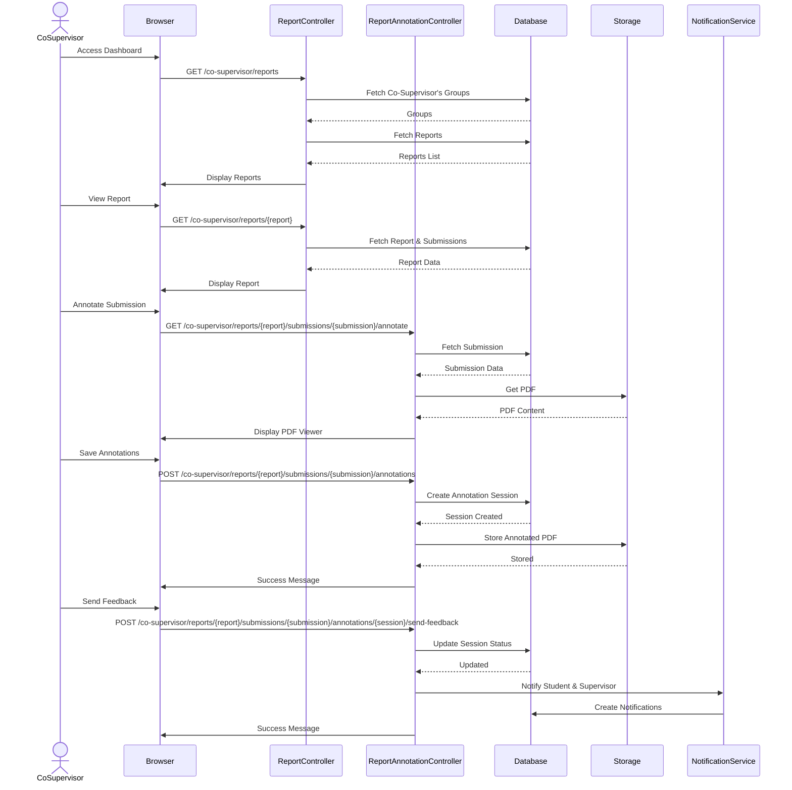
```mermaid
sequenceDiagram
    actor CoSupervisor
    participant Browser
    participant ReportController
    participant ReportAnnotationController
    participant Database
    participant Storage
    participant NotificationService

    CoSupervisor->>Browser: Access Dashboard
    Browser->>ReportController: GET /co-supervisor/reports
    ReportController->>Database: Fetch Co-Supervisor's Groups
    Database-->>ReportController: Groups
    ReportController->>Database: Fetch Reports
    Database-->>ReportController: Reports List
    ReportController->>Browser: Display Reports
    
    CoSupervisor->>Browser: View Report
    Browser->>ReportController: GET /co-supervisor/reports/{report}
    ReportController->>Database: Fetch Report & Submissions
    Database-->>ReportController: Report Data
    ReportController->>Browser: Display Report
    
    CoSupervisor->>Browser: Annotate Submission
    Browser->>ReportAnnotationController: GET /co-supervisor/reports/{report}/submissions/{submission}/annotate
    ReportAnnotationController->>Database: Fetch Submission
    Database-->>ReportAnnotationController: Submission Data
    ReportAnnotationController->>Storage: Get PDF
    Storage-->>ReportAnnotationController: PDF Content
    ReportAnnotationController->>Browser: Display PDF Viewer
    
    CoSupervisor->>Browser: Save Annotations
    Browser->>ReportAnnotationController: POST /co-supervisor/reports/{report}/submissions/{submission}/annotations
    ReportAnnotationController->>Database: Create Annotation Session
    Database-->>ReportAnnotationController: Session Created
    ReportAnnotationController->>Storage: Store Annotated PDF
    Storage-->>ReportAnnotationController: Stored
    ReportAnnotationController->>Browser: Success Message
    
    CoSupervisor->>Browser: Send Feedback
    Browser->>ReportAnnotationController: POST /co-supervisor/reports/{report}/submissions/{submission}/annotations/{session}/send-feedback
    ReportAnnotationController->>Database: Update Session Status
    Database-->>ReportAnnotationController: Updated
    ReportAnnotationController->>NotificationService: Notify Student & Supervisor
    NotificationService->>Database: Create Notifications
    ReportAnnotationController->>Browser: Success Message
```

---

## 13. Panel Member - Report Evaluation

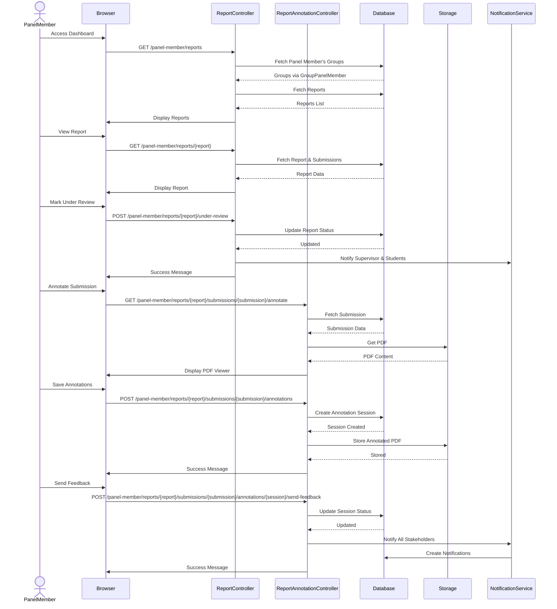
```mermaid
sequenceDiagram
    actor PanelMember
    participant Browser
    participant ReportController
    participant ReportAnnotationController
    participant Database
    participant Storage
    participant NotificationService

    PanelMember->>Browser: Access Dashboard
    Browser->>ReportController: GET /panel-member/reports
    ReportController->>Database: Fetch Panel Member's Groups
    Database-->>ReportController: Groups via GroupPanelMember
    ReportController->>Database: Fetch Reports
    Database-->>ReportController: Reports List
    ReportController->>Browser: Display Reports
    
    PanelMember->>Browser: View Report
    Browser->>ReportController: GET /panel-member/reports/{report}
    ReportController->>Database: Fetch Report & Submissions
    Database-->>ReportController: Report Data
    ReportController->>Browser: Display Report
    
    PanelMember->>Browser: Mark Under Review
    Browser->>ReportController: POST /panel-member/reports/{report}/under-review
    ReportController->>Database: Update Report Status
    Database-->>ReportController: Updated
    ReportController->>NotificationService: Notify Supervisor & Students
    ReportController->>Browser: Success Message
    
    PanelMember->>Browser: Annotate Submission
    Browser->>ReportAnnotationController: GET /panel-member/reports/{report}/submissions/{submission}/annotate
    ReportAnnotationController->>Database: Fetch Submission
    Database-->>ReportAnnotationController: Submission Data
    ReportAnnotationController->>Storage: Get PDF
    Storage-->>ReportAnnotationController: PDF Content
    ReportAnnotationController->>Browser: Display PDF Viewer
    
    PanelMember->>Browser: Save Annotations
    Browser->>ReportAnnotationController: POST /panel-member/reports/{report}/submissions/{submission}/annotations
    ReportAnnotationController->>Database: Create Annotation Session
    Database-->>ReportAnnotationController: Session Created
    ReportAnnotationController->>Storage: Store Annotated PDF
    Storage-->>ReportAnnotationController: Stored
    ReportAnnotationController->>Browser: Success Message
    
    PanelMember->>Browser: Send Feedback
    Browser->>ReportAnnotationController: POST /panel-member/reports/{report}/submissions/{submission}/annotations/{session}/send-feedback
    ReportAnnotationController->>Database: Update Session Status
    Database-->>ReportAnnotationController: Updated
    ReportAnnotationController->>NotificationService: Notify All Stakeholders
    NotificationService->>Database: Create Notifications
    ReportAnnotationController->>Browser: Success Message
```

---

## 14. Notification System

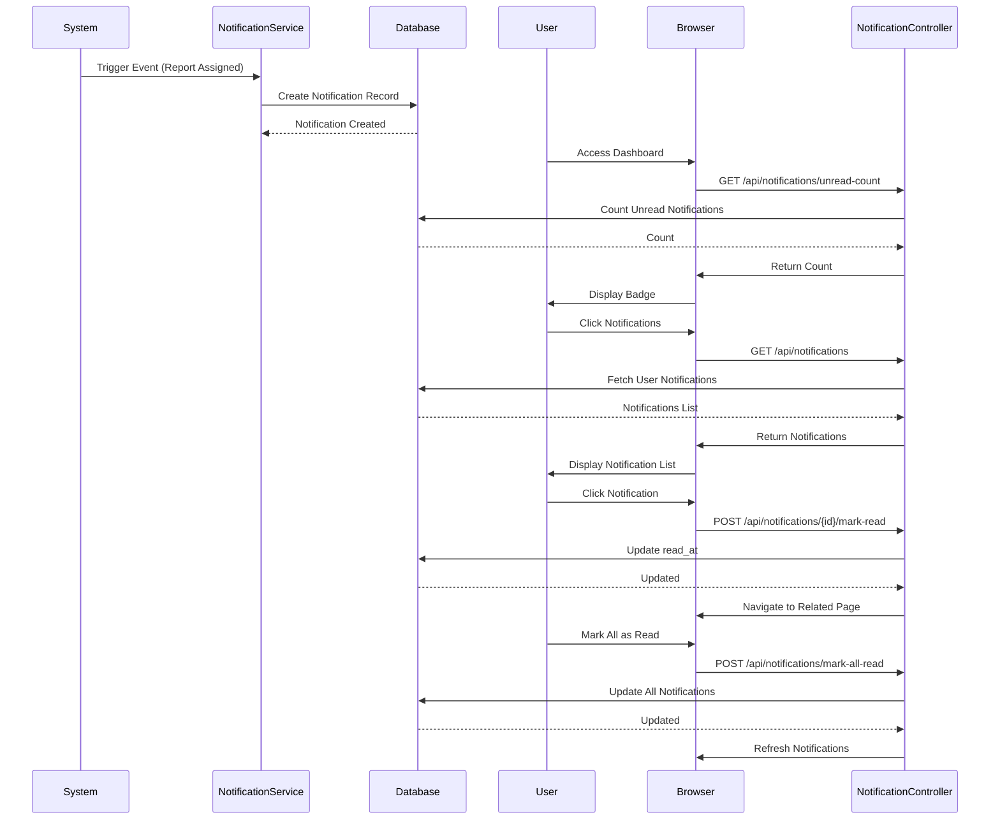
```mermaid
sequenceDiagram
    participant System
    participant NotificationService
    participant Database
    participant User
    participant Browser
    participant NotificationController

    System->>NotificationService: Trigger Event (Report Assigned)
    NotificationService->>Database: Create Notification Record
    Database-->>NotificationService: Notification Created
    
    User->>Browser: Access Dashboard
    Browser->>NotificationController: GET /api/notifications/unread-count
    NotificationController->>Database: Count Unread Notifications
    Database-->>NotificationController: Count
    NotificationController->>Browser: Return Count
    Browser->>User: Display Badge
    
    User->>Browser: Click Notifications
    Browser->>NotificationController: GET /api/notifications
    NotificationController->>Database: Fetch User Notifications
    Database-->>NotificationController: Notifications List
    NotificationController->>Browser: Return Notifications
    Browser->>User: Display Notification List
    
    User->>Browser: Click Notification
    Browser->>NotificationController: POST /api/notifications/{id}/mark-read
    NotificationController->>Database: Update read_at
    Database-->>NotificationController: Updated
    NotificationController->>Browser: Navigate to Related Page
    
    User->>Browser: Mark All as Read
    Browser->>NotificationController: POST /api/notifications/mark-all-read
    NotificationController->>Database: Update All Notifications
    Database-->>NotificationController: Updated
    NotificationController->>Browser: Refresh Notifications
```

---

## 15. Performance Monitoring

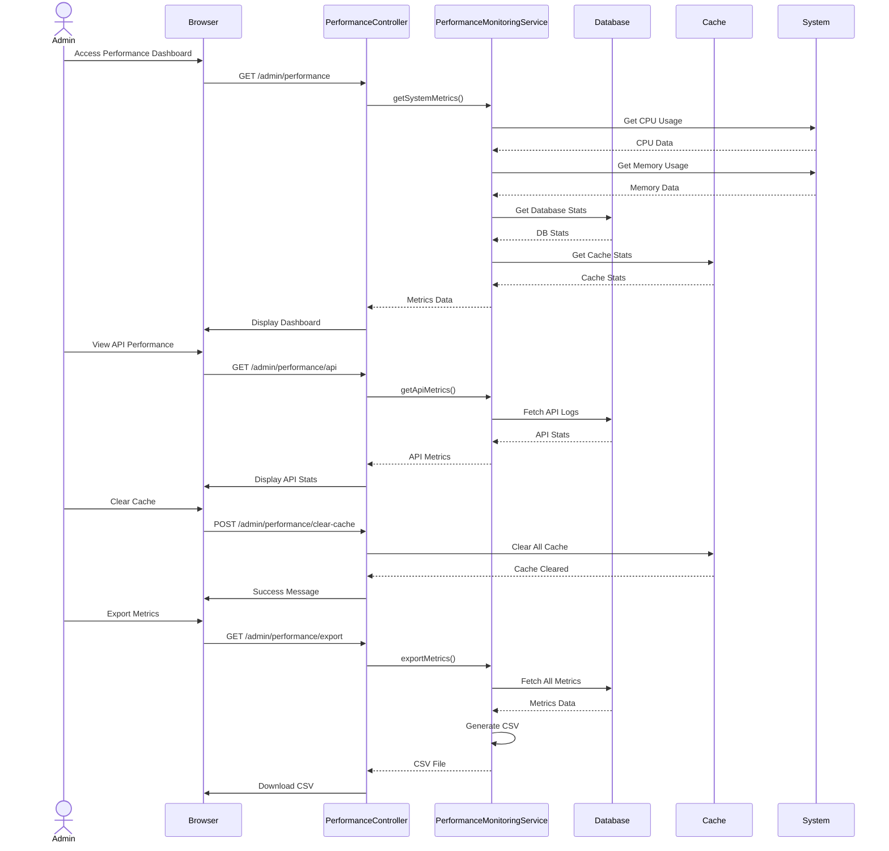
```mermaid
sequenceDiagram
    actor Admin
    participant Browser
    participant PerformanceController
    participant PerformanceMonitoringService
    participant Database
    participant Cache
    participant System

    Admin->>Browser: Access Performance Dashboard
    Browser->>PerformanceController: GET /admin/performance
    PerformanceController->>PerformanceMonitoringService: getSystemMetrics()
    
    PerformanceMonitoringService->>System: Get CPU Usage
    System-->>PerformanceMonitoringService: CPU Data
    
    PerformanceMonitoringService->>System: Get Memory Usage
    System-->>PerformanceMonitoringService: Memory Data
    
    PerformanceMonitoringService->>Database: Get Database Stats
    Database-->>PerformanceMonitoringService: DB Stats
    
    PerformanceMonitoringService->>Cache: Get Cache Stats
    Cache-->>PerformanceMonitoringService: Cache Stats
    
    PerformanceMonitoringService-->>PerformanceController: Metrics Data
    PerformanceController->>Browser: Display Dashboard
    
    Admin->>Browser: View API Performance
    Browser->>PerformanceController: GET /admin/performance/api
    PerformanceController->>PerformanceMonitoringService: getApiMetrics()
    PerformanceMonitoringService->>Database: Fetch API Logs
    Database-->>PerformanceMonitoringService: API Stats
    PerformanceMonitoringService-->>PerformanceController: API Metrics
    PerformanceController->>Browser: Display API Stats
    
    Admin->>Browser: Clear Cache
    Browser->>PerformanceController: POST /admin/performance/clear-cache
    PerformanceController->>Cache: Clear All Cache
    Cache-->>PerformanceController: Cache Cleared
    PerformanceController->>Browser: Success Message
    
    Admin->>Browser: Export Metrics
    Browser->>PerformanceController: GET /admin/performance/export
    PerformanceController->>PerformanceMonitoringService: exportMetrics()
    PerformanceMonitoringService->>Database: Fetch All Metrics
    Database-->>PerformanceMonitoringService: Metrics Data
    PerformanceMonitoringService->>PerformanceMonitoringService: Generate CSV
    PerformanceMonitoringService-->>PerformanceController: CSV File
    PerformanceController->>Browser: Download CSV
```

---

## Additional Diagrams

### 16. External API Integration Flow

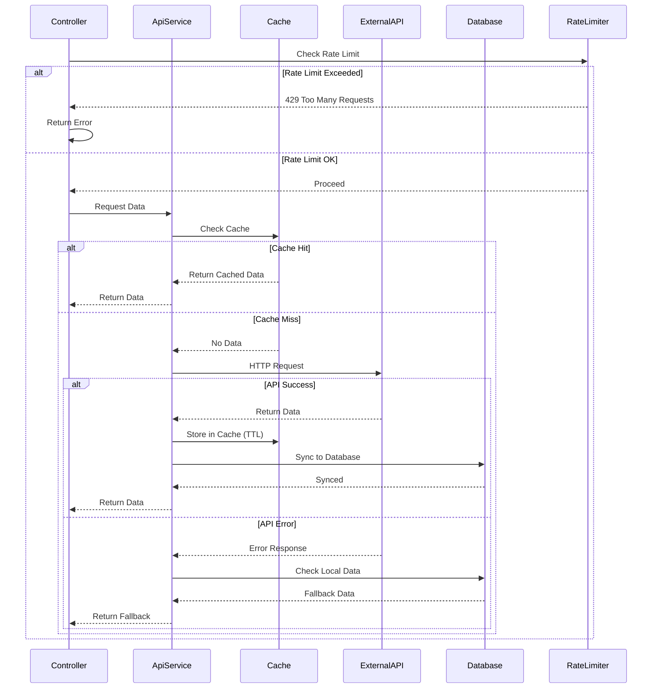
```mermaid
sequenceDiagram
    participant Controller
    participant ApiService
    participant Cache
    participant ExternalAPI
    participant Database
    participant RateLimiter

    Controller->>RateLimiter: Check Rate Limit
    
    alt Rate Limit Exceeded
        RateLimiter-->>Controller: 429 Too Many Requests
        Controller->>Controller: Return Error
    else Rate Limit OK
        RateLimiter-->>Controller: Proceed
        Controller->>ApiService: Request Data
        ApiService->>Cache: Check Cache
        
        alt Cache Hit
            Cache-->>ApiService: Return Cached Data
            ApiService-->>Controller: Return Data
        else Cache Miss
            Cache-->>ApiService: No Data
            ApiService->>ExternalAPI: HTTP Request
            
            alt API Success
                ExternalAPI-->>ApiService: Return Data
                ApiService->>Cache: Store in Cache (TTL)
                ApiService->>Database: Sync to Database
                Database-->>ApiService: Synced
                ApiService-->>Controller: Return Data
            else API Error
                ExternalAPI-->>ApiService: Error Response
                ApiService->>Database: Check Local Data
                Database-->>ApiService: Fallback Data
                ApiService-->>Controller: Return Fallback
            end
        end
    end
```

---

### 17. Group Assignment Excel Import Flow

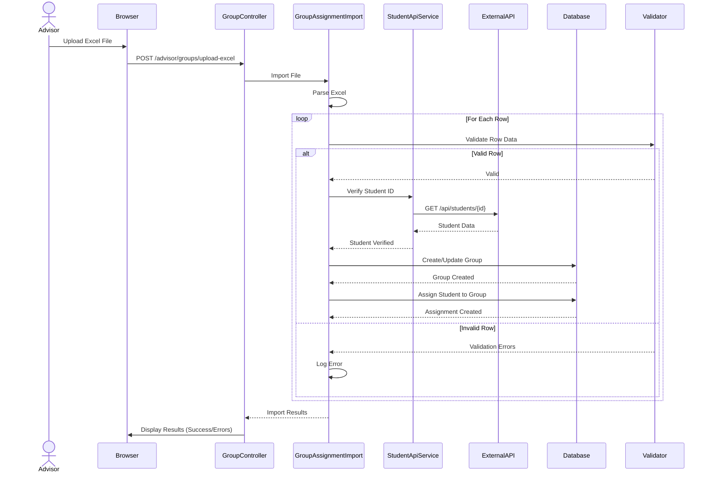
```mermaid
sequenceDiagram
    actor Advisor
    participant Browser
    participant GroupController
    participant GroupAssignmentImport
    participant StudentApiService
    participant ExternalAPI
    participant Database
    participant Validator

    Advisor->>Browser: Upload Excel File
    Browser->>GroupController: POST /advisor/groups/upload-excel
    GroupController->>GroupAssignmentImport: Import File
    
    GroupAssignmentImport->>GroupAssignmentImport: Parse Excel
    
    loop For Each Row
        GroupAssignmentImport->>Validator: Validate Row Data
        
        alt Valid Row
            Validator-->>GroupAssignmentImport: Valid
            GroupAssignmentImport->>StudentApiService: Verify Student ID
            StudentApiService->>ExternalAPI: GET /api/students/{id}
            ExternalAPI-->>StudentApiService: Student Data
            StudentApiService-->>GroupAssignmentImport: Student Verified
            
            GroupAssignmentImport->>Database: Create/Update Group
            Database-->>GroupAssignmentImport: Group Created
            
            GroupAssignmentImport->>Database: Assign Student to Group
            Database-->>GroupAssignmentImport: Assignment Created
        else Invalid Row
            Validator-->>GroupAssignmentImport: Validation Errors
            GroupAssignmentImport->>GroupAssignmentImport: Log Error
        end
    end
    
    GroupAssignmentImport-->>GroupController: Import Results
    GroupController->>Browser: Display Results (Success/Errors)
```

---

### 18. Report Lifecycle State Machine

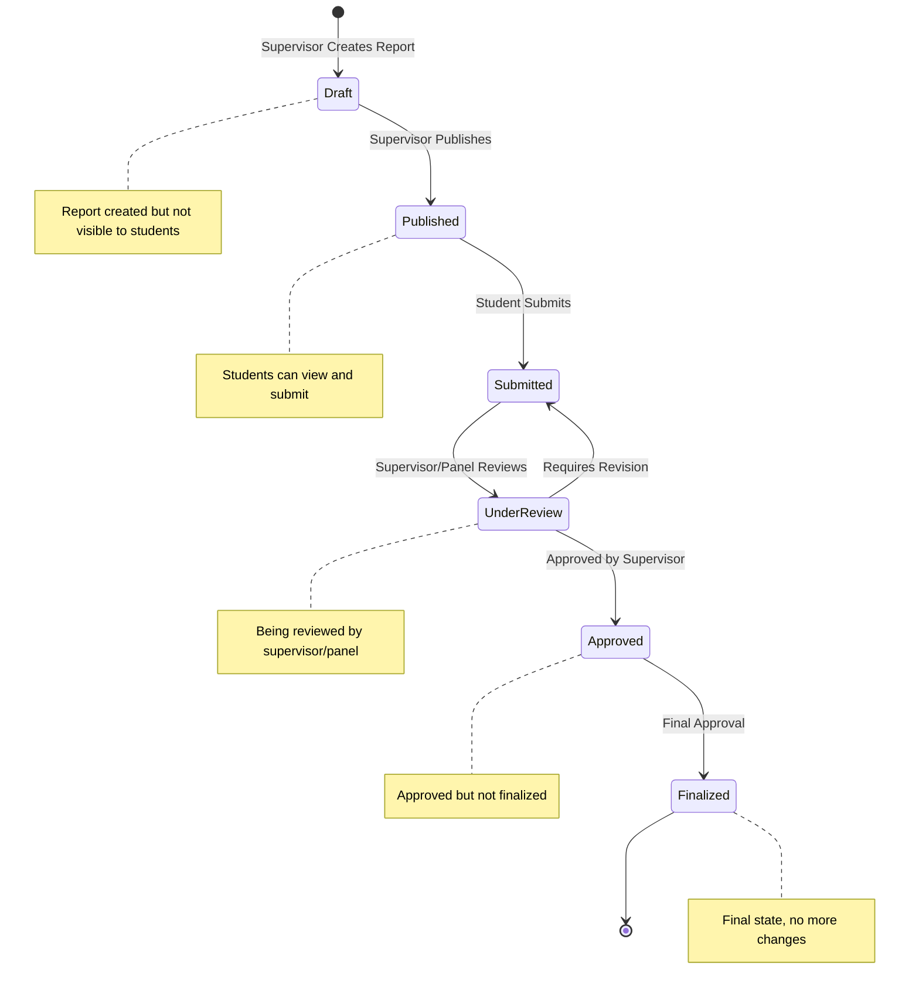
```mermaid
stateDiagram-v2
    [*] --> Draft: Supervisor Creates Report
    Draft --> Published: Supervisor Publishes
    Published --> Submitted: Student Submits
    Submitted --> UnderReview: Supervisor/Panel Reviews
    UnderReview --> Submitted: Requires Revision
    UnderReview --> Approved: Approved by Supervisor
    Approved --> Finalized: Final Approval
    Finalized --> [*]
    
    note right of Draft
        Report created but not visible to students
    end note
    
    note right of Published
        Students can view and submit
    end note
    
    note right of UnderReview
        Being reviewed by supervisor/panel
    end note
    
    note right of Approved
        Approved but not finalized
    end note
    
    note right of Finalized
        Final state, no more changes
    end note
```

---

### 19. Database Transaction Flow (Lottery Assignment)

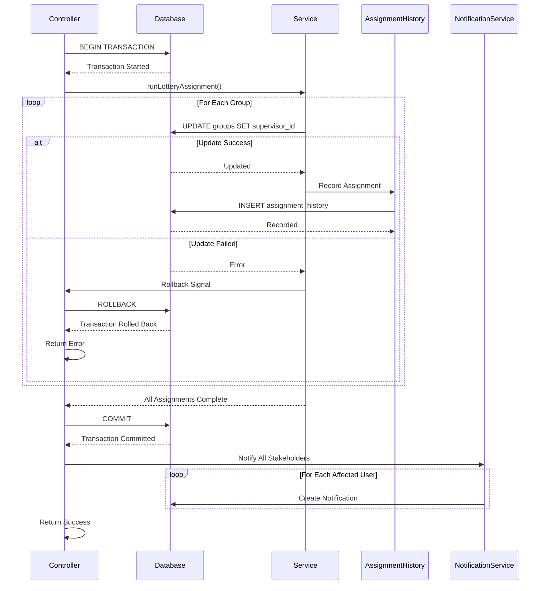
```mermaid
sequenceDiagram
    participant Controller
    participant Database
    participant Service
    participant AssignmentHistory
    participant NotificationService

    Controller->>Database: BEGIN TRANSACTION
    Database-->>Controller: Transaction Started
    
    Controller->>Service: runLotteryAssignment()
    
    loop For Each Group
        Service->>Database: UPDATE groups SET supervisor_id
        
        alt Update Success
            Database-->>Service: Updated
            Service->>AssignmentHistory: Record Assignment
            AssignmentHistory->>Database: INSERT assignment_history
            Database-->>AssignmentHistory: Recorded
        else Update Failed
            Database-->>Service: Error
            Service->>Controller: Rollback Signal
            Controller->>Database: ROLLBACK
            Database-->>Controller: Transaction Rolled Back
            Controller->>Controller: Return Error
        end
    end
    
    Service-->>Controller: All Assignments Complete
    Controller->>Database: COMMIT
    Database-->>Controller: Transaction Committed
    
    Controller->>NotificationService: Notify All Stakeholders
    loop For Each Affected User
        NotificationService->>Database: Create Notification
    end
    
    Controller->>Controller: Return Success
```

---

## System Architecture Overview

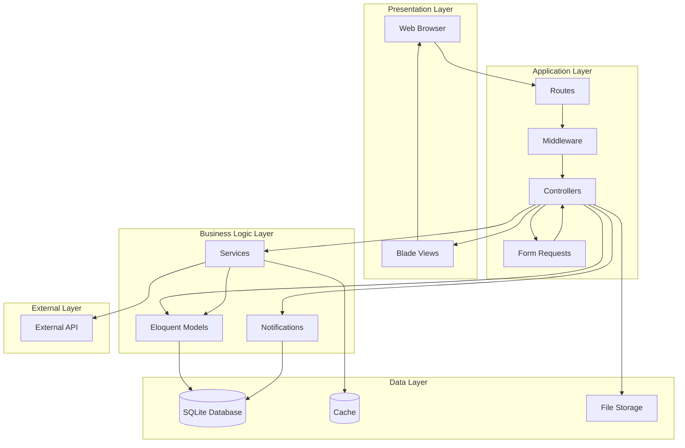
```mermaid
graph TB
    subgraph "Presentation Layer"
        Browser[Web Browser]
        Views[Blade Views]
    end
    
    subgraph "Application Layer"
        Routes[Routes]
        Middleware[Middleware]
        Controllers[Controllers]
        Requests[Form Requests]
    end
    
    subgraph "Business Logic Layer"
        Services[Services]
        Models[Eloquent Models]
        Notifications[Notifications]
    end
    
    subgraph "Data Layer"
        Database[(SQLite Database)]
        Cache[(Cache)]
        Storage[File Storage]
    end
    
    subgraph "External Layer"
        ExternalAPI[External API]
    end
    
    Browser --> Routes
    Routes --> Middleware
    Middleware --> Controllers
    Controllers --> Requests
    Requests --> Controllers
    Controllers --> Services
    Controllers --> Models
    Services --> Models
    Services --> ExternalAPI
    Models --> Database
    Services --> Cache
    Controllers --> Storage
    Controllers --> Notifications
    Notifications --> Database
    Controllers --> Views
    Views --> Browser
```

---

## Notes

- All diagrams follow production-level standards with proper error handling
- Sequence diagrams show complete request-response cycles
- Database transactions are properly illustrated
- Caching strategies are clearly shown
- External API integration includes rate limiting and fallback mechanisms
- Notification flows are integrated into relevant processes
- State machines show report lifecycle clearly
- All major user roles and their interactions are covered

