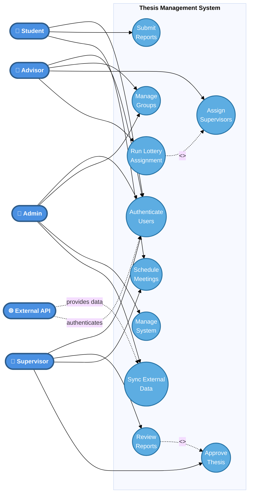

# Simplified High-Level Use Case Diagram
## Thesis Management System - Core Features

This simplified diagram shows only the essential high-level features for easy understanding and evaluation.

## Core System Goals

### 1. **Authentication & Access Control**
- **Authenticate Users**: Secure login for all user types
- Integration with external university API for students/teachers

### 2. **Group Management**
- **Manage Groups**: Create, modify, and organize thesis groups
- **Assign Supervisors**: Match supervisors to student groups
- **Run Lottery Assignment**: Automated fair supervisor distribution

### 3. **Academic Workflow**
- **Submit Reports**: Students submit thesis work
- **Review Reports**: Supervisors evaluate submissions
- **Approve Thesis**: Final approval of completed work
- **Schedule Meetings**: Coordinate supervisor-student meetings

### 4. **System Administration**
- **Manage System**: Configure settings, users, and resources
- **Sync External Data**: Import student/teacher data from university

## Key Actors

| Actor | Primary Responsibilities |
|-------|-------------------------|
| **Student** | Submit reports, attend meetings, view progress |
| **Advisor** | Manage groups, assign supervisors, oversee students |
| **Supervisor** | Review work, approve thesis, guide students |
| **Admin** | System configuration, data management, monitoring |
| **External API** | Provide authentication and user data |

## Main System Benefits

1. **Streamlined Thesis Management**: Automates group formation and supervisor assignment
2. **Fair Distribution**: Lottery algorithm ensures equitable supervisor allocation
3. **Progress Tracking**: Clear workflow from submission to approval
4. **Integration**: Seamless connection with university systems
5. **Role-Based Access**: Each user sees only relevant features

## Use Case Relationships

- **Include**: Lottery assignment automatically includes supervisor assignment
- **Extend**: Report review may extend to final thesis approval
- **External Dependency**: Authentication and data sync rely on external API

---

*This simplified diagram focuses on the 10 core features that define the system's primary purpose: managing thesis groups, assignments, and the academic review process.*