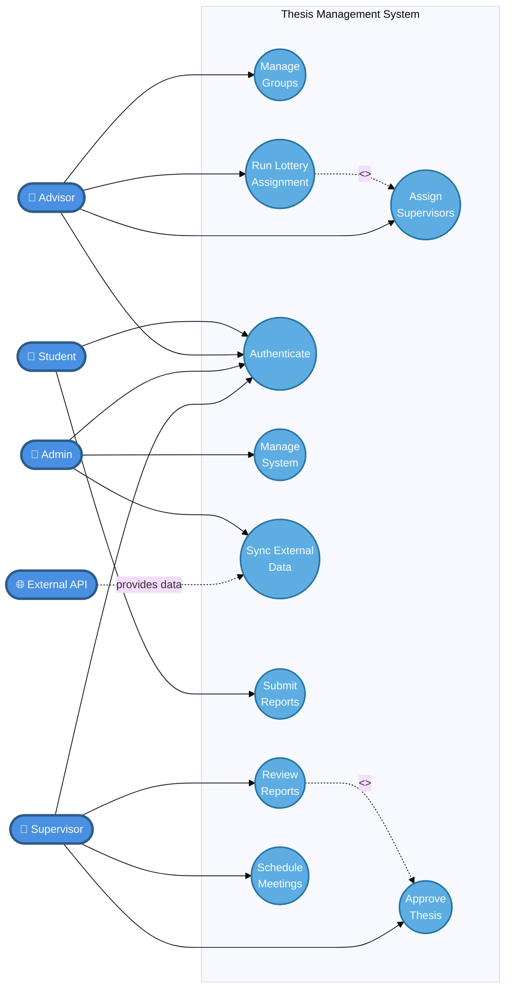

# Thesis Management System - UML Use Case Diagram

## Standard UML Use Case Diagram (A4-Friendly)

## Simplified High-Level Use Case Diagram

### Core System Goals
This simplified diagram shows only the **main goals** of the Thesis Management System:

1. **Authentication & System Management** - Secure access and administration
2. **Group Management & Supervisor Assignment** - Core thesis group operations
3. **Academic Activities** - Reports and meetings management

### Actors (Blue Rectangles)
- **Student**: Submit reports and participate in thesis activities
- **Advisor**: Manage groups and assign supervisors
- **Admin**: System administration and data synchronization
- **Supervisor**: Review reports and schedule meetings
- **External API**: Provides university data

### Core Use Cases (Blue Ovals)
| Use Case | Main Goal |
|----------|-----------|
| Authenticate | Secure system access for all users |
| Manage System | Administrative control and monitoring |
| Sync External Data | Integration with university systems |
| Manage Groups | Create and organize thesis groups |
| Assign Supervisors | Manual supervisor assignment |
| Run Lottery Assignment | Automated fair assignment algorithm |
| Submit Reports | Student thesis submissions |
| Review Reports | Supervisor evaluation process |
| Schedule Meetings | Thesis progress meetings |
| Approve Thesis | Final thesis approval (extends Review) |

### Key Relationships
- **Lottery includes Assignment**: The lottery algorithm performs supervisor assignment
- **Review extends to Approval**: Approval is the final step of review process
- **External API provides data**: University system integration

## Why This Simplified Approach?

### ✅ Benefits for Thesis Evaluation

1. **Clear Main Goals**: Shows the system's primary purpose at a glance
2. **Easy to Understand**: Evaluators can quickly grasp the system scope
3. **Fits on Page**: Compact 3x3 grid layout perfect for A4 printing
4. **Professional**: Clean, uncluttered design
5. **Focus on Value**: Highlights what the system achieves, not implementation details

### 📊 System Overview

The diagram captures the **three pillars** of the thesis management system:

1. **Administrative Layer**
   - User authentication
   - System management
   - External data integration

2. **Organizational Layer**
   - Group formation
   - Supervisor assignment
   - Lottery algorithm (key innovation)

3. **Academic Layer**
   - Report submission
   - Review process
   - Meeting coordination
   - Thesis approval

## MVC Architecture Alignment

### How Core Use Cases Map to MVC

| Use Case | Controller | Service | Model |
|----------|------------|---------|-------|
| Authenticate | AuthController | - | User |
| Manage System | AdminController | PerformanceService | User, Batch |
| Sync External Data | AdminController | External API Services | Batch, Supervisor |
| Manage Groups | AdvisorController | - | Group |
| Assign Supervisors | AdvisorController | - | Group, Supervisor |
| Run Lottery | AdvisorController | SupervisorAssignmentService | Group, Supervisor |
| Submit Reports | StudentController | - | Report |
| Review Reports | SupervisorController | - | Report |
| Schedule Meetings | SupervisorController | - | Meeting |
| Approve Thesis | SupervisorController | - | Report |

### Key System Features

✅ **Lottery Algorithm** - Fair automated supervisor assignment  
✅ **External Integration** - University API synchronization  
✅ **Role-Based Access** - Multi-user authentication  
✅ **Report Workflow** - Submit → Review → Approve  
✅ **Group Management** - Thesis group organization

---

**Document Version**: 2.0  
**Created**: January 2025  
**Format**: Standard UML Use Case Diagram (Mermaid)  
**Optimized For**: A4 Report Printing  
**Compliant With**: UML 2.5 Use Case Diagram Standards
