# Sequence Diagrams - Thesis Repository Management System
## Academic Version for IEEE Documentation

## Table of Contents
1. [System Authentication](#1-system-authentication)
   - 1.1 [Authentication and Authorization Framework](#11-authentication-and-authorization-framework)
     - 1.1.1 [User Authentication Flow](#111-user-authentication-flow)
     - 1.1.2 [Role-Based Access Control](#112-role-based-access-control)
2. [Student Operations](#2-student-operations)
   - 2.1 [Report Submission Process](#21-report-submission-process)
   - 2.2 [View Feedback and Annotations](#22-view-feedback-and-annotations)
   - 2.3 [Dashboard Notification System](#23-dashboard-notification-system)
3. [Supervisor Operations](#3-supervisor-operations)
   - 3.1 [Report Management](#31-report-management)
   - 3.2 [Document Annotation Process](#32-document-annotation-process)
     - 3.2.1 [Annotation Creation with Draft State](#321-annotation-creation-with-draft-state)
     - 3.2.2 [Feedback Distribution](#322-feedback-distribution)
   - 3.3 [Meeting Documentation](#33-meeting-documentation)
4. [Co-Supervisor Operations](#4-co-supervisor-operations)
   - 4.1 [Conditional Meeting Management](#41-conditional-meeting-management)
   - 4.2 [Annotation and Feedback Process](#42-annotation-and-feedback-process)
5. [Panel Member Operations](#5-panel-member-operations)
   - 5.1 [Panel Member Report Evaluation](#51-panel-member-report-evaluation)
   - 5.2 [Panel Member Feedback](#52-panel-member-feedback)
6. [Advisor Operations](#6-advisor-operations)
   - 6.1 [Group Formation](#61-group-formation)
     - 6.1.1 [Manual Group Creation](#611-manual-group-creation)
     - 6.1.2 [Excel-Based Group Import](#612-excel-based-group-import)
     - 6.1.3 [Template Export for Group Assignment](#613-template-export-for-group-assignment)
     - 6.1.4 [Cross-Batch Student Assignment](#614-cross-batch-student-assignment)
     - 6.1.5 [Assign Area of Interest to Group](#615-assign-area-of-interest-to-group)
   - 6.2 [Supervisor Assignment](#62-supervisor-assignment)
     - 6.2.1 [Manual Supervisor Assignment](#621-manual-supervisor-assignment)
     - 6.2.2 [Area of Interest Based Assignment](#622-area-of-interest-based-assignment)
     - 6.2.3 [Ranking-Based Assignment](#623-ranking-based-assignment)
     - 6.2.4 [Hybrid Assignment Strategy](#624-hybrid-assignment-strategy)
     - 6.2.5 [Assignment Algorithm Comparison](#625-assignment-algorithm-comparison)
7. [Administrative Functions](#7-administrative-functions)
   - 7.1 [Co-Supervisor Assignment](#71-co-supervisor-assignment)
   - 7.2 [Panel Member Assignment](#72-panel-member-assignment)
   - 7.3 [Area of Interest Management](#73-area-of-interest-management)
   - 7.4 [Administrator Group Management](#74-administrator-group-management)
     - 7.4.1 [Group Creation with Pre-Configuration](#741-group-creation-with-pre-configuration)
     - 7.4.2 [Cross-Batch Student Pool Management](#742-cross-batch-student-pool-management)
     - 7.4.3 [Student Assignment with Advisor Auto-Detection](#743-student-assignment-with-advisor-auto-detection)
   - 7.5 [Batch Management](#75-batch-management)
     - 7.5.1 [Batch Synchronization from External API](#751-batch-synchronization-from-external-api)
     - 7.5.2 [Batch Status Management](#752-batch-status-management)
   - 7.6 [Supervisor Management](#76-supervisor-management)
8. [Multi-Role Collaboration](#8-multi-role-collaboration)
   - 8.1 [Teacher Role Switching](#81-teacher-role-switching)
   - 8.2 [Collaborative Report Review](#82-collaborative-report-review)
   - 8.3 [Hierarchical Approval Process](#83-hierarchical-approval-process)
9. [External System Integration](#9-external-system-integration)
   - 9.1 [University API Integration](#91-university-api-integration)

---

## 1. System Authentication

### 1.1 Authentication and Authorization Framework

The system implements a robust authentication mechanism with automatic failover capabilities to ensure continuous service availability. This section presents the authentication workflow and role-based access control mechanisms.

#### 1.1.1 User Authentication Flow

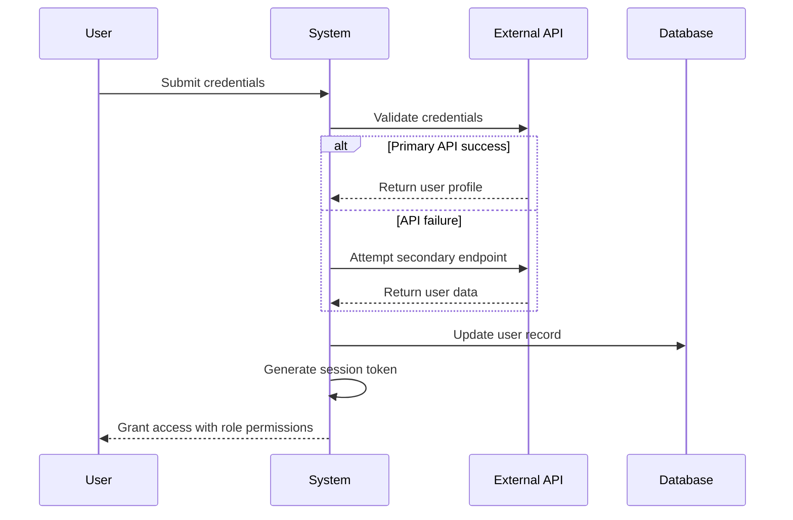
```mermaid
sequenceDiagram
    participant U as User
    participant S as System
    participant API as External API
    participant DB as Database

    U->>S: Submit credentials
    S->>API: Validate credentials
    
    alt Primary API success
        API-->>S: Return user profile
    else API failure
        S->>API: Attempt secondary endpoint
        API-->>S: Return user data
    end
    
    S->>DB: Update user record
    S->>S: Generate session token
    S-->>U: Grant access with role permissions
```

**Figure 1.1:** User authentication sequence with failover mechanism

#### 1.1.2 Role-Based Access Control

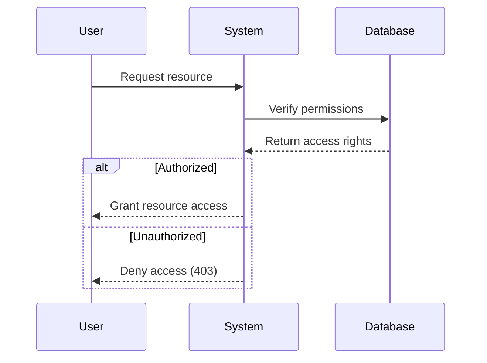
```mermaid
sequenceDiagram
    participant U as User
    participant S as System
    participant DB as Database

    U->>S: Request resource
    S->>DB: Verify permissions
    DB-->>S: Return access rights
    
    alt Authorized
        S-->>U: Grant resource access
    else Unauthorized
        S-->>U: Deny access (403)
    end
```

**Figure 1.2:** Role-based access control verification process

---

## 2. Student Operations

### 2.1 Report Submission Process

This sequence demonstrates how students submit their thesis reports to the system.

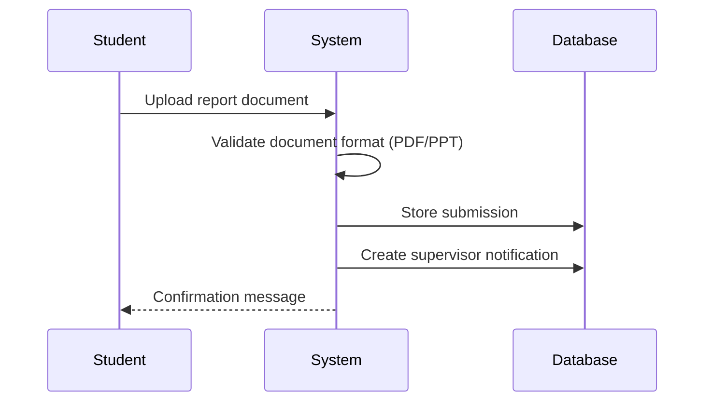
```mermaid
sequenceDiagram
    participant Student
    participant System
    participant Database

    Student->>System: Upload report document
    System->>System: Validate document format (PDF/PPT)
    System->>Database: Store submission
    System->>Database: Create supervisor notification
    System-->>Student: Confirmation message
```

### 2.2 View Feedback and Annotations

Students can view complete annotation history from all reviewers with role-based categorization.

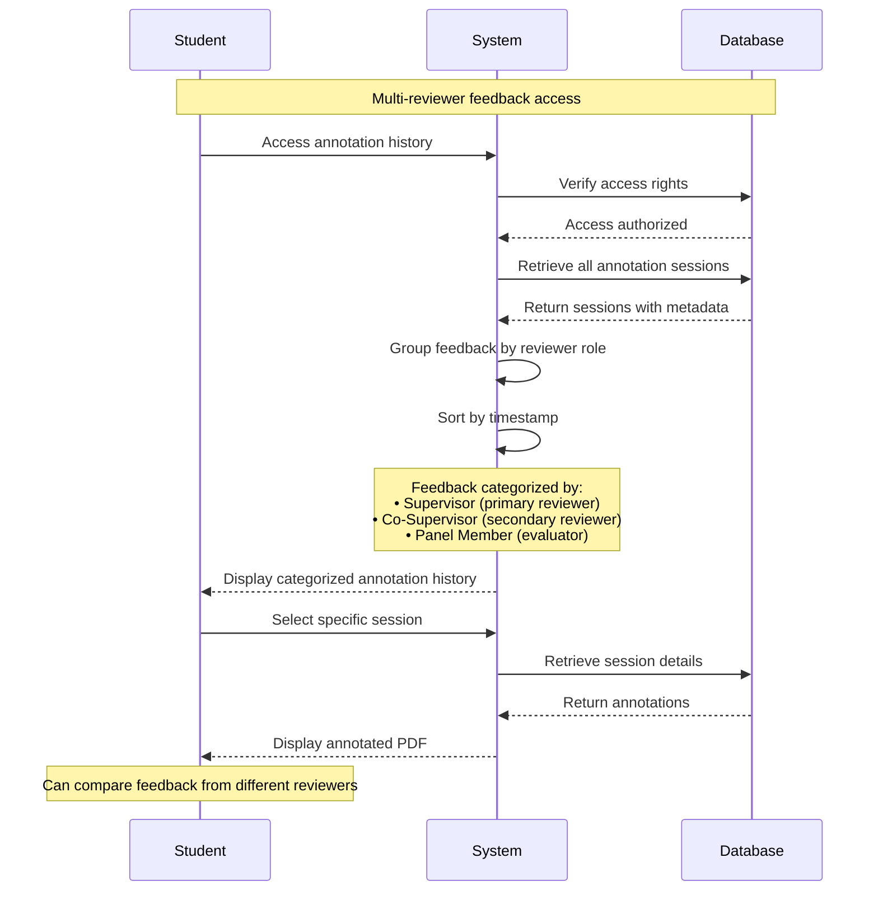
```mermaid
sequenceDiagram
    participant Student
    participant System
    participant Database

    Note over Student,Database: Multi-reviewer feedback access
    
    Student->>System: Access annotation history
    System->>Database: Verify access rights
    Database-->>System: Access authorized
    
    System->>Database: Retrieve all annotation sessions
    Database-->>System: Return sessions with metadata
    
    System->>System: Group feedback by reviewer role
    System->>System: Sort by timestamp
    
    Note over System: Feedback categorized by:<br/>• Supervisor (primary reviewer)<br/>• Co-Supervisor (secondary reviewer)<br/>• Panel Member (evaluator)
    
    System-->>Student: Display categorized annotation history
    
    Student->>System: Select specific session
    System->>Database: Retrieve session details
    Database-->>System: Return annotations
    System-->>Student: Display annotated PDF
    
    Note over Student: Can compare feedback from different reviewers
```

### 2.3 Dashboard Notification System

The notification system keeps students informed about report updates and feedback.

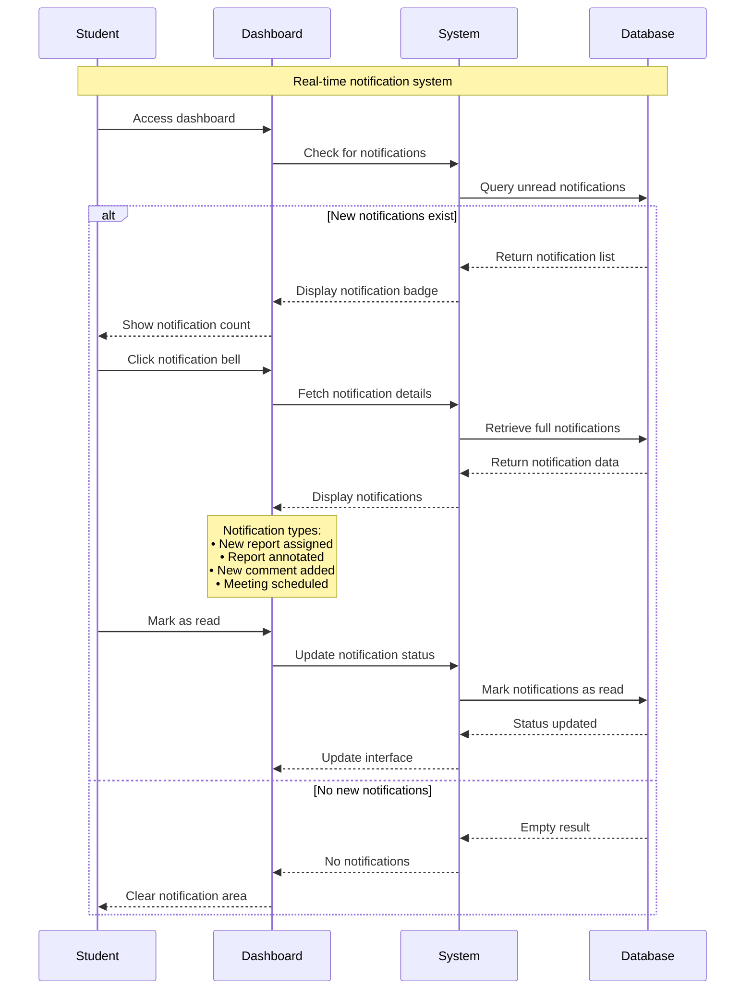
```mermaid
sequenceDiagram
    participant Student
    participant Dashboard
    participant System
    participant Database

    Note over Student,Database: Real-time notification system
    
    Student->>Dashboard: Access dashboard
    Dashboard->>System: Check for notifications
    System->>Database: Query unread notifications
    
    alt New notifications exist
        Database-->>System: Return notification list
        System-->>Dashboard: Display notification badge
        Dashboard-->>Student: Show notification count
        
        Student->>Dashboard: Click notification bell
        Dashboard->>System: Fetch notification details
        System->>Database: Retrieve full notifications
        Database-->>System: Return notification data
        System-->>Dashboard: Display notifications
        
        Note over Dashboard: Notification types:<br/>• New report assigned<br/>• Report annotated<br/>• New comment added<br/>• Meeting scheduled
        
        Student->>Dashboard: Mark as read
        Dashboard->>System: Update notification status
        System->>Database: Mark notifications as read
        Database-->>System: Status updated
        System-->>Dashboard: Update interface
    else No new notifications
        Database-->>System: Empty result
        System-->>Dashboard: No notifications
        Dashboard-->>Student: Clear notification area
    end
```

---

## 3. Supervisor Operations

### 3.1 Report Management

Supervisors can create and assign reports to student groups.

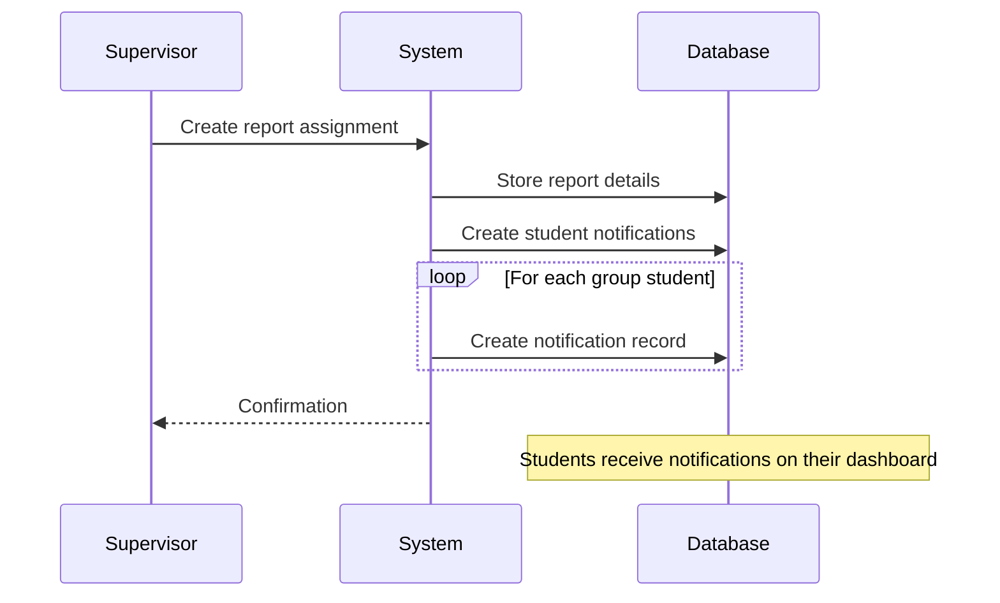
```mermaid
sequenceDiagram
    participant Supervisor
    participant System
    participant Database

    Supervisor->>System: Create report assignment
    System->>Database: Store report details
    System->>Database: Create student notifications
    
    loop For each group student
        System->>Database: Create notification record
    end
    
    System-->>Supervisor: Confirmation
    
    Note over Database: Students receive notifications on their dashboard
```

### 3.2 Document Annotation Process

#### 3.2.1 Annotation Creation with Draft State

Supervisors can create annotations in draft mode before sending to students.

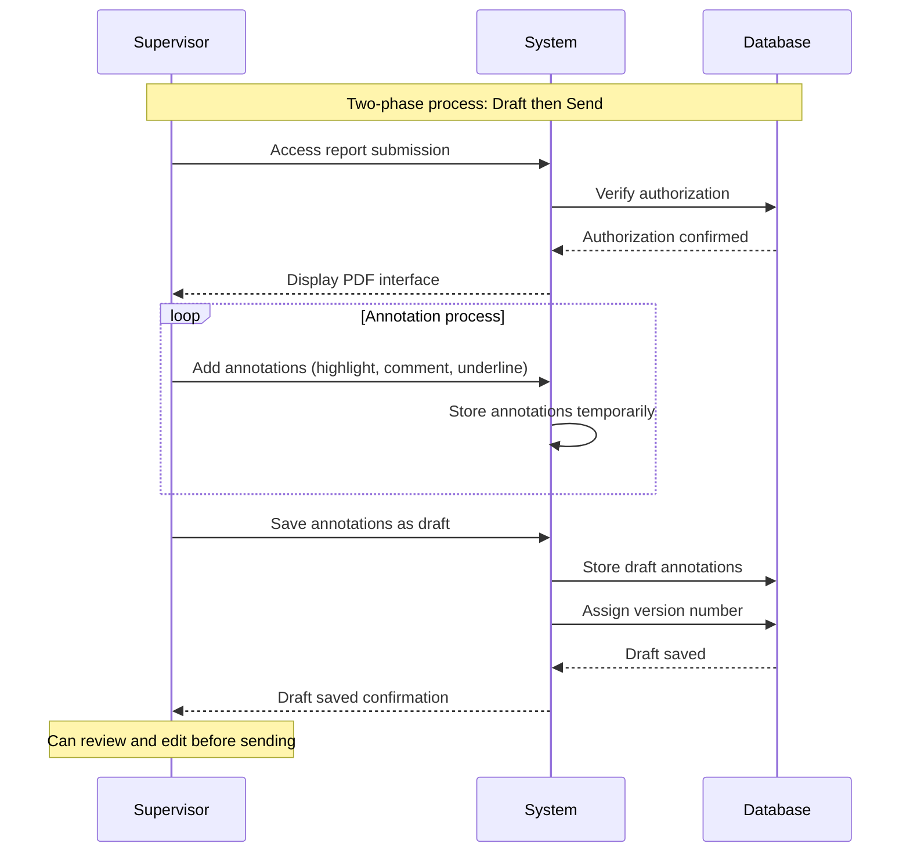
```mermaid
sequenceDiagram
    participant Supervisor
    participant System
    participant Database

    Note over Supervisor,Database: Two-phase process: Draft then Send
    
    Supervisor->>System: Access report submission
    System->>Database: Verify authorization
    Database-->>System: Authorization confirmed
    System-->>Supervisor: Display PDF interface
    
    loop Annotation process
        Supervisor->>System: Add annotations (highlight, comment, underline)
        System->>System: Store annotations temporarily
    end
    
    Supervisor->>System: Save annotations as draft
    System->>Database: Store draft annotations
    System->>Database: Assign version number
    Database-->>System: Draft saved
    System-->>Supervisor: Draft saved confirmation
    
    Note over Supervisor: Can review and edit before sending
```

#### 3.2.2 Feedback Distribution

The system distributes feedback to all group members when supervisor sends annotations.

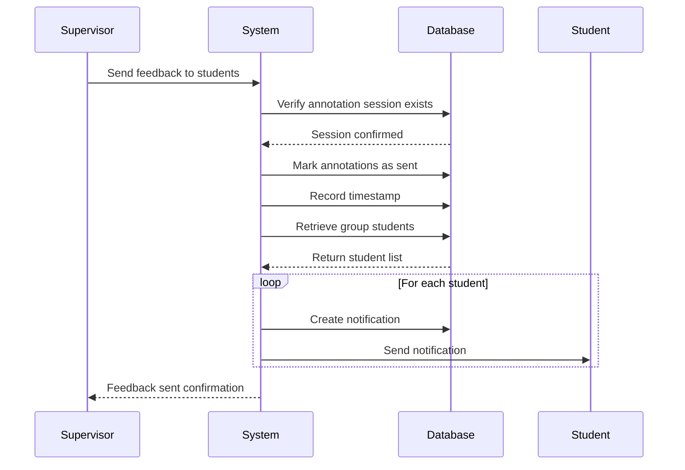
```mermaid
sequenceDiagram
    participant Supervisor
    participant System
    participant Database
    participant Student

    Supervisor->>System: Send feedback to students
    System->>Database: Verify annotation session exists
    Database-->>System: Session confirmed
    
    System->>Database: Mark annotations as sent
    System->>Database: Record timestamp
    
    System->>Database: Retrieve group students
    Database-->>System: Return student list
    
    loop For each student
        System->>Database: Create notification
        System->>Student: Send notification
    end
    
    System-->>Supervisor: Feedback sent confirmation
```

### 3.3 Meeting Documentation

Supervisors can document meetings and generate reports.

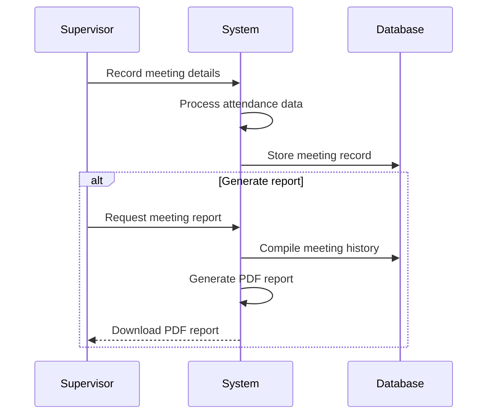
```mermaid
sequenceDiagram
    participant Supervisor
    participant System
    participant Database

    Supervisor->>System: Record meeting details
    System->>System: Process attendance data
    System->>Database: Store meeting record
    
    alt Generate report
        Supervisor->>System: Request meeting report
        System->>Database: Compile meeting history
        System->>System: Generate PDF report
        System-->>Supervisor: Download PDF report
    end
```

---

## 4. Co-Supervisor Operations

### 4.1 Conditional Meeting Management

Main supervisors control whether co-supervisors can manage meetings.

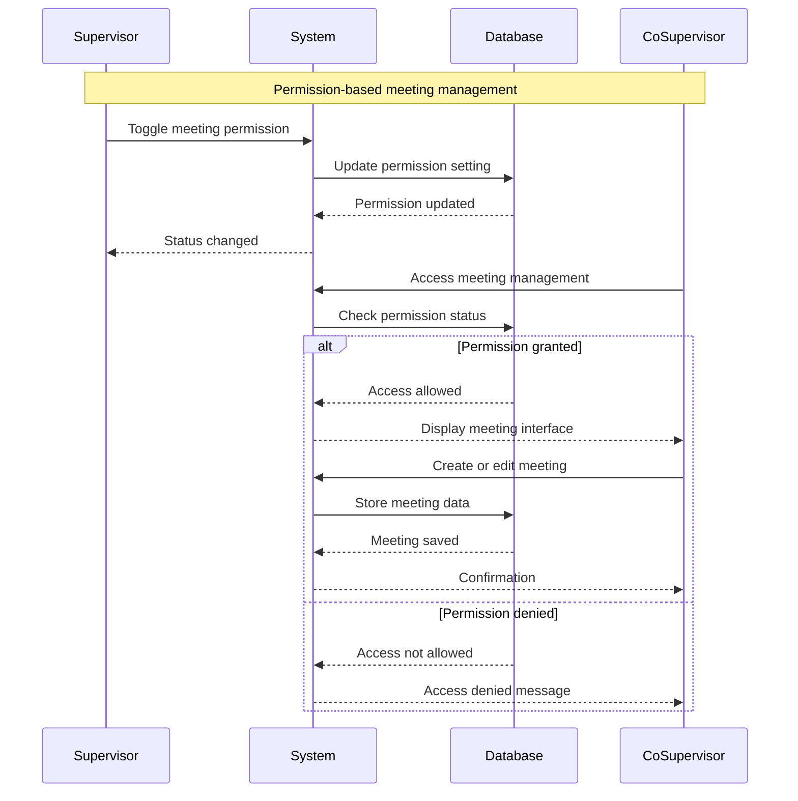
```mermaid
sequenceDiagram
    participant Supervisor
    participant System
    participant Database
    participant CoSupervisor

    Note over Supervisor,CoSupervisor: Permission-based meeting management
    
    Supervisor->>System: Toggle meeting permission
    System->>Database: Update permission setting
    Database-->>System: Permission updated
    System-->>Supervisor: Status changed
    
    CoSupervisor->>System: Access meeting management
    System->>Database: Check permission status
    
    alt Permission granted
        Database-->>System: Access allowed
        System-->>CoSupervisor: Display meeting interface
        
        CoSupervisor->>System: Create or edit meeting
        System->>Database: Store meeting data
        Database-->>System: Meeting saved
        System-->>CoSupervisor: Confirmation
    else Permission denied
        Database-->>System: Access not allowed
        System-->>CoSupervisor: Access denied message
    end
```

### 4.2 Annotation and Feedback Process

Co-supervisors provide feedback through PDF annotations and text comments.

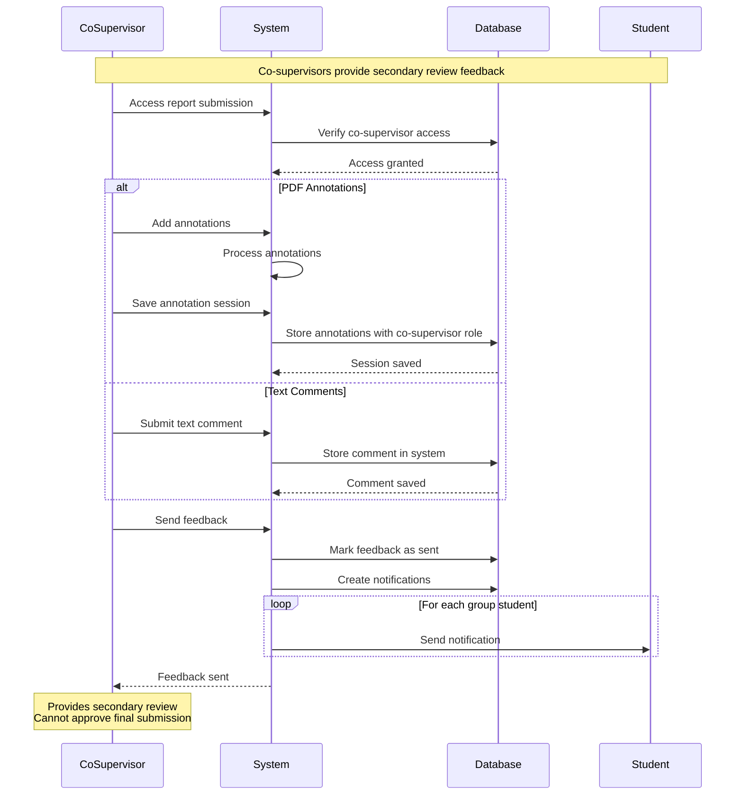
```mermaid
sequenceDiagram
    participant CoSupervisor
    participant System
    participant Database
    participant Student

    Note over CoSupervisor,Student: Co-supervisors provide secondary review feedback
    
    CoSupervisor->>System: Access report submission
    System->>Database: Verify co-supervisor access
    Database-->>System: Access granted
    
    alt PDF Annotations
        CoSupervisor->>System: Add annotations
        System->>System: Process annotations
        CoSupervisor->>System: Save annotation session
        System->>Database: Store annotations with co-supervisor role
        Database-->>System: Session saved
    else Text Comments
        CoSupervisor->>System: Submit text comment
        System->>Database: Store comment in system
        Database-->>System: Comment saved
    end
    
    CoSupervisor->>System: Send feedback
    System->>Database: Mark feedback as sent
    System->>Database: Create notifications
    
    loop For each group student
        System->>Student: Send notification
    end
    
    System-->>CoSupervisor: Feedback sent
    
    Note over CoSupervisor: Provides secondary review<br/>Cannot approve final submission
```

**Figure 4.2:** Co-supervisor feedback workflow demonstrating dual feedback mechanisms (PDF annotations and text comments) with role-based tracking

---

## 5. Panel Member Operations

### 5.1 Panel Member Report Evaluation

Panel members evaluate reports and mark their review status.

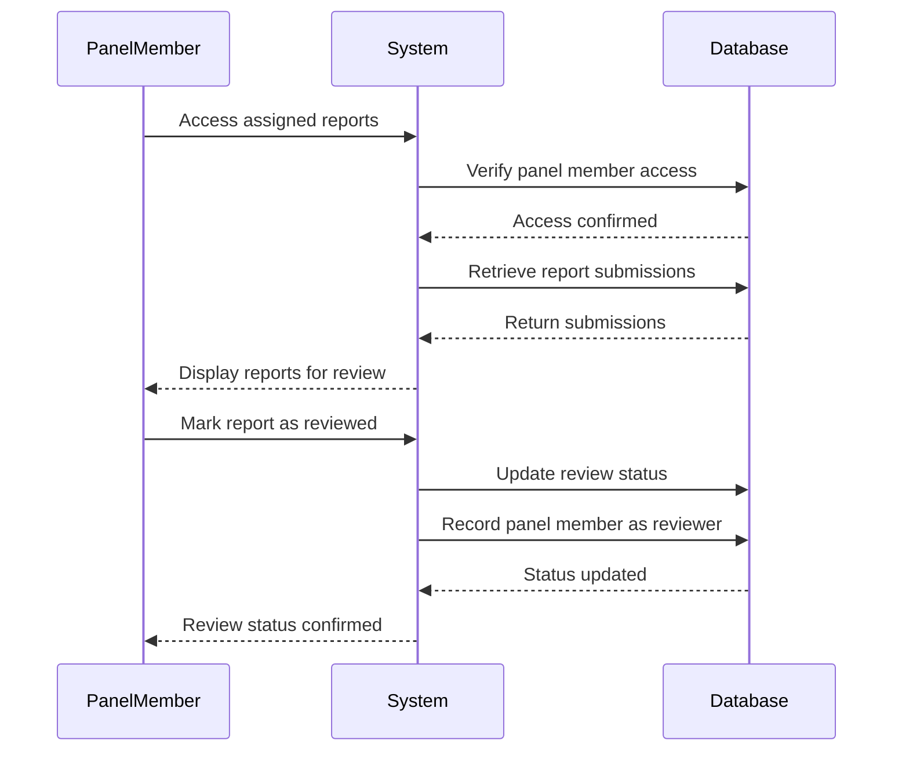
```mermaid
sequenceDiagram
    participant PanelMember
    participant System
    participant Database

    PanelMember->>System: Access assigned reports
    System->>Database: Verify panel member access
    Database-->>System: Access confirmed
    System->>Database: Retrieve report submissions
    Database-->>System: Return submissions
    System-->>PanelMember: Display reports for review
    
    PanelMember->>System: Mark report as reviewed
    System->>Database: Update review status
    System->>Database: Record panel member as reviewer
    Database-->>System: Status updated
    System-->>PanelMember: Review status confirmed
```

### 5.2 Panel Member Feedback

Panel members provide evaluation feedback through annotations and comments.

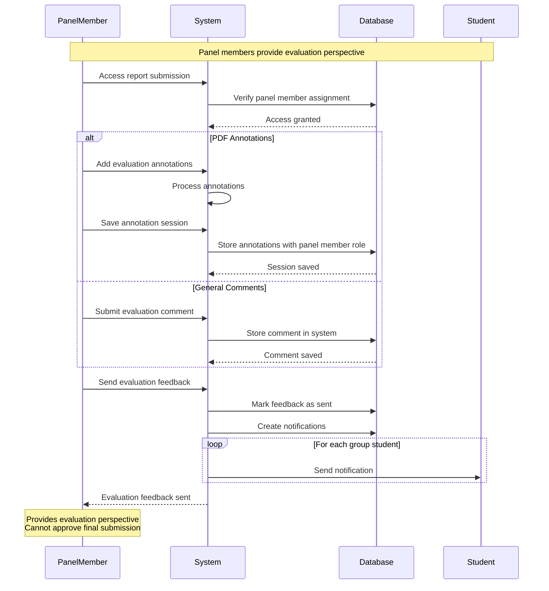
```mermaid
sequenceDiagram
    participant PanelMember
    participant System
    participant Database
    participant Student

    Note over PanelMember,Student: Panel members provide evaluation perspective
    
    PanelMember->>System: Access report submission
    System->>Database: Verify panel member assignment
    Database-->>System: Access granted
    
    alt PDF Annotations
        PanelMember->>System: Add evaluation annotations
        System->>System: Process annotations
        PanelMember->>System: Save annotation session
        System->>Database: Store annotations with panel member role
        Database-->>System: Session saved
    else General Comments
        PanelMember->>System: Submit evaluation comment
        System->>Database: Store comment in system
        Database-->>System: Comment saved
    end
    
    PanelMember->>System: Send evaluation feedback
    System->>Database: Mark feedback as sent
    System->>Database: Create notifications
    
    loop For each group student
        System->>Student: Send notification
    end
    
    System-->>PanelMember: Evaluation feedback sent
    
    Note over PanelMember: Provides evaluation perspective<br/>Cannot approve final submission
```

---

## 6. Advisor Operations

### 6.1 Group Formation

#### 6.1.1 Manual Group Creation

Advisors can manually create groups and assign students.

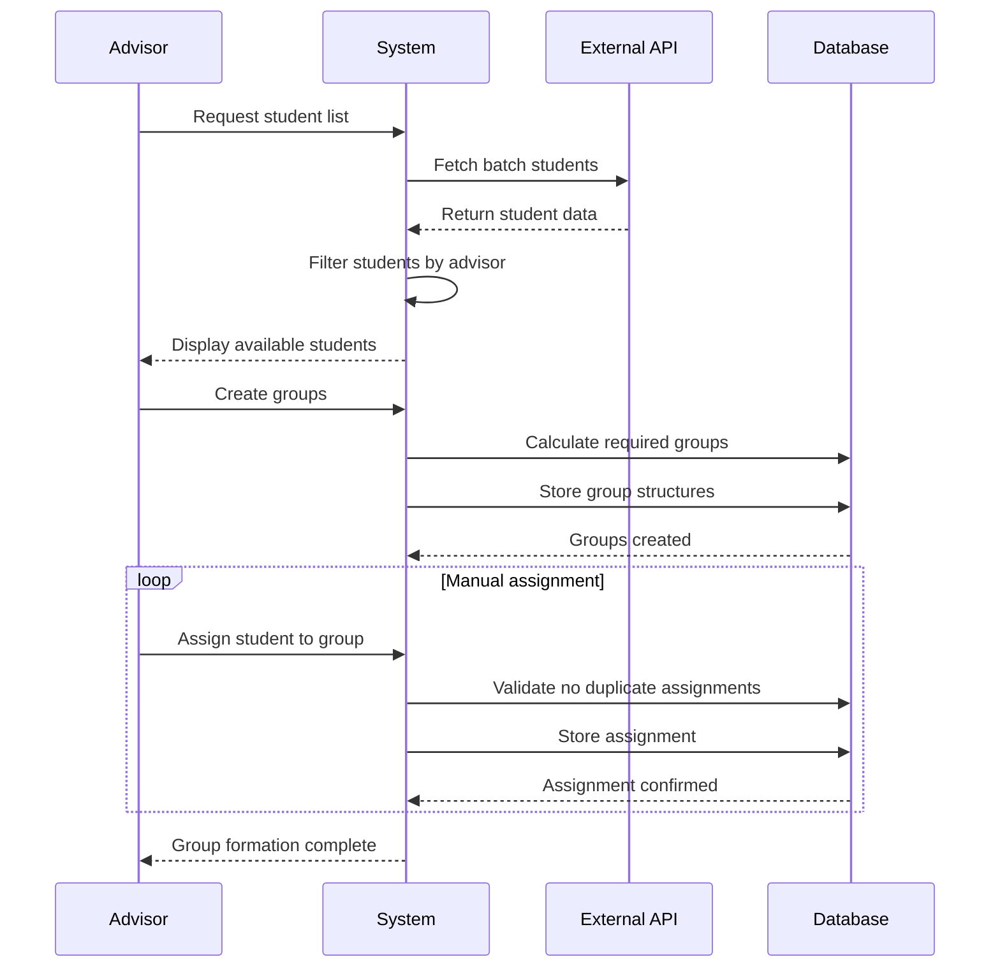
```mermaid
sequenceDiagram
    participant Advisor
    participant System
    participant External API
    participant Database

    Advisor->>System: Request student list
    System->>External API: Fetch batch students
    External API-->>System: Return student data
    System->>System: Filter students by advisor
    System-->>Advisor: Display available students
    
    Advisor->>System: Create groups
    System->>Database: Calculate required groups
    System->>Database: Store group structures
    Database-->>System: Groups created
    
    loop Manual assignment
        Advisor->>System: Assign student to group
        System->>Database: Validate no duplicate assignments
        System->>Database: Store assignment
        Database-->>System: Assignment confirmed
    end
    
    System-->>Advisor: Group formation complete
```

#### 6.1.2 Excel-Based Group Import

Advisors can import group assignments via Excel files.

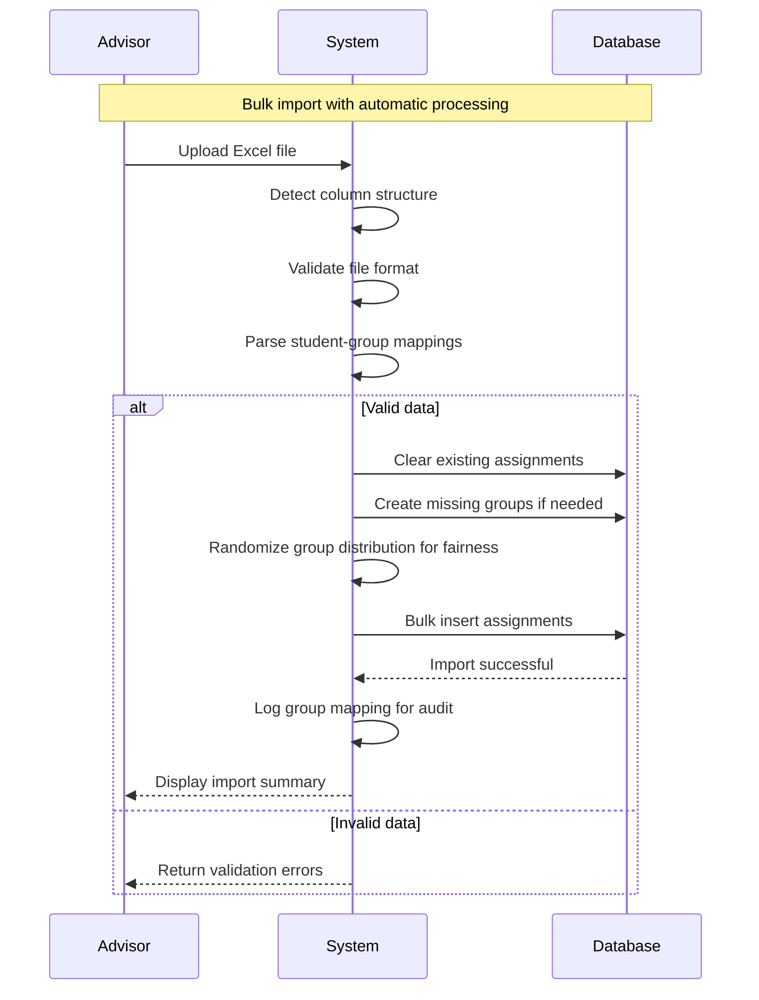
```mermaid
sequenceDiagram
    participant Advisor
    participant System
    participant Database

    Note over Advisor,Database: Bulk import with automatic processing
    
    Advisor->>System: Upload Excel file
    System->>System: Detect column structure
    System->>System: Validate file format
    System->>System: Parse student-group mappings
    
    alt Valid data
        System->>Database: Clear existing assignments
        System->>Database: Create missing groups if needed
        System->>System: Randomize group distribution for fairness
        System->>Database: Bulk insert assignments
        Database-->>System: Import successful
        System->>System: Log group mapping for audit
        System-->>Advisor: Display import summary
    else Invalid data
        System-->>Advisor: Return validation errors
    end
```

#### 6.1.3 Template Export for Group Assignment

The system provides Excel templates for group assignments.

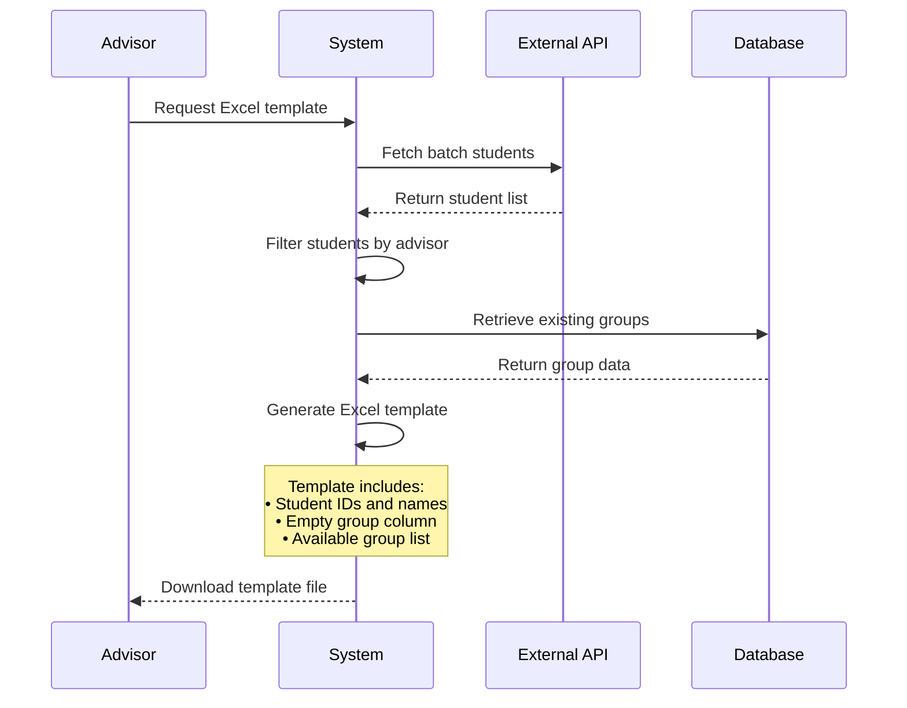
```mermaid
sequenceDiagram
    participant Advisor
    participant System
    participant External API
    participant Database

    Advisor->>System: Request Excel template
    System->>External API: Fetch batch students
    External API-->>System: Return student list
    System->>System: Filter students by advisor
    System->>Database: Retrieve existing groups
    Database-->>System: Return group data
    
    System->>System: Generate Excel template
    Note over System: Template includes:<br/>• Student IDs and names<br/>• Empty group column<br/>• Available group list
    
    System-->>Advisor: Download template file
```

#### 6.1.4 Cross-Batch Student Assignment

Advisors can assign students from different batches to groups.

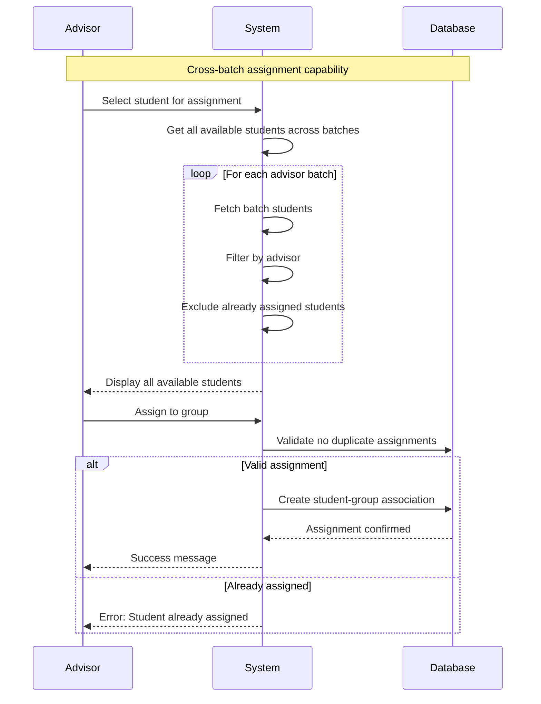
```mermaid
sequenceDiagram
    participant Advisor
    participant System
    participant Database

    Note over Advisor,Database: Cross-batch assignment capability
    
    Advisor->>System: Select student for assignment
    System->>System: Get all available students across batches
    
    loop For each advisor batch
        System->>System: Fetch batch students
        System->>System: Filter by advisor
        System->>System: Exclude already assigned students
    end
    
    System-->>Advisor: Display all available students
    
    Advisor->>System: Assign to group
    System->>Database: Validate no duplicate assignments
    
    alt Valid assignment
        System->>Database: Create student-group association
        Database-->>System: Assignment confirmed
        System-->>Advisor: Success message
    else Already assigned
        System-->>Advisor: Error: Student already assigned
    end
```

#### 6.1.5 Assign Area of Interest to Group

Advisors can assign multiple research areas to groups.

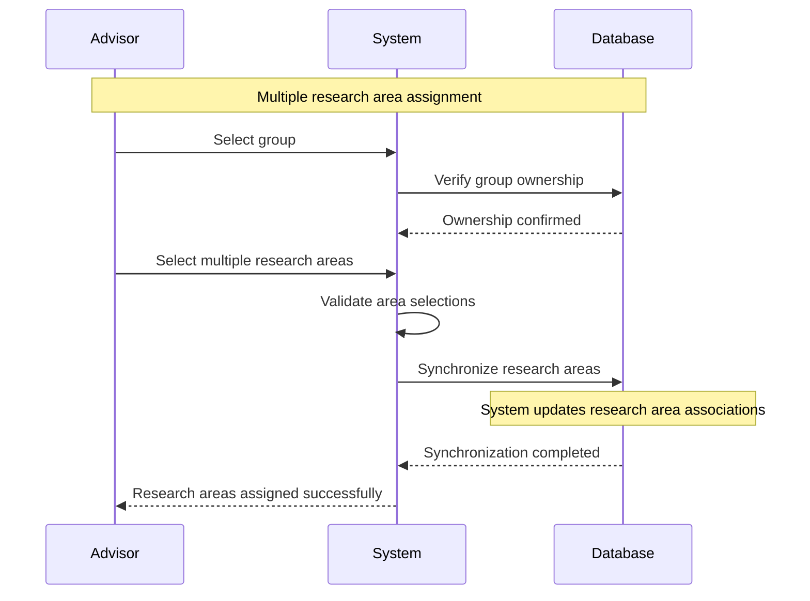
```mermaid
sequenceDiagram
    participant Advisor
    participant System
    participant Database

    Note over Advisor,Database: Multiple research area assignment
    
    Advisor->>System: Select group
    System->>Database: Verify group ownership
    Database-->>System: Ownership confirmed
    
    Advisor->>System: Select multiple research areas
    System->>System: Validate area selections
    System->>Database: Synchronize research areas
    
    Note over Database: System updates research area associations
    
    Database-->>System: Synchronization completed
    System-->>Advisor: Research areas assigned successfully
```

### 6.2 Supervisor Assignment

#### 6.2.1 Manual Supervisor Assignment

Advisors can manually assign supervisors to specific groups.

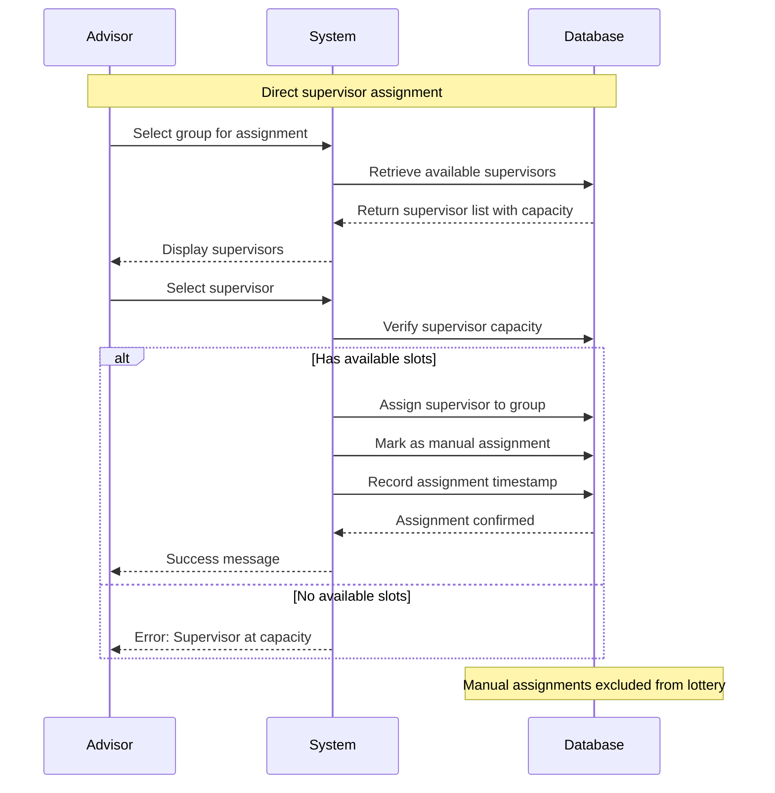
```mermaid
sequenceDiagram
    participant Advisor
    participant System
    participant Database

    Note over Advisor,Database: Direct supervisor assignment
    
    Advisor->>System: Select group for assignment
    System->>Database: Retrieve available supervisors
    Database-->>System: Return supervisor list with capacity
    System-->>Advisor: Display supervisors
    
    Advisor->>System: Select supervisor
    System->>Database: Verify supervisor capacity
    
    alt Has available slots
        System->>Database: Assign supervisor to group
        System->>Database: Mark as manual assignment
        System->>Database: Record assignment timestamp
        Database-->>System: Assignment confirmed
        System-->>Advisor: Success message
    else No available slots
        System-->>Advisor: Error: Supervisor at capacity
    end
    
    Note over Database: Manual assignments excluded from lottery
```

**Figure 6.2.1:** Manual supervisor assignment workflow with capacity verification

#### 6.2.2 Area of Interest Based Assignment

The system assigns supervisors based on matching research expertise, excluding manually assigned groups.

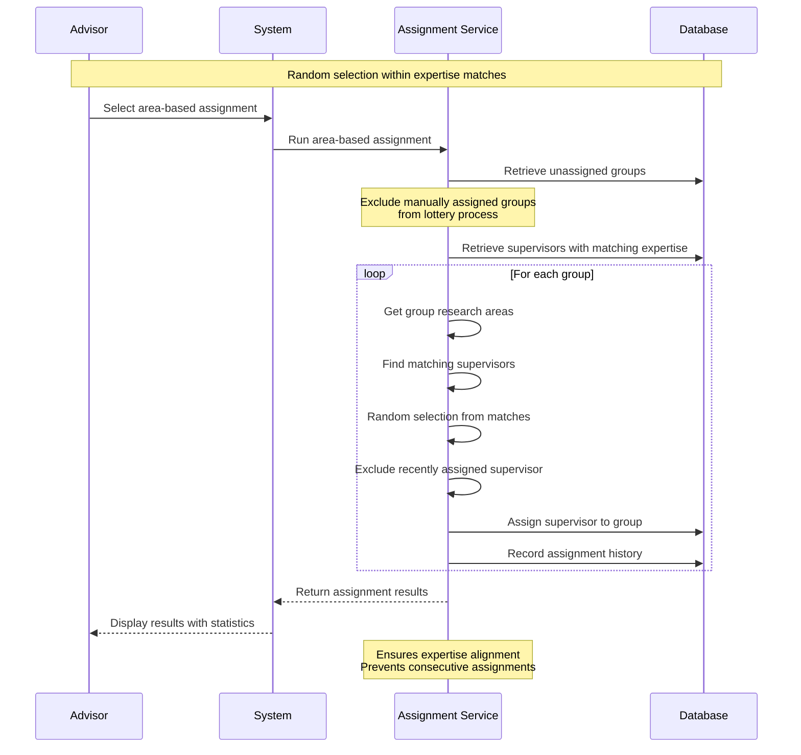
```mermaid
sequenceDiagram
    participant Advisor
    participant System
    participant Assignment Service
    participant Database

    Note over Advisor,Database: Random selection within expertise matches
    
    Advisor->>System: Select area-based assignment
    System->>Assignment Service: Run area-based assignment
    
    Assignment Service->>Database: Retrieve unassigned groups
    Note over Assignment Service: Exclude manually assigned groups<br/>from lottery process
    Assignment Service->>Database: Retrieve supervisors with matching expertise
    
    loop For each group
        Assignment Service->>Assignment Service: Get group research areas
        Assignment Service->>Assignment Service: Find matching supervisors
        Assignment Service->>Assignment Service: Random selection from matches
        Assignment Service->>Assignment Service: Exclude recently assigned supervisor
        Assignment Service->>Database: Assign supervisor to group
        Assignment Service->>Database: Record assignment history
    end
    
    Assignment Service-->>System: Return assignment results
    System-->>Advisor: Display results with statistics
    
    Note over Assignment Service: Ensures expertise alignment<br/>Prevents consecutive assignments
```

#### 6.2.3 Ranking-Based Assignment

The system uses academic ranking for fair distribution, excluding manually assigned groups.

```mermaid
sequenceDiagram
    participant Advisor
    participant System
    participant Assignment Service
    participant Database

    Note over Advisor,Database: Round-robin distribution by rank
    
    Advisor->>System: Select ranking-based assignment
    System->>Assignment Service: Run ranking assignment
    
    Assignment Service->>Database: Get unassigned groups only
    Note over Assignment Service: Filter out groups with existing<br/>manual supervisor assignments
    Assignment Service->>Database: Get supervisors ordered by rank
    Assignment Service->>Assignment Service: Initialize round-robin tracker
    
    loop For each group
        Assignment Service->>Assignment Service: Select next supervisor in rotation
        Assignment Service->>Assignment Service: Check assignment count for current round
        
        alt Can assign
            Assignment Service->>Database: Assign supervisor
            Assignment Service->>Assignment Service: Increment assignment count
        else Move to next round
            Assignment Service->>Assignment Service: Start new round
            Assignment Service->>Assignment Service: Reset to first supervisor
        end
    end
    
    Assignment Service-->>System: Return results
    System-->>Advisor: Display distribution statistics
    
    Note over Assignment Service: Ensures equal distribution before repetition
```

#### 6.2.4 Hybrid Assignment Strategy

The system combines expertise matching with fair distribution, excluding manually assigned groups.

```mermaid
sequenceDiagram
    participant Advisor
    participant System
    participant Assignment Service
    participant Database

    Note over Advisor,Database: Per-area fairness with ranking priority
    
    Advisor->>System: Select hybrid assignment
    System->>Assignment Service: Run combined assignment
    
    Assignment Service->>Database: Get unassigned groups with research areas
    Note over Assignment Service: Filter out groups with existing<br/>manual supervisor assignments
    Assignment Service->>Database: Get supervisors with expertise
    
    loop For each group
        Assignment Service->>Assignment Service: Get area supervisors
        Assignment Service->>Assignment Service: Find minimum assignment count in area
        Assignment Service->>Assignment Service: Filter to supervisors with minimum count
        
        alt Multiple candidates
            Assignment Service->>Assignment Service: Apply ranking priority
        end
        
        Assignment Service->>Database: Assign best candidate
        Assignment Service->>Assignment Service: Update area tracking
    end
    
    Assignment Service-->>System: Return results
    System-->>Advisor: Display balanced distribution
    
    Note over Assignment Service: Ensures fairness within each research area
```

#### 6.2.5 Assignment Algorithm Comparison

```mermaid
graph TD
    Start[Assignment Strategy Selection]
    
    Start --> AOI[Area-Based Strategy]
    Start --> Rank[Ranking-Based Strategy]
    Start --> Hybrid[Hybrid Strategy]
    
    AOI --> AOIFeatures[Features:<br/>✓ Expertise match<br/>✓ Random selection<br/>✓ Rotation tracking<br/>✗ May be uneven]
    
    Rank --> RankFeatures[Features:<br/>✓ Equal distribution<br/>✓ Round-robin fairness<br/>✗ Ignores expertise<br/>✗ No randomization]
    
    Hybrid --> HybridFeatures[Features:<br/>✓ Expertise match<br/>✓ Per-area fairness<br/>✓ Ranking priority<br/>✓ Optimal balance]
    
    style Start fill:#f9f,stroke:#333,stroke-width:2px
    style AOIFeatures fill:#e8f5e9,stroke:#4caf50,stroke-width:1px
    style RankFeatures fill:#e3f2fd,stroke:#2196f3,stroke-width:1px
    style HybridFeatures fill:#fff3e0,stroke:#ff9800,stroke-width:1px
```

---

## 7. Administrative Functions

### 7.1 Co-Supervisor Assignment

Administrators assign co-supervisors to groups.

```mermaid
sequenceDiagram
    participant Administrator
    participant System
    participant Database

    Note over Administrator,Database: Administrative co-supervisor assignment
    
    Administrator->>System: Access group management
    System->>Database: Retrieve groups list
    Database-->>System: Return groups
    System-->>Administrator: Display groups
    
    Administrator->>System: Select group for co-supervisor
    System->>Database: Retrieve available supervisors
    Database-->>System: Return supervisor list
    System->>System: Filter out main supervisor
    System-->>Administrator: Display eligible co-supervisors
    
    Administrator->>System: Assign co-supervisor
    System->>Database: Validate assignment
    
    alt Valid assignment
        System->>Database: Update group with co-supervisor
        System->>Database: Set initial permissions
        Database-->>System: Assignment confirmed
        System->>Database: Create notification for co-supervisor
        System-->>Administrator: Success message
    else Invalid assignment
        System-->>Administrator: Error: Invalid assignment
    end
    
    Note over Database: Initial permissions set conservatively
```

### 7.2 Panel Member Assignment

Administrators can assign multiple panel members to groups.

```mermaid
sequenceDiagram
    participant Administrator
    participant System
    participant Database

    Note over Administrator,Database: Multiple panel members per group
    
    Administrator->>System: Access group management
    System->>Database: Retrieve groups list
    Database-->>System: Return groups
    System-->>Administrator: Display groups
    
    Administrator->>System: Select group for panel member
    System->>Database: Retrieve available supervisors
    Database-->>System: Return supervisor list
    System->>Database: Get existing panel members
    Database-->>System: Return current panel
    System-->>Administrator: Display eligible panel members
    
    Administrator->>System: Assign panel member
    System->>Database: Validate not already assigned
    
    alt Valid assignment
        System->>Database: Create panel assignment
        System->>Database: Record assignment metadata
        Database-->>System: Assignment confirmed
        System->>Database: Create notification for panel member
        System-->>Administrator: Panel member assigned
    else Already assigned
        System-->>Administrator: Error: Already a panel member
    end
    
    Note over Database: No capacity limits for panel members
```

### 7.3 Area of Interest Management

Administrators manage research areas in the system.

```mermaid
sequenceDiagram
    participant Administrator
    participant System
    participant Database

    Note over Administrator,Database: Research area management
    
    Administrator->>System: Manage research areas
    System->>Database: Retrieve existing areas
    Database-->>System: Return area list
    System-->>Administrator: Display areas
    
    alt Create New Area
        Administrator->>System: Submit new research area
        System->>Database: Validate and create area
        Database-->>System: Area created
        System-->>Administrator: Success confirmation
    else Update Area
        Administrator->>System: Edit area details
        System->>Database: Update area record
        Database-->>System: Area updated
        System-->>Administrator: Update confirmation
    else Delete Area
        Administrator->>System: Delete area
        System->>Database: Remove area record
        Database-->>System: Area deleted
        System-->>Administrator: Deletion confirmation
    end
```

### 7.4 Administrator Group Management

Administrators have comprehensive group management capabilities including creating groups, assigning students from any active batch, and configuring supervisors and research areas. Unlike advisors who are restricted to their own batches, administrators can access and assign students from any active batch in the system.

#### 7.4.1 Group Creation with Pre-Configuration

Administrators can create groups with optional supervisor and research area assignments.

```mermaid
sequenceDiagram
    participant Administrator
    participant System
    participant Database

    Note over Administrator,Database: Administrative group creation
    
    Administrator->>System: Submit group creation form
    System->>Database: Validate group name uniqueness
    
    alt Group name exists
        Database-->>System: Duplicate found
        System-->>Administrator: Error: Group already exists
    else Valid group name
        Database-->>System: Name available
        
        alt Supervisor provided
            System->>Database: Verify supervisor capacity
            
            alt Capacity available
                System->>Database: Create group with supervisor
            else Capacity exceeded
                System-->>Administrator: Error: Supervisor at capacity
            end
        else No supervisor
            System->>Database: Create group without supervisor
        end
        
        System->>Database: Associate research areas if provided
        Database-->>System: Group created
        System-->>Administrator: Success confirmation
    end
    
    Note over Database: Admin groups support up to 4 students<br/>Advisor auto-detected on first student assignment
```

**Figure 7.4.1:** Administrator group creation workflow with optional pre-configuration

#### 7.4.2 Cross-Batch Student Pool Management

Administrators can access and assign students from any active batch, unlike advisors who are restricted to their own batches.

```mermaid
sequenceDiagram
    participant Administrator
    participant System
    participant External API
    participant Database

    Note over Administrator,Database: Cross-batch student access
    
    Administrator->>System: Select batch for group management
    System->>Database: Query assigned students
    Database-->>System: Return assigned student IDs
    
    System->>Database: Get prior active batches
    Database-->>System: Return batch list
    
    loop For each prior batch
        System->>External API: Request students for batch
        External API-->>System: Return student data
        System->>System: Filter out assigned students
        System->>System: Add to eligible pool
    end
    
    System-->>Administrator: Display eligible students from all batches
    
    Note over Administrator: Administrator can access ANY active batch<br/>No advisor-specific restrictions
```

**Figure 7.4.2:** Cross-batch student pool management demonstrating administrator's unrestricted batch access

#### 7.4.3 Student Assignment with Advisor Auto-Detection

The system automatically detects and assigns advisors when the first student is added to an admin-created group.

```mermaid
sequenceDiagram
    participant Administrator
    participant System
    participant External API
    participant Database

    Note over Administrator,Database: Advisor auto-detection workflow
    
    Administrator->>System: Assign student to group
    System->>Database: Verify student availability and capacity
    
    alt Student unavailable or group full
        System-->>Administrator: Error message
    else Can proceed
        System->>External API: Fetch student with advisor details
        External API-->>System: Return student profile
        
        alt Group has no advisor
            System->>Database: Check if advisor exists locally
            
            alt Advisor not found locally
                System->>External API: Fetch advisor from teacher API
                System->>Database: Create advisor user if found
            end
            
            System->>Database: Assign advisor to group
        else Group has advisor
            System->>Database: Validate same advisor
            
            alt Advisor mismatch
                System-->>Administrator: Error: Cannot mix advisors
            end
        end
        
        System->>Database: Create student assignment
        System-->>Administrator: Success confirmation
    end
    
    Note over System: Auto-detects and creates advisor from API<br/>Enforces single advisor per group
```

**Figure 7.4.3:** Student assignment workflow with automatic advisor detection

### 7.5 Batch Management

Administrators manage academic batches that serve as the foundation for student grouping and advisor assignments.

#### 7.5.1 Batch Synchronization from External API

The system synchronizes academic batch data from the university information system to maintain current student enrollment information.

```mermaid
sequenceDiagram
    participant Administrator
    participant System
    participant External API
    participant Database

    Administrator->>System: Initiate batch sync
    System->>External API: Request batch list
    
    alt API Success
        External API-->>System: Return batch data
        
        loop For each batch
            System->>Database: Update or create batch
            Database-->>System: Confirmation
        end
        
        System-->>Administrator: Display sync results
    else API Failure
        External API-->>System: Error response
        System-->>Administrator: Display error message
    end
```

**Figure 7.5.1:** Batch synchronization workflow with external university API

**Core Purpose**: Synchronize academic batch information from the university system to ensure the thesis management system has current enrollment data for student grouping and advisor assignments.

#### 7.5.2 Batch Status Management

Administrators control batch activation status to regulate which academic cohorts are available for thesis management operations.

```mermaid
sequenceDiagram
    participant Administrator
    participant System
    participant Database

    Note over Administrator,Database: Batch activation control mechanism
    
    Administrator->>System: Access batch management interface
    System->>Database: Retrieve batch records with statistics
    Database-->>System: Return batch information
    System-->>Administrator: Display batch overview
    
    alt Individual Batch Control
        Administrator->>System: Toggle batch activation status
        System->>Database: Update batch availability status
        Database-->>System: Status modification confirmed
        System-->>Administrator: Display confirmation message
    else Multiple Batch Control
        Administrator->>System: Select multiple batches
        Administrator->>System: Apply batch operation (activate/deactivate)
        System->>System: Validate batch identifiers
        System->>Database: Update batch availability statuses
        Database-->>System: Batch operation completed
        System-->>Administrator: Display operation summary
    else Global Activation
        Administrator->>System: Activate all batches
        System->>Database: Enable all batch records
        Database-->>System: Return modification count
        System-->>Administrator: Display activation summary
    else Global Deactivation
        Administrator->>System: Deactivate all batches
        System->>Database: Disable all batch records
        Database-->>System: Return modification count
        System-->>Administrator: Display deactivation summary
    end
    
    Note over System: Only activated batches are visible<br/>in student assignment operations
```

**Figure 7.5.2:** Batch status management workflow with individual and bulk operations

**Core Purpose**: Enable administrators to control the availability of academic batches within the system, ensuring that only relevant cohorts are accessible for group formation and student assignment operations.

### 7.6 Supervisor Management

Administrators manage supervisor profiles and capacities.

```mermaid
sequenceDiagram
    participant Administrator
    participant System
    participant Database

    Administrator->>System: Access supervisor management
    System->>Database: Retrieve supervisors with statistics
    Database-->>System: Return supervisor data with metrics
    System-->>Administrator: Display supervisor table
    
    alt Toggle Research Area
        Administrator->>System: Toggle supervisor research area
        System->>Database: Check current assignment
        
        alt Currently assigned
            System->>Database: Remove area association
            Database-->>System: Removed
        else Not assigned
            System->>Database: Add area association
            Database-->>System: Added
        end
        
        System-->>Administrator: Area toggled
    else Set Thesis Limit
        Administrator->>System: Update thesis capacity
        System->>Database: Update supervisor record
        Database-->>System: Limit updated
        System-->>Administrator: Capacity updated
    end
```

---

## 8. Multi-Role Collaboration

### 8.1 Teacher Role Switching

Teachers can switch between different supervision roles.

```mermaid
sequenceDiagram
    participant Teacher
    participant System
    participant Database

    Teacher->>System: Access teacher dashboard
    System->>Database: Check all assigned roles
    Database-->>System: Return role assignments
    
    Note over System: Teacher may have multiple roles:<br/>• Supervisor for some groups<br/>• Co-Supervisor for others<br/>• Panel Member for evaluation
    
    System-->>Teacher: Display role selection panel
    
    alt Select Supervisor Role
        Teacher->>System: Access supervisor panel
        System->>Database: Get supervised groups
        System-->>Teacher: Supervisor dashboard
    else Select Co-Supervisor Role
        Teacher->>System: Access co-supervisor panel
        System->>Database: Get co-supervised groups
        System-->>Teacher: Co-supervisor dashboard
    else Select Panel Member Role
        Teacher->>System: Access panel member panel
        System->>Database: Get panel assignments
        System-->>Teacher: Panel member dashboard
    end
```

### 8.2 Collaborative Report Review

Multiple reviewers can annotate the same report independently, with each sending notifications to students separately.

```mermaid
sequenceDiagram
    participant Student
    participant Supervisor
    participant CoSupervisor
    participant PanelMember
    participant System
    participant Database

    Note over Student,Database: Independent review process
    
    Student->>System: Submit report
    System->>Database: Store submission
    
    par Independent Review Process
        Supervisor->>System: Create annotation session
        System->>Database: Store supervisor annotations
        Supervisor->>System: Send feedback
        System->>Database: Mark supervisor session as sent
        System->>Student: Notify of supervisor feedback
    and
        CoSupervisor->>System: Create annotation session
        System->>Database: Store co-supervisor annotations
        CoSupervisor->>System: Send feedback
        System->>Database: Mark co-supervisor session as sent
        System->>Student: Notify of co-supervisor feedback
    and
        PanelMember->>System: Create annotation session
        System->>Database: Store panel member annotations
        PanelMember->>System: Send feedback
        System->>Database: Mark panel member session as sent
        System->>Student: Notify of panel member feedback
    end
    
    Student->>System: View annotations
    System->>Database: Retrieve all annotation sessions
    Database-->>System: Return sessions with role identifiers
    System-->>Student: Display feedback categorized by reviewer
```

### 8.3 Hierarchical Approval Process

Only main supervisors have final approval authority for thesis submissions.

```mermaid
sequenceDiagram
    participant Supervisor
    participant System
    participant Database

    Note over Supervisor,Database: Supervisor-only approval authority
    
    Supervisor->>System: Access final report
    System->>Database: Retrieve all reviewer feedback
    Database-->>System: Return feedback from all reviewers
    System-->>Supervisor: Display comprehensive review
    
    Note over Supervisor: Reviews feedback from:<br/>• Co-Supervisor (recommendations)<br/>• Panel Members (evaluations)<br/>• Own assessment
    
    alt Approve Final Project
        Supervisor->>System: Approve submission
        System->>Database: Update status to approved
        System->>Database: Publish to repository
        Database-->>System: Approval confirmed
        System-->>Supervisor: Success confirmation
    else Request Revision
        Supervisor->>System: Request changes
        System->>Database: Update status to needs revision
        Database-->>System: Status updated
        System-->>Supervisor: Revision request confirmed
    end
    
    Note over Supervisor: Only main supervisor can approve<br/>Co-supervisors and panel members cannot
```

---

## 9. External System Integration

### 9.1 University API Integration

The system integrates with university information systems for data synchronization.

```mermaid
sequenceDiagram
    participant System
    participant Student Service
    participant Supervisor Service
    participant University API

    Note over System,University API: Integration with university systems
    
    alt Student Data Synchronization
        System->>Student Service: Request batch students
        Student Service->>University API: Request student data for batch
        University API-->>Student Service: Return student array
        Student Service->>Student Service: Filter by advisor
        Student Service-->>System: Return filtered students
    else Supervisor Data Synchronization
        System->>Supervisor Service: Request supervisor list
        Supervisor Service->>University API: Request teacher data
        University API-->>Supervisor Service: Return teacher array
        Supervisor Service->>Supervisor Service: Map to supervisor model
        Supervisor Service-->>System: Return supervisors
    else Batch Information
        System->>Student Service: Get advisor batches
        Student Service->>University API: Request batch information
        University API-->>Student Service: Return batch list
        Student Service-->>System: Return active batches
    end
    
    Note over University API: External university information system
```

## System Components Description

### System Actors
- **Student**: Submits thesis reports, receives feedback, and views annotations from multiple reviewers
- **Supervisor**: Primary thesis supervisor with report assignment, annotation, meeting management, and final approval authority
- **Co-Supervisor**: Secondary supervisor providing feedback and optional meeting management (permission-based)
- **Panel Member**: Evaluation-focused reviewer providing assessment feedback without approval authority
- **Advisor**: Coordinates group formation, student assignments, and supervisor allocation for batches
- **Administrator**: Manages system configuration, user assignments (co-supervisors, panel members), and research areas
- **Teacher**: Faculty member who may hold multiple roles simultaneously (supervisor, co-supervisor, panel member)

### External Systems
- **University API**: External information system providing student data, teacher data, and batch information for synchronization
- **Database**: Persistent storage for all system data including users, groups, reports, annotations, and notifications

### Key System Capabilities
1. **Role-Based Access Control**: Multi-role authentication with hierarchical permissions
2. **Batch Management**: API synchronization, status control, and audit capabilities for academic batches
3. **Group Management**: Student group formation with cross-batch assignment support
4. **Supervisor Assignment**: Three algorithmic strategies (area-based, ranking-based, hybrid) with manual override
5. **Dual Feedback Mechanism**: PDF annotations and text comments with role-based tracking
6. **Draft-Send Workflow**: Two-phase annotation process allowing review before distribution
7. **Collaborative Review**: Independent parallel review by multiple reviewers with separate notifications
8. **Hierarchical Approval**: Supervisor-only final approval authority with comprehensive feedback review
9. **Meeting Management**: Documentation and reporting with conditional co-supervisor access
10. **Notification System**: Real-time student notifications for reports, annotations, and comments
11. **Annotation History**: Complete version tracking with role-based categorization and comparison
12. **Cross-Batch Operations**: Administrator access to students across multiple batches
13. **Research Area Management**: Multiple area assignments with expertise-based supervisor matching

---

## Notes

These sequence diagrams illustrate the primary interactions within the Thesis Repository Management System, demonstrating the flow of information between system components and user roles. The diagrams follow UML 2.0 notation standards and IEEE documentation guidelines, focusing on system behavior and user interactions rather than implementation details.

The diagrams are designed to be understood by both technical and non-technical stakeholders, including academic reviewers, system administrators, and end users. They provide a comprehensive view of the system's functionality while maintaining clarity and avoiding unnecessary technical complexity.

### Document Version
- **Version 1.0**: Academic version for IEEE documentation
- **Created**: January 2025
- **Purpose**: Academic documentation and system review
- **Audience**: Academic reviewers, stakeholders, and system evaluators