# Sequence Diagrams - Thesis Repository Management System
## Academic Version for IEEE Documentation

## Table of Contents
1. [System Authentication](#1-system-authentication)
2. [Student Operations](#2-student-operations)
3. [Supervisor Operations](#3-supervisor-operations)
4. [Co-Supervisor Operations](#4-co-supervisor-operations)
5. [Panel Member Operations](#5-panel-member-operations)
6. [Advisor Operations](#6-advisor-operations)
7. [Administrative Functions](#7-administrative-functions)
8. [Multi-Role Collaboration](#8-multi-role-collaboration)
9. [System Architecture](#9-system-architecture)

---

## 1. System Authentication

### 1.1 Authentication and Authorization Framework

The system implements a robust authentication mechanism with automatic failover capabilities to ensure continuous service availability. This section presents the authentication workflow and role-based access control mechanisms.

#### 1.1.1 User Authentication Flow

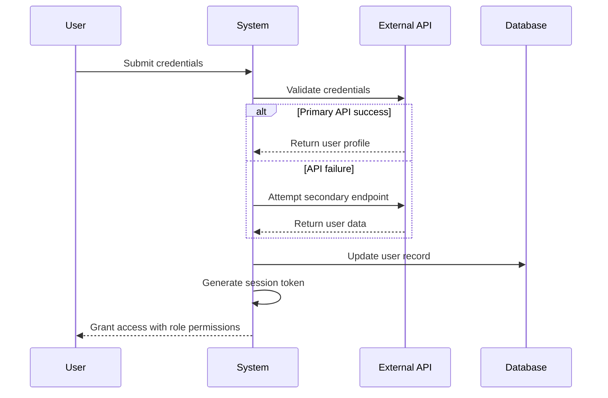
```mermaid
sequenceDiagram
    participant U as User
    participant S as System
    participant API as External API
    participant DB as Database

    U->>S: Submit credentials
    S->>API: Validate credentials
    
    alt Primary API success
        API-->>S: Return user profile
    else API failure
        S->>API: Attempt secondary endpoint
        API-->>S: Return user data
    end
    
    S->>DB: Update user record
    S->>S: Generate session token
    S-->>U: Grant access with role permissions
```

**Figure 1.1:** User authentication sequence with failover mechanism

#### 1.1.2 Role-Based Access Control

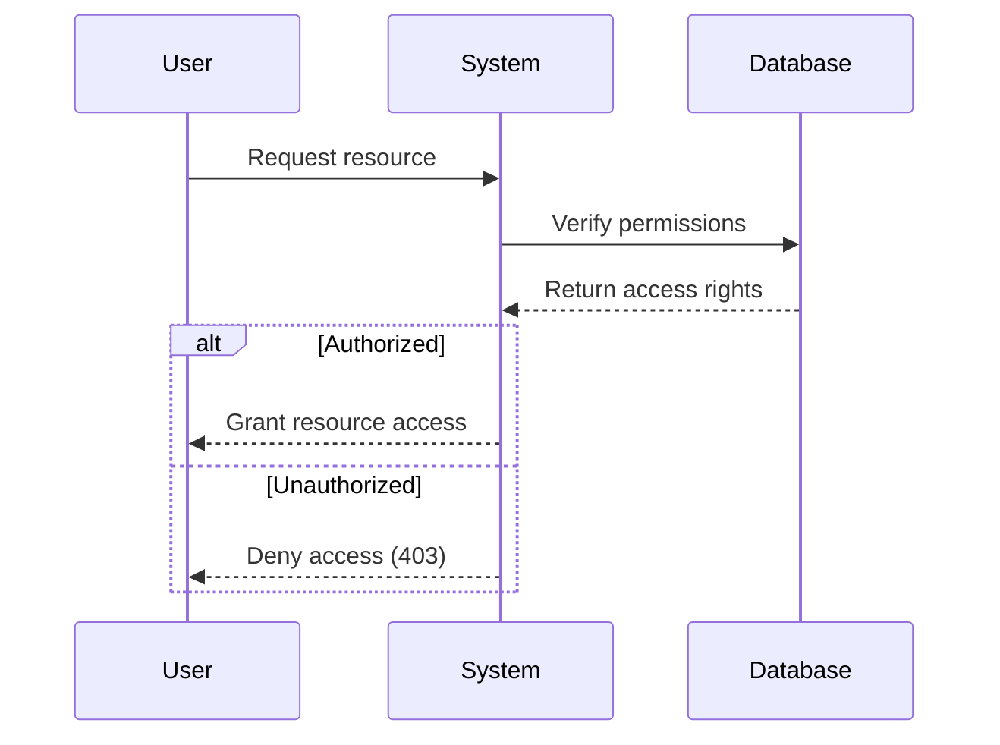
```mermaid
sequenceDiagram
    participant U as User
    participant S as System
    participant DB as Database

    U->>S: Request resource
    S->>DB: Verify permissions
    DB-->>S: Return access rights
    
    alt Authorized
        S-->>U: Grant resource access
    else Unauthorized
        S-->>U: Deny access (403)
    end
```

**Figure 1.2:** Role-based access control verification process

---

## 2. Student Operations

### 2.1 Report Submission Process

This sequence demonstrates how students submit their thesis reports to the system.

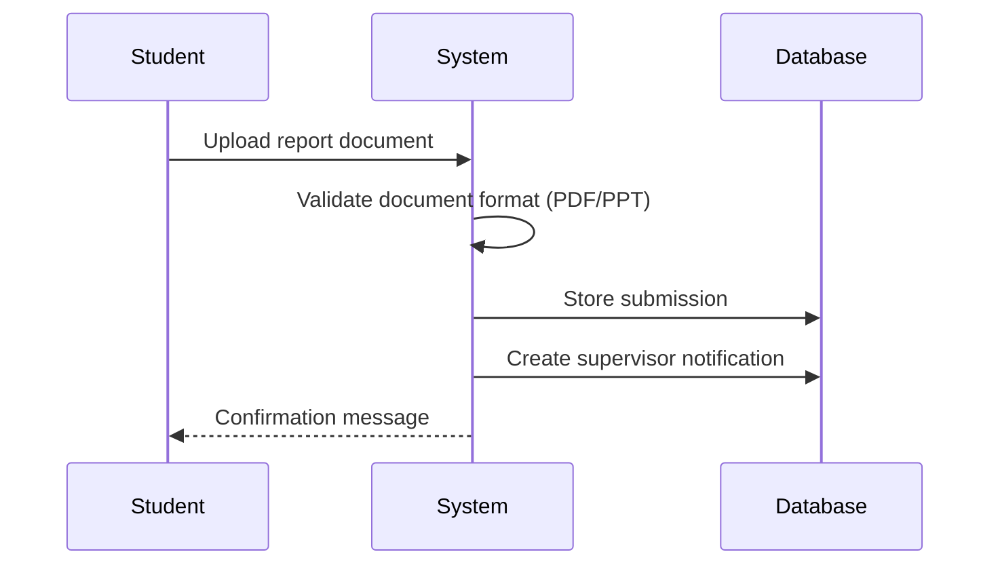
```mermaid
sequenceDiagram
    participant Student
    participant System
    participant Database

    Student->>System: Upload report document
    System->>System: Validate document format (PDF/PPT)
    System->>Database: Store submission
    System->>Database: Create supervisor notification
    System-->>Student: Confirmation message
```

### 2.2 View Feedback and Annotations

Students can view annotated documents with version history and role-based categorization.

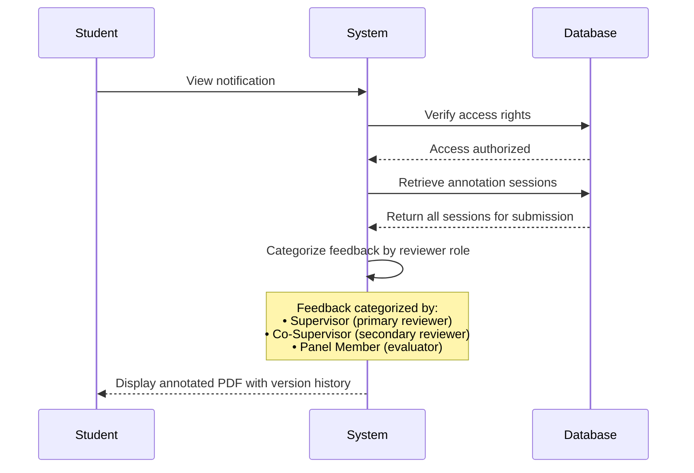
```mermaid
sequenceDiagram
    participant Student
    participant System
    participant Database

    Student->>System: View notification
    System->>Database: Verify access rights
    Database-->>System: Access authorized
    
    System->>Database: Retrieve annotation sessions
    Database-->>System: Return all sessions for submission
    
    System->>System: Categorize feedback by reviewer role
    Note over System: Feedback categorized by:<br/>• Supervisor (primary reviewer)<br/>• Co-Supervisor (secondary reviewer)<br/>• Panel Member (evaluator)
    
    System-->>Student: Display annotated PDF with version history
```

### 2.3 Dashboard Notification System

The notification system keeps students informed about report updates and feedback.

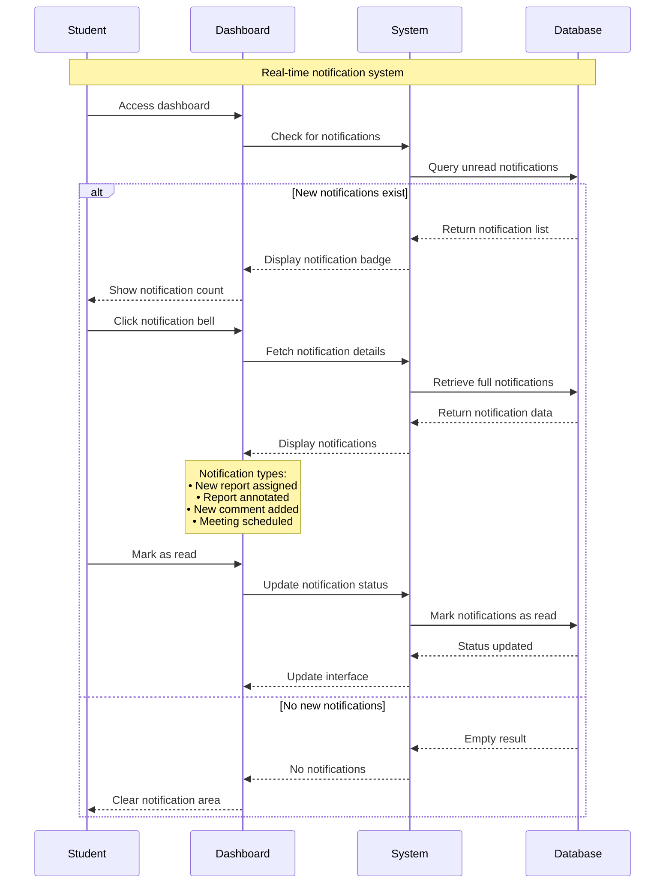
```mermaid
sequenceDiagram
    participant Student
    participant Dashboard
    participant System
    participant Database

    Note over Student,Database: Real-time notification system
    
    Student->>Dashboard: Access dashboard
    Dashboard->>System: Check for notifications
    System->>Database: Query unread notifications
    
    alt New notifications exist
        Database-->>System: Return notification list
        System-->>Dashboard: Display notification badge
        Dashboard-->>Student: Show notification count
        
        Student->>Dashboard: Click notification bell
        Dashboard->>System: Fetch notification details
        System->>Database: Retrieve full notifications
        Database-->>System: Return notification data
        System-->>Dashboard: Display notifications
        
        Note over Dashboard: Notification types:<br/>• New report assigned<br/>• Report annotated<br/>• New comment added<br/>• Meeting scheduled
        
        Student->>Dashboard: Mark as read
        Dashboard->>System: Update notification status
        System->>Database: Mark notifications as read
        Database-->>System: Status updated
        System-->>Dashboard: Update interface
    else No new notifications
        Database-->>System: Empty result
        System-->>Dashboard: No notifications
        Dashboard-->>Student: Clear notification area
    end
```

---

## 3. Supervisor Operations

### 3.1 Report Management

Supervisors can create and assign reports to student groups.

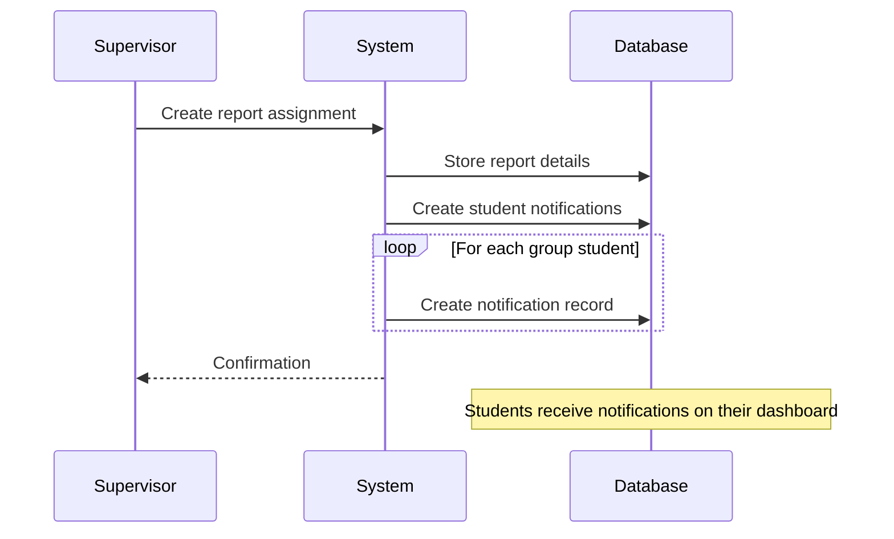
```mermaid
sequenceDiagram
    participant Supervisor
    participant System
    participant Database

    Supervisor->>System: Create report assignment
    System->>Database: Store report details
    System->>Database: Create student notifications
    
    loop For each group student
        System->>Database: Create notification record
    end
    
    System-->>Supervisor: Confirmation
    
    Note over Database: Students receive notifications on their dashboard
```

### 3.2 Document Annotation Process

#### 3.2.1 Annotation Creation with Draft State

Supervisors can create annotations in draft mode before sending to students.

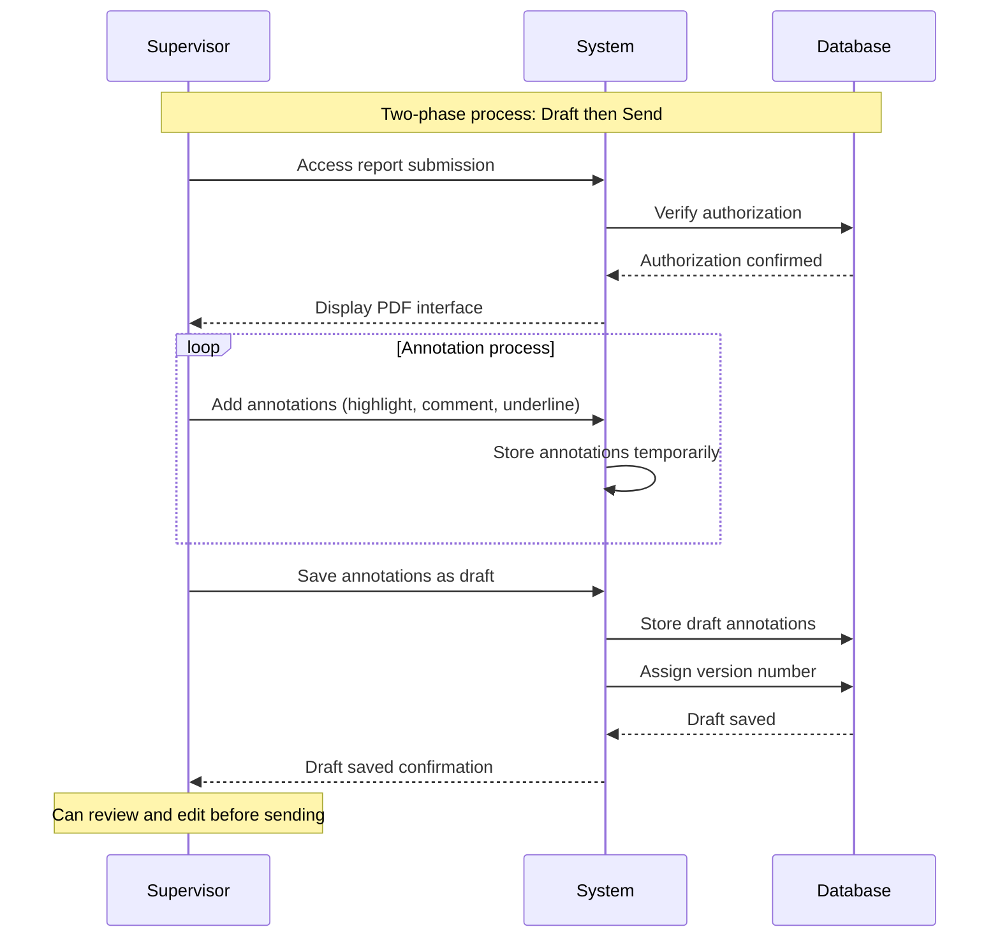
```mermaid
sequenceDiagram
    participant Supervisor
    participant System
    participant Database

    Note over Supervisor,Database: Two-phase process: Draft then Send
    
    Supervisor->>System: Access report submission
    System->>Database: Verify authorization
    Database-->>System: Authorization confirmed
    System-->>Supervisor: Display PDF interface
    
    loop Annotation process
        Supervisor->>System: Add annotations (highlight, comment, underline)
        System->>System: Store annotations temporarily
    end
    
    Supervisor->>System: Save annotations as draft
    System->>Database: Store draft annotations
    System->>Database: Assign version number
    Database-->>System: Draft saved
    System-->>Supervisor: Draft saved confirmation
    
    Note over Supervisor: Can review and edit before sending
```

#### 3.2.2 Feedback Distribution

The system distributes feedback to all group members when supervisor sends annotations.

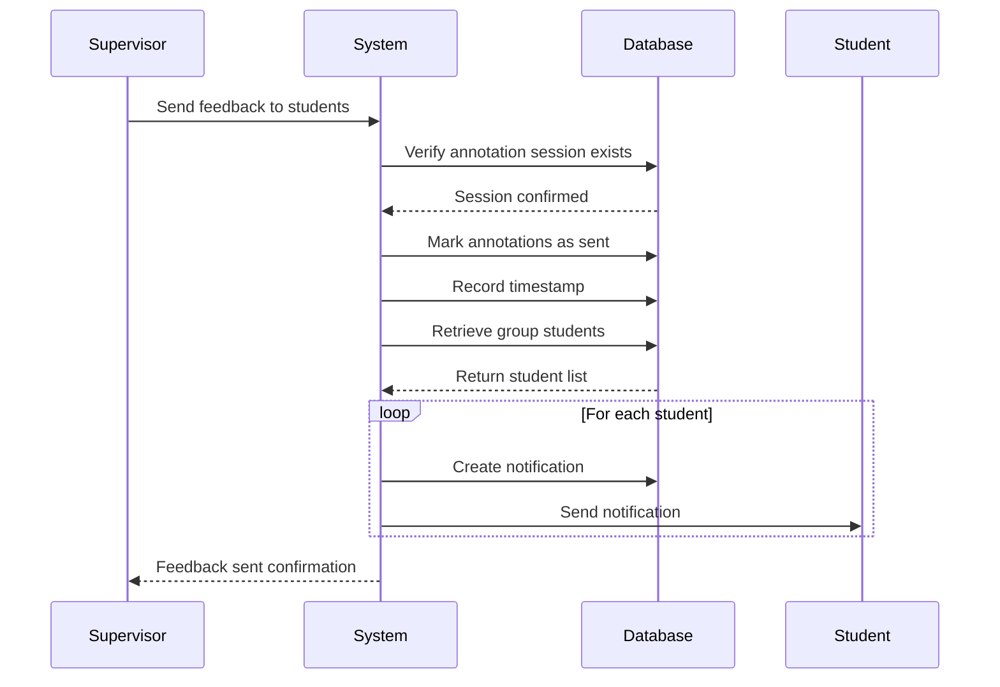
```mermaid
sequenceDiagram
    participant Supervisor
    participant System
    participant Database
    participant Student

    Supervisor->>System: Send feedback to students
    System->>Database: Verify annotation session exists
    Database-->>System: Session confirmed
    
    System->>Database: Mark annotations as sent
    System->>Database: Record timestamp
    
    System->>Database: Retrieve group students
    Database-->>System: Return student list
    
    loop For each student
        System->>Database: Create notification
        System->>Student: Send notification
    end
    
    System-->>Supervisor: Feedback sent confirmation
```

### 3.3 Meeting Documentation

Supervisors can document meetings and generate reports.

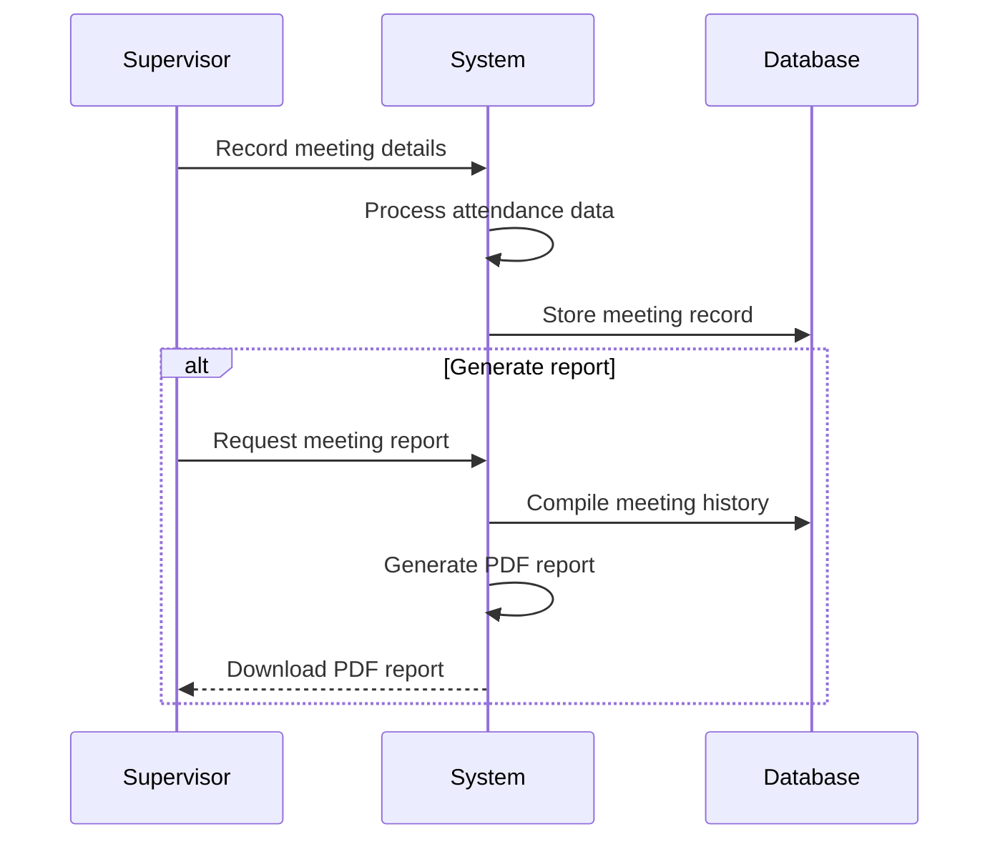
```mermaid
sequenceDiagram
    participant Supervisor
    participant System
    participant Database

    Supervisor->>System: Record meeting details
    System->>System: Process attendance data
    System->>Database: Store meeting record
    
    alt Generate report
        Supervisor->>System: Request meeting report
        System->>Database: Compile meeting history
        System->>System: Generate PDF report
        System-->>Supervisor: Download PDF report
    end
```

---

## 4. Co-Supervisor Operations

### 4.1 Conditional Meeting Management

Main supervisors control whether co-supervisors can manage meetings.

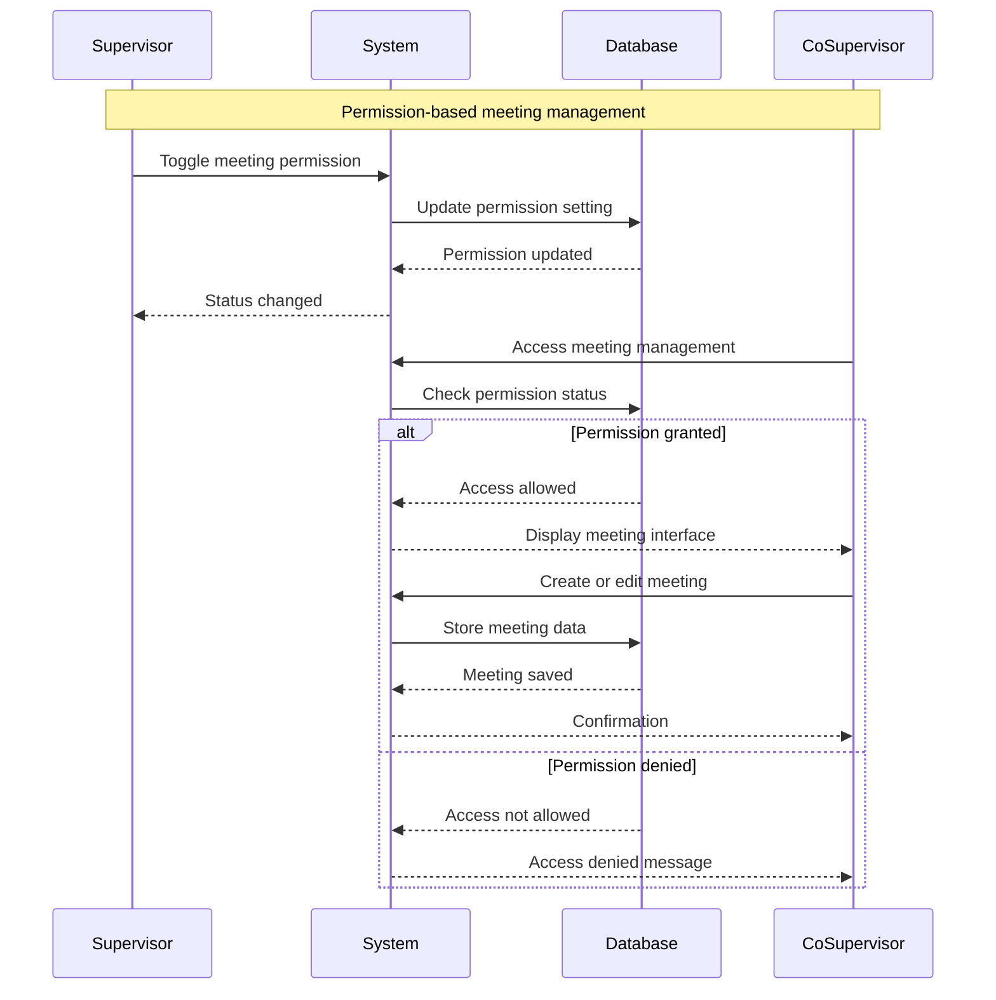
```mermaid
sequenceDiagram
    participant Supervisor
    participant System
    participant Database
    participant CoSupervisor

    Note over Supervisor,CoSupervisor: Permission-based meeting management
    
    Supervisor->>System: Toggle meeting permission
    System->>Database: Update permission setting
    Database-->>System: Permission updated
    System-->>Supervisor: Status changed
    
    CoSupervisor->>System: Access meeting management
    System->>Database: Check permission status
    
    alt Permission granted
        Database-->>System: Access allowed
        System-->>CoSupervisor: Display meeting interface
        
        CoSupervisor->>System: Create or edit meeting
        System->>Database: Store meeting data
        Database-->>System: Meeting saved
        System-->>CoSupervisor: Confirmation
    else Permission denied
        Database-->>System: Access not allowed
        System-->>CoSupervisor: Access denied message
    end
```

### 4.2 Annotation and Feedback Process

Co-supervisors provide feedback through PDF annotations and text comments.

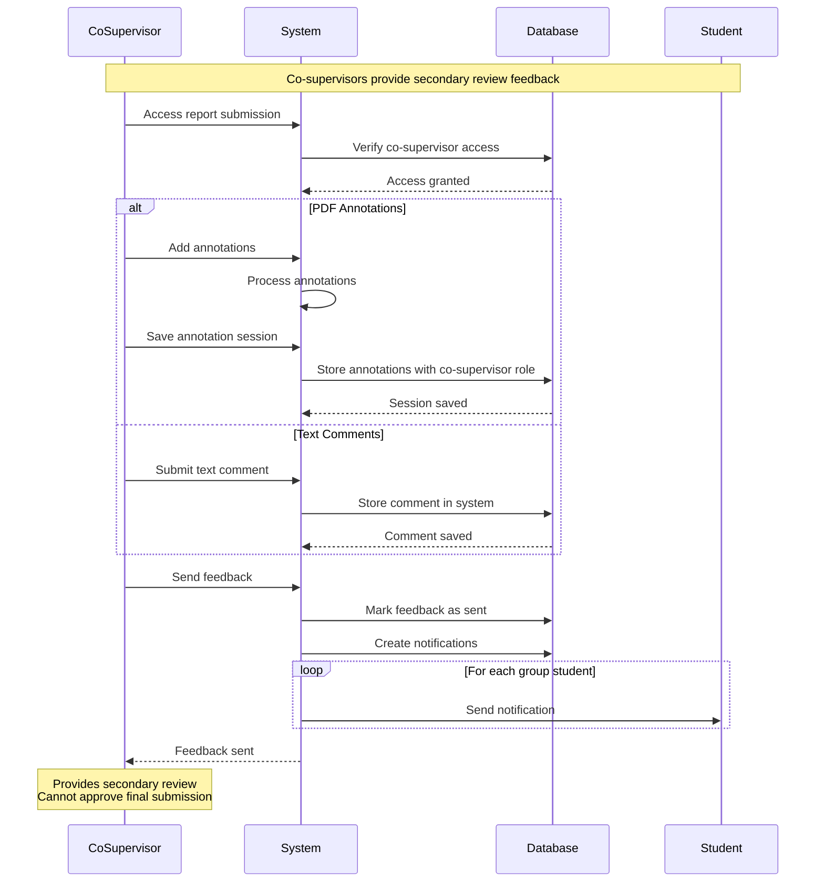
```mermaid
sequenceDiagram
    participant CoSupervisor
    participant System
    participant Database
    participant Student

    Note over CoSupervisor,Student: Co-supervisors provide secondary review feedback
    
    CoSupervisor->>System: Access report submission
    System->>Database: Verify co-supervisor access
    Database-->>System: Access granted
    
    alt PDF Annotations
        CoSupervisor->>System: Add annotations
        System->>System: Process annotations
        CoSupervisor->>System: Save annotation session
        System->>Database: Store annotations with co-supervisor role
        Database-->>System: Session saved
    else Text Comments
        CoSupervisor->>System: Submit text comment
        System->>Database: Store comment in system
        Database-->>System: Comment saved
    end
    
    CoSupervisor->>System: Send feedback
    System->>Database: Mark feedback as sent
    System->>Database: Create notifications
    
    loop For each group student
        System->>Student: Send notification
    end
    
    System-->>CoSupervisor: Feedback sent
    
    Note over CoSupervisor: Provides secondary review<br/>Cannot approve final submission
```

**Figure 4.2:** Co-supervisor feedback workflow demonstrating dual feedback mechanisms (PDF annotations and text comments) with role-based tracking

---

## 5. Panel Member Operations

### 5.1 Panel Member Report Evaluation

Panel members evaluate reports and mark their review status.

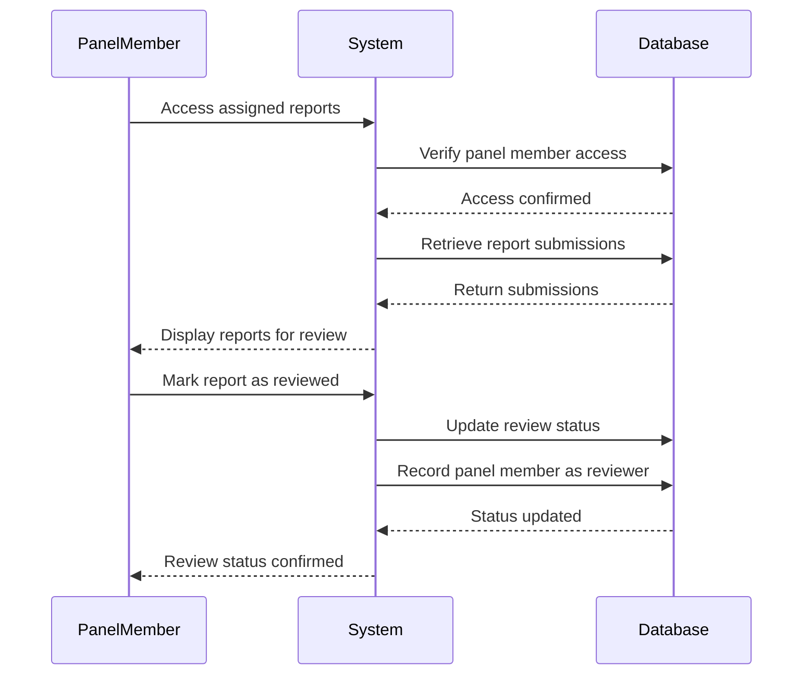
```mermaid
sequenceDiagram
    participant PanelMember
    participant System
    participant Database

    PanelMember->>System: Access assigned reports
    System->>Database: Verify panel member access
    Database-->>System: Access confirmed
    System->>Database: Retrieve report submissions
    Database-->>System: Return submissions
    System-->>PanelMember: Display reports for review
    
    PanelMember->>System: Mark report as reviewed
    System->>Database: Update review status
    System->>Database: Record panel member as reviewer
    Database-->>System: Status updated
    System-->>PanelMember: Review status confirmed
```

### 5.2 Panel Member Feedback

Panel members provide evaluation feedback through annotations and comments.

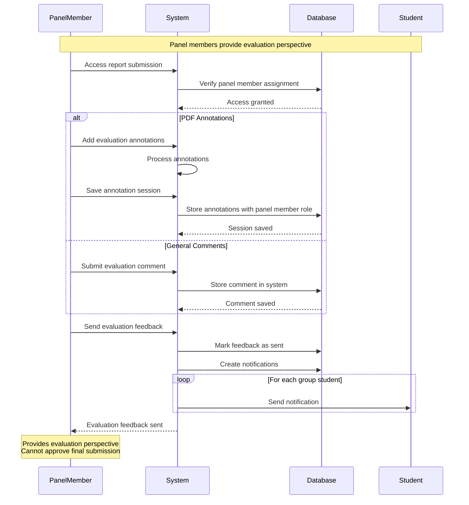
```mermaid
sequenceDiagram
    participant PanelMember
    participant System
    participant Database
    participant Student

    Note over PanelMember,Student: Panel members provide evaluation perspective
    
    PanelMember->>System: Access report submission
    System->>Database: Verify panel member assignment
    Database-->>System: Access granted
    
    alt PDF Annotations
        PanelMember->>System: Add evaluation annotations
        System->>System: Process annotations
        PanelMember->>System: Save annotation session
        System->>Database: Store annotations with panel member role
        Database-->>System: Session saved
    else General Comments
        PanelMember->>System: Submit evaluation comment
        System->>Database: Store comment in system
        Database-->>System: Comment saved
    end
    
    PanelMember->>System: Send evaluation feedback
    System->>Database: Mark feedback as sent
    System->>Database: Create notifications
    
    loop For each group student
        System->>Student: Send notification
    end
    
    System-->>PanelMember: Evaluation feedback sent
    
    Note over PanelMember: Provides evaluation perspective<br/>Cannot approve final submission
```

---

## 6. Advisor Operations

### 6.1 Group Formation

#### 6.1.1 Manual Group Creation

Advisors can manually create groups and assign students.

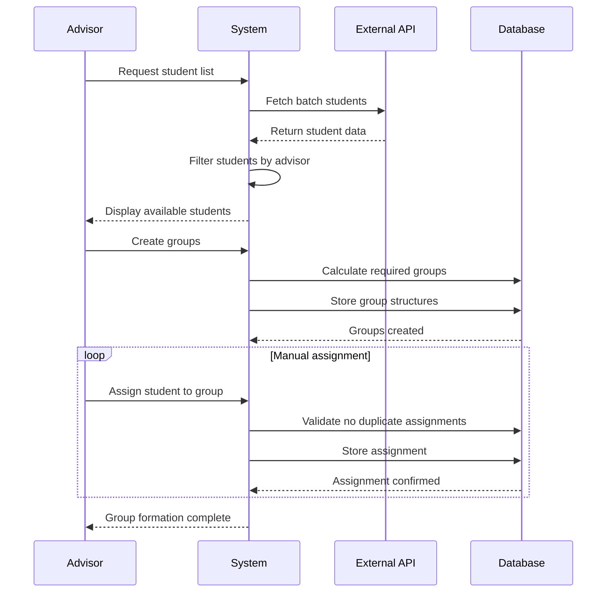
```mermaid
sequenceDiagram
    participant Advisor
    participant System
    participant External API
    participant Database

    Advisor->>System: Request student list
    System->>External API: Fetch batch students
    External API-->>System: Return student data
    System->>System: Filter students by advisor
    System-->>Advisor: Display available students
    
    Advisor->>System: Create groups
    System->>Database: Calculate required groups
    System->>Database: Store group structures
    Database-->>System: Groups created
    
    loop Manual assignment
        Advisor->>System: Assign student to group
        System->>Database: Validate no duplicate assignments
        System->>Database: Store assignment
        Database-->>System: Assignment confirmed
    end
    
    System-->>Advisor: Group formation complete
```

#### 6.1.2 Excel-Based Group Import

Advisors can import group assignments via Excel files.

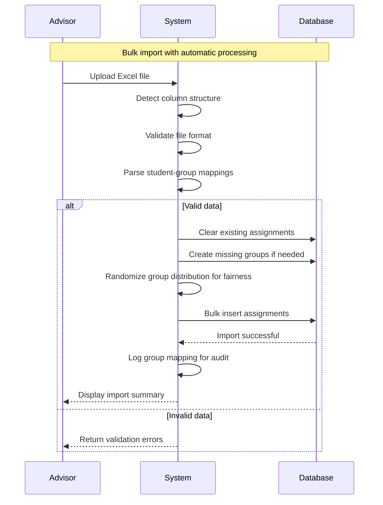
```mermaid
sequenceDiagram
    participant Advisor
    participant System
    participant Database

    Note over Advisor,Database: Bulk import with automatic processing
    
    Advisor->>System: Upload Excel file
    System->>System: Detect column structure
    System->>System: Validate file format
    System->>System: Parse student-group mappings
    
    alt Valid data
        System->>Database: Clear existing assignments
        System->>Database: Create missing groups if needed
        System->>System: Randomize group distribution for fairness
        System->>Database: Bulk insert assignments
        Database-->>System: Import successful
        System->>System: Log group mapping for audit
        System-->>Advisor: Display import summary
    else Invalid data
        System-->>Advisor: Return validation errors
    end
```

#### 6.1.3 Template Export for Group Assignment

The system provides Excel templates for group assignments.

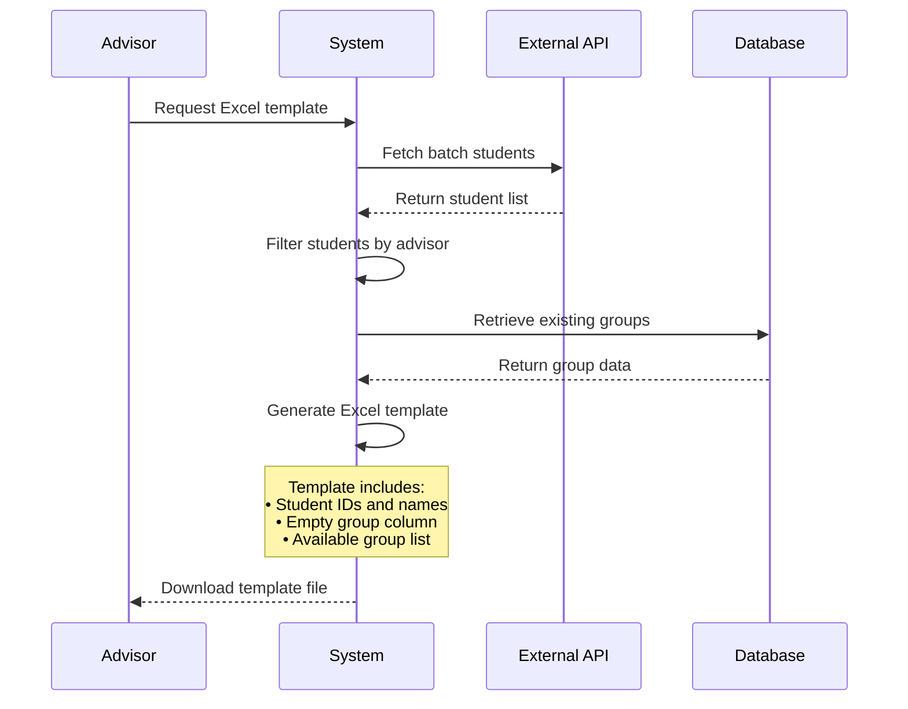
```mermaid
sequenceDiagram
    participant Advisor
    participant System
    participant External API
    participant Database

    Advisor->>System: Request Excel template
    System->>External API: Fetch batch students
    External API-->>System: Return student list
    System->>System: Filter students by advisor
    System->>Database: Retrieve existing groups
    Database-->>System: Return group data
    
    System->>System: Generate Excel template
    Note over System: Template includes:<br/>• Student IDs and names<br/>• Empty group column<br/>• Available group list
    
    System-->>Advisor: Download template file
```

#### 6.1.4 Cross-Batch Student Assignment

Advisors can assign students from different batches to groups.

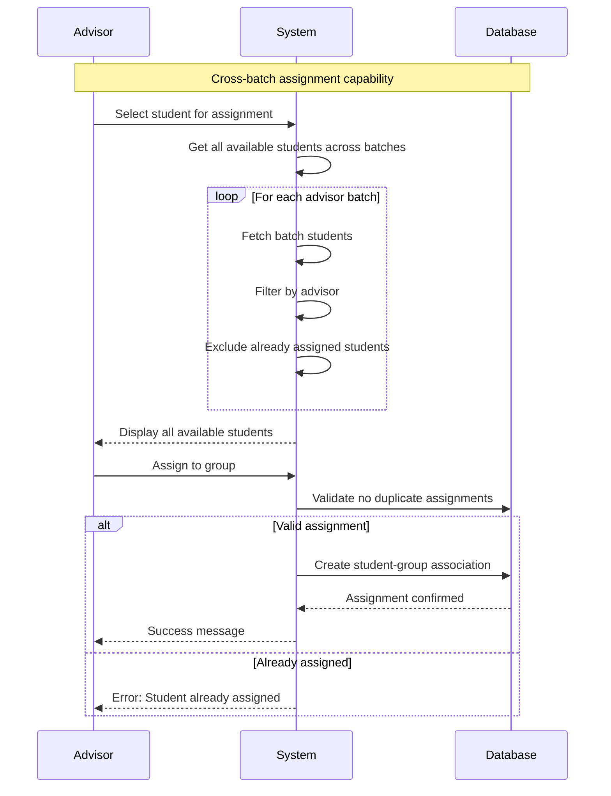
```mermaid
sequenceDiagram
    participant Advisor
    participant System
    participant Database

    Note over Advisor,Database: Cross-batch assignment capability
    
    Advisor->>System: Select student for assignment
    System->>System: Get all available students across batches
    
    loop For each advisor batch
        System->>System: Fetch batch students
        System->>System: Filter by advisor
        System->>System: Exclude already assigned students
    end
    
    System-->>Advisor: Display all available students
    
    Advisor->>System: Assign to group
    System->>Database: Validate no duplicate assignments
    
    alt Valid assignment
        System->>Database: Create student-group association
        Database-->>System: Assignment confirmed
        System-->>Advisor: Success message
    else Already assigned
        System-->>Advisor: Error: Student already assigned
    end
```

#### 6.1.5 Assign Area of Interest to Group

Advisors can assign multiple research areas to groups.

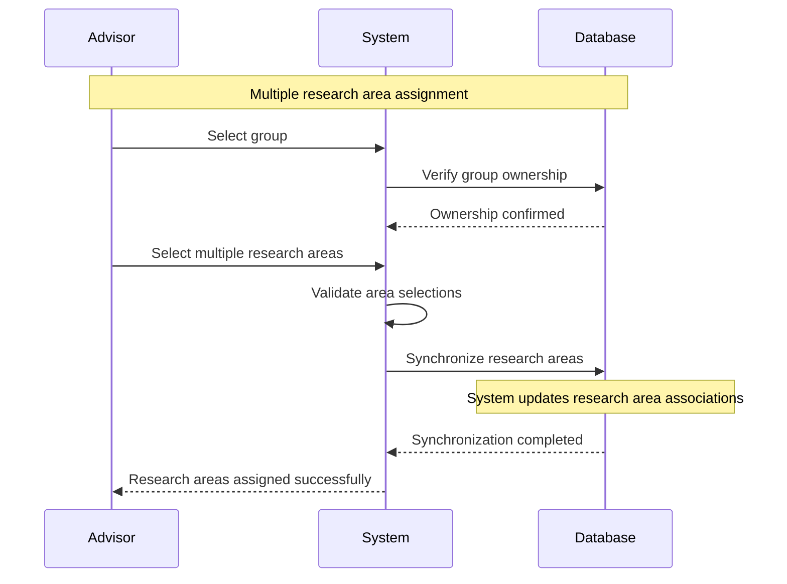
```mermaid
sequenceDiagram
    participant Advisor
    participant System
    participant Database

    Note over Advisor,Database: Multiple research area assignment
    
    Advisor->>System: Select group
    System->>Database: Verify group ownership
    Database-->>System: Ownership confirmed
    
    Advisor->>System: Select multiple research areas
    System->>System: Validate area selections
    System->>Database: Synchronize research areas
    
    Note over Database: System updates research area associations
    
    Database-->>System: Synchronization completed
    System-->>Advisor: Research areas assigned successfully
```

### 6.2 Supervisor Assignment

#### 6.2.1 Manual Supervisor Assignment

Advisors can manually assign supervisors to specific groups.

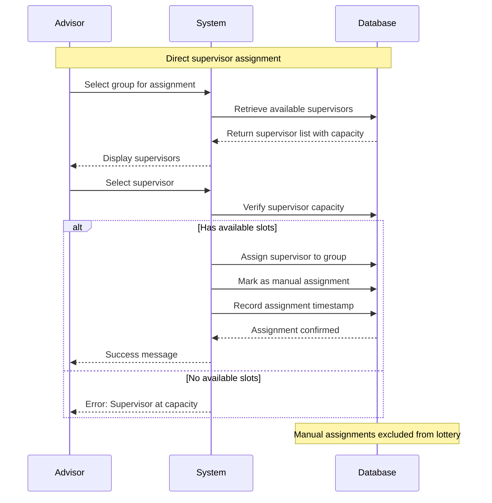
```mermaid
sequenceDiagram
    participant Advisor
    participant System
    participant Database

    Note over Advisor,Database: Direct supervisor assignment
    
    Advisor->>System: Select group for assignment
    System->>Database: Retrieve available supervisors
    Database-->>System: Return supervisor list with capacity
    System-->>Advisor: Display supervisors
    
    Advisor->>System: Select supervisor
    System->>Database: Verify supervisor capacity
    
    alt Has available slots
        System->>Database: Assign supervisor to group
        System->>Database: Mark as manual assignment
        System->>Database: Record assignment timestamp
        Database-->>System: Assignment confirmed
        System-->>Advisor: Success message
    else No available slots
        System-->>Advisor: Error: Supervisor at capacity
    end
    
    Note over Database: Manual assignments excluded from lottery
```

**Figure 6.2.1:** Manual supervisor assignment workflow with capacity verification

#### 6.2.2 Area of Interest Based Assignment

The system assigns supervisors based on matching research expertise, excluding manually assigned groups.

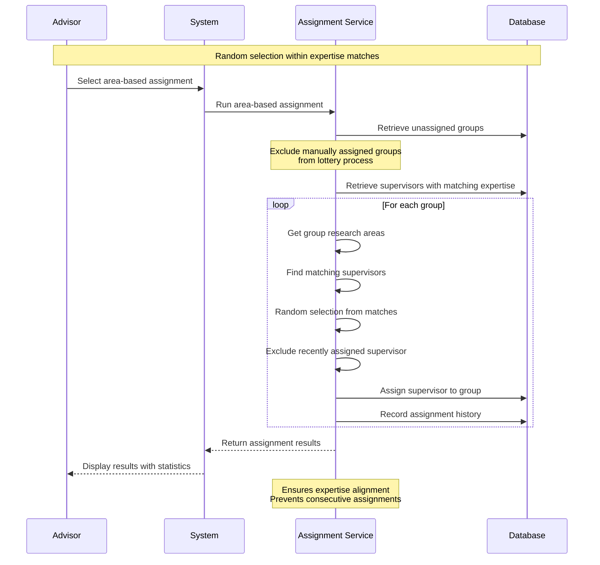
```mermaid
sequenceDiagram
    participant Advisor
    participant System
    participant Assignment Service
    participant Database

    Note over Advisor,Database: Random selection within expertise matches
    
    Advisor->>System: Select area-based assignment
    System->>Assignment Service: Run area-based assignment
    
    Assignment Service->>Database: Retrieve unassigned groups
    Note over Assignment Service: Exclude manually assigned groups<br/>from lottery process
    Assignment Service->>Database: Retrieve supervisors with matching expertise
    
    loop For each group
        Assignment Service->>Assignment Service: Get group research areas
        Assignment Service->>Assignment Service: Find matching supervisors
        Assignment Service->>Assignment Service: Random selection from matches
        Assignment Service->>Assignment Service: Exclude recently assigned supervisor
        Assignment Service->>Database: Assign supervisor to group
        Assignment Service->>Database: Record assignment history
    end
    
    Assignment Service-->>System: Return assignment results
    System-->>Advisor: Display results with statistics
    
    Note over Assignment Service: Ensures expertise alignment<br/>Prevents consecutive assignments
```

#### 6.2.3 Ranking-Based Assignment

The system uses academic ranking for fair distribution, excluding manually assigned groups.

```mermaid
sequenceDiagram
    participant Advisor
    participant System
    participant Assignment Service
    participant Database

    Note over Advisor,Database: Round-robin distribution by rank
    
    Advisor->>System: Select ranking-based assignment
    System->>Assignment Service: Run ranking assignment
    
    Assignment Service->>Database: Get unassigned groups only
    Note over Assignment Service: Filter out groups with existing<br/>manual supervisor assignments
    Assignment Service->>Database: Get supervisors ordered by rank
    Assignment Service->>Assignment Service: Initialize round-robin tracker
    
    loop For each group
        Assignment Service->>Assignment Service: Select next supervisor in rotation
        Assignment Service->>Assignment Service: Check assignment count for current round
        
        alt Can assign
            Assignment Service->>Database: Assign supervisor
            Assignment Service->>Assignment Service: Increment assignment count
        else Move to next round
            Assignment Service->>Assignment Service: Start new round
            Assignment Service->>Assignment Service: Reset to first supervisor
        end
    end
    
    Assignment Service-->>System: Return results
    System-->>Advisor: Display distribution statistics
    
    Note over Assignment Service: Ensures equal distribution before repetition
```

#### 6.2.4 Hybrid Assignment Strategy

The system combines expertise matching with fair distribution, excluding manually assigned groups.

```mermaid
sequenceDiagram
    participant Advisor
    participant System
    participant Assignment Service
    participant Database

    Note over Advisor,Database: Per-area fairness with ranking priority
    
    Advisor->>System: Select hybrid assignment
    System->>Assignment Service: Run combined assignment
    
    Assignment Service->>Database: Get unassigned groups with research areas
    Note over Assignment Service: Filter out groups with existing<br/>manual supervisor assignments
    Assignment Service->>Database: Get supervisors with expertise
    
    loop For each group
        Assignment Service->>Assignment Service: Get area supervisors
        Assignment Service->>Assignment Service: Find minimum assignment count in area
        Assignment Service->>Assignment Service: Filter to supervisors with minimum count
        
        alt Multiple candidates
            Assignment Service->>Assignment Service: Apply ranking priority
        end
        
        Assignment Service->>Database: Assign best candidate
        Assignment Service->>Assignment Service: Update area tracking
    end
    
    Assignment Service-->>System: Return results
    System-->>Advisor: Display balanced distribution
    
    Note over Assignment Service: Ensures fairness within each research area
```

#### 6.2.5 Assignment Algorithm Comparison

```mermaid
graph TD
    Start[Assignment Strategy Selection]
    
    Start --> AOI[Area-Based Strategy]
    Start --> Rank[Ranking-Based Strategy]
    Start --> Hybrid[Hybrid Strategy]
    
    AOI --> AOIFeatures[Features:<br/>✓ Expertise match<br/>✓ Random selection<br/>✓ Rotation tracking<br/>✗ May be uneven]
    
    Rank --> RankFeatures[Features:<br/>✓ Equal distribution<br/>✓ Round-robin fairness<br/>✗ Ignores expertise<br/>✗ No randomization]
    
    Hybrid --> HybridFeatures[Features:<br/>✓ Expertise match<br/>✓ Per-area fairness<br/>✓ Ranking priority<br/>✓ Optimal balance]
    
    style Start fill:#f9f,stroke:#333,stroke-width:2px
    style AOIFeatures fill:#e8f5e9,stroke:#4caf50,stroke-width:1px
    style RankFeatures fill:#e3f2fd,stroke:#2196f3,stroke-width:1px
    style HybridFeatures fill:#fff3e0,stroke:#ff9800,stroke-width:1px
```

---

## 7. Administrative Functions

### 7.1 Co-Supervisor Assignment

Administrators assign co-supervisors to groups.

```mermaid
sequenceDiagram
    participant Administrator
    participant System
    participant Database

    Note over Administrator,Database: Administrative co-supervisor assignment
    
    Administrator->>System: Access group management
    System->>Database: Retrieve groups list
    Database-->>System: Return groups
    System-->>Administrator: Display groups
    
    Administrator->>System: Select group for co-supervisor
    System->>Database: Retrieve available supervisors
    Database-->>System: Return supervisor list
    System->>System: Filter out main supervisor
    System-->>Administrator: Display eligible co-supervisors
    
    Administrator->>System: Assign co-supervisor
    System->>Database: Validate assignment
    
    alt Valid assignment
        System->>Database: Update group with co-supervisor
        System->>Database: Set initial permissions
        Database-->>System: Assignment confirmed
        System->>Database: Create notification for co-supervisor
        System-->>Administrator: Success message
    else Invalid assignment
        System-->>Administrator: Error: Invalid assignment
    end
    
    Note over Database: Initial permissions set conservatively
```

### 7.2 Panel Member Assignment

Administrators can assign multiple panel members to groups.

```mermaid
sequenceDiagram
    participant Administrator
    participant System
    participant Database

    Note over Administrator,Database: Multiple panel members per group
    
    Administrator->>System: Access group management
    System->>Database: Retrieve groups list
    Database-->>System: Return groups
    System-->>Administrator: Display groups
    
    Administrator->>System: Select group for panel member
    System->>Database: Retrieve available supervisors
    Database-->>System: Return supervisor list
    System->>Database: Get existing panel members
    Database-->>System: Return current panel
    System-->>Administrator: Display eligible panel members
    
    Administrator->>System: Assign panel member
    System->>Database: Validate not already assigned
    
    alt Valid assignment
        System->>Database: Create panel assignment
        System->>Database: Record assignment metadata
        Database-->>System: Assignment confirmed
        System->>Database: Create notification for panel member
        System-->>Administrator: Panel member assigned
    else Already assigned
        System-->>Administrator: Error: Already a panel member
    end
    
    Note over Database: No capacity limits for panel members
```

### 7.3 Area of Interest Management

Administrators manage research areas in the system.

```mermaid
sequenceDiagram
    participant Administrator
    participant System
    participant Database

    Note over Administrator,Database: Research area management
    
    Administrator->>System: Manage research areas
    System->>Database: Retrieve existing areas
    Database-->>System: Return area list
    System-->>Administrator: Display areas
    
    alt Create New Area
        Administrator->>System: Submit new research area
        System->>Database: Validate and create area
        Database-->>System: Area created
        System-->>Administrator: Success confirmation
    else Update Area
        Administrator->>System: Edit area details
        System->>Database: Update area record
        Database-->>System: Area updated
        System-->>Administrator: Update confirmation
    else Delete Area
        Administrator->>System: Delete area
        System->>Database: Remove area record
        Database-->>System: Area deleted
        System-->>Administrator: Deletion confirmation
    end
```

### 7.4 Administrator Group Management

Administrators have comprehensive group management capabilities including creating groups, assigning students from any active batch, and configuring supervisors and research areas. Unlike advisors who are restricted to their own batches, administrators can access and assign students from any active batch in the system.

#### 7.4.1 Group Creation with Pre-Configuration

Administrators can create groups with optional supervisor and research area assignments.

```mermaid
sequenceDiagram
    participant Administrator
    participant System
    participant Database

    Note over Administrator,Database: Administrative group creation
    
    Administrator->>System: Submit group creation form
    System->>Database: Validate group name uniqueness
    
    alt Group name exists
        Database-->>System: Duplicate found
        System-->>Administrator: Error: Group already exists
    else Valid group name
        Database-->>System: Name available
        
        alt Supervisor provided
            System->>Database: Verify supervisor capacity
            
            alt Capacity available
                System->>Database: Create group with supervisor
            else Capacity exceeded
                System-->>Administrator: Error: Supervisor at capacity
            end
        else No supervisor
            System->>Database: Create group without supervisor
        end
        
        System->>Database: Associate research areas if provided
        Database-->>System: Group created
        System-->>Administrator: Success confirmation
    end
    
    Note over Database: Admin groups support up to 4 students<br/>Advisor auto-detected on first student assignment
```

**Figure 7.4.1:** Administrator group creation workflow with optional pre-configuration

#### 7.4.2 Cross-Batch Student Pool Management

Administrators can access and assign students from any active batch, providing flexibility beyond advisor restrictions.

```mermaid
sequenceDiagram
    participant Administrator
    participant System
    participant External API
    participant Database

    Note over Administrator,Database: Cross-batch student eligibility system
    
    Administrator->>System: Select batch for group management
    System->>Database: Retrieve selected batch number
    Database-->>System: Return batch information
    
    System->>Database: Query all assigned students
    Database-->>System: Return assigned student IDs
    
    System->>Database: Get active batches less than selected batch
    Database-->>System: Return prior batch list
    
    loop For each prior batch
        System->>External API: Request students for batch
        External API-->>System: Return student data array
        
        System->>System: Filter out assigned students
        System->>System: Extract student details
        Note over System: Student data includes:<br/>• Roll number<br/>• Name<br/>• Batch<br/>• Advisor ID<br/>• Advisor name
        
        System->>System: Add to eligible student pool
    end
    
    System->>System: Sort students by batch and name
    System-->>Administrator: Display eligible student pool
    
    Note over Administrator: Administrator privileges:<br/>• Access ANY active batch < selected<br/>• Assign students with different advisors<br/>• No advisor-specific restrictions<br/>• Cross-batch flexibility
```

**Figure 7.4.2:** Cross-batch student pool management demonstrating administrator's unrestricted access to students from multiple batches

#### 7.4.3 Student Assignment with Advisor Auto-Detection

The system automatically detects and assigns advisors when the first student is added to an admin-created group.

```mermaid
sequenceDiagram
    participant Administrator
    participant System
    participant External API
    participant Database

    Note over Administrator,Database: Advisor auto-detection on first student assignment
    
    Administrator->>System: Assign student to group
    System->>Database: Verify student availability
    
    alt Student already assigned
        Database-->>System: Student in another group
        System-->>Administrator: Error: Student already assigned
    else Student available
        System->>Database: Check group capacity
        
        alt Group full
            System-->>Administrator: Error: Group at capacity
        else Has space
            System->>External API: Fetch student details with advisor
            External API-->>System: Return student profile
            
            alt Group has no advisor
                System->>Database: Search for advisor locally
                
                alt Advisor not found
                    System->>External API: Fetch advisor from teacher API
                    
                    alt Advisor found
                        System->>Database: Create advisor user
                        System->>Database: Assign advisor to group
                    else Advisor not found
                        System-->>Administrator: Error: Advisor auto-detection failed
                    end
                else Advisor exists
                    System->>Database: Assign advisor to group
                end
            else Group has advisor
                System->>Database: Validate same advisor
                
                alt Advisor mismatch
                    System-->>Administrator: Error: Cannot mix advisors
                else Advisor matches
                    System->>Database: Proceed with assignment
                end
            end
            
            System->>Database: Create student assignment
            System-->>Administrator: Success confirmation
        end
    end
    
    Note over System: Enforces single advisor per group<br/>Auto-creates advisor if needed
```

**Figure 7.4.3:** Student assignment workflow with automatic advisor detection from external API

### 7.5 Supervisor Management

Administrators manage supervisor profiles and capacities.

```mermaid
sequenceDiagram
    participant Administrator
    participant System
    participant Database

    Administrator->>System: Access supervisor management
    System->>Database: Retrieve supervisors with statistics
    Database-->>System: Return supervisor data with metrics
    System-->>Administrator: Display supervisor table
    
    alt Toggle Research Area
        Administrator->>System: Toggle supervisor research area
        System->>Database: Check current assignment
        
        alt Currently assigned
            System->>Database: Remove area association
            Database-->>System: Removed
        else Not assigned
            System->>Database: Add area association
            Database-->>System: Added
        end
        
        System-->>Administrator: Area toggled
    else Set Thesis Limit
        Administrator->>System: Update thesis capacity
        System->>Database: Update supervisor record
        Database-->>System: Limit updated
        System-->>Administrator: Capacity updated
    end
```

---

## 8. Multi-Role Collaboration

### 8.1 Teacher Role Switching

Teachers can switch between different supervision roles.

```mermaid
sequenceDiagram
    participant Teacher
    participant System
    participant Database

    Teacher->>System: Access teacher dashboard
    System->>Database: Check all assigned roles
    Database-->>System: Return role assignments
    
    Note over System: Teacher may have multiple roles:<br/>• Supervisor for some groups<br/>• Co-Supervisor for others<br/>• Panel Member for evaluation
    
    System-->>Teacher: Display role selection panel
    
    alt Select Supervisor Role
        Teacher->>System: Access supervisor panel
        System->>Database: Get supervised groups
        System-->>Teacher: Supervisor dashboard
    else Select Co-Supervisor Role
        Teacher->>System: Access co-supervisor panel
        System->>Database: Get co-supervised groups
        System-->>Teacher: Co-supervisor dashboard
    else Select Panel Member Role
        Teacher->>System: Access panel member panel
        System->>Database: Get panel assignments
        System-->>Teacher: Panel member dashboard
    end
```

### 8.2 Collaborative Report Review

Multiple reviewers can annotate the same report simultaneously.

```mermaid
sequenceDiagram
    participant Student
    participant Supervisor
    participant CoSupervisor
    participant PanelMember
    participant System
    participant Database

    Note over Student,Database: Collaborative review process
    
    Student->>System: Submit report
    System->>Database: Store submission
    System->>Supervisor: Notify main supervisor
    System->>CoSupervisor: Notify co-supervisor
    System->>PanelMember: Notify panel members
    
    par Parallel Review Process
        Supervisor->>System: Create annotation session
        System->>Database: Store supervisor annotations
    and
        CoSupervisor->>System: Create annotation session
        System->>Database: Store co-supervisor annotations
    and
        PanelMember->>System: Create annotation session
        System->>Database: Store panel member annotations
    end
    
    System->>Database: Compile all annotations
    Database-->>System: Return merged feedback
    System->>Student: Notify of available feedback
    
    Student->>System: View all annotations
    System->>Database: Retrieve all sessions
    Database-->>System: Return categorized feedback
    System-->>Student: Display feedback with role indicators
```

### 8.3 Hierarchical Approval Process

Only main supervisors have final approval authority.

```mermaid
sequenceDiagram
    participant Student
    participant PanelMember
    participant CoSupervisor
    participant Supervisor
    participant System
    participant Database

    Note over Student,Database: Hierarchical approval workflow
    
    Student->>System: Submit final report
    System->>Database: Store submission
    
    PanelMember->>System: Review and annotate
    System->>Database: Store evaluation feedback
    System->>Student: Notify of panel review
    
    CoSupervisor->>System: Review and recommend
    System->>Database: Store recommendation
    System->>Student: Notify of co-supervisor review
    
    Note over CoSupervisor: Can recommend but not approve
    
    Supervisor->>System: Review all feedback
    System->>Database: Retrieve all reviews
    Database-->>System: Return compiled feedback
    System-->>Supervisor: Display comprehensive review
    
    alt Approve
        Supervisor->>System: Approve final project
        System->>Database: Update status to approved
        System->>Student: Send approval notification
        System->>Database: Publish to repository
    else Request Revision
        Supervisor->>System: Request changes
        System->>Database: Update status to needs revision
        System->>Student: Send revision request
    end
```

### 8.4 Multi-Reviewer Annotation History

Students can view complete feedback history from all reviewers.

```mermaid
sequenceDiagram
    participant Student
    participant System
    participant Database

    Note over Student,Database: Complete feedback history view
    
    Student->>System: Request annotation history
    System->>Database: Retrieve all annotation sessions
    Database-->>System: Return sessions with metadata
    
    System->>System: Group feedback by reviewer role
    System->>System: Sort by timestamp
    System->>System: Apply role-based categorization
    
    Note over System: Visual distinction by role:<br/>• Supervisor feedback<br/>• Co-Supervisor feedback<br/>• Panel Member feedback
    
    System-->>Student: Display categorized history
    
    Student->>System: Select specific session
    System->>Database: Retrieve session details
    Database-->>System: Return annotations
    System-->>Student: Display annotated document
    
    Note over Student: Can compare feedback from different reviewers
```

---

## 9. System Architecture

### 9.1 Service Layer Architecture

The system implements a clean service layer architecture for business logic separation.

```mermaid
sequenceDiagram
    participant Client
    participant Controller
    participant Service
    participant Model
    participant Database

    Note over Client,Database: Model-View-Controller with Service Layer
    
    Client->>Controller: HTTP Request
    Controller->>Controller: Validate request
    Controller->>Service: Delegate business logic
    
    Service->>Model: Interact with data layer
    Model->>Database: Execute query
    Database-->>Model: Return results
    Model-->>Service: Return domain objects
    
    Service->>Service: Apply business rules
    Service-->>Controller: Return processed data
    
    Controller->>Controller: Format response
    Controller-->>Client: HTTP Response
    
    Note over Service: Core Services:<br/>• Supervisor Assignment Service<br/>• Student Data Service<br/>• Performance Monitoring Service
```

### 9.2 External API Integration

The system integrates with university information systems for data synchronization.

```mermaid
sequenceDiagram
    participant System
    participant Student Service
    participant Supervisor Service
    participant University API

    Note over System,University API: Integration with university systems
    
    alt Student Data Synchronization
        System->>Student Service: Request batch students
        Student Service->>University API: Request student data for batch
        University API-->>Student Service: Return student array
        Student Service->>Student Service: Filter by advisor
        Student Service-->>System: Return filtered students
    else Supervisor Data Synchronization
        System->>Supervisor Service: Request supervisor list
        Supervisor Service->>University API: Request teacher data
        University API-->>Supervisor Service: Return teacher array
        Supervisor Service->>Supervisor Service: Map to supervisor model
        Supervisor Service-->>System: Return supervisors
    else Batch Information
        System->>Student Service: Get advisor batches
        Student Service->>University API: Request batch information
        University API-->>Student Service: Return batch list
        Student Service-->>System: Return active batches
    end
    
    Note over University API: External university information system
```

### 9.3 Notification System Architecture

The system implements a comprehensive notification system for all user roles.

```mermaid
sequenceDiagram
    participant Event
    participant Notification System
    participant Queue
    participant Database
    participant User

    Note over Event,User: Event-driven notification system
    
    Event->>Notification System: Trigger notification
    Notification System->>Notification System: Prepare notification data
    
    alt Queued notification
        Notification System->>Queue: Dispatch to queue
        Queue->>Queue: Process in background
        Queue->>Database: Store notification
    else Immediate notification
        Notification System->>Database: Store directly
    end
    
    Database->>Database: Record notification details
    
    User->>System: Check notifications
    System->>Database: Query unread notifications
    Database-->>System: Return notifications
    System-->>User: Display in dashboard
    
    Note over Notification System: Notification types:<br/>• New report assigned<br/>• New annotations available<br/>• New comments added<br/>• Report status updated
```

---

## System Components Description

### Core Components
- **Client**: End-user interface (web browser)
- **System**: Application server handling business logic
- **Controller**: Request handling and response formatting
- **Service**: Business logic layer for complex operations
- **Model**: Data access layer for database interactions
- **Database**: Persistent data storage system
- **External API**: University information systems for data synchronization
- **Queue**: Background job processing for asynchronous tasks
- **Storage**: File storage for documents and submissions

### User Roles
- **Student**: Thesis/project students submitting reports and receiving feedback
- **Supervisor**: Faculty members with primary supervision responsibilities and final approval authority
- **Co-Supervisor**: Secondary supervisors assisting main supervisors with conditional permissions
- **Panel Member**: Faculty members providing evaluation and feedback without management capabilities
- **Advisor**: Faculty coordinating student groups and supervisor assignments
- **Administrator**: System administrators managing users, research areas, and system configuration
- **Teacher**: Faculty members who can have multiple roles (supervisor, co-supervisor, panel member)

### Key System Features
1. **Multi-Role Authentication**: Support for multiple user types with role-based access control
2. **Group Management**: Formation and assignment of student groups with validation
3. **Dual Feedback System**: PDF annotations and text comments for comprehensive feedback
4. **Report Workflow**: Draft and send pattern for quality control
5. **Meeting Documentation**: Recording and tracking of supervision meetings
6. **Intelligent Assignment**: Multiple algorithms for fair supervisor distribution
7. **Data Synchronization**: Integration with external university systems
8. **Real-time Notifications**: Event-driven notification system
9. **Collaborative Review**: Multiple reviewers can provide feedback on the same report
10. **Hierarchical Approval**: Structured approval process with role-based permissions
11. **Permission Management**: Granular control over user capabilities
12. **Role Switching**: Seamless transition between different user roles
13. **Annotation History**: Complete tracking of all feedback with timestamps
14. **Cross-Batch Management**: Support for students from different academic batches
15. **Audit Trail**: Comprehensive logging for accountability and tracking

---

## Notes

These sequence diagrams illustrate the primary interactions within the Thesis Repository Management System, demonstrating the flow of information between system components and user roles. The diagrams follow UML 2.0 notation standards and IEEE documentation guidelines, focusing on system behavior and user interactions rather than implementation details.

The diagrams are designed to be understood by both technical and non-technical stakeholders, including academic reviewers, system administrators, and end users. They provide a comprehensive view of the system's functionality while maintaining clarity and avoiding unnecessary technical complexity.

### Document Version
- **Version 1.0**: Academic version for IEEE documentation
- **Created**: January 2025
- **Purpose**: Academic documentation and system review
- **Audience**: Academic reviewers, stakeholders, and system evaluators