# Sequence Diagrams - Thesis Repository Management System

## Table of Contents
1. [System Authentication](#1-system-authentication)
2. [Student Operations](#2-student-operations)
3. [Supervisor Operations](#3-supervisor-operations)
4. [Co-Supervisor Operations](#4-co-supervisor-operations)
5. [Panel Member Operations](#5-panel-member-operations)
6. [Advisor Operations](#6-advisor-operations)
7. [Administrative Functions](#7-administrative-functions)
8. [Multi-Role Collaboration](#8-multi-role-collaboration)
9. [System Architecture](#9-system-architecture)

---

## 1. System Authentication

### 1.1 User Authentication Process
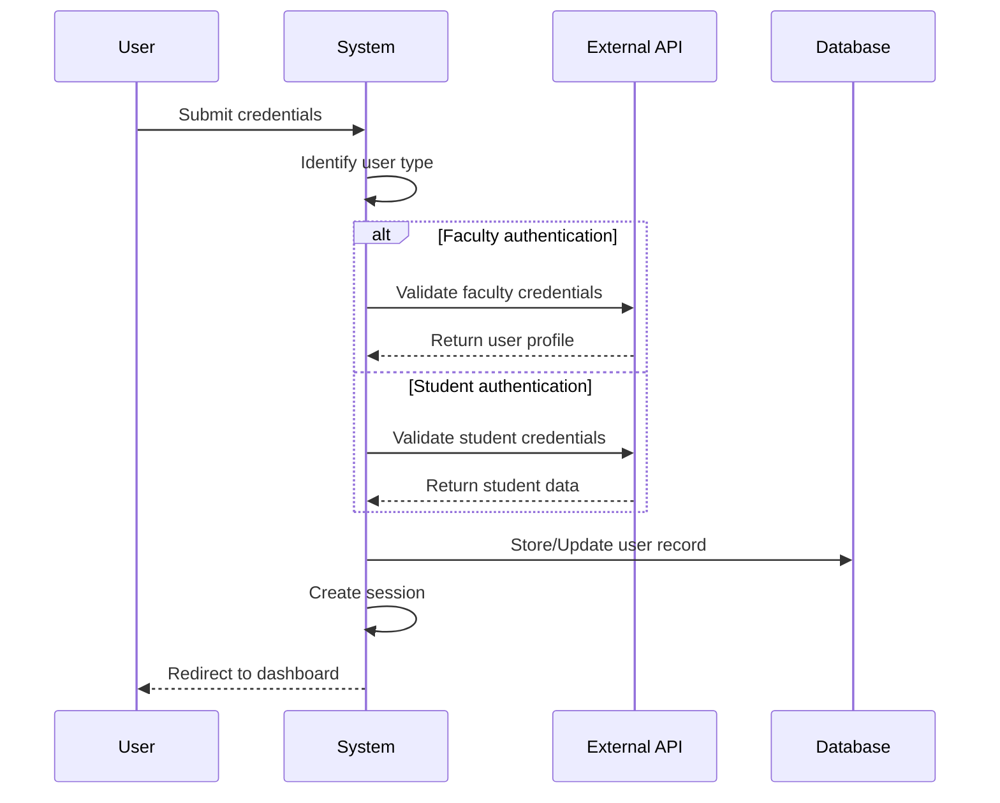
```mermaid
sequenceDiagram
    participant User
    participant System
    participant External API
    participant Database

    User->>System: Submit credentials
    System->>System: Identify user type
    
    alt Faculty authentication
        System->>External API: Validate faculty credentials
        External API-->>System: Return user profile
    else Student authentication
        System->>External API: Validate student credentials
        External API-->>System: Return student data
    end
    
    System->>Database: Store/Update user record
    System->>System: Create session
    System-->>User: Redirect to dashboard
```

### 1.2 Role-Based Access Control
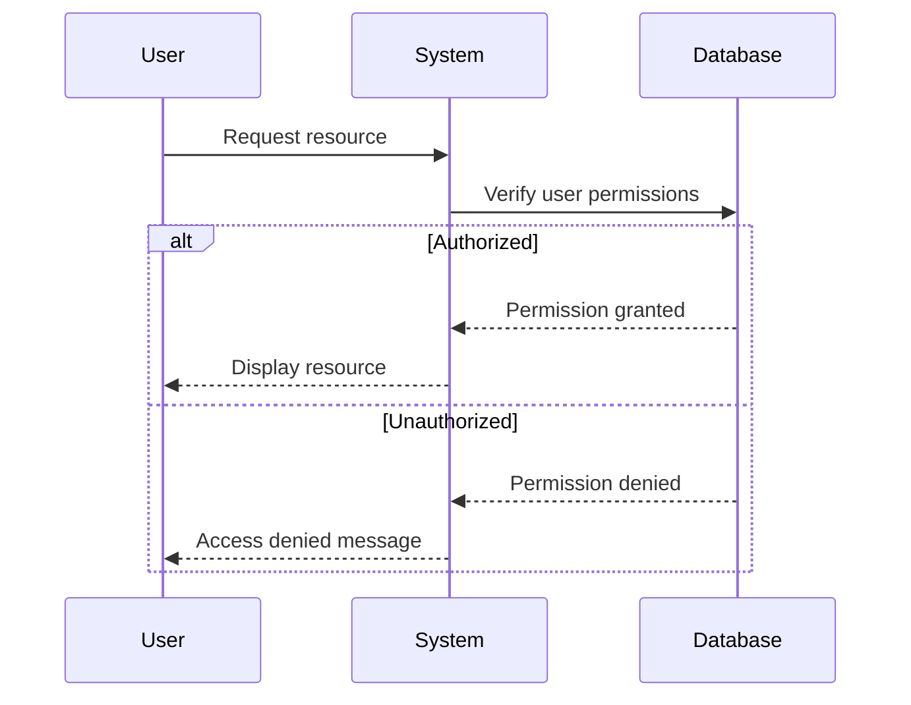
```mermaid
sequenceDiagram
    participant User
    participant System
    participant Database

    User->>System: Request resource
    System->>Database: Verify user permissions
    
    alt Authorized
        Database-->>System: Permission granted
        System-->>User: Display resource
    else Unauthorized
        Database-->>System: Permission denied
        System-->>User: Access denied message
    end
```

---

## 2. Student Operations

### 2.1 Report Submission Process
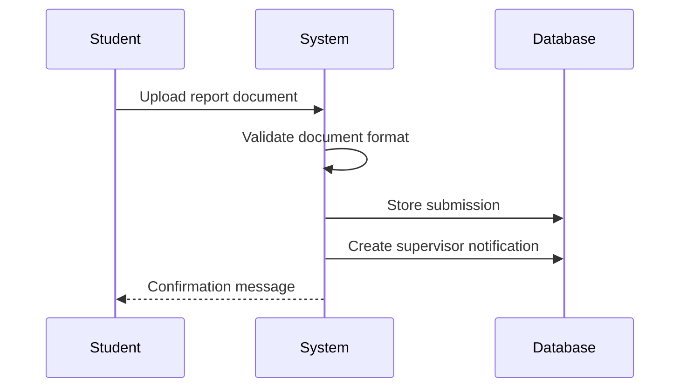
```mermaid
sequenceDiagram
    participant Student
    participant System
    participant Database

    Student->>System: Upload report document
    System->>System: Validate document format
    System->>Database: Store submission
    System->>Database: Create supervisor notification
    System-->>Student: Confirmation message
```

### 2.2 View Feedback and Annotations
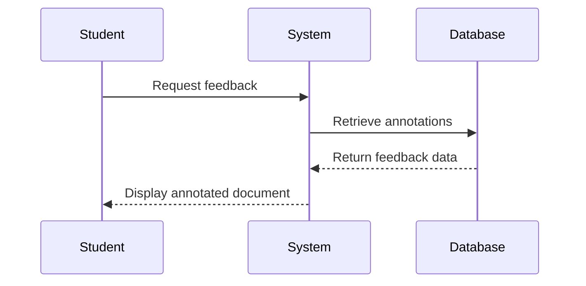
```mermaid
sequenceDiagram
    participant Student
    participant System
    participant Database

    Student->>System: Request feedback
    System->>Database: Retrieve annotations
    Database-->>System: Return feedback data
    System-->>Student: Display annotated document
```

### 2.3 Dashboard Notification System
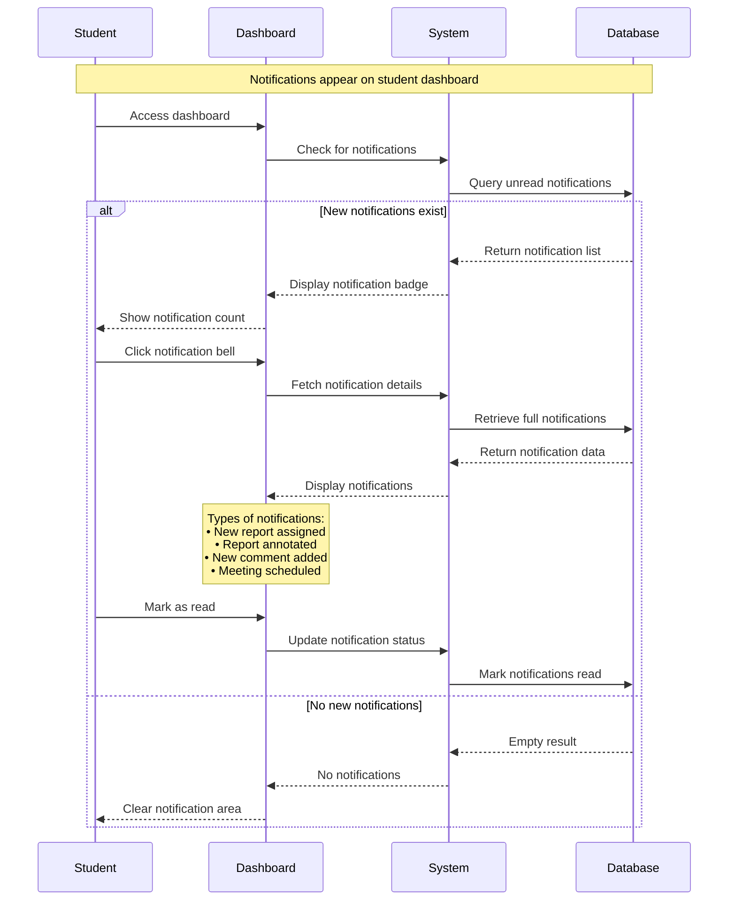
```mermaid
sequenceDiagram
    participant Student
    participant Dashboard
    participant System
    participant Database

    Note over Student,Database: Notifications appear on student dashboard
    
    Student->>Dashboard: Access dashboard
    Dashboard->>System: Check for notifications
    System->>Database: Query unread notifications
    
    alt New notifications exist
        Database-->>System: Return notification list
        System-->>Dashboard: Display notification badge
        Dashboard-->>Student: Show notification count
        
        Student->>Dashboard: Click notification bell
        Dashboard->>System: Fetch notification details
        System->>Database: Retrieve full notifications
        Database-->>System: Return notification data
        System-->>Dashboard: Display notifications
        
        Note over Dashboard: Types of notifications:<br/>• New report assigned<br/>• Report annotated<br/>• New comment added<br/>• Meeting scheduled
        
        Student->>Dashboard: Mark as read
        Dashboard->>System: Update notification status
        System->>Database: Mark notifications read
    else No new notifications
        Database-->>System: Empty result
        System-->>Dashboard: No notifications
        Dashboard-->>Student: Clear notification area
    end
```

---

## 3. Supervisor Operations

### 3.1 Report Management
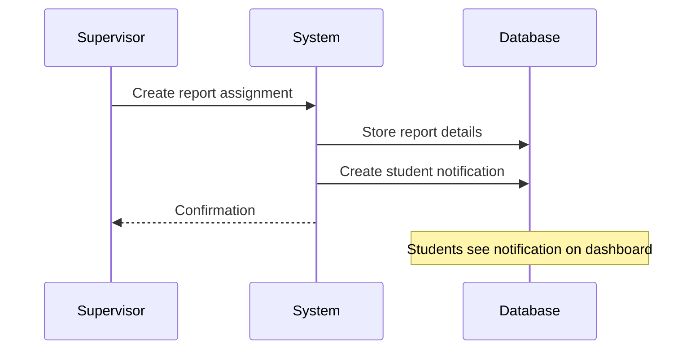
```mermaid
sequenceDiagram
    participant Supervisor
    participant System
    participant Database

    Supervisor->>System: Create report assignment
    System->>Database: Store report details
    System->>Database: Create student notification
    System-->>Supervisor: Confirmation
    
    Note over Database: Students see notification on dashboard
```

### 3.2 Document Annotation Process

#### 3.2.1 Annotation Creation and Storage
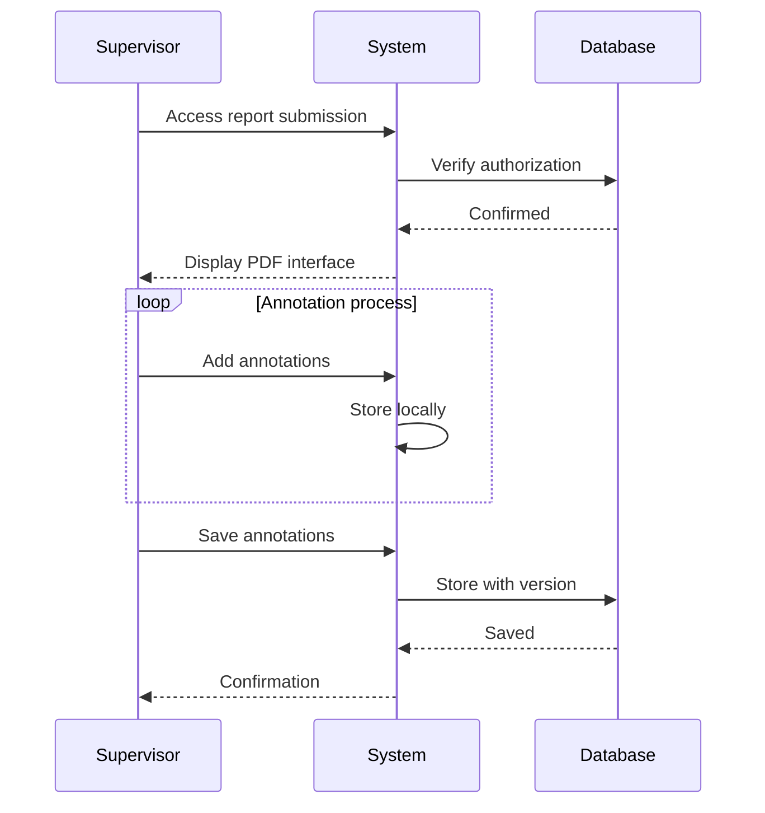
```mermaid
sequenceDiagram
    participant Supervisor
    participant System
    participant Database

    Supervisor->>System: Access report submission
    System->>Database: Verify authorization
    Database-->>System: Confirmed
    System-->>Supervisor: Display PDF interface
    
    loop Annotation process
        Supervisor->>System: Add annotations
        System->>System: Store locally
    end
    
    Supervisor->>System: Save annotations
    System->>Database: Store with version
    Database-->>System: Saved
    System-->>Supervisor: Confirmation
```

#### 3.2.2 Feedback Distribution
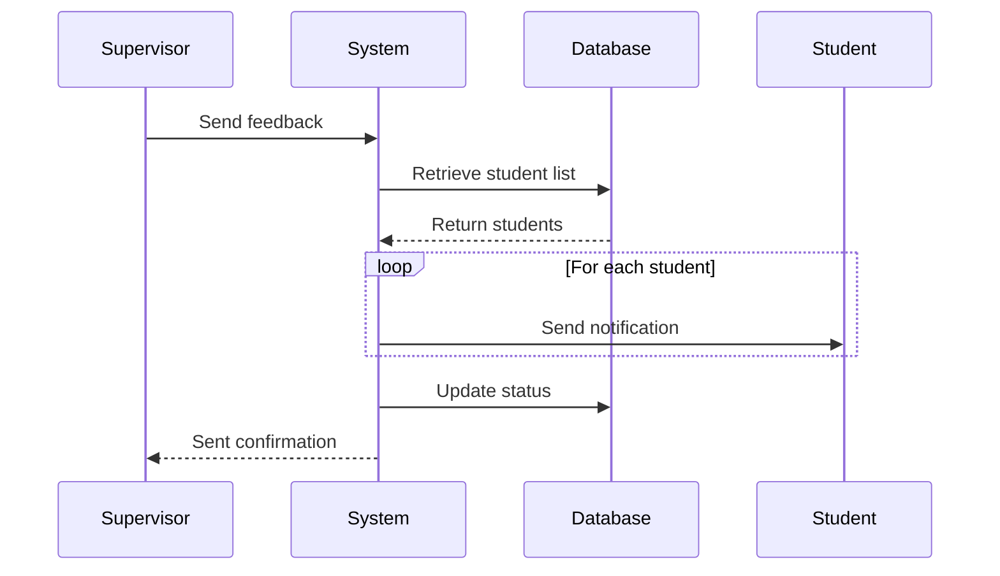
```mermaid
sequenceDiagram
    participant Supervisor
    participant System
    participant Database
    participant Student

    Supervisor->>System: Send feedback
    System->>Database: Retrieve student list
    Database-->>System: Return students
    
    loop For each student
        System->>Student: Send notification
    end
    
    System->>Database: Update status
    System-->>Supervisor: Sent confirmation
```

#### 3.2.3 Student Access to Annotations
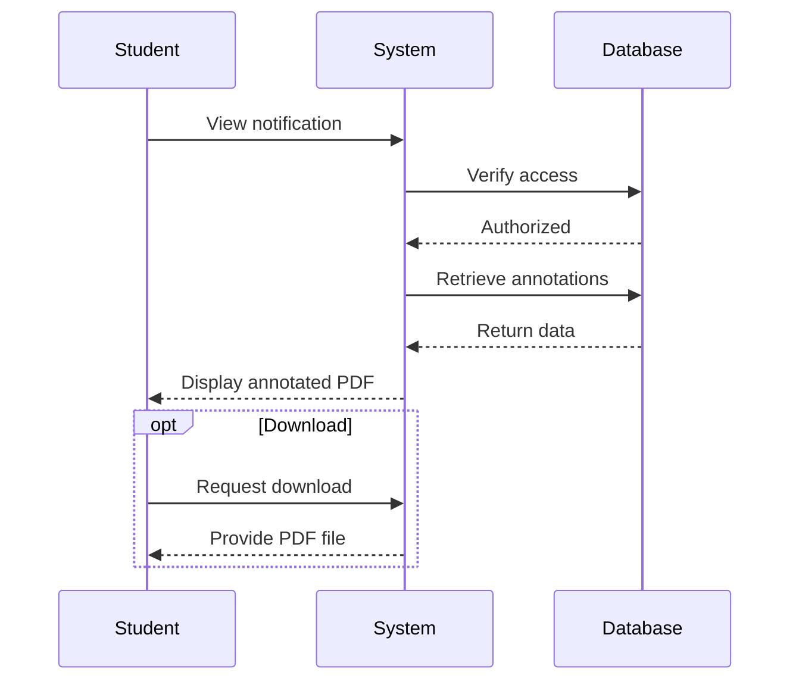
```mermaid
sequenceDiagram
    participant Student
    participant System
    participant Database

    Student->>System: View notification
    System->>Database: Verify access
    Database-->>System: Authorized
    
    System->>Database: Retrieve annotations
    Database-->>System: Return data
    System-->>Student: Display annotated PDF
    
    opt Download
        Student->>System: Request download
        System-->>Student: Provide PDF file
    end
```

### 3.3 Meeting Documentation
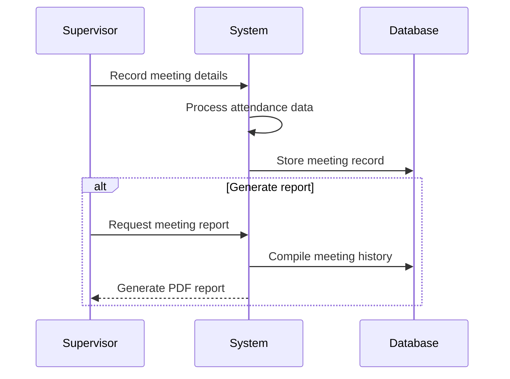
```mermaid
sequenceDiagram
    participant Supervisor
    participant System
    participant Database

    Supervisor->>System: Record meeting details
    System->>System: Process attendance data
    System->>Database: Store meeting record
    
    alt Generate report
        Supervisor->>System: Request meeting report
        System->>Database: Compile meeting history
        System-->>Supervisor: Generate PDF report
    end
```

---

## 4. Co-Supervisor Operations

### 4.1 Co-Supervisor Dashboard Access
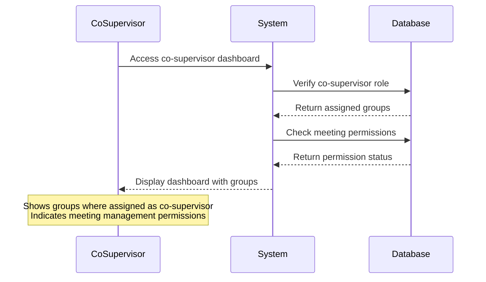
```mermaid
sequenceDiagram
    participant CoSupervisor
    participant System
    participant Database

    CoSupervisor->>System: Access co-supervisor dashboard
    System->>Database: Verify co-supervisor role
    Database-->>System: Return assigned groups
    System->>Database: Check meeting permissions
    Database-->>System: Return permission status
    System-->>CoSupervisor: Display dashboard with groups
    
    Note over CoSupervisor: Shows groups where assigned as co-supervisor<br/>Indicates meeting management permissions
```

### 4.2 Conditional Meeting Management
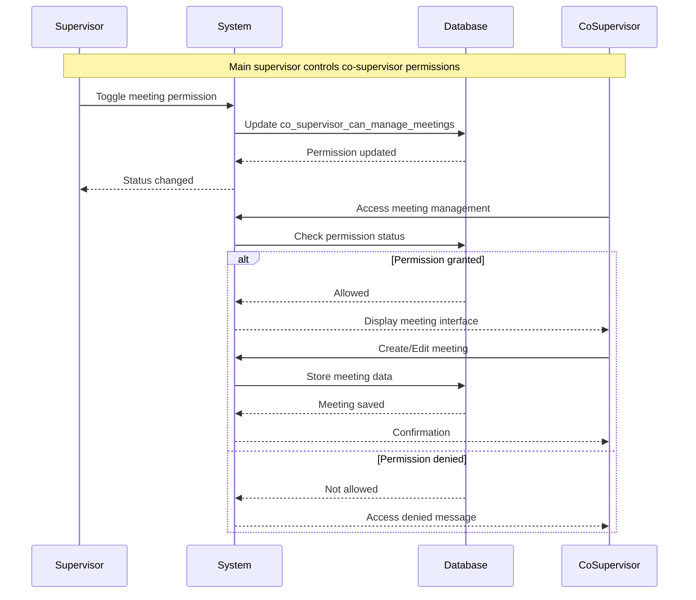
```mermaid
sequenceDiagram
    participant Supervisor
    participant System
    participant Database
    participant CoSupervisor

    Note over Supervisor,CoSupervisor: Main supervisor controls co-supervisor permissions
    
    Supervisor->>System: Toggle meeting permission
    System->>Database: Update co_supervisor_can_manage_meetings
    Database-->>System: Permission updated
    System-->>Supervisor: Status changed
    
    CoSupervisor->>System: Access meeting management
    System->>Database: Check permission status
    
    alt Permission granted
        Database-->>System: Allowed
        System-->>CoSupervisor: Display meeting interface
        
        CoSupervisor->>System: Create/Edit meeting
        System->>Database: Store meeting data
        Database-->>System: Meeting saved
        System-->>CoSupervisor: Confirmation
    else Permission denied
        Database-->>System: Not allowed
        System-->>CoSupervisor: Access denied message
    end
```

### 4.3 Co-Supervisor Report Review
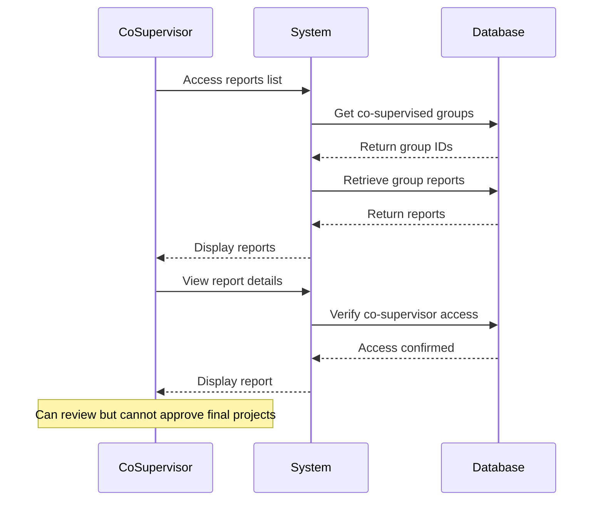
```mermaid
sequenceDiagram
    participant CoSupervisor
    participant System
    participant Database

    CoSupervisor->>System: Access reports list
    System->>Database: Get co-supervised groups
    Database-->>System: Return group IDs
    System->>Database: Retrieve group reports
    Database-->>System: Return reports
    System-->>CoSupervisor: Display reports
    
    CoSupervisor->>System: View report details
    System->>Database: Verify co-supervisor access
    Database-->>System: Access confirmed
    System-->>CoSupervisor: Display report
    
    Note over CoSupervisor: Can review but cannot approve final projects
```

### 4.4 Co-Supervisor Annotation Process
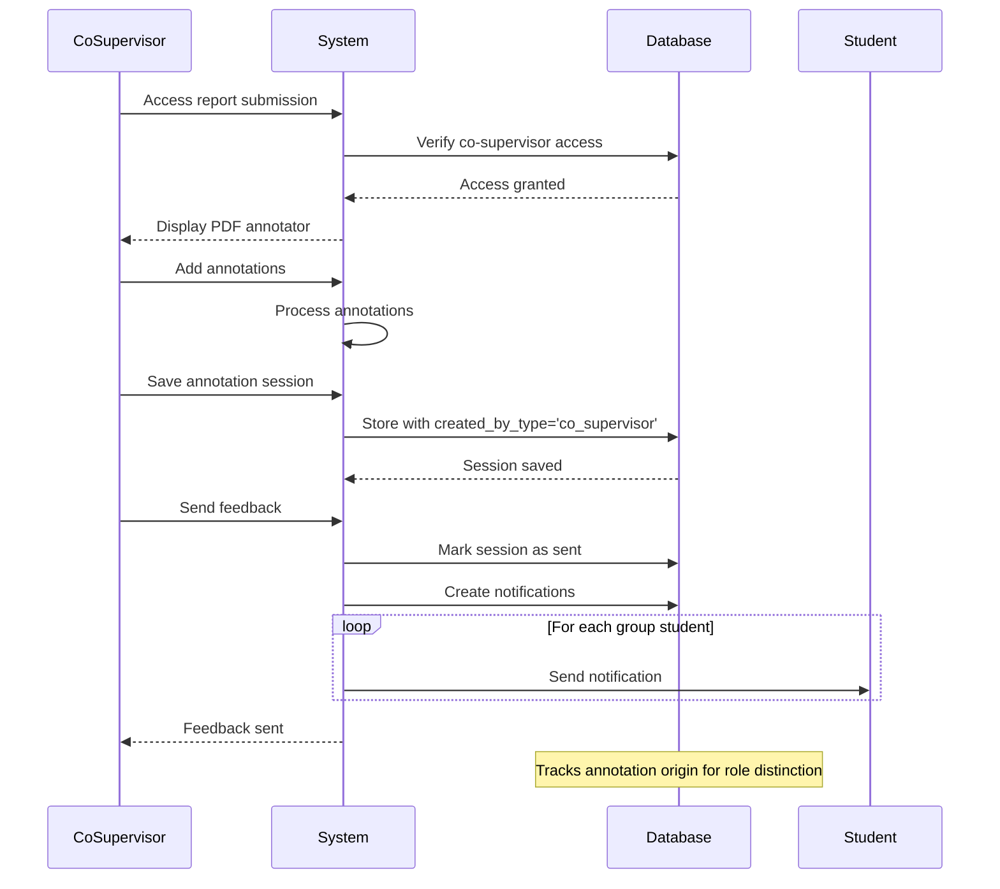
```mermaid
sequenceDiagram
    participant CoSupervisor
    participant System
    participant Database
    participant Student

    CoSupervisor->>System: Access report submission
    System->>Database: Verify co-supervisor access
    Database-->>System: Access granted
    System-->>CoSupervisor: Display PDF annotator
    
    CoSupervisor->>System: Add annotations
    System->>System: Process annotations
    CoSupervisor->>System: Save annotation session
    System->>Database: Store with created_by_type='co_supervisor'
    Database-->>System: Session saved
    
    CoSupervisor->>System: Send feedback
    System->>Database: Mark session as sent
    System->>Database: Create notifications
    
    loop For each group student
        System->>Student: Send notification
    end
    
    System-->>CoSupervisor: Feedback sent
    
    Note over Database: Tracks annotation origin for role distinction
```

---

## 5. Panel Member Operations

### 5.1 Panel Member Dashboard
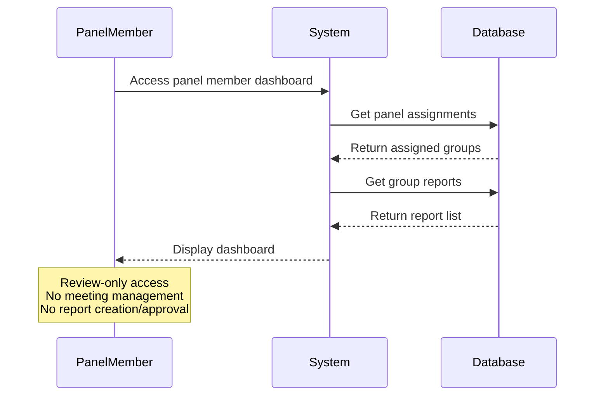
```mermaid
sequenceDiagram
    participant PanelMember
    participant System
    participant Database

    PanelMember->>System: Access panel member dashboard
    System->>Database: Get panel assignments
    Database-->>System: Return assigned groups
    System->>Database: Get group reports
    Database-->>System: Return report list
    System-->>PanelMember: Display dashboard
    
    Note over PanelMember: Review-only access<br/>No meeting management<br/>No report creation/approval
```

### 5.2 Panel Member Report Evaluation
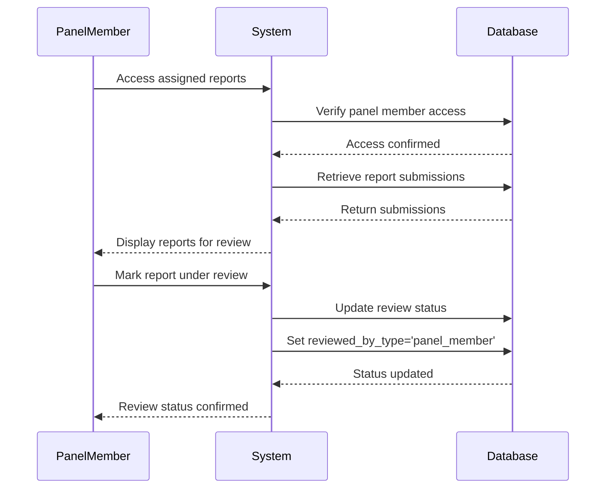
```mermaid
sequenceDiagram
    participant PanelMember
    participant System
    participant Database

    PanelMember->>System: Access assigned reports
    System->>Database: Verify panel member access
    Database-->>System: Access confirmed
    System->>Database: Retrieve report submissions
    Database-->>System: Return submissions
    System-->>PanelMember: Display reports for review
    
    PanelMember->>System: Mark report under review
    System->>Database: Update review status
    System->>Database: Set reviewed_by_type='panel_member'
    Database-->>System: Status updated
    System-->>PanelMember: Review status confirmed
```

### 5.3 Panel Member Annotation Process
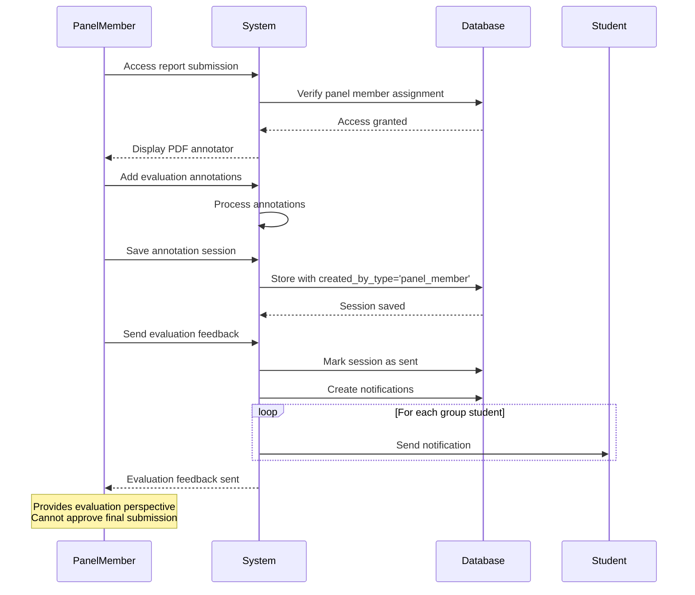
```mermaid
sequenceDiagram
    participant PanelMember
    participant System
    participant Database
    participant Student

    PanelMember->>System: Access report submission
    System->>Database: Verify panel member assignment
    Database-->>System: Access granted
    System-->>PanelMember: Display PDF annotator
    
    PanelMember->>System: Add evaluation annotations
    System->>System: Process annotations
    PanelMember->>System: Save annotation session
    System->>Database: Store with created_by_type='panel_member'
    Database-->>System: Session saved
    
    PanelMember->>System: Send evaluation feedback
    System->>Database: Mark session as sent
    System->>Database: Create notifications
    
    loop For each group student
        System->>Student: Send notification
    end
    
    System-->>PanelMember: Evaluation feedback sent
    
    Note over PanelMember: Provides evaluation perspective<br/>Cannot approve final submission
```

### 5.4 Panel Member Access Restrictions
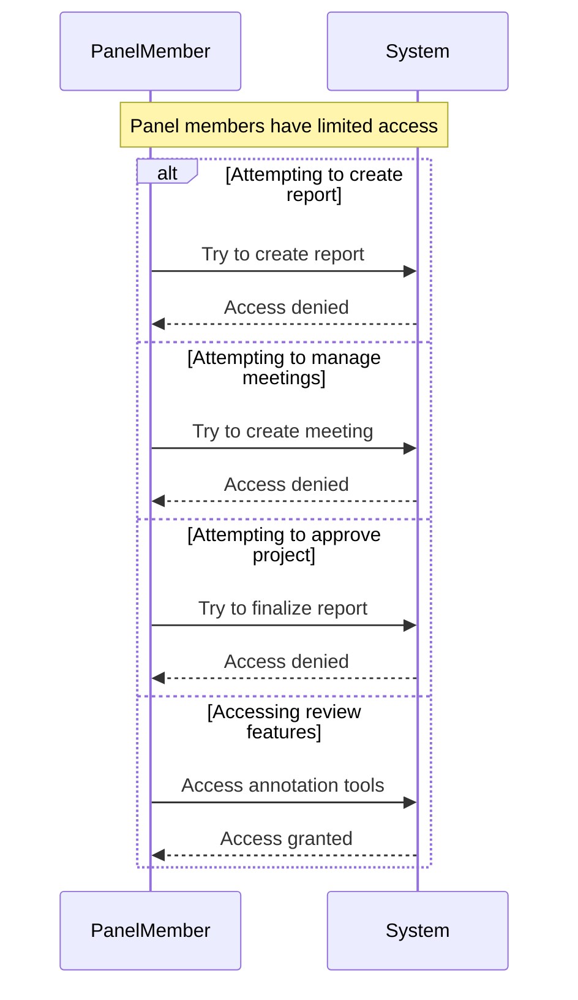
```mermaid
sequenceDiagram
    participant PanelMember
    participant System

    Note over PanelMember,System: Panel members have limited access
    
    alt Attempting to create report
        PanelMember->>System: Try to create report
        System-->>PanelMember: Access denied
    else Attempting to manage meetings
        PanelMember->>System: Try to create meeting
        System-->>PanelMember: Access denied
    else Attempting to approve project
        PanelMember->>System: Try to finalize report
        System-->>PanelMember: Access denied
    else Accessing review features
        PanelMember->>System: Access annotation tools
        System-->>PanelMember: Access granted
    end
```

---

## 6. Advisor Operations

### 6.1 Group Formation

#### 6.1.1 Manual Group Creation
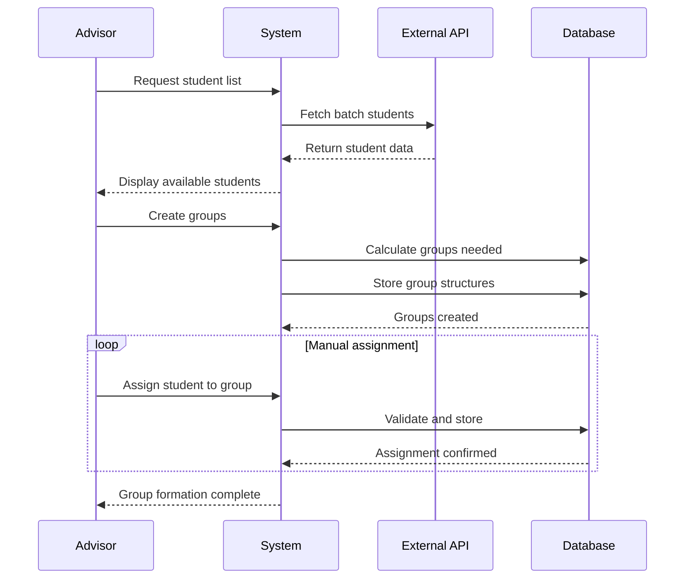
```mermaid
sequenceDiagram
    participant Advisor
    participant System
    participant External API
    participant Database

    Advisor->>System: Request student list
    System->>External API: Fetch batch students
    External API-->>System: Return student data
    System-->>Advisor: Display available students
    
    Advisor->>System: Create groups
    System->>Database: Calculate groups needed
    System->>Database: Store group structures
    Database-->>System: Groups created
    
    loop Manual assignment
        Advisor->>System: Assign student to group
        System->>Database: Validate and store
        Database-->>System: Assignment confirmed
    end
    
    System-->>Advisor: Group formation complete
```

#### 6.1.2 Excel-Based Group Import
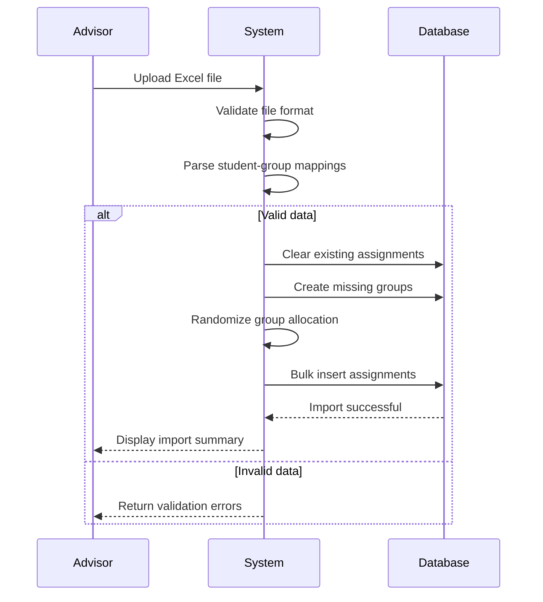
```mermaid
sequenceDiagram
    participant Advisor
    participant System
    participant Database

    Advisor->>System: Upload Excel file
    System->>System: Validate file format
    System->>System: Parse student-group mappings
    
    alt Valid data
        System->>Database: Clear existing assignments
        System->>Database: Create missing groups
        System->>System: Randomize group allocation
        System->>Database: Bulk insert assignments
        Database-->>System: Import successful
        System-->>Advisor: Display import summary
    else Invalid data
        System-->>Advisor: Return validation errors
    end
```

#### 6.1.3 Template Export for Group Assignment
```mermaid
sequenceDiagram
    participant Advisor
    participant System
    participant External API
    participant Database

    Advisor->>System: Request Excel template
    System->>External API: Fetch batch students
    External API-->>System: Return student list
    System->>Database: Retrieve existing groups
    Database-->>System: Return group data
    
    System->>System: Generate Excel template
    Note over System: Template includes:<br/>• Student IDs and names<br/>• Empty group column<br/>• Available group list
    
    System-->>Advisor: Download template file
```

### 6.2 Supervisor Assignment System

#### 6.2.1 Automated Assignment Process
```mermaid
sequenceDiagram
    participant Advisor
    participant System
    participant Database

    Advisor->>System: Initiate assignment process
    System->>System: Select assignment strategy
    System->>Database: Retrieve eligible groups
    System->>Database: Retrieve available supervisors
    System->>System: Execute assignment algorithm
    System->>Database: Store assignments
    System-->>Advisor: Display results
```

#### 6.2.2 Area of Interest Based Assignment
```mermaid
sequenceDiagram
    participant Advisor
    participant System
    participant Database

    Note over Advisor,Database: Strategy: Match groups with supervisor expertise
    
    Advisor->>System: Select AOI-based assignment
    System->>Database: Retrieve unassigned groups
    System->>Database: Retrieve supervisors with expertise areas
    
    loop For each group
        System->>System: Identify group's area of interest
        System->>System: Find matching supervisors
        System->>System: Random selection from matches
        System->>Database: Assign supervisor to group
    end
    
    System-->>Advisor: Display assignment results
    
    Note over System: Ensures expertise alignment<br/>May result in uneven distribution
```

#### 6.2.3 Ranking Based Assignment
```mermaid
sequenceDiagram
    participant Advisor
    participant System
    participant Database

    Note over Advisor,Database: Strategy: Fair distribution by designation rank
    
    Advisor->>System: Select ranking-based assignment
    System->>Database: Retrieve unassigned groups
    System->>Database: Retrieve supervisors by designation
    System->>System: Sort by rank (Professor to Lecturer)
    
    loop Round-robin assignment
        System->>System: Select next supervisor in rotation
        System->>System: Verify supervisor capacity
        System->>Database: Assign supervisor to group
        System->>System: Move to next supervisor
        
        Note over System: Each supervisor gets one group<br/>before anyone gets second
    end
    
    System-->>Advisor: Display assignment results
    
    Note over System: Ensures equal distribution<br/>Ignores expertise matching
```

#### 6.2.4 Hybrid Assignment Strategy
```mermaid
sequenceDiagram
    participant Advisor
    participant System
    participant Database

    Note over Advisor,Database: Strategy: Balance expertise and fair distribution
    
    Advisor->>System: Select hybrid assignment
    System->>Database: Retrieve unassigned groups
    System->>Database: Retrieve supervisors with expertise
    
    loop For each group
        System->>System: Find area-matching supervisors
        System->>System: Check assignment counts
        System->>System: Select supervisor with minimum load
        
        alt Multiple candidates with same load
            System->>System: Apply rank-based selection
        end
        
        System->>Database: Assign supervisor to group
    end
    
    System-->>Advisor: Display assignment results
    
    Note over System: Optimizes both expertise match<br/>and workload distribution
```

#### 6.2.5 Assignment Strategy Comparison
```mermaid
graph TD
    Start[Assignment Strategy Selection]
    
    Start --> AOI[Area-Based Strategy]
    Start --> Rank[Ranking-Based Strategy]
    Start --> Hybrid[Hybrid Strategy]
    
    AOI --> AOIResult[Expertise-focused<br/>Random within matches<br/>Possible uneven load]
    Rank --> RankResult[Equal distribution<br/>Round-robin assignment<br/>Ignores expertise]
    Hybrid --> HybridResult[Balanced approach<br/>Expertise with fairness<br/>Optimal distribution]
    
    style Start fill:#f9f,stroke:#333,stroke-width:2px
    style AOIResult fill:#e8f5e9,stroke:#4caf50,stroke-width:1px
    style RankResult fill:#e3f2fd,stroke:#2196f3,stroke-width:1px
    style HybridResult fill:#fff3e0,stroke:#ff9800,stroke-width:1px
```

---

## 7. Administrative Functions

### 7.1 External Data Synchronization
```mermaid
sequenceDiagram
    participant Administrator
    participant System
    participant External API
    participant Database

    Administrator->>System: Initiate synchronization
    System->>External API: Request updated data
    External API-->>System: Return data
    System->>System: Process updates
    System->>Database: Update records
    System-->>Administrator: Synchronization report
```

### 7.2 System Monitoring
```mermaid
sequenceDiagram
    participant Administrator
    participant System
    participant Database

    Administrator->>System: Request system metrics
    System->>Database: Query performance data
    Database-->>System: Return statistics
    System->>System: Calculate metrics
    System-->>Administrator: Display dashboard
```

### 7.3 Co-Supervisor Assignment Process
```mermaid
sequenceDiagram
    participant Administrator
    participant System
    participant Database

    Note over Administrator,Database: Only administrators can assign co-supervisors
    
    Administrator->>System: Access group management
    System->>Database: Retrieve groups list
    Database-->>System: Return groups
    System-->>Administrator: Display groups
    
    Administrator->>System: Select group for co-supervisor
    System->>Database: Retrieve available supervisors
    Database-->>System: Return supervisor list
    System->>System: Filter out main supervisor
    System-->>Administrator: Display eligible co-supervisors
    
    Administrator->>System: Assign co-supervisor
    System->>Database: Validate assignment
    
    alt Valid assignment
        System->>Database: Update group co_supervisor_id
        System->>Database: Set initial permissions (false)
        Database-->>System: Assignment confirmed
        System->>Database: Create notification for co-supervisor
        System-->>Administrator: Success message
    else Invalid (same as main supervisor)
        System-->>Administrator: Error: Cannot assign same person
    end
    
    Note over Database: Co-supervisor gets notified of assignment
```

### 7.4 Panel Member Assignment Process
```mermaid
sequenceDiagram
    participant Administrator
    participant System
    participant Database

    Note over Administrator,Database: Only administrators can assign panel members
    
    Administrator->>System: Access group management
    System->>Database: Retrieve groups list
    Database-->>System: Return groups
    System-->>Administrator: Display groups
    
    Administrator->>System: Select group for panel member
    System->>Database: Retrieve available supervisors
    Database-->>System: Return supervisor list
    System->>Database: Get existing panel members
    Database-->>System: Return current panel
    System-->>Administrator: Display eligible panel members
    
    Administrator->>System: Assign panel member
    System->>Database: Validate assignment
    
    alt Valid assignment
        System->>Database: Create panel assignment
        System->>Database: Store in group_panel_members
        System->>Database: Record assignment metadata
        Database-->>System: Assignment confirmed
        System->>Database: Create notification for panel member
        System-->>Administrator: Panel member assigned
    else Already assigned
        System-->>Administrator: Error: Already a panel member
    end
    
    Note over Database: No capacity limits for panel members<br/>Multiple panel members per group allowed
```

---

## 8. Multi-Role Collaboration

### 8.1 Teacher Role Switching
```mermaid
sequenceDiagram
    participant Teacher
    participant System
    participant Database

    Teacher->>System: Access teacher dashboard
    System->>Database: Check all assigned roles
    Database-->>System: Return role assignments
    
    Note over System: Teacher can be:<br/>• Supervisor for some groups<br/>• Co-Supervisor for others<br/>• Panel Member for evaluation
    
    System-->>Teacher: Display role selection panel
    
    alt Select Supervisor Role
        Teacher->>System: Access supervisor panel
        System->>Database: Get supervised groups
        System-->>Teacher: Supervisor dashboard
    else Select Co-Supervisor Role
        Teacher->>System: Access co-supervisor panel
        System->>Database: Get co-supervised groups
        System-->>Teacher: Co-supervisor dashboard
    else Select Panel Member Role
        Teacher->>System: Access panel member panel
        System->>Database: Get panel assignments
        System-->>Teacher: Panel member dashboard
    end
```

### 8.2 Collaborative Report Review
```mermaid
sequenceDiagram
    participant Student
    participant Supervisor
    participant CoSupervisor
    participant PanelMember
    participant System
    participant Database

    Note over Student,Database: Multiple reviewers can annotate the same report
    
    Student->>System: Submit report
    System->>Database: Store submission
    System->>Supervisor: Notify main supervisor
    System->>CoSupervisor: Notify co-supervisor
    System->>PanelMember: Notify panel members
    
    par Parallel Review Process
        Supervisor->>System: Create annotation session
        System->>Database: Store with created_by_type='supervisor'
    and
        CoSupervisor->>System: Create annotation session
        System->>Database: Store with created_by_type='co_supervisor'
    and
        PanelMember->>System: Create annotation session
        System->>Database: Store with created_by_type='panel_member'
    end
    
    System->>Database: Compile all annotations
    Database-->>System: Return merged feedback
    System->>Student: Notify of available feedback
    
    Student->>System: View all annotations
    System->>Database: Retrieve all sessions
    Database-->>System: Return categorized feedback
    System-->>Student: Display with role indicators
```

### 8.3 Hierarchical Approval Process
```mermaid
sequenceDiagram
    participant Student
    participant PanelMember
    participant CoSupervisor
    participant Supervisor
    participant System
    participant Database

    Note over Student,Database: Only main supervisor can give final approval
    
    Student->>System: Submit final report
    System->>Database: Store submission
    
    PanelMember->>System: Review and annotate
    System->>Database: Store evaluation feedback
    System->>Student: Notify of panel review
    
    CoSupervisor->>System: Review and recommend
    System->>Database: Store recommendation
    System->>Student: Notify of co-supervisor review
    
    Note over CoSupervisor: Can recommend but not approve
    
    Supervisor->>System: Review all feedback
    System->>Database: Retrieve all reviews
    Database-->>System: Return compiled feedback
    System-->>Supervisor: Display comprehensive review
    
    alt Approve
        Supervisor->>System: Approve final project
        System->>Database: Update status to 'approved'
        System->>Student: Send approval notification
        System->>Database: Publish to repository
    else Request Revision
        Supervisor->>System: Request changes
        System->>Database: Update status to 'needs_revision'
        System->>Student: Send revision request
    end
```

### 8.4 Permission-Based Meeting Coordination
```mermaid
sequenceDiagram
    participant Supervisor
    participant CoSupervisor
    participant System
    participant Database
    participant Student

    Note over Supervisor,Student: Meeting management with conditional permissions
    
    Supervisor->>System: Schedule meeting
    System->>Database: Create meeting record
    System->>Student: Send meeting notification
    
    Supervisor->>System: Grant co-supervisor meeting permission
    System->>Database: Update co_supervisor_can_manage_meetings=true
    System->>CoSupervisor: Notify of permission grant
    
    CoSupervisor->>System: Schedule additional meeting
    System->>Database: Check permission status
    Database-->>System: Permission granted
    System->>Database: Create meeting record
    System->>Student: Send meeting notification
    
    Note over CoSupervisor: Can now manage meetings independently
    
    opt Permission Revoked
        Supervisor->>System: Revoke meeting permission
        System->>Database: Update co_supervisor_can_manage_meetings=false
        System->>CoSupervisor: Notify of permission change
        
        CoSupervisor->>System: Try to schedule meeting
        System->>Database: Check permission status
        Database-->>System: Permission denied
        System-->>CoSupervisor: Access denied
    end
```

### 8.5 Multi-Reviewer Annotation History
```mermaid
sequenceDiagram
    participant Student
    participant System
    participant Database

    Student->>System: Request annotation history
    System->>Database: Retrieve all annotation sessions
    Database-->>System: Return sessions with metadata
    
    System->>System: Group by reviewer role
    System->>System: Sort by timestamp
    
    System-->>Student: Display categorized history
    
    Note over Student: History shows:<br/>• Supervisor annotations (blue)<br/>• Co-Supervisor annotations (purple)<br/>• Panel Member annotations (orange)<br/>• Timestamps and versions
    
    Student->>System: Select specific session
    System->>Database: Retrieve session details
    Database-->>System: Return annotations
    System-->>Student: Display annotated document
    
    Note over Student: Can compare feedback from different reviewers
```

---

## 9. System Architecture

### 9.1 Request Processing Flow
```mermaid
sequenceDiagram
    participant Client
    participant Web Server
    participant Application
    participant Database

    Client->>Web Server: HTTP Request
    Web Server->>Application: Route request
    Application->>Application: Process business logic
    Application->>Database: Data operation
    Database-->>Application: Return data
    Application-->>Web Server: Generate response
    Web Server-->>Client: HTTP Response
```

### 9.2 File Management
```mermaid
sequenceDiagram
    participant User
    participant System
    participant Storage
    participant Database

    User->>System: Upload file
    System->>System: Validate file
    
    alt Valid file
        System->>Storage: Store file
        System->>Database: Save metadata
        System-->>User: Upload successful
    else Invalid file
        System-->>User: Validation error
    end
```

---

## System Components Description

### Core Components
- **Client**: End-user interface (web browser)
- **System**: Application server handling business logic
- **Database**: Persistent data storage
- **External API**: University information systems
- **Storage**: File storage service

### User Roles
- **Student**: Thesis/project students submitting reports and receiving feedback
- **Supervisor**: Faculty members with primary supervision responsibilities and final approval authority
- **Co-Supervisor**: Secondary supervisors assisting main supervisors with conditional meeting management permissions
- **Panel Member**: Faculty members providing evaluation and feedback without management capabilities
- **Advisor**: Faculty coordinating student groups and supervisor assignments
- **Administrator**: System administrators managing users and system configuration
- **Teacher**: Umbrella role for faculty who can switch between supervisor, co-supervisor, and panel member roles

### Key Features
1. **Authentication**: Multi-role authentication with external API integration
2. **Group Management**: Formation and assignment of student groups with multiple supervision levels
3. **Report Workflow**: Creation, submission, and multi-reviewer annotation system
4. **Meeting Documentation**: Recording and tracking with permission-based co-supervisor access
5. **Automated Assignment**: Algorithmic supervisor-group matching with AOI, ranking, and hybrid strategies
6. **Data Synchronization**: Integration with university systems for student and faculty data
7. **In-App Notifications**: Dashboard-based notifications for all user roles
8. **Collaborative Review**: Multiple reviewers can annotate reports with role-based tracking
9. **Hierarchical Approval**: Only main supervisors can approve final projects
10. **Permission Management**: Granular control over co-supervisor meeting permissions
11. **Role Switching**: Teachers can seamlessly switch between different supervision roles
12. **Annotation History**: Complete tracking of all feedback with reviewer role identification

---

## Notes
These sequence diagrams illustrate the primary interactions within the Thesis Repository Management System, demonstrating the flow of information between system components and user roles. The diagrams follow UML 2.0 notation standards and focus on essential system behaviors rather than implementation details.