# ThesisRepo System - Sequence Diagrams

## Table of Contents
1. [Authentication & Authorization](#1-authentication--authorization)
2. [Student Workflows](#2-student-workflows)
3. [Supervisor Workflows](#3-supervisor-workflows)
4. [Co-Supervisor Workflows](#4-co-supervisor-workflows)
5. [Panel Member Workflows](#5-panel-member-workflows)
6. [Advisor Workflows](#6-advisor-workflows)
7. [Admin Workflows](#7-admin-workflows)
8. [Report Management](#8-report-management)
9. [Meeting Management](#9-meeting-management)
10. [Notification System](#10-notification-system)

---

## 1. Authentication & Authorization

### 1.1 User Login Flow
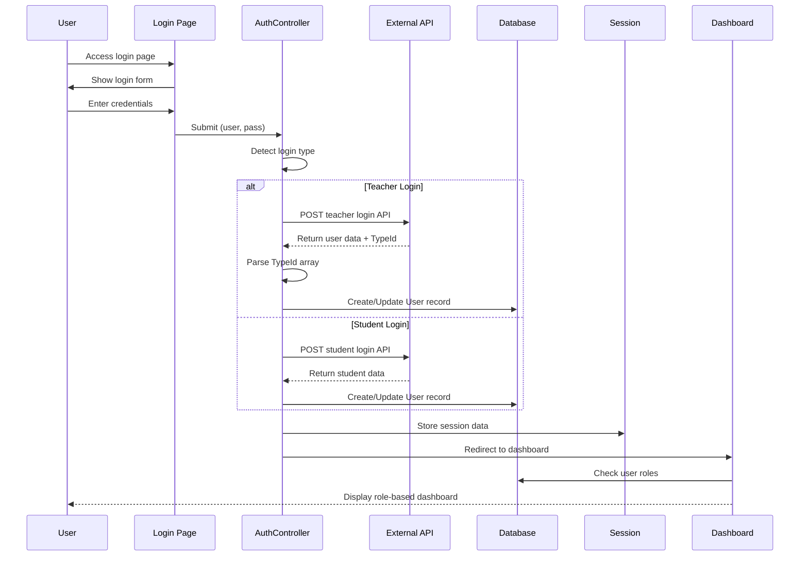
```mermaid
sequenceDiagram
    participant U as User
    participant L as Login Page
    participant AC as AuthController
    participant API as External API
    participant DB as Database
    participant S as Session
    participant D as Dashboard

    U->>L: Access login page
    L->>U: Show login form
    U->>L: Enter credentials
    L->>AC: Submit (user, pass)
    AC->>AC: Detect login type
    
    alt Teacher Login
        AC->>API: POST teacher login API
        API-->>AC: Return user data + TypeId
        AC->>AC: Parse TypeId array
        AC->>DB: Create/Update User record
    else Student Login
        AC->>API: POST student login API
        API-->>AC: Return student data
        AC->>DB: Create/Update User record
    end
    
    AC->>S: Store session data
    AC->>D: Redirect to dashboard
    D->>DB: Check user roles
    D-->>U: Display role-based dashboard
```

### 1.2 Role-Based Access Control
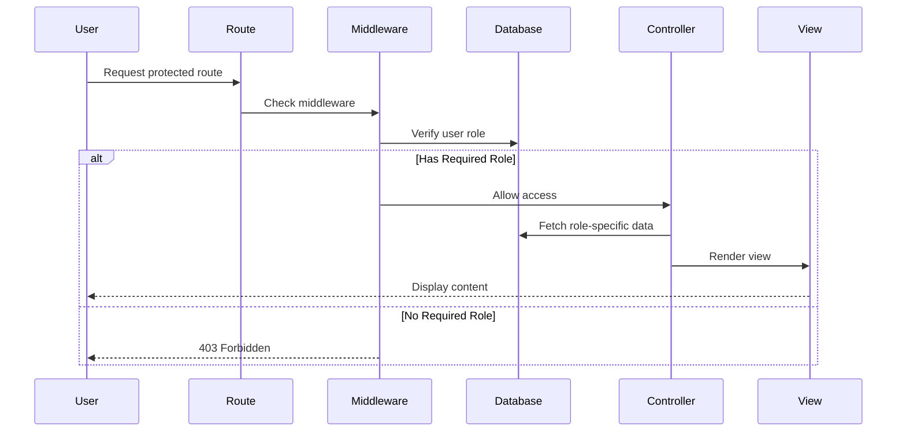
```mermaid
sequenceDiagram
    participant U as User
    participant R as Route
    participant M as Middleware
    participant DB as Database
    participant C as Controller
    participant V as View

    U->>R: Request protected route
    R->>M: Check middleware
    M->>DB: Verify user role
    
    alt Has Required Role
        M->>C: Allow access
        C->>DB: Fetch role-specific data
        C->>V: Render view
        V-->>U: Display content
    else No Required Role
        M-->>U: 403 Forbidden
    end
```

---

## 2. Student Workflows

### 2.1 Student Dashboard
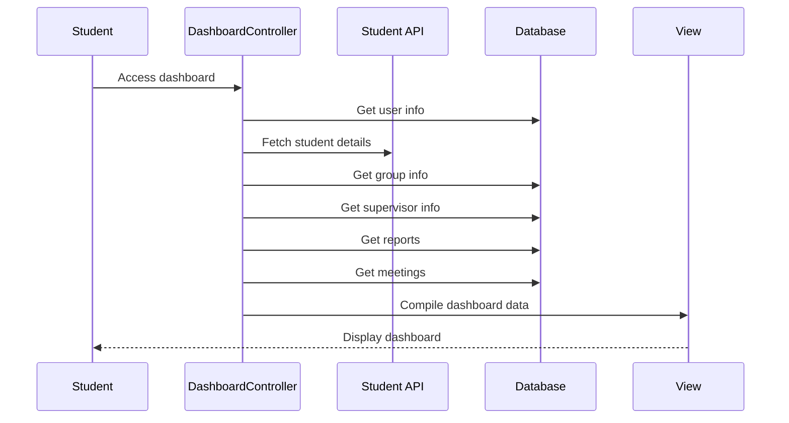
```mermaid
sequenceDiagram
    participant S as Student
    participant DC as DashboardController
    participant API as Student API
    participant DB as Database
    participant V as View

    S->>DC: Access dashboard
    DC->>DB: Get user info
    DC->>API: Fetch student details
    DC->>DB: Get group info
    DC->>DB: Get supervisor info
    DC->>DB: Get reports
    DC->>DB: Get meetings
    DC->>V: Compile dashboard data
    V-->>S: Display dashboard
```

### 2.2 Report Submission
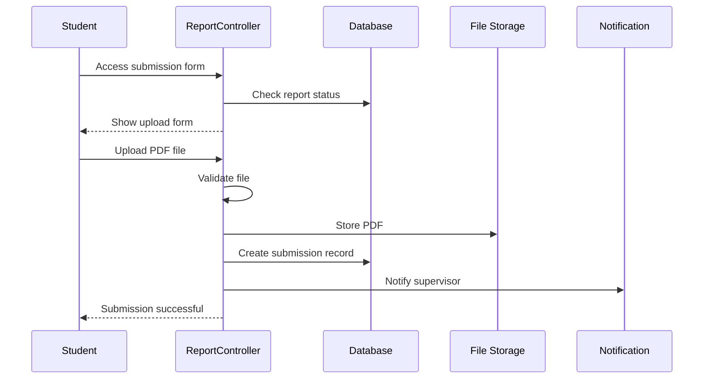
```mermaid
sequenceDiagram
    participant S as Student
    participant RC as ReportController
    participant DB as Database
    participant FS as File Storage
    participant N as Notification

    S->>RC: Access submission form
    RC->>DB: Check report status
    RC-->>S: Show upload form
    S->>RC: Upload PDF file
    RC->>RC: Validate file
    RC->>FS: Store PDF
    RC->>DB: Create submission record
    RC->>N: Notify supervisor
    RC-->>S: Submission successful
```

### 2.3 View Annotations
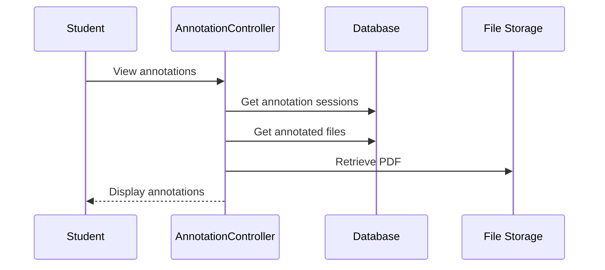
```mermaid
sequenceDiagram
    participant S as Student
    participant AC as AnnotationController
    participant DB as Database
    participant FS as File Storage

    S->>AC: View annotations
    AC->>DB: Get annotation sessions
    AC->>DB: Get annotated files
    AC->>FS: Retrieve PDF
    AC-->>S: Display annotations
```

---

## 3. Supervisor Workflows

### 3.1 Group Management
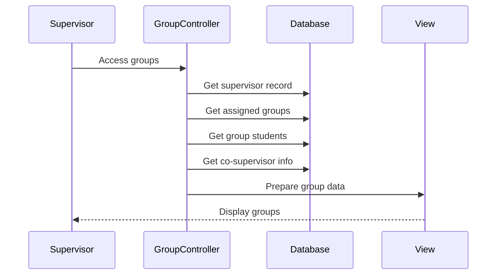
```mermaid
sequenceDiagram
    participant Su as Supervisor
    participant GC as GroupController
    participant DB as Database
    participant V as View

    Su->>GC: Access groups
    GC->>DB: Get supervisor record
    GC->>DB: Get assigned groups
    GC->>DB: Get group students
    GC->>DB: Get co-supervisor info
    GC->>V: Prepare group data
    V-->>Su: Display groups
```

### 3.2 Report Creation
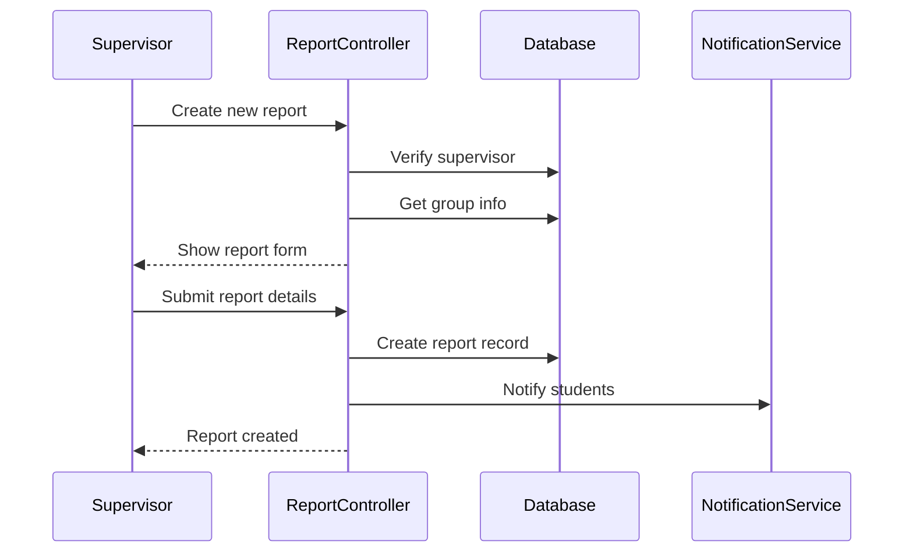
```mermaid
sequenceDiagram
    participant Su as Supervisor
    participant RC as ReportController
    participant DB as Database
    participant N as NotificationService

    Su->>RC: Create new report
    RC->>DB: Verify supervisor
    RC->>DB: Get group info
    RC-->>Su: Show report form
    Su->>RC: Submit report details
    RC->>DB: Create report record
    RC->>N: Notify students
    RC-->>Su: Report created
```

### 3.3 Meeting Record Management
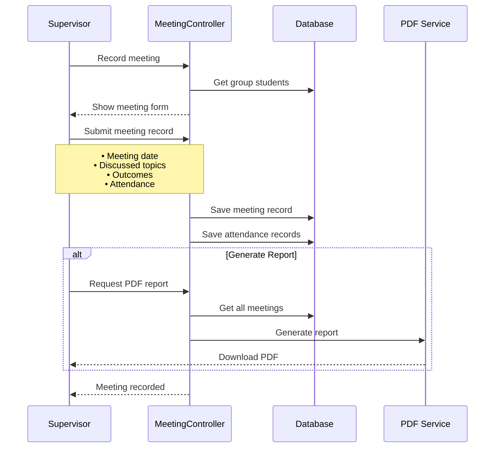
```mermaid
sequenceDiagram
    participant Su as Supervisor
    participant MC as MeetingController
    participant DB as Database
    participant PDF as PDF Service

    Su->>MC: Record meeting
    MC->>DB: Get group students
    MC-->>Su: Show meeting form
    Su->>MC: Submit meeting record
    Note over Su,MC: • Meeting date<br/>• Discussed topics<br/>• Outcomes<br/>• Attendance
    MC->>DB: Save meeting record
    MC->>DB: Save attendance records
    
    alt Generate Report
        Su->>MC: Request PDF report
        MC->>DB: Get all meetings
        MC->>PDF: Generate report
        PDF-->>Su: Download PDF
    end
    
    MC-->>Su: Meeting recorded
```

### 3.4 Report Annotation
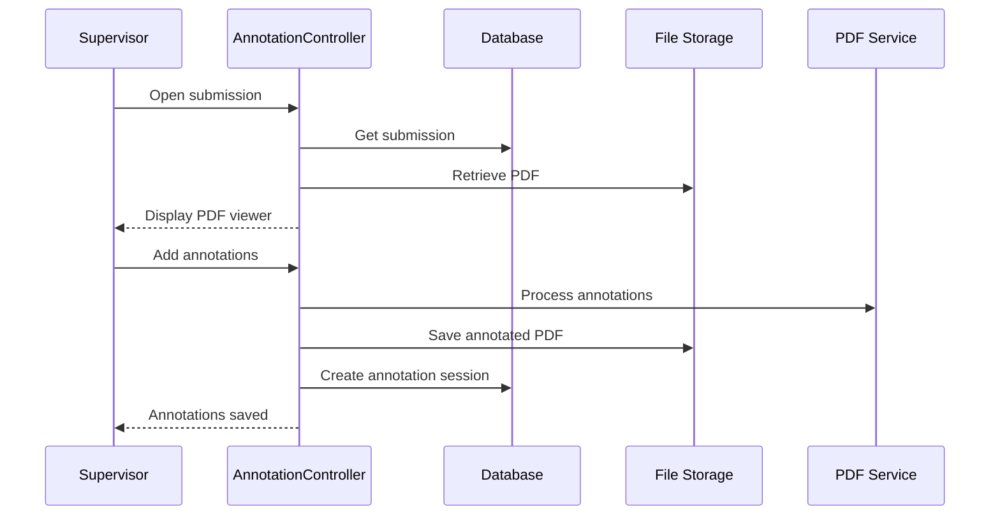
```mermaid
sequenceDiagram
    participant Su as Supervisor
    participant AC as AnnotationController
    participant DB as Database
    participant FS as File Storage
    participant PDF as PDF Service

    Su->>AC: Open submission
    AC->>DB: Get submission
    AC->>FS: Retrieve PDF
    AC-->>Su: Display PDF viewer
    Su->>AC: Add annotations
    AC->>PDF: Process annotations
    AC->>FS: Save annotated PDF
    AC->>DB: Create annotation session
    AC-->>Su: Annotations saved
```

---

## 4. Co-Supervisor Workflows

### 4.1 Conditional Meeting Management
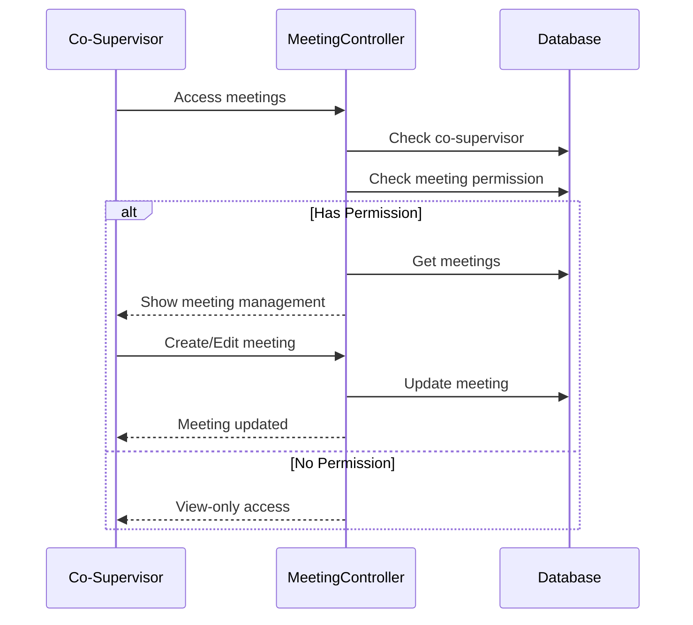
```mermaid
sequenceDiagram
    participant CS as Co-Supervisor
    participant MC as MeetingController
    participant DB as Database

    CS->>MC: Access meetings
    MC->>DB: Check co-supervisor
    MC->>DB: Check meeting permission
    
    alt Has Permission
        MC->>DB: Get meetings
        MC-->>CS: Show meeting management
        CS->>MC: Create/Edit meeting
        MC->>DB: Update meeting
        MC-->>CS: Meeting updated
    else No Permission
        MC-->>CS: View-only access
    end
```

### 4.2 Report Review
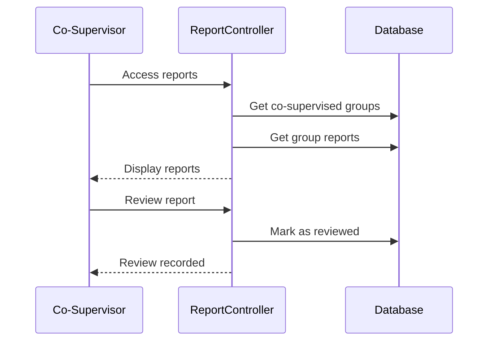
```mermaid
sequenceDiagram
    participant CS as Co-Supervisor
    participant RC as ReportController
    participant DB as Database

    CS->>RC: Access reports
    RC->>DB: Get co-supervised groups
    RC->>DB: Get group reports
    RC-->>CS: Display reports
    CS->>RC: Review report
    RC->>DB: Mark as reviewed
    RC-->>CS: Review recorded
```

---

## 5. Panel Member Workflows

### 5.1 Report Evaluation
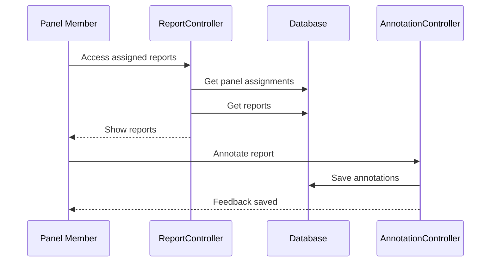
```mermaid
sequenceDiagram
    participant PM as Panel Member
    participant RC as ReportController
    participant DB as Database
    participant AC as AnnotationController

    PM->>RC: Access assigned reports
    RC->>DB: Get panel assignments
    RC->>DB: Get reports
    RC-->>PM: Show reports
    PM->>AC: Annotate report
    AC->>DB: Save annotations
    AC-->>PM: Feedback saved
```

---

## 6. Advisor Workflows

### 6.1 Student Group Creation
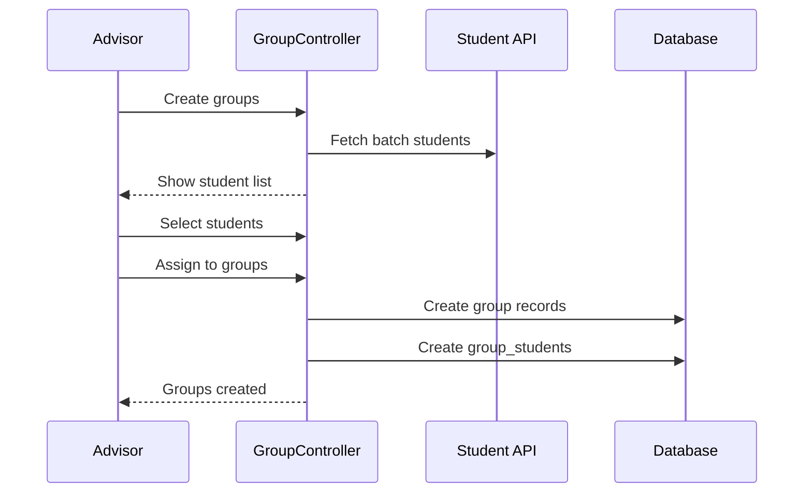
```mermaid
sequenceDiagram
    participant Ad as Advisor
    participant GC as GroupController
    participant API as Student API
    participant DB as Database

    Ad->>GC: Create groups
    GC->>API: Fetch batch students
    GC-->>Ad: Show student list
    Ad->>GC: Select students
    Ad->>GC: Assign to groups
    GC->>DB: Create group records
    GC->>DB: Create group_students
    GC-->>Ad: Groups created
```

### 6.2 Supervisor Assignment Lottery System

#### 6.2.1 AOI-Based Lottery (Mode: 'aoi')
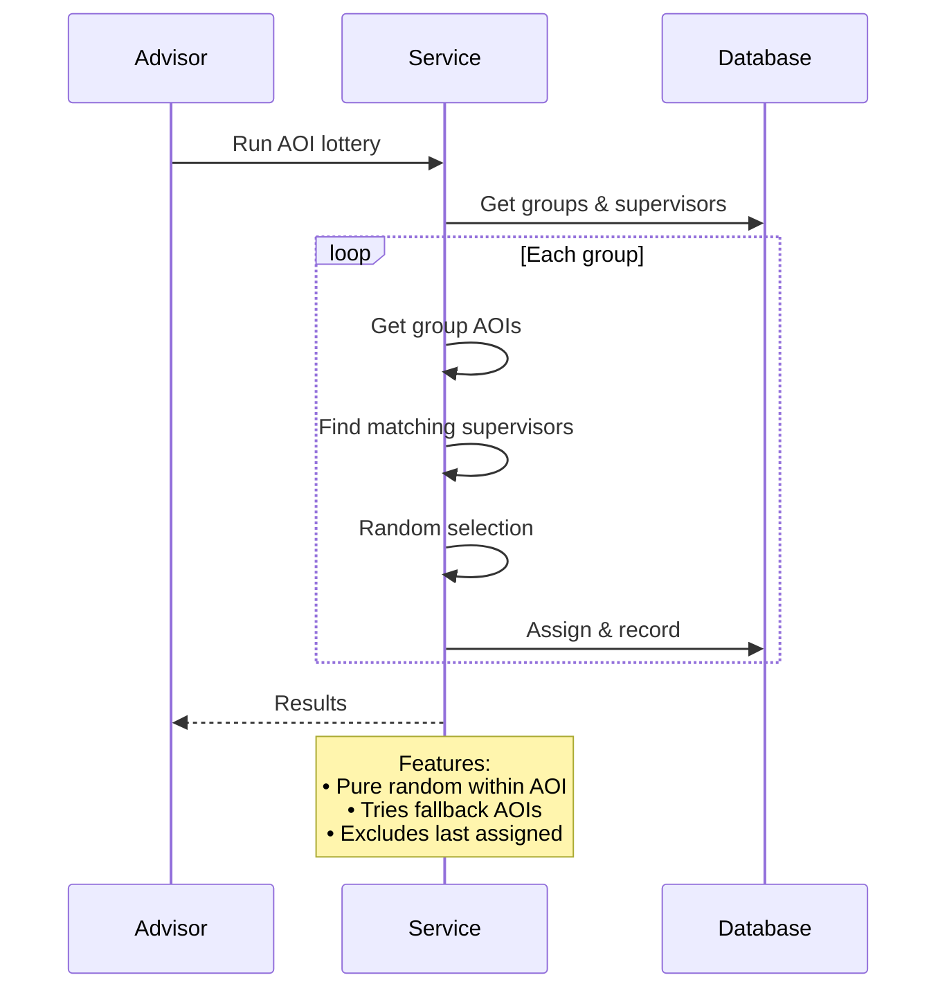
```mermaid
sequenceDiagram
    participant Ad as Advisor
    participant SAS as Service
    participant DB as Database

    Ad->>SAS: Run AOI lottery
    SAS->>DB: Get groups & supervisors
    
    loop Each group
        SAS->>SAS: Get group AOIs
        SAS->>SAS: Find matching supervisors
        SAS->>SAS: Random selection
        SAS->>DB: Assign & record
    end
    
    SAS-->>Ad: Results
    
    Note over SAS: Features:<br/>• Pure random within AOI<br/>• Tries fallback AOIs<br/>• Excludes last assigned
```

#### 6.2.2 Ranking-Based Lottery (Mode: 'ranking')
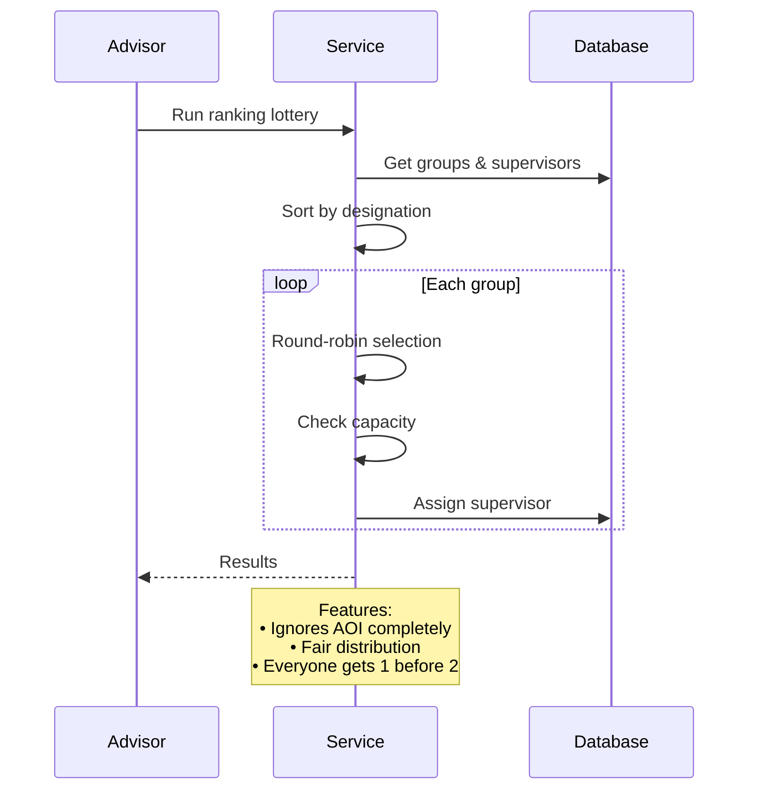
```mermaid
sequenceDiagram
    participant Ad as Advisor
    participant SAS as Service
    participant DB as Database

    Ad->>SAS: Run ranking lottery
    SAS->>DB: Get groups & supervisors
    SAS->>SAS: Sort by designation
    
    loop Each group
        SAS->>SAS: Round-robin selection
        SAS->>SAS: Check capacity
        SAS->>DB: Assign supervisor
    end
    
    SAS-->>Ad: Results
    
    Note over SAS: Features:<br/>• Ignores AOI completely<br/>• Fair distribution<br/>• Everyone gets 1 before 2
```

#### 6.2.3 Combined Lottery (Mode: 'both')
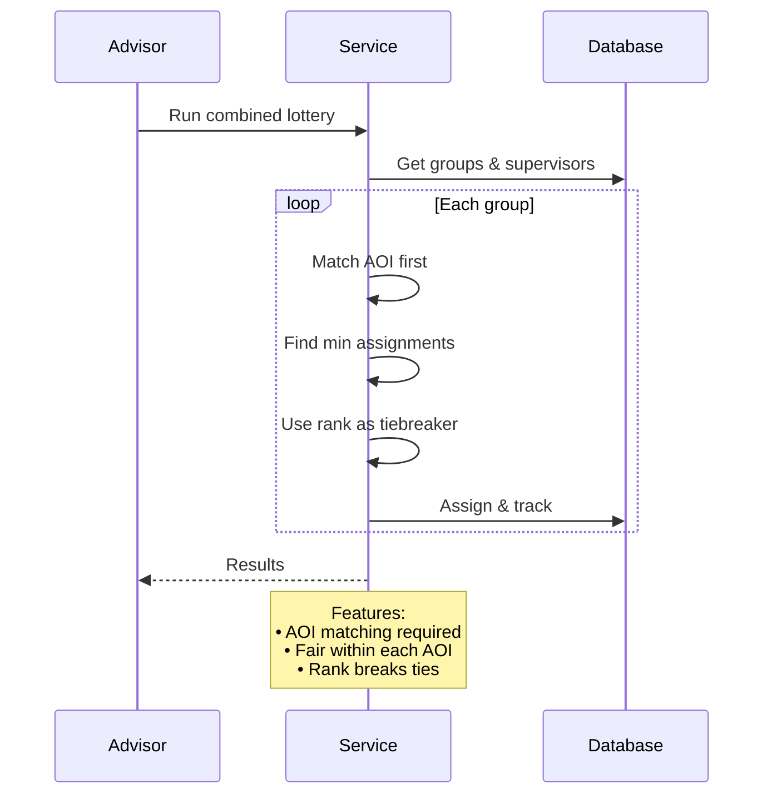
```mermaid
sequenceDiagram
    participant Ad as Advisor
    participant SAS as Service
    participant DB as Database

    Ad->>SAS: Run combined lottery
    SAS->>DB: Get groups & supervisors
    
    loop Each group
        SAS->>SAS: Match AOI first
        SAS->>SAS: Find min assignments
        SAS->>SAS: Use rank as tiebreaker
        SAS->>DB: Assign & track
    end
    
    SAS-->>Ad: Results
    
    Note over SAS: Features:<br/>• AOI matching required<br/>• Fair within each AOI<br/>• Rank breaks ties
```

#### 6.2.4 Lottery Comparison
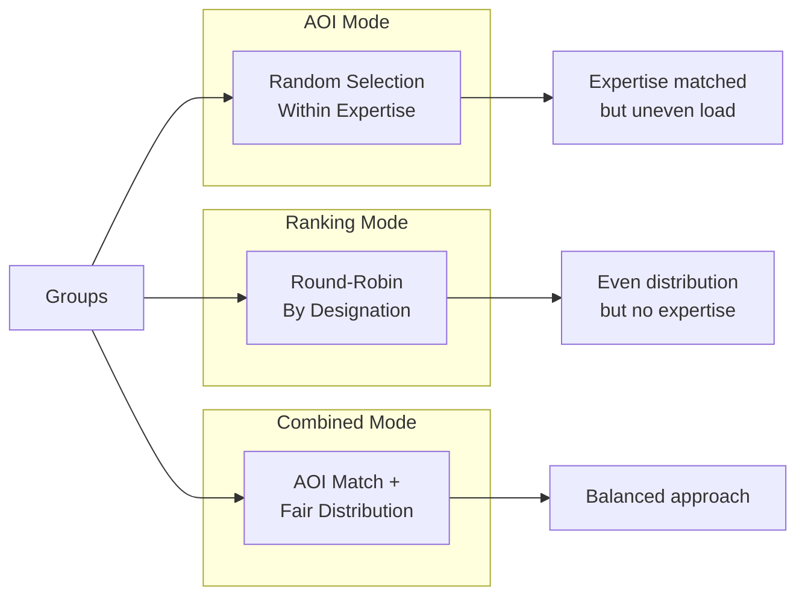
```mermaid
graph LR
    subgraph AOI Mode
        A[Random Selection<br/>Within Expertise]
    end
    
    subgraph Ranking Mode
        B[Round-Robin<br/>By Designation]
    end
    
    subgraph Combined Mode
        C[AOI Match +<br/>Fair Distribution]
    end
    
    Groups --> A
    Groups --> B
    Groups --> C
    
    A --> R1[Expertise matched<br/>but uneven load]
    B --> R2[Even distribution<br/>but no expertise]
    C --> R3[Balanced approach]
```

### 6.3 Excel Import/Export
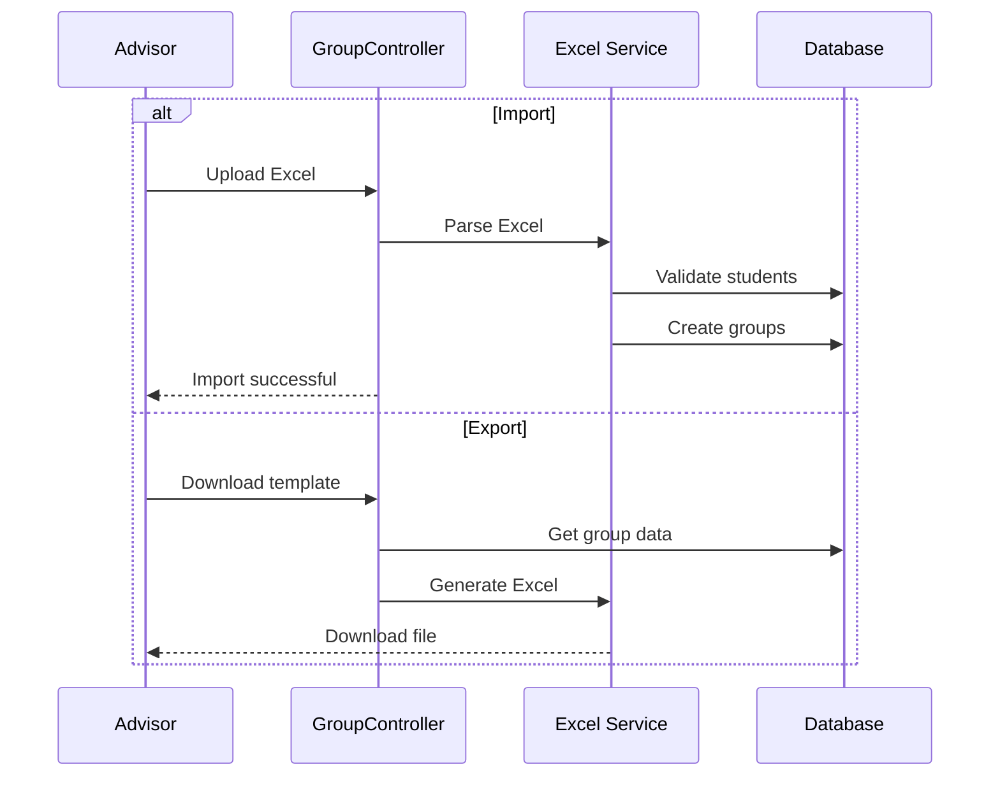
```mermaid
sequenceDiagram
    participant Ad as Advisor
    participant GC as GroupController
    participant EX as Excel Service
    participant DB as Database

    alt Import
        Ad->>GC: Upload Excel
        GC->>EX: Parse Excel
        EX->>DB: Validate students
        EX->>DB: Create groups
        GC-->>Ad: Import successful
    else Export
        Ad->>GC: Download template
        GC->>DB: Get group data
        GC->>EX: Generate Excel
        EX-->>Ad: Download file
    end
```

---

## 7. Admin Workflows

### 7.1 API Synchronization
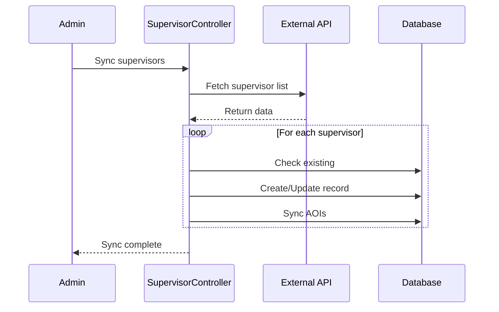
```mermaid
sequenceDiagram
    participant A as Admin
    participant SC as SupervisorController
    participant API as External API
    participant DB as Database

    A->>SC: Sync supervisors
    SC->>API: Fetch supervisor list
    API-->>SC: Return data
    
    loop For each supervisor
        SC->>DB: Check existing
        SC->>DB: Create/Update record
        SC->>DB: Sync AOIs
    end
    
    SC-->>A: Sync complete
```

### 7.2 Batch Management
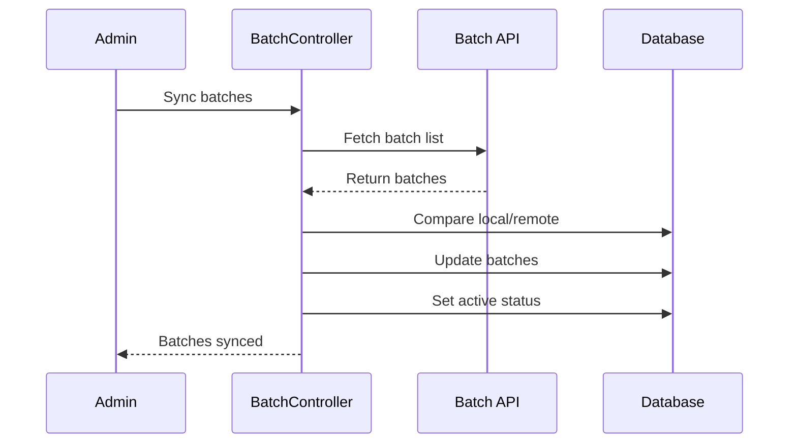
```mermaid
sequenceDiagram
    participant A as Admin
    participant BC as BatchController
    participant API as Batch API
    participant DB as Database

    A->>BC: Sync batches
    BC->>API: Fetch batch list
    API-->>BC: Return batches
    BC->>DB: Compare local/remote
    BC->>DB: Update batches
    BC->>DB: Set active status
    BC-->>A: Batches synced
```

### 7.3 Performance Monitoring
```mermaid
sequenceDiagram
    participant A as Admin
    participant PC as PerformanceController
    participant PMS as MonitoringService
    participant DB as Database

    A->>PC: View metrics
    PC->>PMS: Collect metrics
    PMS->>DB: Query performance
    PMS->>PMS: Calculate stats
    PMS-->>PC: Return metrics
    PC-->>A: Display dashboard
```

### 7.4 Global Group Management
```mermaid
sequenceDiagram
    participant A as Admin
    participant GMC as GroupManagementController
    participant DB as Database

    A->>GMC: Manage groups
    GMC->>DB: Get all groups
    GMC-->>A: Show groups
    
    alt Assign Supervisor
        A->>GMC: Select supervisor
        GMC->>DB: Check capacity
        GMC->>DB: Update assignment
    else Assign Students
        A->>GMC: Add students
        GMC->>DB: Create associations
    else Delete Group
        A->>GMC: Delete empty group
        GMC->>DB: Check if empty
        GMC->>DB: Delete record
    end
    
    GMC-->>A: Operation complete
```

---

## 8. Report Management

### 8.1 Report Lifecycle
```mermaid
sequenceDiagram
    participant Su as Supervisor
    participant R as Report
    participant St as Student
    participant PM as Panel Member
    participant DB as Database

    Su->>DB: Create report (draft)
    DB->>St: Notify students
    St->>DB: Submit PDF
    Su->>DB: Review submission
    Su->>DB: Add annotations
    PM->>DB: Review & annotate
    Su->>DB: Approve report
    DB->>DB: Update status (approved)
    DB->>St: Notify completion
```

### 8.2 Comment System
```mermaid
sequenceDiagram
    participant T as Teacher
    participant CC as CommentController
    participant DB as Database
    participant N as NotificationService

    T->>CC: Add comment
    CC->>DB: Verify supervisor
    
    alt Is Supervisor
        CC->>DB: Save comment
        CC->>N: Notify students
        CC-->>T: Comment added
    else Not Supervisor
        CC-->>T: Access denied
    end
```

---

## 9. Meeting Management

### 9.1 Meeting Attendance
```mermaid
sequenceDiagram
    participant Su as Supervisor
    participant MC as MeetingController
    participant DB as Database
    participant PDF as PDF Service

    Su->>MC: View meeting
    MC->>DB: Get meeting details
    MC->>DB: Get attendances
    MC-->>Su: Show attendance
    Su->>MC: Mark attendance
    MC->>DB: Update records
    Su->>MC: Generate report
    MC->>PDF: Create PDF
    PDF-->>Su: Download report
```

---

## 10. Notification System

### 10.1 Notification Flow
```mermaid
sequenceDiagram
    participant S as System
    participant E as Event
    participant N as NotificationService
    participant DB as Database
    participant U as User

    S->>E: Trigger event
    E->>N: Create notification
    N->>DB: Store notification
    N->>U: Send notification
    
    alt Email Channel
        N->>U: Send email
    else Database Channel
        N->>DB: Store in DB
        U->>DB: Fetch notifications
    end
    
    U->>N: Mark as read
    N->>DB: Update status
```

### 10.2 Real-time Notifications
```mermaid
sequenceDiagram
    participant C as Client
    participant API as API Endpoint
    participant NC as NotificationController
    participant DB as Database

    loop Polling
        C->>API: Check notifications
        API->>NC: Get unread count
        NC->>DB: Query notifications
        NC-->>API: Return count
        API-->>C: Update badge
    end
    
    C->>API: Get notifications
    API->>NC: Fetch all
    NC->>DB: Get notifications
    NC-->>C: Display list
```

---

## System Architecture Overview

### Complete Request Flow
```mermaid
sequenceDiagram
    participant U as User
    participant MW as Middleware Stack
    participant R as Router
    participant C as Controller
    participant S as Service Layer
    participant M as Model
    participant DB as Database
    participant V as View

    U->>MW: HTTP Request
    MW->>MW: Auth Check
    MW->>MW: Role Check
    MW->>R: Route Request
    R->>C: Dispatch to Controller
    C->>S: Business Logic
    S->>M: Data Operations
    M->>DB: Database Query
    DB-->>M: Return Data
    M-->>S: Model Instances
    S-->>C: Processed Data
    C->>V: Render View
    V-->>U: HTTP Response
```

---

## Key Integration Points

### External API Integration
```mermaid
sequenceDiagram
    participant S as System
    participant AS as API Service
    participant API as External API
    participant DB as Database
    participant C as Cache

    S->>AS: Request data
    AS->>C: Check cache
    
    alt Cache Hit
        C-->>AS: Return cached
    else Cache Miss
        AS->>API: HTTP Request
        API-->>AS: API Response
        AS->>AS: Parse response
        AS->>C: Store in cache
        AS->>DB: Update database
    end
    
    AS-->>S: Return data
```

### File Upload Processing
```mermaid
sequenceDiagram
    participant U as User
    participant UC as UploadController
    participant V as Validator
    participant FS as File Storage
    participant DB as Database

    U->>UC: Upload file
    UC->>V: Validate file
    
    alt Valid File
        V->>FS: Store file
        FS->>FS: Generate path
        FS-->>UC: Return path
        UC->>DB: Save metadata
        UC-->>U: Upload success
    else Invalid File
        V-->>U: Validation error
    end
```

---

## Error Handling & Recovery

### Transaction Management
```mermaid
sequenceDiagram
    participant C as Controller
    participant DB as Database
    participant T as Transaction
    participant L as Logger

    C->>T: Begin transaction
    T->>DB: Execute queries
    
    alt Success
        DB-->>T: All successful
        T->>T: Commit
        T-->>C: Success
    else Failure
        DB-->>T: Error occurred
        T->>T: Rollback
        T->>L: Log error
        T-->>C: Failure
        C-->>C: Handle error
    end
```

---

## Security Flows

### CSRF Protection
```mermaid
sequenceDiagram
    participant U as User
    participant F as Form
    participant MW as CSRF Middleware
    participant C as Controller

    U->>F: Request form
    F->>F: Generate CSRF token
    F-->>U: Form with token
    U->>MW: Submit with token
    MW->>MW: Verify token
    
    alt Valid Token
        MW->>C: Process request
        C-->>U: Success
    else Invalid Token
        MW-->>U: 419 Error
    end
```

---

## Notes

1. **Authentication**: Multi-type login system with external API integration
2. **Authorization**: Role-based middleware protection on all routes
3. **Data Flow**: Clear separation between controllers, services, and models
4. **Notifications**: Event-driven notification system with multiple channels
5. **File Management**: Centralized file storage with validation
6. **API Integration**: Throttled external API calls with caching
7. **Error Handling**: Comprehensive error handling with transaction support
8. **Security**: CSRF protection, session management, and role verification

These sequence diagrams represent the core workflows and interactions within the ThesisRepo system, providing a comprehensive view of how different components interact to deliver functionality.