# Sequence Diagrams - Thesis Repository Management System

## Table of Contents
1. [System Authentication](#1-system-authentication)
2. [Student Operations](#2-student-operations)
3. [Supervisor Operations](#3-supervisor-operations)
4. [Advisor Operations](#4-advisor-operations)
5. [Administrative Functions](#5-administrative-functions)
6. [System Architecture](#6-system-architecture)

---

## 1. System Authentication

### 1.1 User Authentication Process
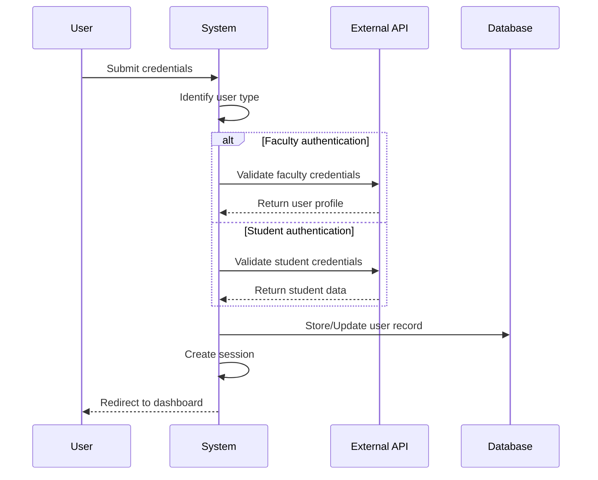
```mermaid
sequenceDiagram
    participant User
    participant System
    participant External API
    participant Database

    User->>System: Submit credentials
    System->>System: Identify user type
    
    alt Faculty authentication
        System->>External API: Validate faculty credentials
        External API-->>System: Return user profile
    else Student authentication
        System->>External API: Validate student credentials
        External API-->>System: Return student data
    end
    
    System->>Database: Store/Update user record
    System->>System: Create session
    System-->>User: Redirect to dashboard
```

### 1.2 Role-Based Access Control
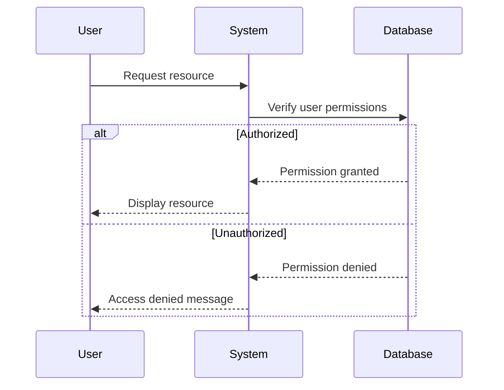
```mermaid
sequenceDiagram
    participant User
    participant System
    participant Database

    User->>System: Request resource
    System->>Database: Verify user permissions
    
    alt Authorized
        Database-->>System: Permission granted
        System-->>User: Display resource
    else Unauthorized
        Database-->>System: Permission denied
        System-->>User: Access denied message
    end
```

---

## 2. Student Operations

### 2.1 Report Submission Process
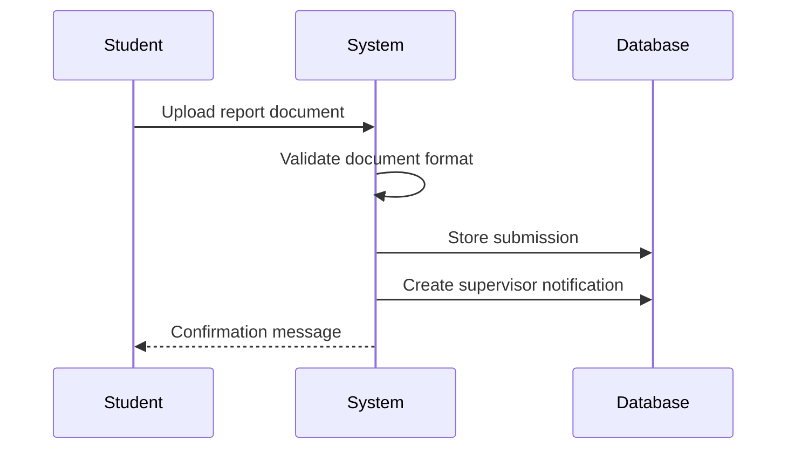
```mermaid
sequenceDiagram
    participant Student
    participant System
    participant Database

    Student->>System: Upload report document
    System->>System: Validate document format
    System->>Database: Store submission
    System->>Database: Create supervisor notification
    System-->>Student: Confirmation message
```

### 2.2 View Feedback and Annotations
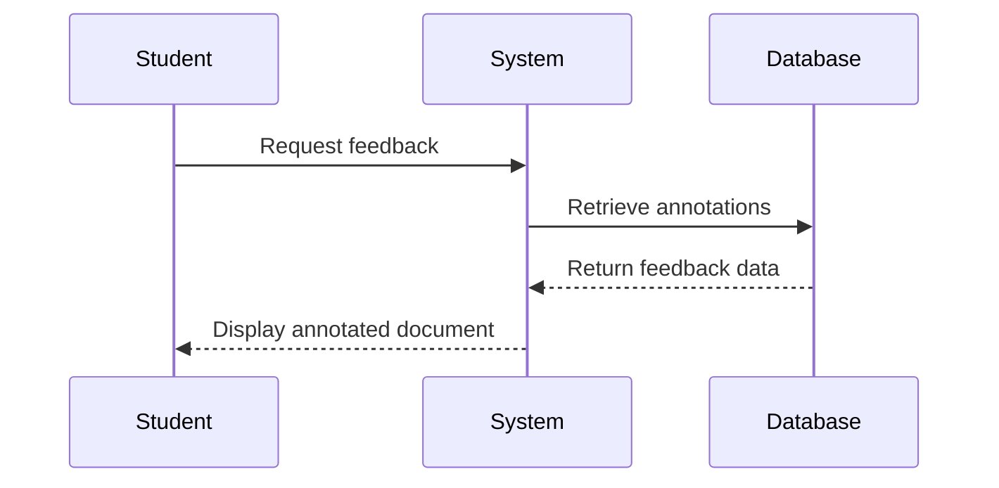
```mermaid
sequenceDiagram
    participant Student
    participant System
    participant Database

    Student->>System: Request feedback
    System->>Database: Retrieve annotations
    Database-->>System: Return feedback data
    System-->>Student: Display annotated document
```

### 2.3 Dashboard Notification System
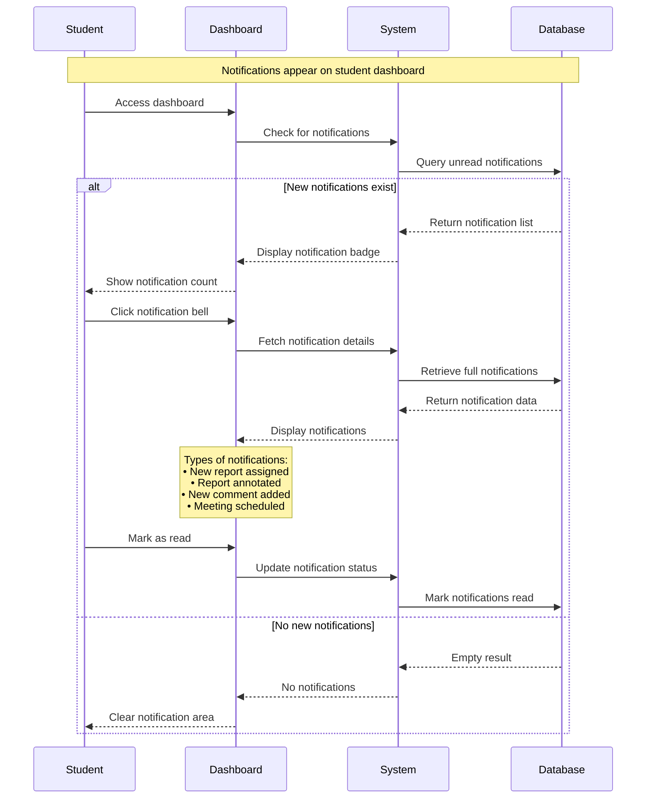
```mermaid
sequenceDiagram
    participant Student
    participant Dashboard
    participant System
    participant Database

    Note over Student,Database: Notifications appear on student dashboard
    
    Student->>Dashboard: Access dashboard
    Dashboard->>System: Check for notifications
    System->>Database: Query unread notifications
    
    alt New notifications exist
        Database-->>System: Return notification list
        System-->>Dashboard: Display notification badge
        Dashboard-->>Student: Show notification count
        
        Student->>Dashboard: Click notification bell
        Dashboard->>System: Fetch notification details
        System->>Database: Retrieve full notifications
        Database-->>System: Return notification data
        System-->>Dashboard: Display notifications
        
        Note over Dashboard: Types of notifications:<br/>• New report assigned<br/>• Report annotated<br/>• New comment added<br/>• Meeting scheduled
        
        Student->>Dashboard: Mark as read
        Dashboard->>System: Update notification status
        System->>Database: Mark notifications read
    else No new notifications
        Database-->>System: Empty result
        System-->>Dashboard: No notifications
        Dashboard-->>Student: Clear notification area
    end
```

---

## 3. Supervisor Operations

### 3.1 Report Management
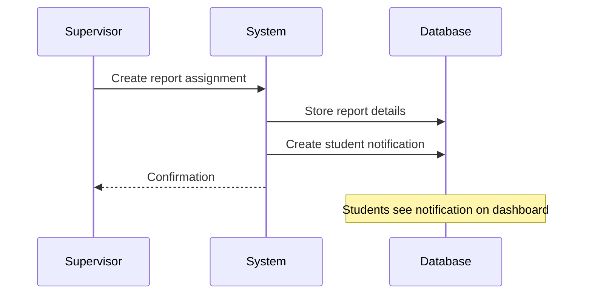
```mermaid
sequenceDiagram
    participant Supervisor
    participant System
    participant Database

    Supervisor->>System: Create report assignment
    System->>Database: Store report details
    System->>Database: Create student notification
    System-->>Supervisor: Confirmation
    
    Note over Database: Students see notification on dashboard
```

### 3.2 Document Annotation Process

#### 3.2.1 Annotation Creation and Storage
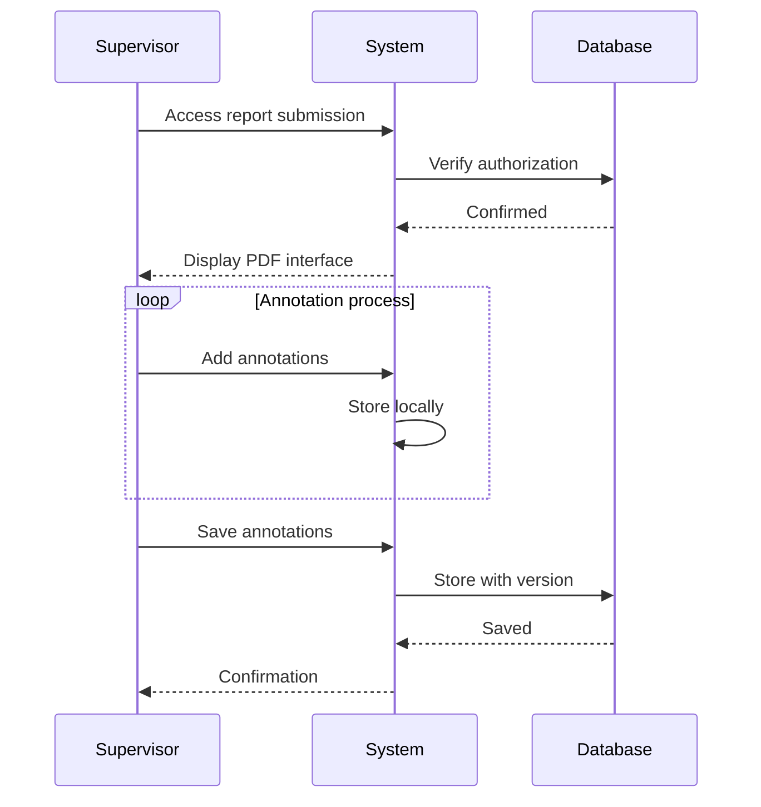
```mermaid
sequenceDiagram
    participant Supervisor
    participant System
    participant Database

    Supervisor->>System: Access report submission
    System->>Database: Verify authorization
    Database-->>System: Confirmed
    System-->>Supervisor: Display PDF interface
    
    loop Annotation process
        Supervisor->>System: Add annotations
        System->>System: Store locally
    end
    
    Supervisor->>System: Save annotations
    System->>Database: Store with version
    Database-->>System: Saved
    System-->>Supervisor: Confirmation
```

#### 3.2.2 Feedback Distribution
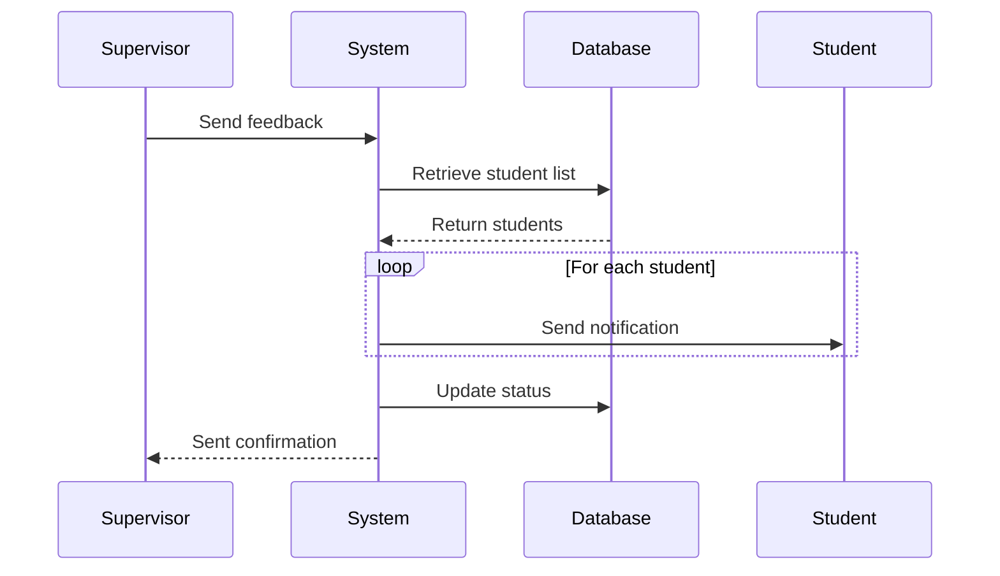
```mermaid
sequenceDiagram
    participant Supervisor
    participant System
    participant Database
    participant Student

    Supervisor->>System: Send feedback
    System->>Database: Retrieve student list
    Database-->>System: Return students
    
    loop For each student
        System->>Student: Send notification
    end
    
    System->>Database: Update status
    System-->>Supervisor: Sent confirmation
```

#### 3.2.3 Student Access to Annotations
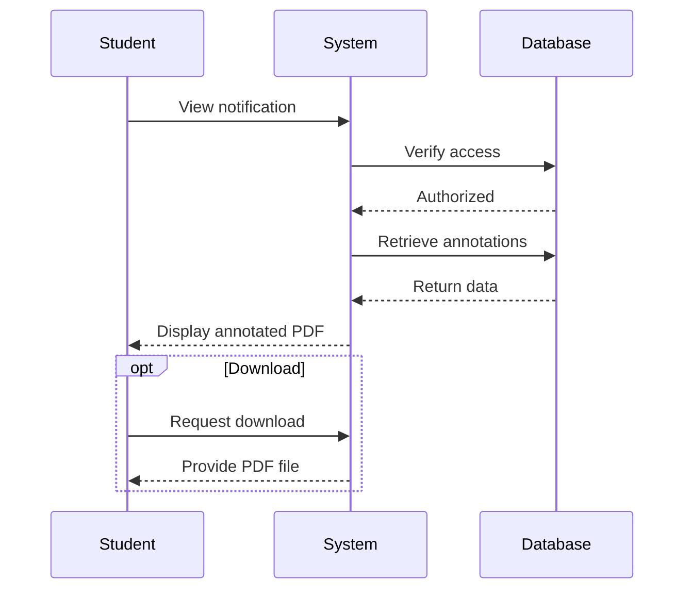
```mermaid
sequenceDiagram
    participant Student
    participant System
    participant Database

    Student->>System: View notification
    System->>Database: Verify access
    Database-->>System: Authorized
    
    System->>Database: Retrieve annotations
    Database-->>System: Return data
    System-->>Student: Display annotated PDF
    
    opt Download
        Student->>System: Request download
        System-->>Student: Provide PDF file
    end
```

### 3.3 Meeting Documentation
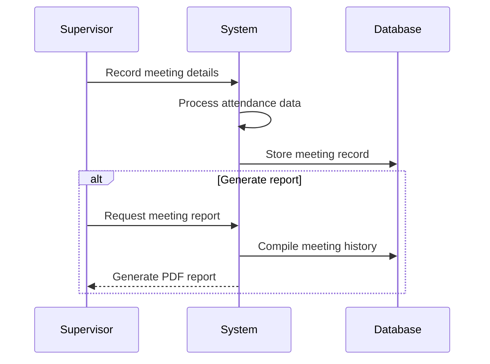
```mermaid
sequenceDiagram
    participant Supervisor
    participant System
    participant Database

    Supervisor->>System: Record meeting details
    System->>System: Process attendance data
    System->>Database: Store meeting record
    
    alt Generate report
        Supervisor->>System: Request meeting report
        System->>Database: Compile meeting history
        System-->>Supervisor: Generate PDF report
    end
```

---

## 4. Advisor Operations

### 4.1 Group Formation
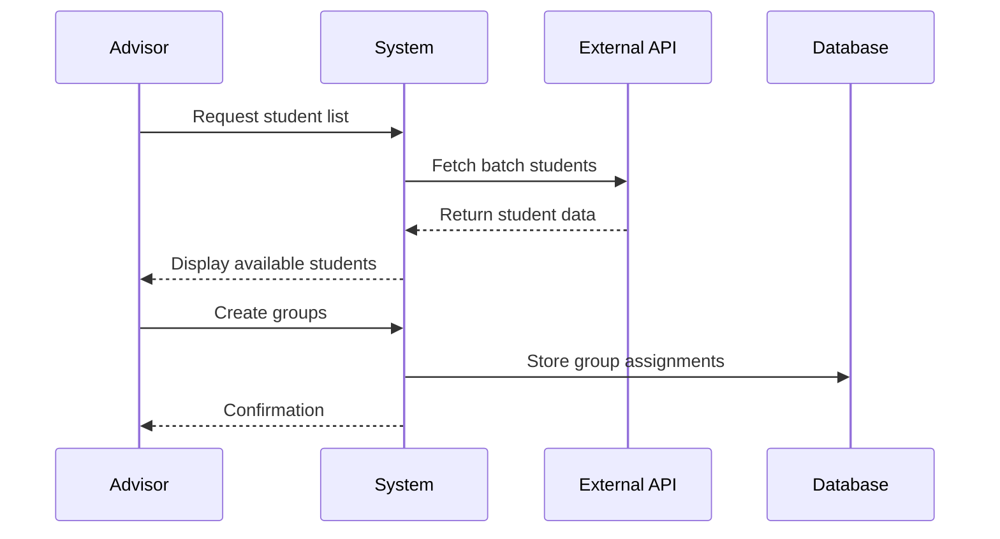
```mermaid
sequenceDiagram
    participant Advisor
    participant System
    participant External API
    participant Database

    Advisor->>System: Request student list
    System->>External API: Fetch batch students
    External API-->>System: Return student data
    System-->>Advisor: Display available students
    Advisor->>System: Create groups
    System->>Database: Store group assignments
    System-->>Advisor: Confirmation
```

### 4.2 Supervisor Assignment System

#### 4.2.1 Automated Assignment Process
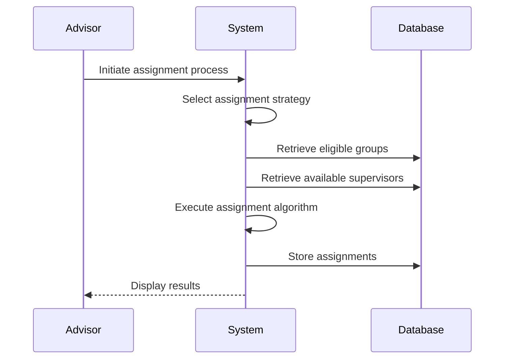
```mermaid
sequenceDiagram
    participant Advisor
    participant System
    participant Database

    Advisor->>System: Initiate assignment process
    System->>System: Select assignment strategy
    System->>Database: Retrieve eligible groups
    System->>Database: Retrieve available supervisors
    System->>System: Execute assignment algorithm
    System->>Database: Store assignments
    System-->>Advisor: Display results
```

#### 4.2.2 Area of Interest Based Assignment
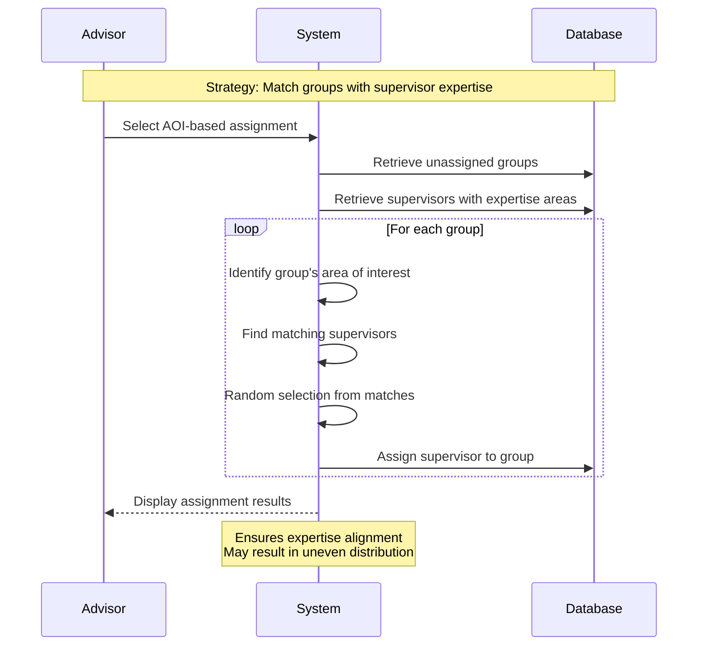
```mermaid
sequenceDiagram
    participant Advisor
    participant System
    participant Database

    Note over Advisor,Database: Strategy: Match groups with supervisor expertise
    
    Advisor->>System: Select AOI-based assignment
    System->>Database: Retrieve unassigned groups
    System->>Database: Retrieve supervisors with expertise areas
    
    loop For each group
        System->>System: Identify group's area of interest
        System->>System: Find matching supervisors
        System->>System: Random selection from matches
        System->>Database: Assign supervisor to group
    end
    
    System-->>Advisor: Display assignment results
    
    Note over System: Ensures expertise alignment<br/>May result in uneven distribution
```

#### 4.2.3 Ranking Based Assignment
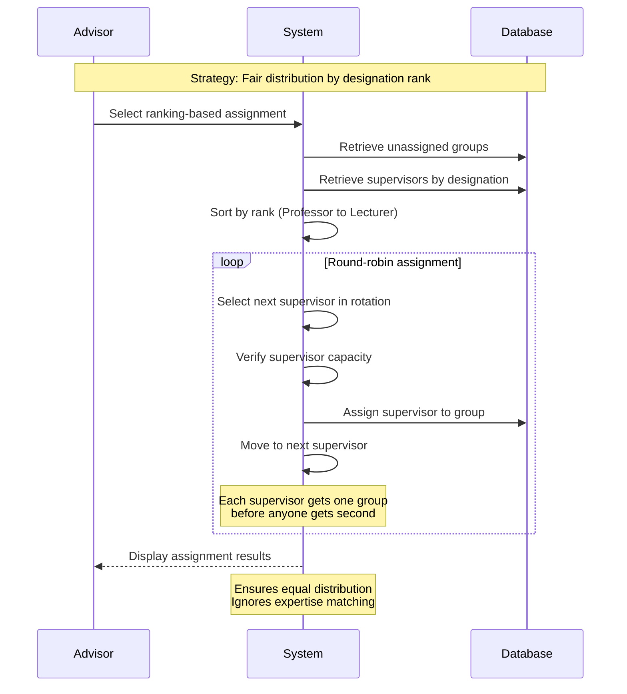
```mermaid
sequenceDiagram
    participant Advisor
    participant System
    participant Database

    Note over Advisor,Database: Strategy: Fair distribution by designation rank
    
    Advisor->>System: Select ranking-based assignment
    System->>Database: Retrieve unassigned groups
    System->>Database: Retrieve supervisors by designation
    System->>System: Sort by rank (Professor to Lecturer)
    
    loop Round-robin assignment
        System->>System: Select next supervisor in rotation
        System->>System: Verify supervisor capacity
        System->>Database: Assign supervisor to group
        System->>System: Move to next supervisor
        
        Note over System: Each supervisor gets one group<br/>before anyone gets second
    end
    
    System-->>Advisor: Display assignment results
    
    Note over System: Ensures equal distribution<br/>Ignores expertise matching
```

#### 4.2.4 Hybrid Assignment Strategy
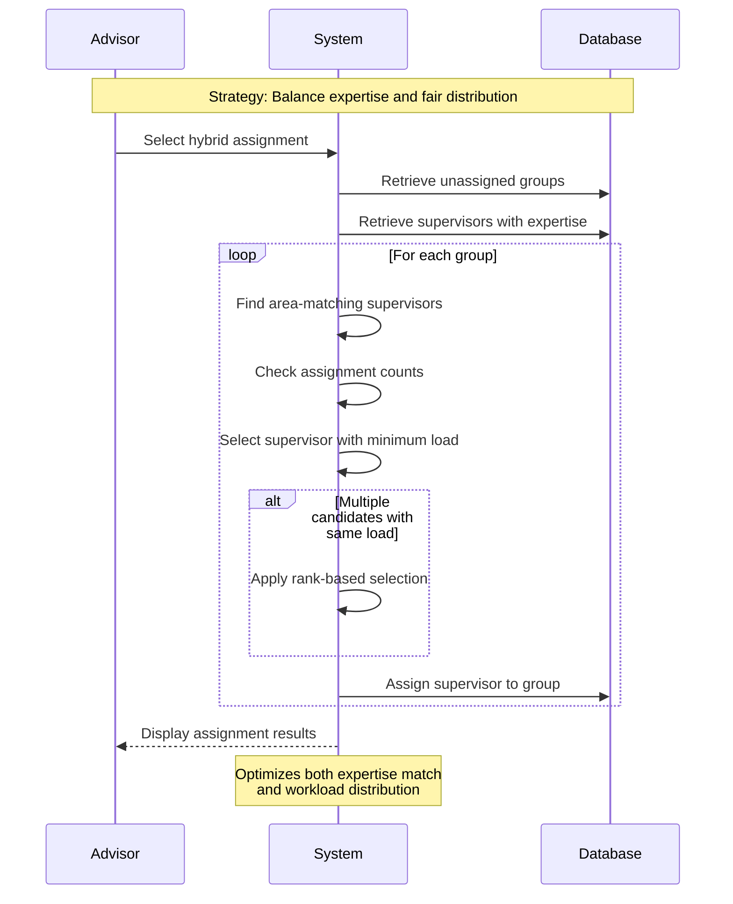
```mermaid
sequenceDiagram
    participant Advisor
    participant System
    participant Database

    Note over Advisor,Database: Strategy: Balance expertise and fair distribution
    
    Advisor->>System: Select hybrid assignment
    System->>Database: Retrieve unassigned groups
    System->>Database: Retrieve supervisors with expertise
    
    loop For each group
        System->>System: Find area-matching supervisors
        System->>System: Check assignment counts
        System->>System: Select supervisor with minimum load
        
        alt Multiple candidates with same load
            System->>System: Apply rank-based selection
        end
        
        System->>Database: Assign supervisor to group
    end
    
    System-->>Advisor: Display assignment results
    
    Note over System: Optimizes both expertise match<br/>and workload distribution
```

#### 4.2.5 Assignment Strategy Comparison
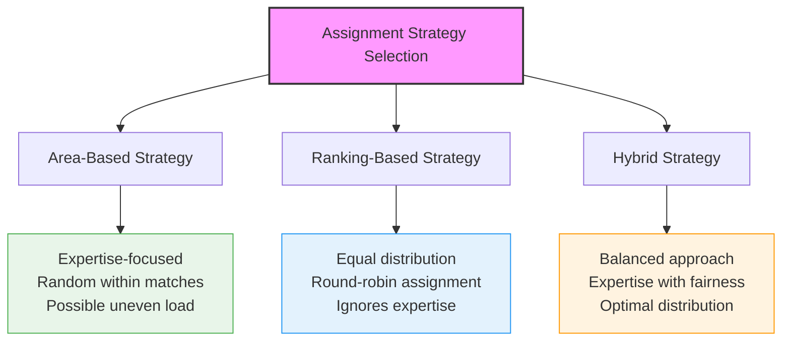
```mermaid
graph TD
    Start[Assignment Strategy Selection]
    
    Start --> AOI[Area-Based Strategy]
    Start --> Rank[Ranking-Based Strategy]
    Start --> Hybrid[Hybrid Strategy]
    
    AOI --> AOIResult[Expertise-focused<br/>Random within matches<br/>Possible uneven load]
    Rank --> RankResult[Equal distribution<br/>Round-robin assignment<br/>Ignores expertise]
    Hybrid --> HybridResult[Balanced approach<br/>Expertise with fairness<br/>Optimal distribution]
    
    style Start fill:#f9f,stroke:#333,stroke-width:2px
    style AOIResult fill:#e8f5e9,stroke:#4caf50,stroke-width:1px
    style RankResult fill:#e3f2fd,stroke:#2196f3,stroke-width:1px
    style HybridResult fill:#fff3e0,stroke:#ff9800,stroke-width:1px
```

### 4.3 Data Import/Export
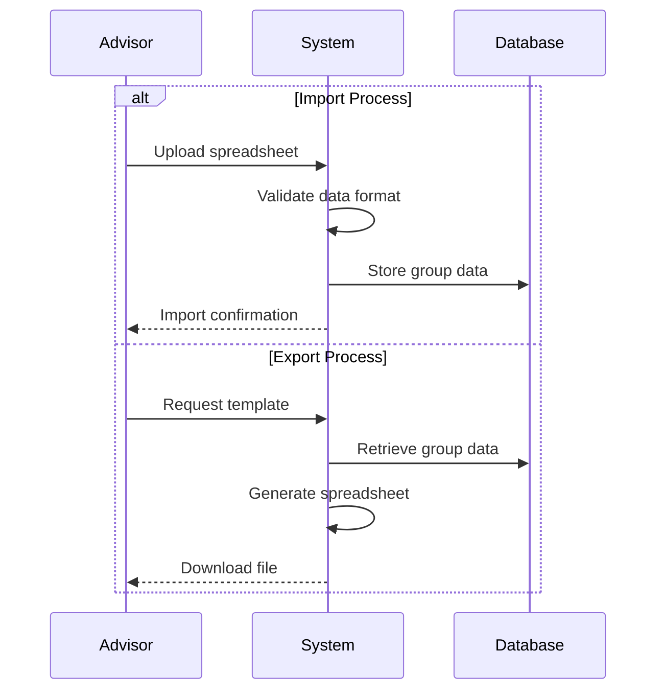
```mermaid
sequenceDiagram
    participant Advisor
    participant System
    participant Database

    alt Import Process
        Advisor->>System: Upload spreadsheet
        System->>System: Validate data format
        System->>Database: Store group data
        System-->>Advisor: Import confirmation
    else Export Process
        Advisor->>System: Request template
        System->>Database: Retrieve group data
        System->>System: Generate spreadsheet
        System-->>Advisor: Download file
    end
```

---

## 5. Administrative Functions

### 5.1 External Data Synchronization
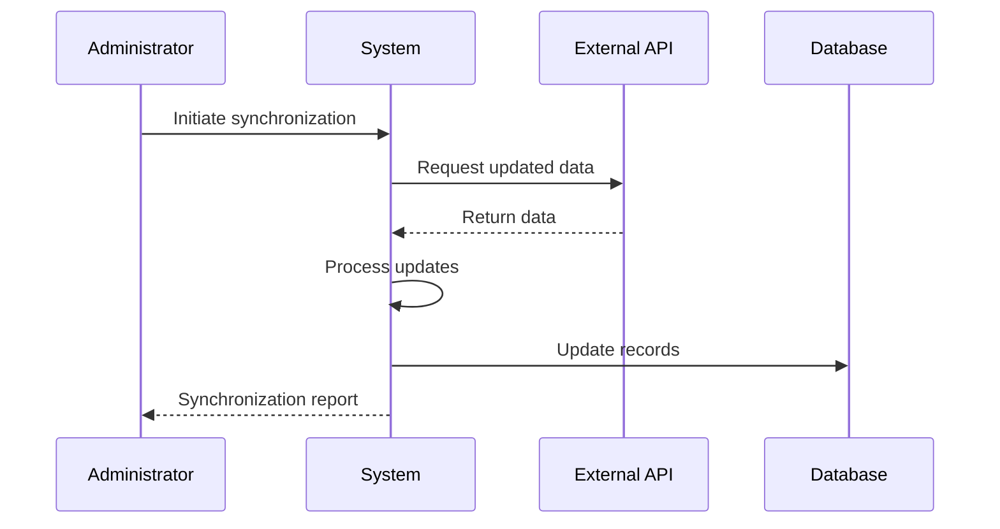
```mermaid
sequenceDiagram
    participant Administrator
    participant System
    participant External API
    participant Database

    Administrator->>System: Initiate synchronization
    System->>External API: Request updated data
    External API-->>System: Return data
    System->>System: Process updates
    System->>Database: Update records
    System-->>Administrator: Synchronization report
```

### 5.2 System Monitoring
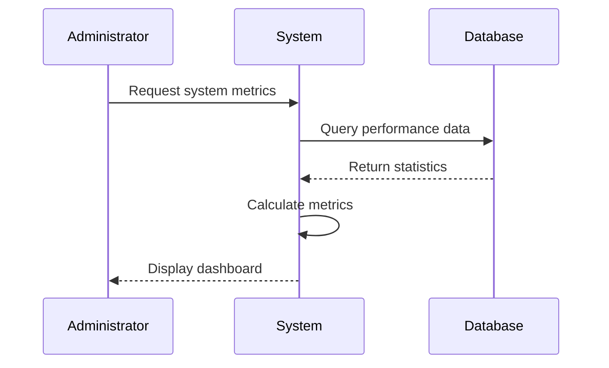
```mermaid
sequenceDiagram
    participant Administrator
    participant System
    participant Database

    Administrator->>System: Request system metrics
    System->>Database: Query performance data
    Database-->>System: Return statistics
    System->>System: Calculate metrics
    System-->>Administrator: Display dashboard
```

---

## 6. System Architecture

### 6.1 Request Processing Flow
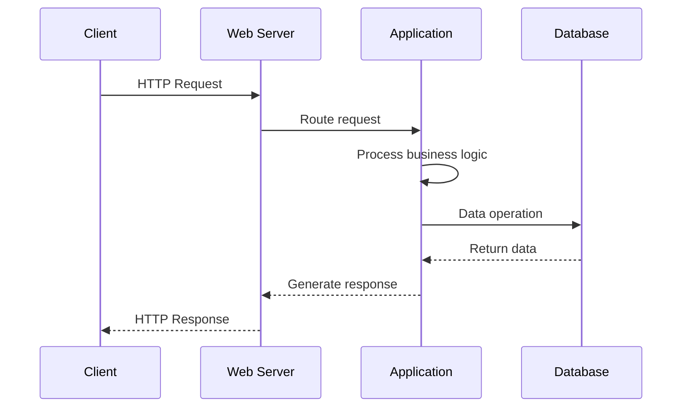
```mermaid
sequenceDiagram
    participant Client
    participant Web Server
    participant Application
    participant Database

    Client->>Web Server: HTTP Request
    Web Server->>Application: Route request
    Application->>Application: Process business logic
    Application->>Database: Data operation
    Database-->>Application: Return data
    Application-->>Web Server: Generate response
    Web Server-->>Client: HTTP Response
```

### 6.2 File Management
```mermaid
sequenceDiagram
    participant User
    participant System
    participant Storage
    participant Database

    User->>System: Upload file
    System->>System: Validate file
    
    alt Valid file
        System->>Storage: Store file
        System->>Database: Save metadata
        System-->>User: Upload successful
    else Invalid file
        System-->>User: Validation error
    end
```

---

## System Components Description

### Core Components
- **Client**: End-user interface (web browser)
- **System**: Application server handling business logic
- **Database**: Persistent data storage
- **External API**: University information systems
- **Storage**: File storage service

### User Roles
- **Student**: Thesis/project students
- **Supervisor**: Faculty members supervising groups
- **Advisor**: Faculty coordinating student groups
- **Administrator**: System administrators

### Key Features
1. **Authentication**: Multi-role authentication with external API integration
2. **Group Management**: Formation and assignment of student groups
3. **Report Workflow**: Creation, submission, and review of reports
4. **Meeting Documentation**: Recording and tracking of supervision meetings
5. **Automated Assignment**: Algorithmic supervisor-group matching
6. **Data Synchronization**: Integration with university systems
7. **In-App Notifications**: Dashboard-based notifications for students on report updates

---

## Notes
These sequence diagrams illustrate the primary interactions within the Thesis Repository Management System, demonstrating the flow of information between system components and user roles. The diagrams follow UML 2.0 notation standards and focus on essential system behaviors rather than implementation details.