# Sequence Diagrams - Thesis Repository Management System

## Table of Contents
1. [System Authentication](#1-system-authentication)
2. [Student Operations](#2-student-operations)
3. [Supervisor Operations](#3-supervisor-operations)
4. [Co-Supervisor Operations](#4-co-supervisor-operations)
5. [Panel Member Operations](#5-panel-member-operations)
6. [Advisor Operations](#6-advisor-operations)
7. [Supervisor Assignment Algorithms](#7-supervisor-assignment-algorithms)
8. [Administrative Functions](#8-administrative-functions)
9. [Multi-Role Collaboration](#9-multi-role-collaboration)
10. [System Architecture](#10-system-architecture)

---

## 1. System Authentication

### 1.1 User Authentication Process
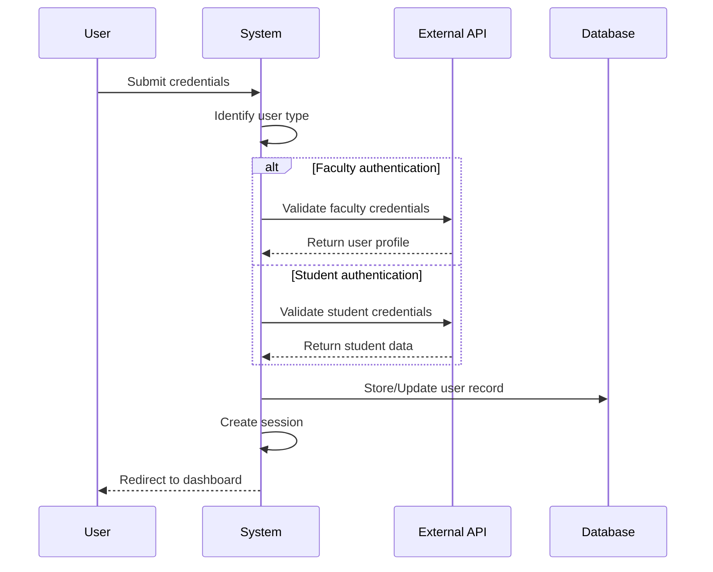
```mermaid
sequenceDiagram
    participant User
    participant System
    participant External API
    participant Database

    User->>System: Submit credentials
    System->>System: Identify user type
    
    alt Faculty authentication
        System->>External API: Validate faculty credentials
        External API-->>System: Return user profile
    else Student authentication
        System->>External API: Validate student credentials
        External API-->>System: Return student data
    end
    
    System->>Database: Store/Update user record
    System->>System: Create session
    System-->>User: Redirect to dashboard
```

### 1.2 Role-Based Access Control
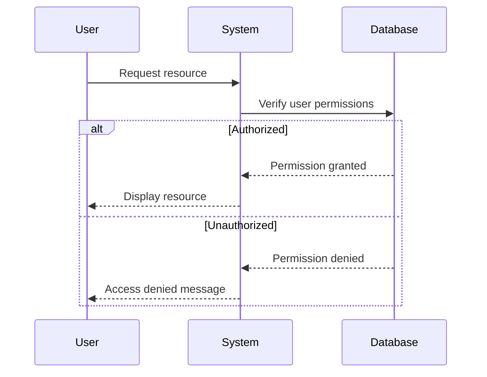
```mermaid
sequenceDiagram
    participant User
    participant System
    participant Database

    User->>System: Request resource
    System->>Database: Verify user permissions
    
    alt Authorized
        Database-->>System: Permission granted
        System-->>User: Display resource
    else Unauthorized
        Database-->>System: Permission denied
        System-->>User: Access denied message
    end
```

### 1.3 Enhanced Authentication with Fallback
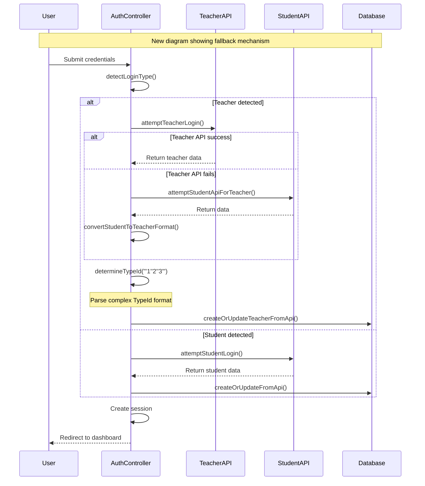
```mermaid
sequenceDiagram
    participant User
    participant Controller as AuthController
    participant TeacherAPI
    participant StudentAPI
    participant Database

    Note over User,Database: New diagram showing fallback mechanism
    
    User->>Controller: Submit credentials
    Controller->>Controller: detectLoginType()
    
    alt Teacher detected
        Controller->>TeacherAPI: attemptTeacherLogin()
        
        alt Teacher API success
            TeacherAPI-->>Controller: Return teacher data
        else Teacher API fails
            Controller->>StudentAPI: attemptStudentApiForTeacher()
            StudentAPI-->>Controller: Return data
            Controller->>Controller: convertStudentToTeacherFormat()
        end
        
        Controller->>Controller: determineTypeId("'1''2''3'")
        Note over Controller: Parse complex TypeId format
        Controller->>Database: createOrUpdateTeacherFromApi()
    else Student detected
        Controller->>StudentAPI: attemptStudentLogin()
        StudentAPI-->>Controller: Return student data
        Controller->>Database: createOrUpdateFromApi()
    end
    
    Controller->>Controller: Create session
    Controller-->>User: Redirect to dashboard
```

---

## 2. Student Operations

### 2.1 Report Submission Process
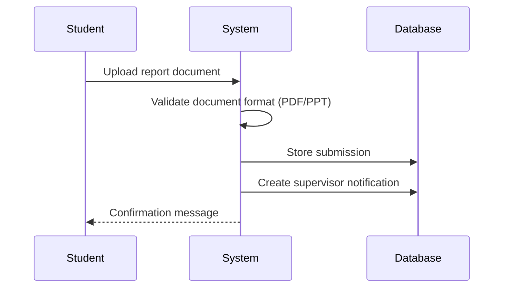
```mermaid
sequenceDiagram
    participant Student
    participant System
    participant Database

    Student->>System: Upload report document
    System->>System: Validate document format (PDF/PPT)
    System->>Database: Store submission
    System->>Database: Create supervisor notification
    System-->>Student: Confirmation message
```

### 2.2 View Feedback and Annotations
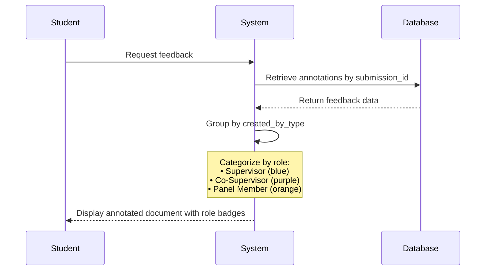
```mermaid
sequenceDiagram
    participant Student
    participant System
    participant Database

    Student->>System: Request feedback
    System->>Database: Retrieve annotations by submission_id
    Database-->>System: Return feedback data
    
    System->>System: Group by created_by_type
    Note over System: Categorize by role:<br/>• Supervisor (blue)<br/>• Co-Supervisor (purple)<br/>• Panel Member (orange)
    
    System-->>Student: Display annotated document with role badges
```

### 2.3 Dashboard Notification System
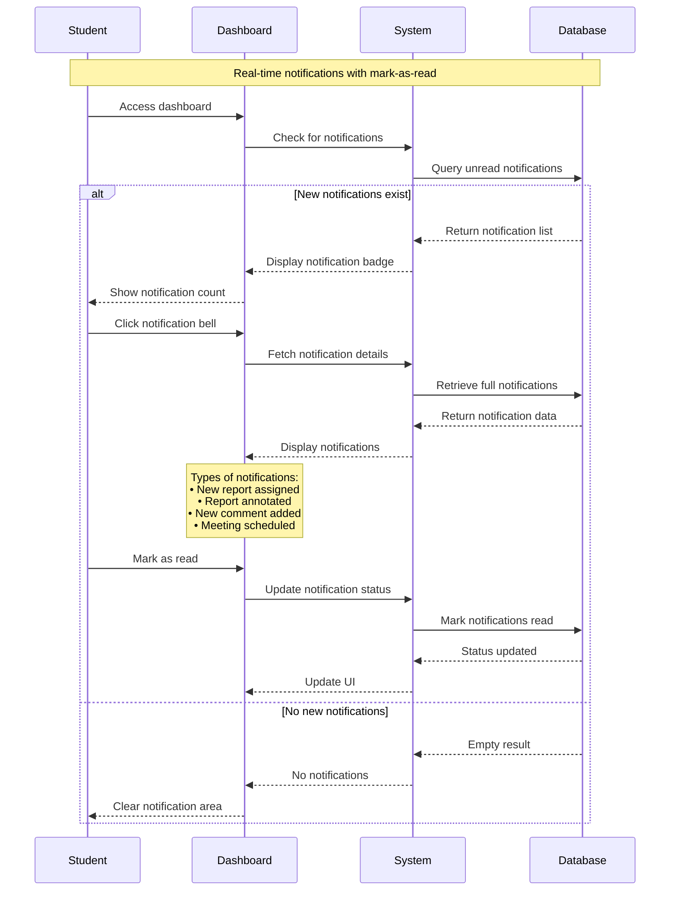
```mermaid
sequenceDiagram
    participant Student
    participant Dashboard
    participant System
    participant Database

    Note over Student,Database: Real-time notifications with mark-as-read
    
    Student->>Dashboard: Access dashboard
    Dashboard->>System: Check for notifications
    System->>Database: Query unread notifications
    
    alt New notifications exist
        Database-->>System: Return notification list
        System-->>Dashboard: Display notification badge
        Dashboard-->>Student: Show notification count
        
        Student->>Dashboard: Click notification bell
        Dashboard->>System: Fetch notification details
        System->>Database: Retrieve full notifications
        Database-->>System: Return notification data
        System-->>Dashboard: Display notifications
        
        Note over Dashboard: Types of notifications:<br/>• New report assigned<br/>• Report annotated<br/>• New comment added<br/>• Meeting scheduled
        
        Student->>Dashboard: Mark as read
        Dashboard->>System: Update notification status
        System->>Database: Mark notifications read
        Database-->>System: Status updated
        System-->>Dashboard: Update UI
    else No new notifications
        Database-->>System: Empty result
        System-->>Dashboard: No notifications
        Dashboard-->>Student: Clear notification area
    end
```

---

## 3. Supervisor Operations

### 3.1 Report Management
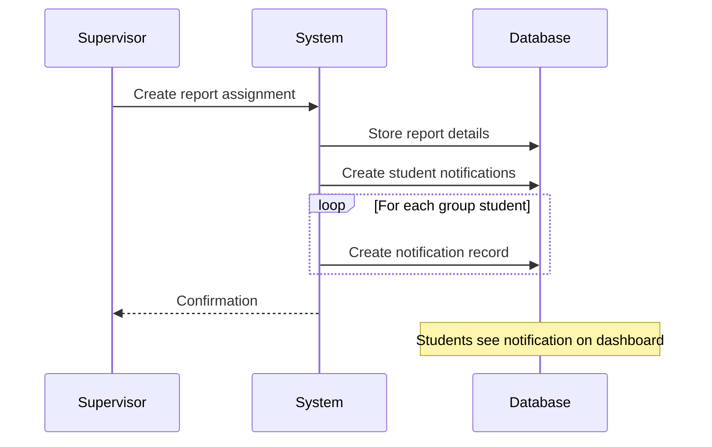
```mermaid
sequenceDiagram
    participant Supervisor
    participant System
    participant Database

    Supervisor->>System: Create report assignment
    System->>Database: Store report details
    System->>Database: Create student notifications
    
    loop For each group student
        System->>Database: Create notification record
    end
    
    System-->>Supervisor: Confirmation
    
    Note over Database: Students see notification on dashboard
```

### 3.2 Document Annotation Process

#### 3.2.1 Annotation Creation with Draft State
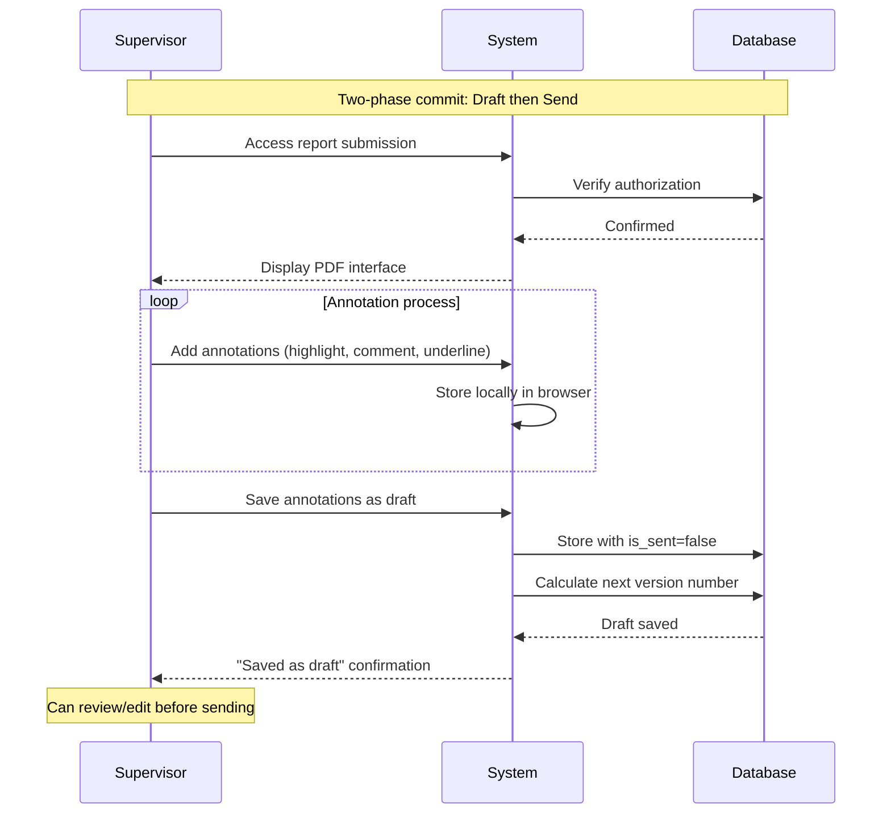
```mermaid
sequenceDiagram
    participant Supervisor
    participant System
    participant Database

    Note over Supervisor,Database: Two-phase commit: Draft then Send
    
    Supervisor->>System: Access report submission
    System->>Database: Verify authorization
    Database-->>System: Confirmed
    System-->>Supervisor: Display PDF interface
    
    loop Annotation process
        Supervisor->>System: Add annotations (highlight, comment, underline)
        System->>System: Store locally in browser
    end
    
    Supervisor->>System: Save annotations as draft
    System->>Database: Store with is_sent=false
    System->>Database: Calculate next version number
    Database-->>System: Draft saved
    System-->>Supervisor: "Saved as draft" confirmation
    
    Note over Supervisor: Can review/edit before sending
```

#### 3.2.2 Feedback Distribution
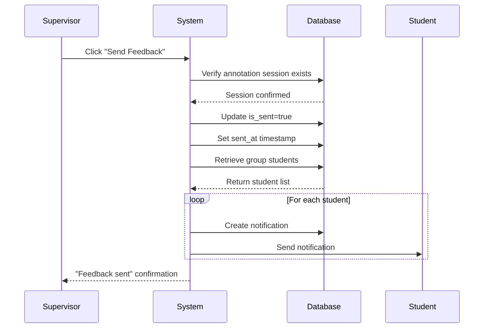
```mermaid
sequenceDiagram
    participant Supervisor
    participant System
    participant Database
    participant Student

    Supervisor->>System: Click "Send Feedback"
    System->>Database: Verify annotation session exists
    Database-->>System: Session confirmed
    
    System->>Database: Update is_sent=true
    System->>Database: Set sent_at timestamp
    
    System->>Database: Retrieve group students
    Database-->>System: Return student list
    
    loop For each student
        System->>Database: Create notification
        System->>Student: Send notification
    end
    
    System-->>Supervisor: "Feedback sent" confirmation
```

#### 3.2.3 Student Access to Annotations
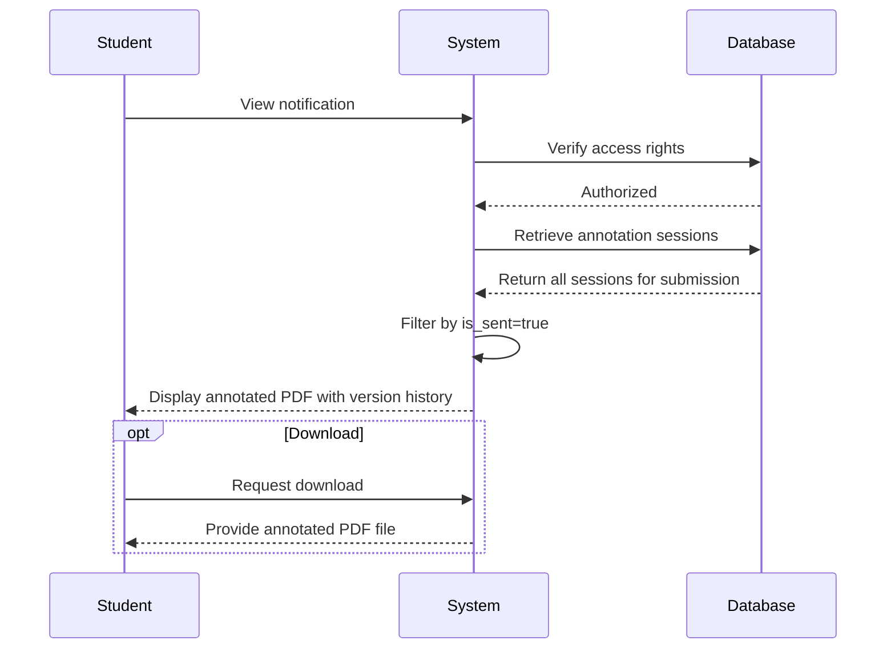
```mermaid
sequenceDiagram
    participant Student
    participant System
    participant Database

    Student->>System: View notification
    System->>Database: Verify access rights
    Database-->>System: Authorized
    
    System->>Database: Retrieve annotation sessions
    Database-->>System: Return all sessions for submission
    
    System->>System: Filter by is_sent=true
    System-->>Student: Display annotated PDF with version history
    
    opt Download
        Student->>System: Request download
        System-->>Student: Provide annotated PDF file
    end
```

### 3.3 Meeting Documentation
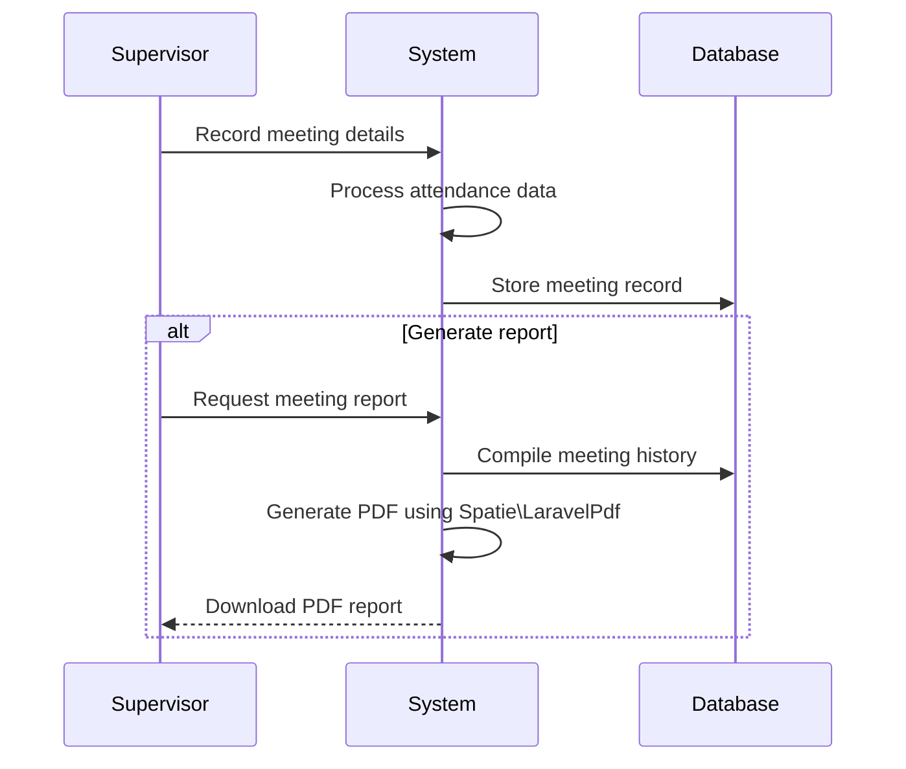
```mermaid
sequenceDiagram
    participant Supervisor
    participant System
    participant Database

    Supervisor->>System: Record meeting details
    System->>System: Process attendance data
    System->>Database: Store meeting record
    
    alt Generate report
        Supervisor->>System: Request meeting report
        System->>Database: Compile meeting history
        System->>System: Generate PDF using Spatie\LaravelPdf
        System-->>Supervisor: Download PDF report
    end
```

---

## 4. Co-Supervisor Operations

### 4.1 Co-Supervisor Dashboard Access
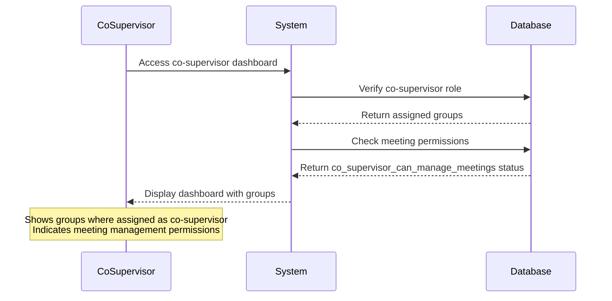
```mermaid
sequenceDiagram
    participant CoSupervisor
    participant System
    participant Database

    CoSupervisor->>System: Access co-supervisor dashboard
    System->>Database: Verify co-supervisor role
    Database-->>System: Return assigned groups
    System->>Database: Check meeting permissions
    Database-->>System: Return co_supervisor_can_manage_meetings status
    System-->>CoSupervisor: Display dashboard with groups
    
    Note over CoSupervisor: Shows groups where assigned as co-supervisor<br/>Indicates meeting management permissions
```

### 4.2 Conditional Meeting Management
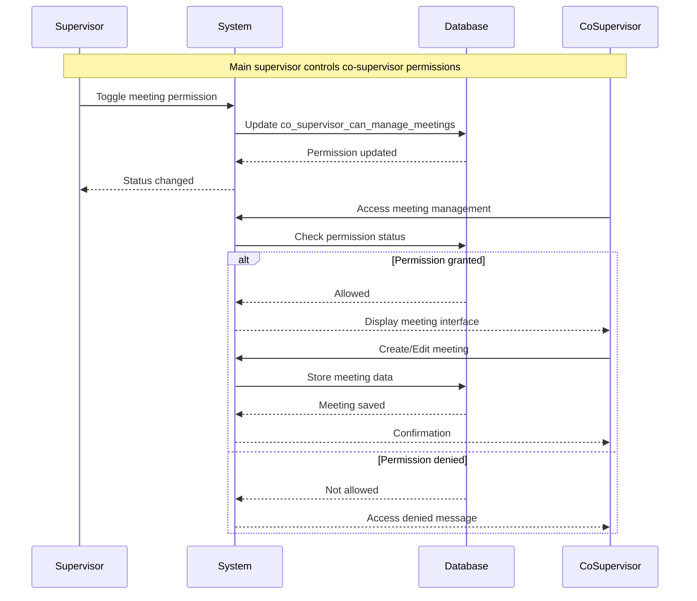
```mermaid
sequenceDiagram
    participant Supervisor
    participant System
    participant Database
    participant CoSupervisor

    Note over Supervisor,CoSupervisor: Main supervisor controls co-supervisor permissions
    
    Supervisor->>System: Toggle meeting permission
    System->>Database: Update co_supervisor_can_manage_meetings
    Database-->>System: Permission updated
    System-->>Supervisor: Status changed
    
    CoSupervisor->>System: Access meeting management
    System->>Database: Check permission status
    
    alt Permission granted
        Database-->>System: Allowed
        System-->>CoSupervisor: Display meeting interface
        
        CoSupervisor->>System: Create/Edit meeting
        System->>Database: Store meeting data
        Database-->>System: Meeting saved
        System-->>CoSupervisor: Confirmation
    else Permission denied
        Database-->>System: Not allowed
        System-->>CoSupervisor: Access denied message
    end
```

### 4.3 Co-Supervisor Report Review
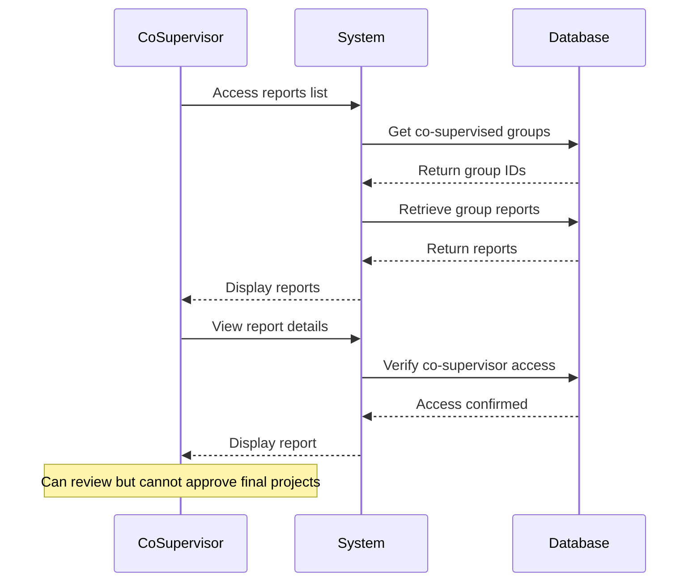
```mermaid
sequenceDiagram
    participant CoSupervisor
    participant System
    participant Database

    CoSupervisor->>System: Access reports list
    System->>Database: Get co-supervised groups
    Database-->>System: Return group IDs
    System->>Database: Retrieve group reports
    Database-->>System: Return reports
    System-->>CoSupervisor: Display reports
    
    CoSupervisor->>System: View report details
    System->>Database: Verify co-supervisor access
    Database-->>System: Access confirmed
    System-->>CoSupervisor: Display report
    
    Note over CoSupervisor: Can review but cannot approve final projects
```

### 4.4 Co-Supervisor Annotation Process
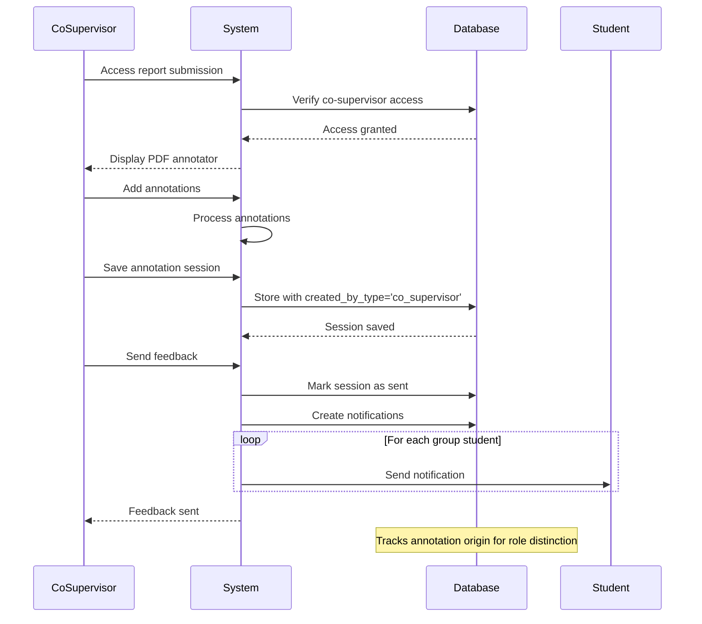
```mermaid
sequenceDiagram
    participant CoSupervisor
    participant System
    participant Database
    participant Student

    CoSupervisor->>System: Access report submission
    System->>Database: Verify co-supervisor access
    Database-->>System: Access granted
    System-->>CoSupervisor: Display PDF annotator
    
    CoSupervisor->>System: Add annotations
    System->>System: Process annotations
    CoSupervisor->>System: Save annotation session
    System->>Database: Store with created_by_type='co_supervisor'
    Database-->>System: Session saved
    
    CoSupervisor->>System: Send feedback
    System->>Database: Mark session as sent
    System->>Database: Create notifications
    
    loop For each group student
        System->>Student: Send notification
    end
    
    System-->>CoSupervisor: Feedback sent
    
    Note over Database: Tracks annotation origin for role distinction
```

### 4.5 Dual Feedback Mechanism
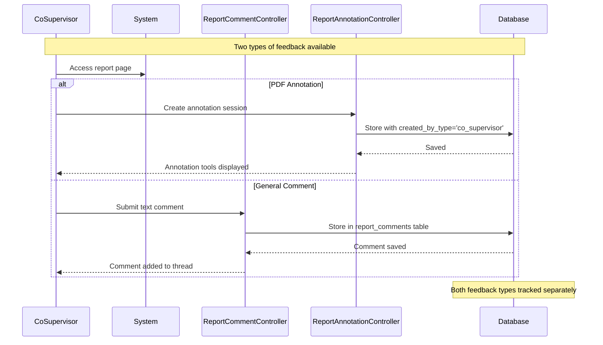
```mermaid
sequenceDiagram
    participant CoSupervisor
    participant System
    participant ReportCommentController
    participant ReportAnnotationController
    participant Database

    Note over CoSupervisor,Database: Two types of feedback available
    
    CoSupervisor->>System: Access report page
    
    alt PDF Annotation
        CoSupervisor->>ReportAnnotationController: Create annotation session
        ReportAnnotationController->>Database: Store with created_by_type='co_supervisor'
        Database-->>ReportAnnotationController: Saved
        ReportAnnotationController-->>CoSupervisor: Annotation tools displayed
    else General Comment
        CoSupervisor->>ReportCommentController: Submit text comment
        ReportCommentController->>Database: Store in report_comments table
        Database-->>ReportCommentController: Comment saved
        ReportCommentController-->>CoSupervisor: Comment added to thread
    end
    
    Note over Database: Both feedback types tracked separately
```

---

## 5. Panel Member Operations

### 5.1 Panel Member Dashboard (Evaluation-Only Access)
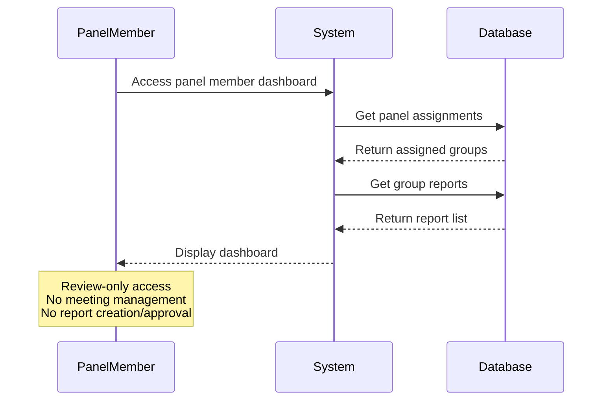
```mermaid
sequenceDiagram
    participant PanelMember
    participant System
    participant Database

    PanelMember->>System: Access panel member dashboard
    System->>Database: Get panel assignments
    Database-->>System: Return assigned groups
    System->>Database: Get group reports
    Database-->>System: Return report list
    System-->>PanelMember: Display dashboard
    
    Note over PanelMember: Review-only access<br/>No meeting management<br/>No report creation/approval
```

### 5.2 Panel Member Report Evaluation
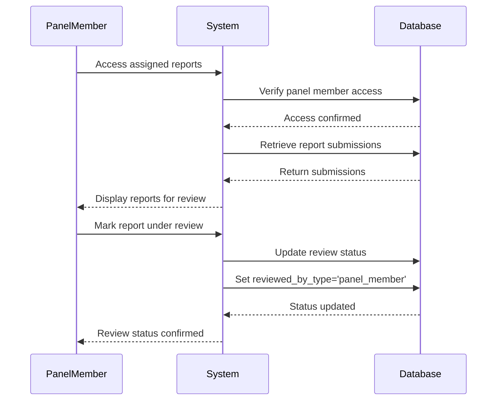
```mermaid
sequenceDiagram
    participant PanelMember
    participant System
    participant Database

    PanelMember->>System: Access assigned reports
    System->>Database: Verify panel member access
    Database-->>System: Access confirmed
    System->>Database: Retrieve report submissions
    Database-->>System: Return submissions
    System-->>PanelMember: Display reports for review
    
    PanelMember->>System: Mark report under review
    System->>Database: Update review status
    System->>Database: Set reviewed_by_type='panel_member'
    Database-->>System: Status updated
    System-->>PanelMember: Review status confirmed
```

### 5.3 Panel Member Annotation with Dual Feedback
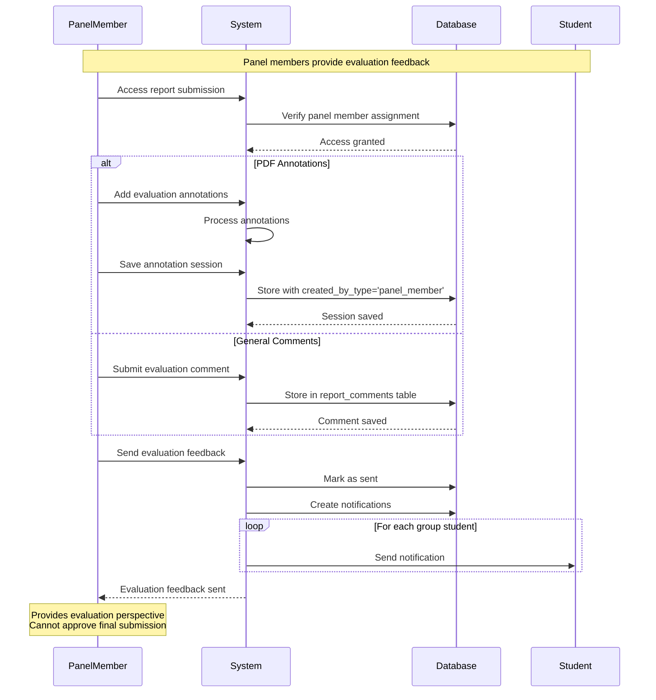
```mermaid
sequenceDiagram
    participant PanelMember
    participant System
    participant Database
    participant Student

    Note over PanelMember,Student: Panel members provide evaluation feedback
    
    PanelMember->>System: Access report submission
    System->>Database: Verify panel member assignment
    Database-->>System: Access granted
    
    alt PDF Annotations
        PanelMember->>System: Add evaluation annotations
        System->>System: Process annotations
        PanelMember->>System: Save annotation session
        System->>Database: Store with created_by_type='panel_member'
        Database-->>System: Session saved
    else General Comments
        PanelMember->>System: Submit evaluation comment
        System->>Database: Store in report_comments table
        Database-->>System: Comment saved
    end
    
    PanelMember->>System: Send evaluation feedback
    System->>Database: Mark as sent
    System->>Database: Create notifications
    
    loop For each group student
        System->>Student: Send notification
    end
    
    System-->>PanelMember: Evaluation feedback sent
    
    Note over PanelMember: Provides evaluation perspective<br/>Cannot approve final submission
```

---

## 6. Advisor Operations

### 6.1 Group Formation

#### 6.1.1 Manual Group Creation
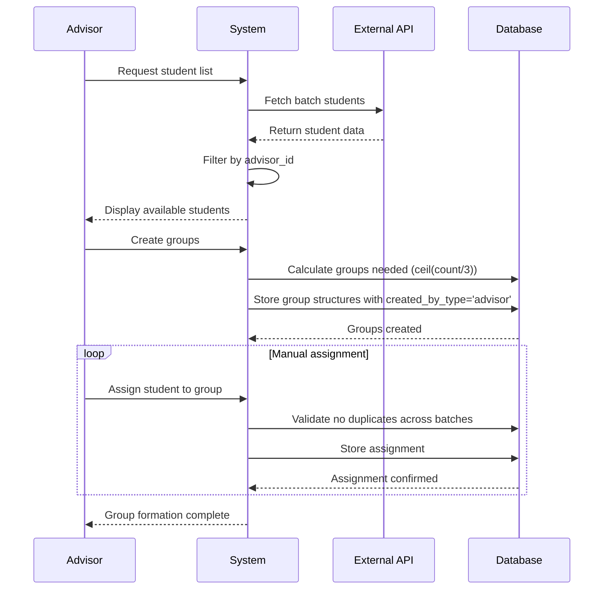
```mermaid
sequenceDiagram
    participant Advisor
    participant System
    participant External API
    participant Database

    Advisor->>System: Request student list
    System->>External API: Fetch batch students
    External API-->>System: Return student data
    System->>System: Filter by advisor_id
    System-->>Advisor: Display available students
    
    Advisor->>System: Create groups
    System->>Database: Calculate groups needed (ceil(count/3))
    System->>Database: Store group structures with created_by_type='advisor'
    Database-->>System: Groups created
    
    loop Manual assignment
        Advisor->>System: Assign student to group
        System->>Database: Validate no duplicates across batches
        System->>Database: Store assignment
        Database-->>System: Assignment confirmed
    end
    
    System-->>Advisor: Group formation complete
```

#### 6.1.2 Excel-Based Group Import with Randomization
```mermaid
sequenceDiagram
    participant Advisor
    participant System
    participant Database

    Note over Advisor,Database: Enhanced with auto-detection and randomization
    
    Advisor->>System: Upload Excel file
    System->>System: detectColumnStructure()
    System->>System: Validate file format
    System->>System: Parse student-group mappings
    
    alt Valid data
        System->>Database: Clear existing assignments
        System->>Database: Create missing groups if needed
        System->>System: shuffle(availableGroupIds)
        Note over System: Randomize for fairness
        System->>Database: Bulk insert randomized assignments
        Database-->>System: Import successful
        System->>System: Log group mapping for audit
        System-->>Advisor: Display import summary with mapping
    else Invalid data
        System-->>Advisor: Return validation errors
    end
```

#### 6.1.3 Template Export for Group Assignment
```mermaid
sequenceDiagram
    participant Advisor
    participant System
    participant External API
    participant Database

    Advisor->>System: Request Excel template
    System->>External API: Fetch batch students
    External API-->>System: Return student list
    System->>System: Filter by advisor_id
    System->>Database: Retrieve existing groups
    Database-->>System: Return group data
    
    System->>System: Generate Excel template
    Note over System: Template includes:<br/>• Student IDs and names<br/>• Empty group column<br/>• Available group list
    
    System-->>Advisor: Download template file
```

#### 6.1.4 Cross-Batch Student Assignment
```mermaid
sequenceDiagram
    participant Advisor
    participant System
    participant StudentAPI
    participant Database

    Note over Advisor,Database: Assign students from any advisor's batch
    
    Advisor->>System: Select student for assignment
    System->>StudentAPI: getAllAvailableStudents(advisorApiId)
    
    loop For each advisor batch
        StudentAPI->>StudentAPI: Fetch batch students
        StudentAPI->>StudentAPI: Filter by advisor_id
        StudentAPI->>StudentAPI: Exclude already assigned
    end
    
    StudentAPI-->>System: Return all available students
    System-->>Advisor: Display students (current batch first)
    
    Advisor->>System: Assign to group
    System->>Database: Validate no duplicate across all batches
    
    alt Valid assignment
        System->>Database: Create GroupStudent record
        Database-->>System: Assignment confirmed
        System-->>Advisor: Success message
    else Already assigned
        System-->>Advisor: Error: Student in batch X group Y
    end
```

#### 6.1.5 Assign Area of Interest to Group
```mermaid
sequenceDiagram
    participant Advisor
    participant System
    participant Database

    Note over Advisor,Database: Multi-select AOI assignment
    
    Advisor->>System: Select group
    System->>Database: Verify group ownership
    Database-->>System: Confirmed (created_by_type='advisor')
    
    Advisor->>System: Select multiple AOIs
    System->>System: Validate AOI IDs
    System->>Database: syncAreasOfInterest(areaIds)
    
    Note over Database: Sync operation:<br/>• Adds new AOIs<br/>• Removes unselected AOIs<br/>• Updates pivot table
    
    Database-->>System: Sync completed
    System-->>Advisor: AOIs assigned successfully
```

#### 6.1.6 Bulk Remove AOIs from Batch
```mermaid
sequenceDiagram
    participant Advisor
    participant System
    participant Database

    Advisor->>System: Select batch
    Advisor->>System: Click "Remove All AOIs"
    
    System->>Database: Get advisor-created groups for batch
    Database-->>System: Return groups
    
    loop For each group
        System->>Database: Clear area_of_interest_id
        System->>Database: Clear pivot table entries
    end
    
    Database-->>System: AOIs removed
    System-->>Advisor: Removed from X groups
```

#### 6.1.7 Remove All Groups in Batch
```mermaid
sequenceDiagram
    participant Advisor
    participant System
    participant Database

    Note over Advisor,Database: Safe deletion - only advisor-created groups
    
    Advisor->>System: Request remove all groups
    System->>Database: Get groups where created_by_type='advisor'
    Database-->>System: Return advisor groups
    
    loop For each group
        System->>Database: Delete GroupStudent records
        System->>Database: Delete Group record
    end
    
    Database-->>System: Deletion complete
    System-->>Advisor: Removed X groups, Y assignments
    
    Note over Database: Admin-created groups remain untouched
```

---

## 7. Supervisor Assignment Algorithms

### 7.1 AOI-Based Assignment with Randomization
```mermaid
sequenceDiagram
    participant Advisor
    participant System
    participant Service as SupervisorAssignmentService
    participant Database

    Note over Advisor,Database: Random selection within expertise matches
    
    Advisor->>System: Select AOI-based assignment
    System->>Service: runAOIAssignment(groups)
    
    Service->>Database: Retrieve unassigned groups
    Service->>Database: Retrieve supervisors with AOIs
    
    loop For each group
        Service->>Service: Get group AOIs (primary + fallback)
        Service->>Service: Find matching supervisors
        Service->>Service: array_rand() for selection
        Service->>Service: Exclude last assigned supervisor
        Service->>Database: Assign supervisor to group
        Service->>Database: Record in AssignmentHistory
    end
    
    Service-->>System: Return assignment results
    System-->>Advisor: Display results with statistics
    
    Note over Service: Ensures expertise alignment<br/>Prevents consecutive assignments
```

### 7.2 Ranking-Based Assignment with Round-Robin
```mermaid
sequenceDiagram
    participant Advisor
    participant System
    participant Service as SupervisorAssignmentService
    participant Database

    Note over Advisor,Database: Proper round-robin implementation
    
    Advisor->>System: Select ranking-based assignment
    System->>Service: runRankingAssignment(groups)
    
    Service->>Database: Get supervisors ordered by rank
    Service->>Service: Initialize round-robin tracker
    
    loop For each group
        Service->>Service: Select next supervisor in rotation
        Service->>Service: Check assigned_count <= currentRound
        
        alt Can assign
            Service->>Database: Assign supervisor
            Service->>Service: Increment assigned_count
        else Move to next round
            Service->>Service: currentRound++
            Service->>Service: Reset to first supervisor
        end
    end
    
    Service-->>System: Return results
    System-->>Advisor: Display distribution statistics
    
    Note over Service: Everyone gets 1 before anyone gets 2
```

### 7.3 Hybrid Assignment Strategy
```mermaid
sequenceDiagram
    participant Advisor
    participant System
    participant Service as SupervisorAssignmentService
    participant Database

    Note over Advisor,Database: Per-area fairness with ranking
    
    Advisor->>System: Select hybrid assignment
    System->>Service: runCombinedAssignment(groups)
    
    Service->>Database: Get groups with AOIs
    Service->>Database: Get supervisors with expertise
    
    loop For each group
        Service->>Service: Get area supervisors
        Service->>Service: Find minimum assignment count in area
        Service->>Service: Filter to supervisors with min count
        
        alt Multiple candidates
            Service->>Service: Apply ranking (Professor > Lecturer)
        end
        
        Service->>Database: Assign best candidate
        Service->>Service: Update per-area tracking
    end
    
    Service-->>System: Return results
    System-->>Advisor: Display balanced distribution
    
    Note over Service: NO ONE in ML gets 2<br/>before EVERYONE in ML gets 1
```

### 7.4 Assignment Algorithm Comparison
```mermaid
graph TD
    Start[Assignment Strategy Selection]
    
    Start --> AOI[AOI-Based Strategy]
    Start --> Rank[Ranking-Based Strategy]
    Start --> Hybrid[Hybrid Strategy]
    
    AOI --> AOIFeatures[Features:<br/>✓ Expertise match<br/>✓ Random selection<br/>✓ Exclude last assigned<br/>✗ May be uneven]
    
    Rank --> RankFeatures[Features:<br/>✓ Equal distribution<br/>✓ Round-robin fairness<br/>✗ Ignores expertise<br/>✗ No randomization]
    
    Hybrid --> HybridFeatures[Features:<br/>✓ Expertise match<br/>✓ Per-area fairness<br/>✓ Ranking priority<br/>✓ Optimal balance]
    
    style Start fill:#f9f,stroke:#333,stroke-width:2px
    style AOIFeatures fill:#e8f5e9,stroke:#4caf50,stroke-width:1px
    style RankFeatures fill:#e3f2fd,stroke:#2196f3,stroke-width:1px
    style HybridFeatures fill:#fff3e0,stroke:#ff9800,stroke-width:1px
```

---

## 8. Administrative Functions

### 8.1 Co-Supervisor Assignment Process
```mermaid
sequenceDiagram
    participant Administrator
    participant System
    participant Database

    Note over Administrator,Database: Only administrators can assign co-supervisors
    
    Administrator->>System: Access group management
    System->>Database: Retrieve groups list
    Database-->>System: Return groups
    System-->>Administrator: Display groups
    
    Administrator->>System: Select group for co-supervisor
    System->>Database: Retrieve available supervisors
    Database-->>System: Return supervisor list
    System->>System: Filter out main supervisor
    System-->>Administrator: Display eligible co-supervisors
    
    Administrator->>System: Assign co-supervisor
    System->>Database: Validate assignment
    
    alt Valid assignment
        System->>Database: Update group co_supervisor_id
        System->>Database: Set co_supervisor_can_manage_meetings=false
        Database-->>System: Assignment confirmed
        System->>Database: Create notification for co-supervisor
        System-->>Administrator: Success message
    else Invalid (same as main supervisor)
        System-->>Administrator: Error: Cannot assign same person
    end
    
    Note over Database: Initial permission set to false
```

### 8.2 Panel Member Assignment Process
```mermaid
sequenceDiagram
    participant Administrator
    participant System
    participant Database

    Note over Administrator,Database: Multiple panel members per group allowed
    
    Administrator->>System: Access group management
    System->>Database: Retrieve groups list
    Database-->>System: Return groups
    System-->>Administrator: Display groups
    
    Administrator->>System: Select group for panel member
    System->>Database: Retrieve available supervisors
    Database-->>System: Return supervisor list
    System->>Database: Get existing panel members
    Database-->>System: Return current panel
    System-->>Administrator: Display eligible panel members
    
    Administrator->>System: Assign panel member
    System->>Database: Validate not already assigned
    
    alt Valid assignment
        System->>Database: Create panel assignment
        System->>Database: Store in group_panel_members table
        System->>Database: Record assignment metadata
        Database-->>System: Assignment confirmed
        System->>Database: Create notification for panel member
        System-->>Administrator: Panel member assigned
    else Already assigned
        System-->>Administrator: Error: Already a panel member
    end
    
    Note over Database: No capacity limits for panel members
```

### 8.3 Area of Interest Management
```mermaid
sequenceDiagram
    participant Administrator
    participant System
    participant Database

    Note over Administrator,Database: CRUD operations for AOIs
    
    alt Create AOI
        Administrator->>System: Submit new AOI
        System->>System: Validate unique name
        System->>Database: Create area_of_interests record
        Database-->>System: AOI created
        System-->>Administrator: Success message
    else Bulk Create
        Administrator->>System: Submit multiple AOIs (textarea)
        System->>System: Parse line-separated values
        
        loop For each AOI
            System->>Database: Check if exists
            alt Not exists
                System->>Database: Create AOI
            else Exists
                System->>System: Skip and count
            end
        end
        
        System-->>Administrator: Created X, Skipped Y
    else Update AOI
        Administrator->>System: Edit AOI details
        System->>Database: Update record
        Database-->>System: Updated
        System-->>Administrator: Success message
    else Delete AOI
        Administrator->>System: Delete AOI
        System->>Database: Remove record
        Database-->>System: Deleted
        System-->>Administrator: Success message
    end
```

### 8.4 Admin Group Creation with AOI & Supervisor
```mermaid
sequenceDiagram
    participant Administrator
    participant System
    participant Database

    Note over Administrator,Database: Admin creates pre-configured groups
    
    Administrator->>System: Create new group
    System->>System: Validate group name uniqueness
    
    Administrator->>System: Assign AOIs (multi-select)
    Administrator->>System: Assign supervisor (optional)
    
    System->>Database: Create group with created_by_type='admin'
    System->>Database: Sync AOIs to pivot table
    System->>Database: Set supervisor_id if provided
    
    Database-->>System: Group created
    System-->>Administrator: Group created with configurations
    
    Note over Database: Admin groups protected from advisor deletion
```

### 8.5 Supervisor Management
```mermaid
sequenceDiagram
    participant Administrator
    participant System
    participant Database

    Administrator->>System: Access supervisor management
    System->>Database: Retrieve supervisors with stats
    Database-->>System: Return list with capacity/assignments
    System-->>Administrator: Display supervisor table
    
    alt Toggle AOI
        Administrator->>System: Toggle supervisor AOI
        System->>Database: Check current assignment
        
        alt Currently assigned
            System->>Database: Detach AOI
            Database-->>System: Removed
        else Not assigned
            System->>Database: Attach AOI
            Database-->>System: Added
        end
        
        System-->>Administrator: AOI toggled
    else Set Thesis Limit
        Administrator->>System: Update thesis limit
        System->>Database: Update supervisor record
        Database-->>System: Limit updated
        System-->>Administrator: Capacity updated
    end
```

---

## 9. Multi-Role Collaboration

### 9.1 Teacher Role Switching
```mermaid
sequenceDiagram
    participant Teacher
    participant System
    participant Database

    Teacher->>System: Access teacher dashboard
    System->>Database: Check all assigned roles
    Database-->>System: Return role assignments
    
    Note over System: Teacher can be:<br/>• Supervisor for some groups<br/>• Co-Supervisor for others<br/>• Panel Member for evaluation
    
    System-->>Teacher: Display role selection panel
    
    alt Select Supervisor Role
        Teacher->>System: Access supervisor panel
        System->>Database: Get supervised groups
        System-->>Teacher: Supervisor dashboard
    else Select Co-Supervisor Role
        Teacher->>System: Access co-supervisor panel
        System->>Database: Get co-supervised groups
        System-->>Teacher: Co-supervisor dashboard
    else Select Panel Member Role
        Teacher->>System: Access panel member panel
        System->>Database: Get panel assignments
        System-->>Teacher: Panel member dashboard
    end
```

### 9.2 Collaborative Report Review
```mermaid
sequenceDiagram
    participant Student
    participant Supervisor
    participant CoSupervisor
    participant PanelMember
    participant System
    participant Database

    Note over Student,Database: Multiple reviewers annotate same report
    
    Student->>System: Submit report
    System->>Database: Store submission
    System->>Supervisor: Notify main supervisor
    System->>CoSupervisor: Notify co-supervisor
    System->>PanelMember: Notify panel members
    
    par Parallel Review Process
        Supervisor->>System: Create annotation session
        System->>Database: Store with created_by_type='supervisor'
    and
        CoSupervisor->>System: Create annotation session
        System->>Database: Store with created_by_type='co_supervisor'
    and
        PanelMember->>System: Create annotation session
        System->>Database: Store with created_by_type='panel_member'
    end
    
    System->>Database: Compile all annotations
    Database-->>System: Return merged feedback
    System->>Student: Notify of available feedback
    
    Student->>System: View all annotations
    System->>Database: Retrieve all sessions
    Database-->>System: Return categorized feedback
    System-->>Student: Display with role indicators
```

### 9.3 Hierarchical Approval Process
```mermaid
sequenceDiagram
    participant Student
    participant PanelMember
    participant CoSupervisor
    participant Supervisor
    participant System
    participant Database

    Note over Student,Database: Only main supervisor can give final approval
    
    Student->>System: Submit final report
    System->>Database: Store submission
    
    PanelMember->>System: Review and annotate
    System->>Database: Store evaluation feedback
    System->>Student: Notify of panel review
    
    CoSupervisor->>System: Review and recommend
    System->>Database: Store recommendation
    System->>Student: Notify of co-supervisor review
    
    Note over CoSupervisor: Can recommend but not approve
    
    Supervisor->>System: Review all feedback
    System->>Database: Retrieve all reviews
    Database-->>System: Return compiled feedback
    System-->>Supervisor: Display comprehensive review
    
    alt Approve
        Supervisor->>System: Approve final project
        System->>Database: Update status to 'approved'
        System->>Student: Send approval notification
        System->>Database: Publish to repository
    else Request Revision
        Supervisor->>System: Request changes
        System->>Database: Update status to 'needs_revision'
        System->>Student: Send revision request
    end
```

### 9.4 Multi-Reviewer Annotation History
```mermaid
sequenceDiagram
    participant Student
    participant System
    participant Database

    Note over Student,Database: View all feedback with role identification
    
    Student->>System: Request annotation history
    System->>Database: Retrieve all annotation sessions
    Database-->>System: Return sessions with metadata
    
    System->>System: Group by created_by_type
    System->>System: Sort by timestamp
    System->>System: Apply role-based styling
    
    Note over System: Color coding:<br/>• Supervisor: Blue badge<br/>• Co-Supervisor: Purple badge<br/>• Panel Member: Orange badge
    
    System-->>Student: Display categorized history
    
    Student->>System: Select specific session
    System->>Database: Retrieve session details
    Database-->>System: Return annotations
    System-->>Student: Display annotated document
    
    Note over Student: Can compare feedback from different reviewers
```

---

## 10. System Architecture

### 10.1 Service Layer Architecture
```mermaid
sequenceDiagram
    participant Client
    participant Controller
    participant Service
    participant Model
    participant Database

    Note over Client,Database: Laravel MVC with Service Layer
    
    Client->>Controller: HTTP Request
    Controller->>Controller: Validate request
    Controller->>Service: Delegate business logic
    
    Service->>Model: Interact with data layer
    Model->>Database: Execute query
    Database-->>Model: Return results
    Model-->>Service: Return domain objects
    
    Service->>Service: Apply business rules
    Service-->>Controller: Return processed data
    
    Controller->>Controller: Format response
    Controller-->>Client: HTTP Response
    
    Note over Service: Key Services:<br/>• SupervisorAssignmentService<br/>• StudentApiService<br/>• SupervisorApiService<br/>• PerformanceMonitoringService
```

### 10.2 External API Integration
```mermaid
sequenceDiagram
    participant System
    participant StudentApiService
    participant SupervisorApiService
    participant ExternalAPI

    Note over System,ExternalAPI: Integration with university systems
    
    alt Student Data Sync
        System->>StudentApiService: Request batch students
        StudentApiService->>ExternalAPI: GET /api/students?batch=X
        ExternalAPI-->>StudentApiService: Return student array
        StudentApiService->>StudentApiService: Filter by advisor
        StudentApiService-->>System: Return filtered students
    else Supervisor Data Sync
        System->>SupervisorApiService: Request supervisor list
        SupervisorApiService->>ExternalAPI: GET /api/teachers
        ExternalAPI-->>SupervisorApiService: Return teacher array
        SupervisorApiService->>SupervisorApiService: Map to supervisor model
        SupervisorApiService-->>System: Return supervisors
    else Batch Information
        System->>StudentApiService: Get advisor batches
        StudentApiService->>ExternalAPI: GET /api/advisor/batches
        ExternalAPI-->>StudentApiService: Return batch list
        StudentApiService-->>System: Return active batches
    end
    
    Note over ExternalAPI: Base URL: http://puc.ac.bd:8012/api
```

### 10.3 Notification System Architecture
```mermaid
sequenceDiagram
    participant Event
    participant NotificationClass
    participant Queue
    participant Database
    participant User

    Note over Event,User: Database-driven notification system
    
    Event->>NotificationClass: Trigger notification
    NotificationClass->>NotificationClass: Prepare notification data
    
    alt Queued notification
        NotificationClass->>Queue: Dispatch to queue
        Queue->>Queue: Process in background
        Queue->>Database: Store in notifications table
    else Immediate notification
        NotificationClass->>Database: Store directly
    end
    
    Database->>Database: Set user_id, type, data
    
    User->>System: Check notifications
    System->>Database: Query unread notifications
    Database-->>System: Return notifications
    System-->>User: Display in dashboard
    
    Note over NotificationClass: Types:<br/>• NewReportAssigned<br/>• NewReportAnnotation<br/>• NewReportComment<br/>• ReportUpdated
```

---

## System Components Description

### Core Components
- **Client**: End-user interface (web browser)
- **System**: Application server handling business logic
- **Controller**: Request handling and response formatting
- **Service**: Business logic layer (SupervisorAssignmentService, StudentApiService, etc.)
- **Model**: Data access layer using Eloquent ORM
- **Database**: MySQL/SQLite persistent data storage
- **External API**: University information systems (http://puc.ac.bd:8012/api)
- **Queue**: Background job processing for notifications
- **Storage**: File storage for PDF documents and submissions

### User Roles
- **Student**: Thesis/project students submitting reports and receiving feedback
- **Supervisor**: Faculty members with primary supervision responsibilities and final approval authority
- **Co-Supervisor**: Secondary supervisors assisting main supervisors with conditional meeting management permissions
- **Panel Member**: Faculty members providing evaluation and feedback without management capabilities
- **Advisor**: Faculty coordinating student groups and supervisor assignments
- **Administrator**: System administrators managing users, AOIs, and system configuration
- **Teacher**: Umbrella role for faculty who can switch between supervisor, co-supervisor, and panel member roles

### Key Features
1. **Enhanced Authentication**: Multi-role authentication with fallback mechanism and TypeId parsing
2. **Group Management**: Formation and assignment with cross-batch validation and randomization
3. **Dual Feedback System**: PDF annotations and general text comments
4. **Report Workflow**: Draft-send pattern for quality control
5. **Meeting Documentation**: Recording and tracking with permission-based co-supervisor access
6. **Intelligent Assignment**: Three algorithms (AOI, Ranking, Hybrid) with fairness guarantees
7. **Data Synchronization**: Integration with university systems for student and faculty data
8. **Real-time Notifications**: Database-driven notifications with mark-as-read functionality
9. **Collaborative Review**: Multiple reviewers annotate reports with role-based tracking
10. **Hierarchical Approval**: Only main supervisors can approve final projects
11. **Permission Management**: Granular control over co-supervisor meeting permissions
12. **Role Switching**: Teachers can seamlessly switch between different supervision roles
13. **Annotation History**: Complete tracking with role identification and color coding
14. **Cross-Batch Management**: Advisors can assign students from any of their batches
15. **Audit Trail**: Assignment history tracking and logging for accountability

### Technical Implementation Details
- **Framework**: Laravel 12 with PHP 8.2+
- **Frontend**: Blade templates with Tailwind CSS and Alpine.js
- **Build Tool**: Vite for asset compilation
- **Testing**: PHPUnit/Pest with RefreshDatabase trait
- **Code Standards**: PSR-12 enforced by Laravel Pint
- **Security**: CSRF protection, parameterized queries, rate limiting

---

## Notes
These sequence diagrams illustrate the primary interactions within the Thesis Repository Management System, demonstrating the flow of information between system components and user roles. The diagrams follow UML 2.0 notation standards and IEEE documentation guidelines, focusing on essential system behaviors with implementation-specific details based on actual code analysis.

### Revision History
- **Version 2.0**: Added 12 new diagrams based on code analysis
- **Version 2.1**: Enhanced with implementation details from controller and service analysis
- **Version 2.2**: Added dual feedback mechanisms and cross-batch validation
- **Version 2.3**: Incorporated randomization, draft-send pattern, and audit trail features