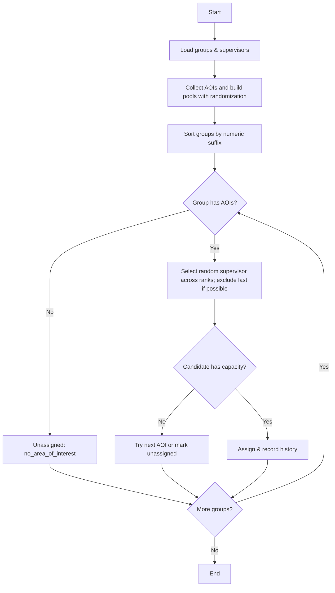
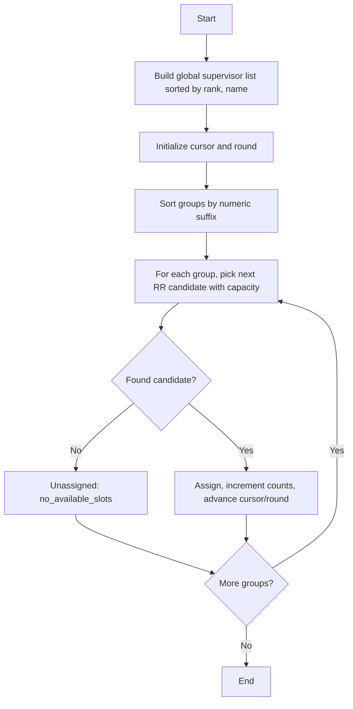

# Supervisor Assignment Algorithm (Production)

Last Updated: 2025-08-26

This document describes the production algorithm for automatically assigning supervisors to thesis groups. The system supports three lottery modes and enforces capacity, fairness, and transparency:

- AOI-based Lottery (Area of Interest Only)
- Ranking-based Lottery (Ranking Priority Only)
- Combined Lottery (AOI + Ranking)

All modes:
- Respect supervisor capacity limits
- Avoid immediate consecutive assignments when alternatives exist
- Process groups in deterministic sorted order by group number suffix (Group 1, 2, 3…)
- Provide persistence and preview (dry-run) variants


## 1) High-Level Overview and Pseudocode

### Modes
- aoi: Area-of-Interest-aware random selection (true randomness) with smart rotation
- ranking: Global round-robin by rank priority
- both: AOI + rank with ULTRA-FAIR area-specific round-robin and rank as tiebreaker

---

### AOI-based Lottery (Area of Interest Only)

Behavior
- Match by Area of Interest
- Select randomly from all available matching supervisors across ranks
- Exclude the last supervisor assigned to that group (if alternatives exist) to avoid repetition
- Different results on every run by design

Minimal Pseudocode
```
pools, areaHasSup, avail = buildAOIPoolsWithRandomization(allAOIFrom(groups))
assignmentCounts = {}

for group in sortByNumericSuffix(groups):
  areaIds = group.areaIds()
  if areaIds is empty: markUnassigned(no_area_of_interest); continue

  assigned = false
  for aoi in areaIds:        # primary first, then fallbacks
    candidates = allAvailableCandidatesRandomized(pools[aoi], avail)
    candidates = excludeLastSupervisorForGroupIfPossible(candidates, group)
    if candidates is empty: continue

    pick = randomChoice(candidates)
    assign(group, pick.supervisor, aoi, rank=pick.rank)
    avail[pick.id]--
    assignmentCounts[pick.id] = assignmentCounts.get(pick.id, 0) + 1
    recordHistory(group.id, pick.id, aoi, method='lottery_aoi')
    assigned = true
    break

  if not assigned:
    markUnassigned(reason = areaHasSupForAny(areaIds)? 'no_available_slots':'no_matches')
```

---

### Ranking-based Lottery (Ranking Priority Only)

Behavior
- Ignore AOI
- Proper round-robin by rank: nobody receives a 2nd group until everyone received 1
- Deterministic outcome given the same inputs

Minimal Pseudocode
```
list = buildGlobalSupervisorListSortedBy(rank asc, name asc) with available_slots>0
currentRound = 0
cursor = 0

for group in sortByNumericSuffix(groups):
  assigned = false
  attempts = 0
  while not assigned and attempts < len(list):
    s = list[cursor]
    if s.assigned_count <= currentRound and s.assigned_count < s.available_slots:
      assign(group, s)
      s.assigned_count++
      assigned = true
    cursor = (cursor+1) % len(list)
    if cursor==0: currentRound++
    attempts++
  if not assigned: markUnassigned('no_available_slots')
```

---

### Combined Lottery (AOI + Ranking)

Behavior
- Work within the group’s AOI(s)
- ULTRA-FAIR within each AOI: no supervisor in that AOI gets 2 before everyone in that AOI gets 1
- Rank priority used only as a tiebreaker when assignment counts are equal
- Avoid consecutive assignments to the same supervisor when alternatives exist

Minimal Pseudocode
```
# Build non-random AOI pools (stable ordering)
pools, areaHasSup, avail = buildAOIPoolsWithoutRandomization(allAOI)

# Global counters but fairness is evaluated per AOI
globalCounts = {}              # total assignments per supervisor this run
lastAssignedPerArea = {}       # avoid consecutive within an AOI

for group in sortByNumericSuffix(groups):
  assigned = false
  for aoi in group.areaIds():
    areaSupervisors = allAvailableSupervisorsForAOI(pools[aoi], avail)
    if areaSupervisors is empty: continue

    # Area-specific fairness: find minimum count within this AOI
    areaMin = min(globalCounts.get(s.id,0) for s in areaSupervisors)

    # Eligible have the minimum count only
    eligible = [s for s in areaSupervisors if globalCounts.get(s.id,0) == areaMin]

    # Avoid consecutive if possible
    lastId = lastAssignedPerArea.get(aoi)
    nonConsecutive = [s for s in eligible if s.id != lastId]
    candidates = nonConsecutive if nonConsecutive else eligible

    # Tie-breaker: rank asc, then name asc
    candidates.sort(key=lambda s: (s.rank_priority, s.name))

    pick = firstWithCapacity(candidates, avail)
    if pick is None: continue

    assign(group, pick, aoi, rank=pick.rank_priority)
    avail[pick.id] -= 1
    globalCounts[pick.id] = globalCounts.get(pick.id,0)+1
    lastAssignedPerArea[aoi] = pick.id
    assigned = true
    break

  if not assigned:
    markUnassigned(reason = areaHasSupForAny(group.areaIds())? 'no_available_slots':'no_matches')
```


## 2) Flowcharts

### AOI-based Lottery (Randomized)


### Ranking-based Lottery (Round-Robin)


### Combined Lottery (AOI + ULTRA-FAIR RR)
```mermaid
flowchart TD
  A[Start] --> B[Build AOI pools (no random), availability]
  B --> C[Sort groups by numeric suffix]
  C --> D[For each group AOI in order]
  D --> E[Gather available supervisors for AOI]
  E --> F{Any?}
  F -- No --> G[Try next AOI or mark unassigned] --> M
  F -- Yes --> H[Compute areaMin from globalCounts for this AOI]
  H --> I[Filter to eligible: count == areaMin]
  I --> J[Avoid consecutive if possible]
  J --> K[Sort by rank, then name]
  K --> L[Pick first with capacity; assign & update counts]
  L --> M{Assigned?}
  M -- No --> D
  M -- Yes --> N{More groups?}
  N -- Yes --> D
  N -- No --> O[End]
```


## 3) Detailed Specification (Implementation Mapping)

### 3.1 Service Entry Points
- Service: `App\Services\SupervisorAssignmentService`
  - `runLotteryAssignment(Collection $groups, string $mode = 'aoi')`
    - `mode='aoi'` → AOI-based algorithm with true randomization
    - `mode='ranking'` → global ranking round-robin
    - `mode='both'` → AOI + rank with area-specific ultra-fair round-robin
  - `previewLotteryAssignment(Collection $groups, string $mode = 'aoi')`
    - Simulates assignments without persistence

### 3.2 Core Methods
- AOI Mode
  - `runAOIAssignment(...)`
  - `buildAOIPoolsWithRandomization(...)`
  - `selectRandomSupervisor(...)` (excludes the last assigned supervisor to the same group if alternatives exist)
- Ranking Mode
  - `runRankingAssignment(...)` (proper round-robin implementation)
- Combined Mode
  - `runCombinedAssignment(...)`
  - `buildAOIPoolsWithoutRandomization(...)`
  - `selectSupervisorWithIntelligentRoundRobin(...)` (ABSOLUTE fairness within area; rank as tiebreaker)

### 3.3 Data Structures
- `availability`: map[supervisorId] → remaining slots
- `pools[aoiId][rank] = { supervisors: [{id, model}, ...], cursor? }`
- `globalAssignmentCounts[supervisorId]` (combined mode fairness tracking)
- `lastAssignedPerArea[aoiId]` (avoid consecutive picks per AOI)

### 3.4 Ordering and Determinism
- Groups are processed by numeric suffix extracted from the group name; missing suffix groups sort last.
- AOI mode includes randomness (non-deterministic). Ranking and Combined modes are deterministic given the same input state.

### 3.5 Capacity and Concurrency
- Capacity checked per pick using `available_slots` (computed as `thesis_limit - assigned_theses_count`).
- Persistent runs are wrapped in DB transactions at the controller layer to avoid oversubscription under concurrency.

### 3.6 Edge Cases
- Group without AOI in AOI/Combined modes → `no_area_of_interest`/`no_matches` as applicable
- AOI has supervisors but all at capacity → `no_available_slots`
- Only a single supervisor available in AOI → consecutive allowed as there is no alternative
- Multi-AOI groups: try in defined order (primary first, then fallbacks)

### 3.7 Result Fields (Persistence)
- `groups.supervisor_id` set to assigned supervisor
- `groups.matched_area_of_interest_id` set in AOI/Combined to the matched AOI id
- `groups.is_manual_assignment = false`, `groups.assigned_at = now()`
- `groups.assignment_priority = rank_priority of supervisor`
- Assignment history recorded for AOI assignments (`AssignmentHistory::recordAssignment(...)`)


## 4) Testing Guidance (What is Covered)

Unit/Feature tests should validate:
- AOI Mode
  - Randomization produces different patterns over multiple runs
  - Last assigned supervisor exclusion works when alternatives exist
  - Multi-AOI fallback selection is respected
- Ranking Mode
  - Proper round-robin: nobody gets a 2nd assignment before everyone gets 1
  - Rank order is respected when tie-breaking
- Combined Mode
  - Area-specific fairness: within an AOI, all get 1 before anyone gets 2
  - Seniority used only as tiebreaker when counts are equal
  - Avoid consecutive assignments to the same AOI supervisor when alternatives exist
- Capacity
  - No supervisor exceeds their capacity across all modes
- Preview vs Run
  - Preview does not persist changes but produces structurally valid plans

Reference implementation tests:
- `tests/Feature/Advisor/IntelligentSupervisorAssignmentTest.php`


## 5) API-Level Behavior Summary

- Preview (GET): `/advisor/supervisor-assignment/preview-lottery`
  - Query: `batch` (optional), `mode in {aoi, ranking, both}`
  - Returns: planned assignments, unassigned list, and stats
- Run (POST): `/advisor/supervisor-assignment/run-lottery`
  - Form: `batch` (optional), `mode in {aoi, ranking, both}`
  - Persists assignments based on mode


## 6) Glossary
- AOI: Area Of Interest
- Rank priority: Numeric value; lower means higher academic rank
- Round-robin: Distribution ensuring equal allocation before repetition
- Ultra-fair (area-specific): No supervisor gets a 2nd assignment within an AOI until everyone in that AOI gets 1
- Smart rotation: Avoid consecutive assignments to the same supervisor when alternatives exist

---

Historical note: Earlier design docs referenced a generic Hungarian algorithm and multi-factor scoring. The current production implementation is a capacity-aware lottery using ranked round-robin selection tailored to the thesis assignment domain. This document reflects the implemented behavior including the new ultra-fair combined mode.