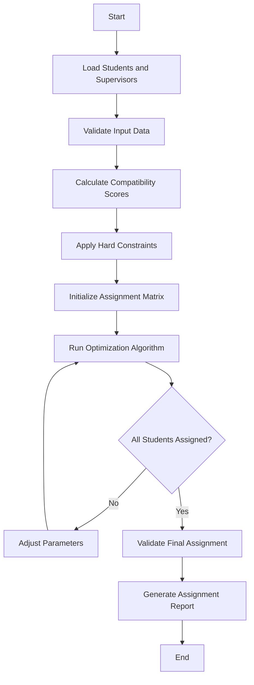

# Supervisor Assignment Algorithm

## Overview

This document describes the algorithm used for automatically assigning supervisors to students in the thesis management system. The algorithm aims to optimize the assignment process by considering multiple factors including supervisor expertise, workload, student preferences, and research area compatibility.

## Table of Contents

1. [Algorithm Objectives](#algorithm-objectives)
2. [Input Parameters](#input-parameters)
3. [Constraints](#constraints)
4. [Algorithm Design](#algorithm-design)
5. [Implementation Details](#implementation-details)
6. [Scoring System](#scoring-system)
7. [Assignment Process](#assignment-process)
8. [Edge Cases](#edge-cases)
9. [Performance Considerations](#performance-considerations)
10. [Testing Strategy](#testing-strategy)

## Algorithm Objectives

### Primary Objectives
- **Maximize Research Area Match**: Assign students to supervisors with expertise in their chosen research areas
- **Balance Workload**: Distribute students evenly among available supervisors
- **Respect Capacity Limits**: Ensure no supervisor exceeds their maximum student capacity
- **Honor Preferences**: Consider student preferences for specific supervisors when possible

### Secondary Objectives
- **Minimize Assignment Time**: Complete assignments efficiently
- **Ensure Fairness**: Provide equal opportunities for all students
- **Maintain Quality**: Ensure adequate supervision quality for all assignments

## Input Parameters

### Student Data
```php
class Student {
    public int $id;
    public string $name;
    public string $email;
    public array $research_areas;        // Primary and secondary research interests
    public array $preferred_supervisors; // Ordered list of preferred supervisor IDs
    public float $gpa;                   // Academic performance indicator
    public string $thesis_topic;        // Proposed thesis topic
    public DateTime $registration_date;  // When student registered for thesis
    public string $program;              // Undergraduate/Graduate program
}
```

### Supervisor Data
```php
class Supervisor {
    public int $id;
    public string $name;
    public string $email;
    public array $expertise_areas;       // Research areas of expertise
    public int $max_capacity;           // Maximum number of students
    public int $current_load;           // Current number of assigned students
    public float $rating;               // Supervisor rating/experience level
    public array $preferred_student_types; // Preferred student characteristics
    public bool $is_available;          // Availability status
}
```

### System Configuration
```php
class AssignmentConfig {
    public int $max_iterations;         // Maximum algorithm iterations
    public float $research_match_weight; // Weight for research area matching
    public float $preference_weight;     // Weight for student preferences
    public float $workload_weight;      // Weight for workload balancing
    public float $gpa_weight;           // Weight for academic performance
    public bool $allow_overload;       // Allow temporary capacity overload
    public int $overload_limit;        // Maximum overload percentage
}
```

## Constraints

### Hard Constraints
1. **Capacity Constraint**: No supervisor can exceed their maximum capacity
2. **Availability Constraint**: Only available supervisors can be assigned
3. **Program Compatibility**: Supervisors must be qualified for student's program level
4. **Minimum Expertise**: Supervisor must have at least basic expertise in student's research area

### Soft Constraints
1. **Workload Balance**: Prefer balanced distribution of students
2. **Preference Satisfaction**: Honor student preferences when possible
3. **Research Area Match**: Maximize compatibility between student interests and supervisor expertise
4. **Academic Performance**: Consider student GPA in assignment decisions

## Algorithm Design

### Algorithm Type: Weighted Bipartite Matching with Constraints

The algorithm uses a modified version of the Hungarian algorithm combined with constraint satisfaction techniques.

### High-Level Flow



## Implementation Details

### Phase 1: Data Preparation and Validation

```php
class SupervisorAssignmentAlgorithm 
{
    private array $students;
    private array $supervisors;
    private AssignmentConfig $config;
    private array $compatibilityMatrix;
    
    public function prepareData(): void 
    {
        // Validate student data
        $this->validateStudents();
        
        // Validate supervisor data
        $this->validateSupervisors();
        
        // Check system constraints
        $this->validateSystemConstraints();
        
        // Sort students by priority (registration date, GPA, etc.)
        $this->prioritizeStudents();
    }
    
    private function validateStudents(): void 
    {
        foreach ($this->students as $student) {
            if (empty($student->research_areas)) {
                throw new InvalidDataException("Student {$student->id} has no research areas");
            }
            
            if (empty($student->thesis_topic)) {
                throw new InvalidDataException("Student {$student->id} has no thesis topic");
            }
        }
    }
    
    private function validateSupervisors(): void 
    {
        $availableSupervisors = array_filter($this->supervisors, fn($s) => $s->is_available);
        
        if (empty($availableSupervisors)) {
            throw new NoAvailableSupervisorsException();
        }
        
        $totalCapacity = array_sum(array_map(fn($s) => $s->max_capacity, $availableSupervisors));
        
        if ($totalCapacity < count($this->students)) {
            throw new InsufficientCapacityException();
        }
    }
}
```

### Phase 2: Compatibility Score Calculation

```php
private function calculateCompatibilityScores(): void 
{
    foreach ($this->students as $studentIndex => $student) {
        foreach ($this->supervisors as $supervisorIndex => $supervisor) {
            $score = $this->calculatePairScore($student, $supervisor);
            $this->compatibilityMatrix[$studentIndex][$supervisorIndex] = $score;
        }
    }
}

private function calculatePairScore(Student $student, Supervisor $supervisor): float 
{
    $score = 0.0;
    
    // Research area compatibility (40% weight)
    $researchScore = $this->calculateResearchMatch($student, $supervisor);
    $score += $researchScore * $this->config->research_match_weight;
    
    // Student preference (25% weight)
    $preferenceScore = $this->calculatePreferenceScore($student, $supervisor);
    $score += $preferenceScore * $this->config->preference_weight;
    
    // Workload balance (20% weight)
    $workloadScore = $this->calculateWorkloadScore($supervisor);
    $score += $workloadScore * $this->config->workload_weight;
    
    // Academic performance match (15% weight)
    $gpaScore = $this->calculateGPAScore($student, $supervisor);
    $score += $gpaScore * $this->config->gpa_weight;
    
    return $score;
}

private function calculateResearchMatch(Student $student, Supervisor $supervisor): float 
{
    $matches = 0;
    $totalAreas = count($student->research_areas);
    
    foreach ($student->research_areas as $area) {
        if (in_array($area, $supervisor->expertise_areas)) {
            $matches++;
        }
    }
    
    return $totalAreas > 0 ? $matches / $totalAreas : 0.0;
}

private function calculatePreferenceScore(Student $student, Supervisor $supervisor): float 
{
    $position = array_search($supervisor->id, $student->preferred_supervisors);
    
    if ($position === false) {
        return 0.0; // Not in preferences
    }
    
    // Higher score for higher preference (lower position index)
    $totalPreferences = count($student->preferred_supervisors);
    return ($totalPreferences - $position) / $totalPreferences;
}

private function calculateWorkloadScore(Supervisor $supervisor): float 
{
    $utilizationRate = $supervisor->current_load / $supervisor->max_capacity;
    
    // Prefer supervisors with lower current load
    return 1.0 - $utilizationRate;
}

private function calculateGPAScore(Student $student, Supervisor $supervisor): float 
{
    // Match high-performing students with experienced supervisors
    $normalizedGPA = ($student->gpa - 2.0) / 2.0; // Assuming 4.0 scale
    $normalizedRating = $supervisor->rating / 5.0; // Assuming 5.0 scale
    
    // Prefer matching high GPA students with high-rated supervisors
    return 1.0 - abs($normalizedGPA - $normalizedRating);
}
```

### Phase 3: Assignment Optimization

```php
public function runAssignment(): array 
{
    $assignments = [];
    $iteration = 0;
    
    while ($iteration < $this->config->max_iterations && !$this->allStudentsAssigned($assignments)) {
        $assignments = $this->optimizeAssignments();
        $iteration++;
        
        if (!$this->isValidAssignment($assignments)) {
            $this->adjustParameters();
        }
    }
    
    return $assignments;
}

private function optimizeAssignments(): array 
{
    // Use Hungarian algorithm for optimal bipartite matching
    $hungarianSolver = new HungarianAlgorithm($this->compatibilityMatrix);
    $optimalAssignment = $hungarianSolver->solve();
    
    // Apply constraint satisfaction
    $constrainedAssignment = $this->applyConstraints($optimalAssignment);
    
    return $constrainedAssignment;
}

private function applyConstraints(array $assignment): array 
{
    $validAssignment = [];
    $supervisorLoads = [];
    
    // Initialize supervisor loads
    foreach ($this->supervisors as $supervisor) {
        $supervisorLoads[$supervisor->id] = $supervisor->current_load;
    }
    
    foreach ($assignment as $studentIndex => $supervisorIndex) {
        $student = $this->students[$studentIndex];
        $supervisor = $this->supervisors[$supervisorIndex];
        
        // Check hard constraints
        if ($this->satisfiesHardConstraints($student, $supervisor, $supervisorLoads)) {
            $validAssignment[$studentIndex] = $supervisorIndex;
            $supervisorLoads[$supervisor->id]++;
        } else {
            // Find alternative assignment
            $alternative = $this->findAlternativeAssignment($student, $supervisorLoads);
            if ($alternative !== null) {
                $validAssignment[$studentIndex] = $alternative;
                $supervisorLoads[$this->supervisors[$alternative]->id]++;
            }
        }
    }
    
    return $validAssignment;
}

private function satisfiesHardConstraints(Student $student, Supervisor $supervisor, array $supervisorLoads): bool 
{
    // Check availability
    if (!$supervisor->is_available) {
        return false;
    }
    
    // Check capacity
    if ($supervisorLoads[$supervisor->id] >= $supervisor->max_capacity) {
        return false;
    }
    
    // Check program compatibility
    if (!$this->isProgramCompatible($student, $supervisor)) {
        return false;
    }
    
    // Check minimum expertise requirement
    if (!$this->hasMinimumExpertise($student, $supervisor)) {
        return false;
    }
    
    return true;
}
```

## Scoring System

### Score Components

| Component | Weight | Range | Description |
|-----------|--------|-------|-------------|
| Research Match | 40% | 0.0-1.0 | Overlap between student interests and supervisor expertise |
| Student Preference | 25% | 0.0-1.0 | Position in student's preference list |
| Workload Balance | 20% | 0.0-1.0 | Inverse of supervisor's current utilization |
| Academic Performance | 15% | 0.0-1.0 | Compatibility between student GPA and supervisor rating |

### Score Calculation Formula

```
Total Score = (Research_Match × 0.40) + 
              (Preference_Score × 0.25) + 
              (Workload_Score × 0.20) + 
              (GPA_Score × 0.15)
```

### Score Interpretation

- **0.8-1.0**: Excellent match
- **0.6-0.8**: Good match
- **0.4-0.6**: Acceptable match
- **0.2-0.4**: Poor match
- **0.0-0.2**: Very poor match

## Assignment Process

### Step-by-Step Process

1. **Initialization**
   - Load student and supervisor data
   - Validate input parameters
   - Initialize configuration settings

2. **Preprocessing**
   - Sort students by priority
   - Filter available supervisors
   - Calculate total system capacity

3. **Score Calculation**
   - Compute compatibility scores for all student-supervisor pairs
   - Create compatibility matrix

4. **Constraint Application**
   - Apply hard constraints (capacity, availability, expertise)
   - Mark invalid assignments

5. **Optimization**
   - Run Hungarian algorithm on valid assignments
   - Apply constraint satisfaction techniques
   - Iterate until optimal solution found

6. **Validation**
   - Verify all constraints are satisfied
   - Check assignment completeness
   - Generate quality metrics

7. **Output Generation**
   - Create assignment mappings
   - Generate detailed reports
   - Log assignment statistics

## Edge Cases

### Insufficient Capacity
```php
private function handleInsufficientCapacity(): void 
{
    if ($this->config->allow_overload) {
        $this->temporaryOverload();
    } else {
        throw new InsufficientCapacityException(
            "Cannot assign all students within capacity limits"
        );
    }
}

private function temporaryOverload(): void 
{
    $overloadLimit = $this->config->overload_limit;
    
    foreach ($this->supervisors as $supervisor) {
        $maxOverload = ceil($supervisor->max_capacity * (1 + $overloadLimit / 100));
        $supervisor->max_capacity = $maxOverload;
    }
}
```

### No Suitable Supervisor
```php
private function handleUnsuitableSupervisor(Student $student): void 
{
    // Find supervisor with minimum expertise requirement
    $fallbackSupervisor = $this->findFallbackSupervisor($student);
    
    if ($fallbackSupervisor === null) {
        // Escalate to manual assignment
        $this->escalateToManualAssignment($student);
    } else {
        $this->assignWithWarning($student, $fallbackSupervisor);
    }
}
```

### Preference Conflicts
```php
private function resolvePreferenceConflicts(): void 
{
    // Use student priority (GPA, registration date) to resolve conflicts
    $this->sortStudentsByPriority();
    
    // Reassign based on priority order
    $this->reassignByPriority();
}
```

## Performance Considerations

### Time Complexity
- **Best Case**: O(n²) where n is the number of students
- **Average Case**: O(n³) due to Hungarian algorithm
- **Worst Case**: O(n³ × k) where k is the number of iterations

### Space Complexity
- **Compatibility Matrix**: O(n × m) where m is the number of supervisors
- **Assignment Storage**: O(n)
- **Total**: O(n × m)

### Optimization Strategies

1. **Early Termination**
   ```php
   if ($this->isOptimalSolution($currentAssignment)) {
       break; // Stop iterations early
   }
   ```

2. **Caching**
   ```php
   private array $scoreCache = [];
   
   private function getCachedScore(int $studentId, int $supervisorId): ?float 
   {
       return $this->scoreCache[$studentId][$supervisorId] ?? null;
   }
   ```

3. **Parallel Processing**
   ```php
   private function calculateScoresParallel(): void 
   {
       $chunks = array_chunk($this->students, $this->getOptimalChunkSize());
       
       $processes = [];
       foreach ($chunks as $chunk) {
           $processes[] = $this->processChunk($chunk);
       }
       
       $this->waitForCompletion($processes);
   }
   ```

## Testing Strategy

### Unit Tests
```php
class SupervisorAssignmentAlgorithmTest extends TestCase 
{
    public function test_calculates_research_match_correctly(): void 
    {
        $student = $this->createStudentWithResearchAreas(['AI', 'ML']);
        $supervisor = $this->createSupervisorWithExpertise(['AI', 'Data Science']);
        
        $score = $this->algorithm->calculateResearchMatch($student, $supervisor);
        
        $this->assertEquals(0.5, $score); // 1 out of 2 areas match
    }
    
    public function test_respects_capacity_constraints(): void 
    {
        $supervisor = $this->createSupervisorWithCapacity(2);
        $students = $this->createStudents(3);
        
        $assignment = $this->algorithm->assignStudents($students, [$supervisor]);
        
        $assignedToSupervisor = $this->countAssignments($assignment, $supervisor->id);
        $this->assertLessThanOrEqual(2, $assignedToSupervisor);
    }
    
    public function test_handles_no_available_supervisors(): void 
    {
        $this->expectException(NoAvailableSupervisorsException::class);
        
        $students = $this->createStudents(5);
        $supervisors = $this->createUnavailableSupervisors(3);
        
        $this->algorithm->assignStudents($students, $supervisors);
    }
}
```

### Integration Tests
```php
public function test_complete_assignment_workflow(): void 
{
    // Setup realistic test data
    $students = $this->createRealisticStudents(50);
    $supervisors = $this->createRealisticSupervisors(15);
    
    // Run assignment
    $assignments = $this->algorithm->runAssignment();
    
    // Verify results
    $this->assertAllStudentsAssigned($assignments, $students);
    $this->assertNoCapacityViolations($assignments, $supervisors);
    $this->assertReasonableQualityScores($assignments);
}
```

### Performance Tests
```php
public function test_algorithm_performance_with_large_dataset(): void 
{
    $students = $this->createStudents(1000);
    $supervisors = $this->createSupervisors(100);
    
    $startTime = microtime(true);
    $assignments = $this->algorithm->runAssignment();
    $endTime = microtime(true);
    
    $executionTime = $endTime - $startTime;
    $this->assertLessThan(30, $executionTime); // Should complete within 30 seconds
}
```

## Usage Example

```php
// Initialize the algorithm
$config = new AssignmentConfig([
    'max_iterations' => 100,
    'research_match_weight' => 0.40,
    'preference_weight' => 0.25,
    'workload_weight' => 0.20,
    'gpa_weight' => 0.15,
    'allow_overload' => false
]);

$algorithm = new SupervisorAssignmentAlgorithm($config);

// Load data
$students = Student::where('status', 'pending_assignment')->get();
$supervisors = Supervisor::where('is_available', true)->get();

// Run assignment
try {
    $assignments = $algorithm->assignStudents($students, $supervisors);
    
    // Save assignments to database
    foreach ($assignments as $studentIndex => $supervisorIndex) {
        $student = $students[$studentIndex];
        $supervisor = $supervisors[$supervisorIndex];
        
        Assignment::create([
            'student_id' => $student->id,
            'supervisor_id' => $supervisor->id,
            'assigned_at' => now(),
            'status' => 'assigned'
        ]);
    }
    
    // Generate report
    $report = $algorithm->generateAssignmentReport($assignments);
    
} catch (Exception $e) {
    Log::error('Assignment failed: ' . $e->getMessage());
    // Handle assignment failure
}
```

## Conclusion

This supervisor assignment algorithm provides a robust, scalable solution for automatically matching students with supervisors based on multiple criteria. The algorithm balances research compatibility, student preferences, workload distribution, and academic performance to create optimal assignments while respecting system constraints.

The implementation is designed to be flexible, allowing for easy configuration adjustments and extension with additional criteria as needed. Regular testing and performance monitoring ensure the algorithm continues to meet the system's requirements as it scales.

---

*This document is part of the thesis management system documentation. For implementation details, refer to the source code in the `app/Services/SupervisorAssignment/` directory.*